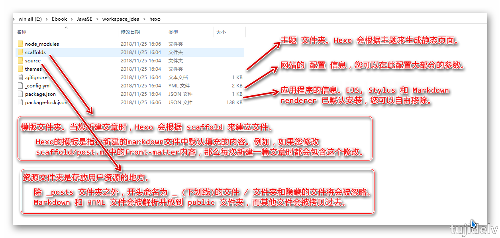
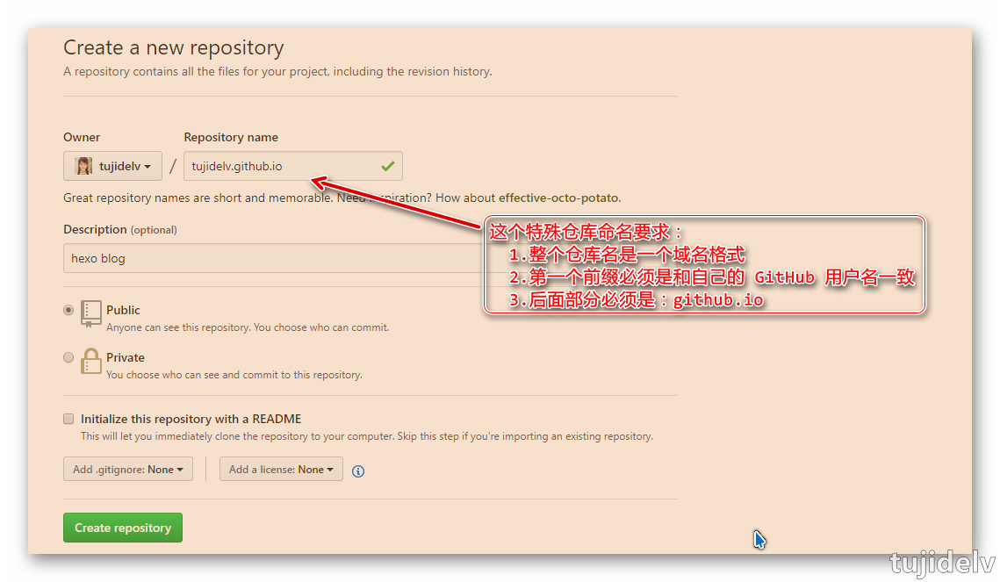
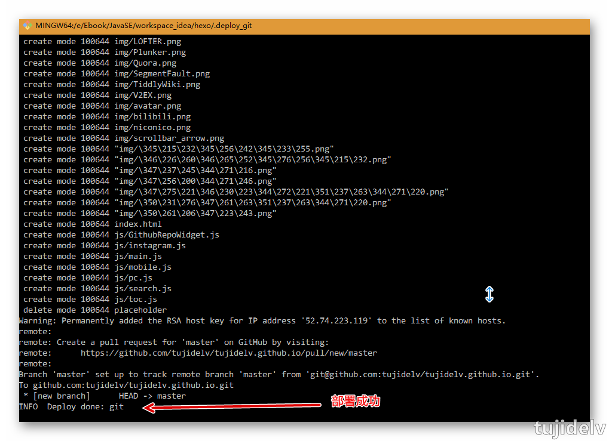

# Hexo 札记

## 目录

- [简介](#简介)
- [准备工作](#准备工作)
- [快速入门](#开始搭建)
- [进阶使用](#进阶使用)
- [参考链接](#参考链接)
- [结束语](#结束语)

## 简介

- 中文官网
    - <http://hexo.io/zh-cn/>
- 作者 Tommy Chen
    - <https://zespia.tw/>
- 个人理解
    - Hexo 是一个基于 Node.js 快速、简洁且高效的博客框架，可以将 Markdown 文件快速的生成静态网页，托管在 GitHub Pages 上。
- 官网释义
    > Hexo 是一个快速、简洁且高效的博客框架。Hexo 使用 Markdown（或其他渲染引擎）解析文章，在几秒内，即可利用靓丽的主题生成静态网页。
- 特点
    ```
    1.超快速度
        Node.js 所带来的超快生成速度，让上百个页面在几秒内瞬间完成渲染。
    2.支持 Markdown
        Hexo 支持 GitHub Flavored Markdown 的所有功能，甚至可以整合 Octopress 的大多数插件。
    3.一键部署
        只需一条指令即可部署到 GitHub Pages, Heroku 或其他网站。
    4.丰富的插件
        Hexo 拥有强大的插件系统，安装插件可以让 Hexo 支持 Jade, CoffeeScript。
    ```

## 准备工作

- Git 安装
    ```
    Tujide.lv@tujide MINGW64 ~
    $ git --version
    git version 2.15.1.windows.2
    ```
- Node.js 安装
    ```
    Tujide.lv@tujide MINGW64 ~
    $ npm -v
    6.4.1
    ```
- 设置 Node.js 源为淘宝 NPM 镜像
    - Node.js 官方源默认是：<https://r.cnpmjs.org/>，但是由于在国外，说不定你使用的时候就抽风无法下载任何软件，所以我们决定暂时使用淘宝提供的源，淘宝源官网：<http://npm.taobao.org/>。
    - 安装时间不一定很快，耐心等待一会。
    ```
    Tujide.lv@tujide MINGW64 ~
    $ npm install -g cnpm --registry=https://registry.npm.taobao.org
    npm WARN deprecated socks@1.1.10: If using 2.x branch, please upgrade to at least 2.1.6 to avoid a serious bug with socket data flow and an import issue introduced in 2.1.0
    E:\Ebook\JavaSE\develop\nodejs\node_global\cnpm -> E:\Ebook\JavaSE\develop\nodejs\node_global\node_modules\cnpm\bin\cnpm
    +cnpm@6.0.0
    added 633 packages from 844 contributors in 120.981s
    
    Tujide.lv@tujide MINGW64 ~
    $ npm list -g --depth 0
    E:\Ebook\JavaSE\develop\nodejs\node_global
    `-- cnpm@6.0.0
    ```
    
## 开始搭建

- 安装 Hexo 框架
    - 因为国内的网络问题，有时候安装异常慢花了大半个小时都没效果，那就 `Ctrl + C` 停掉这次命令，执行 `npm uninstall -g hexo-cli`，然后重新再执行一次。
    - 安装时间不一定很快，耐心等待一会。
    ```
    Tujide.lv@tujide MINGW64 ~
    $ cnpm install -g hexo-cli
    Downloading hexo-cli to E:\Ebook\JavaSE\develop\nodejs\node_global\node_modules\hexo-cli_tmp
    Copying E:\Ebook\JavaSE\develop\nodejs\node_global\node_modules\hexo-cli_tmp\_hexo-cli@1.1.0@hexo-cli to E:\Ebook\JavaSE\develop\nodejs\node_global\node_modules\hexo-cli
    Installing hexo-cli's dependencies to E:\Ebook\JavaSE\develop\nodejs\node_global\node_modules\hexo-cli/node_modules
    [1/11] abbrev@^1.0.7 installed at node_modules\_abbrev@1.1.1@abbrev
    [2/11] object-assign@^4.1.0 installed at node_modules\_object-assign@4.1.1@object-assign
    [3/11] command-exists@^1.2.0 installed at node_modules\_command-exists@1.2.8@command-exists
    [4/11] minimist@^1.2.0 installed at node_modules\_minimist@1.2.0@minimist
    [5/11] tildify@^1.2.0 installed at node_modules\_tildify@1.2.0@tildify
    [6/11] chalk@^1.1.3 installed at node_modules\_chalk@1.1.3@chalk
    [7/11] bluebird@^3.4.0 installed at node_modules\_bluebird@3.5.3@bluebird
    [8/11] resolve@^1.5.0 installed at node_modules\_resolve@1.8.1@resolve
    [9/11] hexo-util@^0.6.0 installed at node_modules\_hexo-util@0.6.3@hexo-util
    [10/11] hexo-log@^0.2.0 installed at node_modules\_hexo-log@0.2.0@hexo-log
    fsevents@1.2.4 download from binary mirror: {"module_name":"fse","module_path":"./lib/binding/{configuration}/{node_abi}-{platform}-{arch}/","remote_path":"./v{version}/","package_name":"{module_name}-v{version}-{node_abi}-{platform}-{arch}.tar.gz","host":"https://cdn.npm.taobao.org/dist/fsevents"}
    platform unsupported hexo-fs@0.2.3 › chokidar@1.7.0 › fsevents@^1.0.0 Package require os(darwin) not compatible with your platform(win32)
    [fsevents@^1.0.0] optional install error: Package require os(darwin) not compatible with your platform(win32)
    [11/11] hexo-fs@^0.2.0 installed at node_modules\_hexo-fs@0.2.3@hexo-fs
    Recently updated (since 2018-11-18): 2 packages (detail see file E:\Ebook\JavaSE\develop\nodejs\node_global\node_modules\hexo-cli\node_modules\.recently_updates.txt)
      2018-11-22
        → hexo-util@0.6.3 › cross-spawn@4.0.2 › lru-cache@4.1.4 › yallist@^3.0.2(3.0.3) (07:22:36)
      2018-11-21
        → hexo-util@0.6.3 › cross-spawn@4.0.2 › lru-cache@^4.0.1(4.1.4) (08:14:09)
    All packages installed (175 packages installed from npm registry, used 7s(network 6s), speed 498.55kB/s, json 151(218.72kB), tarball 2.93MB)
    [hexo-cli@1.1.0] link E:\Ebook\JavaSE\develop\nodejs\node_global\hexo@ -> E:\Ebook\JavaSE\develop\nodejs\node_global\node_modules\hexo-cli\bin\hexo
    ```
- 创建 Hexo 项目
    
    - 现在初始化后不需要 `npm install` 了，它会默认执行该命令把相关依赖包下载到 node_modules 目录中，同时会自动生成 package-lock.json 文件用以纪录当前实际安装的各个插件包的具体来源和版本号。
    - 安装时间不一定很快，耐心等待一会。
    ```
    Tujide.lv@tujide MINGW64 /e/Ebook/JavaSE/workspace_idea
    $ hexo init hexo-blog
    INFO  Cloning hexo-starter to E:\Ebook\JavaSE\workspace_idea\hexo-blog
    Cloning into 'E:\Ebook\JavaSE\workspace_idea\hexo-blog'...
    remote: Enumerating objects: 68, done.
    remote: Total 68 (delta 0), reused 0 (delta 0), pack-reused 68
    Unpacking objects: 100% (68/68), done.
    Submodule 'themes/landscape' (https://github.com/hexojs/hexo-theme-landscape.git) registered for path 'themes/landscape'
    Cloning into 'E:/Ebook/JavaSE/workspace_idea/hexo-blog/themes/landscape'...
    remote: Enumerating objects: 21, done.
    remote: Counting objects: 100% (21/21), done.
    remote: Compressing objects: 100% (21/21), done.
    remote: Total 867 (delta 8), reused 0 (delta 0), pack-reused 846
    Receiving objects: 100% (867/867), 2.55 MiB | 1.31 MiB/s, done.
    Resolving deltas: 100% (457/457), done.
    Submodule path 'themes/landscape': checked out '73a23c51f8487cfcd7c6deec96ccc7543960d350'
    INFO  Install dependencies
    npm WARN deprecated titlecase@1.1.2: no longer maintained
    npm WARN deprecated postinstall-build@5.0.3: postinstall-build's behavior is now built into npm! You should migrate off of postinstall-build and use the new `prepare` lifecycle script with npm 5.0.0 or greater.
    
    > nunjucks@3.1.4 postinstall E:\Ebook\JavaSE\workspace_idea\hexo-blog\node_modules\nunjucks
    > node postinstall-build.js src
    
    npm notice created a lockfile as package-lock.json. You should commit this file.
    npm WARN optional SKIPPING OPTIONAL DEPENDENCY: fsevents@1.2.4 (node_modules\fsevents):
    npm WARN notsup SKIPPING OPTIONAL DEPENDENCY: Unsupported platform for fsevents@1.2.4: wanted {"os":"darwin","arch":"any"} (current: {"os":"win32","arch":"x64"})
    
    added 423 packages from 501 contributors and audited 4700 packages in 109.987s
    found 0 vulnerabilities
    
    INFO  Start blogging with Hexo!
    ```
- 启动 hexo 本地服务
    - 本地用浏览器访问：<http://localhost:4000/>，查看默认效果。
    - 如果要停止 hexo 服务：在 Git Bash 下按 `Ctrl + C` 即可。
    ```
    Tujide.lv@tujide MINGW64 /e/Ebook/JavaSE/workspace_idea/hexo-blog
    $ hexo server
    INFO  Start processing
    INFO  Hexo is running at http://localhost:4000 . Press Ctrl+C to stop.
    ```
- 更换其他主题
    - 由于默认主题太大众了，可以去这里找主题
        - hexo-theme：<https://hexo.io/themes/>
        - hexo-github-theme-list：<https://github.com/hexojs/hexo/wiki/Themes>
        - 有那些好看的 hexo 主题？：<http://www.zhihu.com/question/24422335>
    - 这里列出比较中意的 3 款(以 3-hexo 为例)
        - <https://github.com/theme-next/hexo-theme-next>
        - <https://github.com/MOxFIVE/hexo-theme-yelee>
        - <https://github.com/wizardforcel/hexo-theme-cyanstyle>
        - <https://github.com/yelog/hexo-theme-3-hexo>
    - 下载主题到 themes 文件夹
        - 如果以后你不自己修改这个主题的话，可以考虑 `git pull` 经常更新下作者的更新内容。
        - 下载时间不一定很快，耐心等待一会。
        ```
        Tujide.lv@tujide MINGW64 /e/Ebook/JavaSE/workspace_idea/hexo-blog
        $ git clone https://github.com/tujidelv/hexo-theme-3-hexo.git themes/3-hexo
        Cloning into 'themes/3-hexo'...
        remote: Enumerating objects: 12, done.
        remote: Counting objects: 100% (12/12), done.
        remote: Compressing objects: 100% (9/9), done.
        remote: Total 1854 (delta 3), reused 9 (delta 3), pack-reused 1842
        Receiving objects: 100% (1854/1854), 1.10 MiB | 937.00 KiB/s, done.
        Resolving deltas: 100% (1045/1045), done.
        
        Tujide.lv@tujide MINGW64 /e/Ebook/JavaSE/workspace_idea/hexo-blog/themes/3-hexo (master)
        $ git pull origin master
        From https://github.com/tujidelv/hexo-theme-3-hexo
         * branch            master     -> FETCH_HEAD
        Already up to date.
        ```
    - 修改 hexo 站点配置文件 _config.yml 使主题生效
    
        
    - 重新渲染主题静态内容并本地预览
        ```
        Tujide.lv@tujide MINGW64 /e/Ebook/JavaSE/workspace_idea/hexo-blog
        $ hexo clean && hexo g && hexo s
        INFO  Deleted database.
        INFO  Deleted public folder.
        INFO  Start processing
        INFO  Files loaded in 311 ms
        INFO  Generated: img/brown-papersq.png
        INFO  Generated: img/avatar.jpg
        INFO  Generated: img/weixin.jpg
        INFO  Generated: img/school-book.png
        INFO  Generated: index.html
        INFO  Generated: archives/index.html
        INFO  Generated: css/fonts/icomoon.eot
        INFO  Generated: img/alipay.jpg
        INFO  Generated: js/search.js
        INFO  Generated: css/hl_theme/atom-dark.css
        INFO  Generated: css/mobile.css
        INFO  Generated: css/hl_theme/atom-light.css
        INFO  Generated: css/hl_theme/brown-paper.css
        INFO  Generated: css/hl_theme/darcula.css
        INFO  Generated: css/hl_theme/github-gist.css
        INFO  Generated: css/hl_theme/github.css
        INFO  Generated: css/hl_theme/gruvbox-light.css
        INFO  Generated: css/hl_theme/gruvbox-dark.css
        INFO  Generated: css/hl_theme/kimbie-dark.css
        INFO  Generated: css/hl_theme/kimbie-light.css
        INFO  Generated: css/hl_theme/railscasts.css
        INFO  Generated: css/hl_theme/rainbow.css
        INFO  Generated: archives/2018/index.html
        INFO  Generated: css/hl_theme/school-book.css
        INFO  Generated: css/hl_theme/sublime.css
        INFO  Generated: css/hl_theme/sunburst.css
        INFO  Generated: css/hl_theme/zenbum.css
        INFO  Generated: css/fonts/icomoon.ttf
        INFO  Generated: archives/2018/11/index.html
        INFO  Generated: js/script.js
        INFO  Generated: css/fonts/icomoon.woff
        INFO  Generated: css/fonts/icomoon.svg
        INFO  Generated: css/style.css
        INFO  Generated: css/fonts/selection.json
        INFO  Generated: css/gitalk.css
        INFO  Generated: js/jquery.autocomplete.min.js
        INFO  Generated: 2018/11/28/hello-world/index.html
        INFO  Generated: js/gitalk.js
        INFO  38 files generated in 775 ms
        INFO  Start processing
        INFO  Hexo is running at http://localhost:4000 . Press Ctrl+C to stop.
        ```
- 创建 Github pages 并 SSH 授权
    - 创建好这个特殊仓库之后，在本地生成 SSH 秘钥并添加到 GitHub上，方便电脑上的 git 将内容到 Github 上。
    
    
- 把本地的博客内容同步到 Github 上
    - 安装与 hexo 相关的 git 部署插件
        ```
        Tujide.lv@tujide MINGW64 /e/Ebook/JavaSE/workspace_idea/hexo-blog
        $ cnpm install hexo-deployer-git --save
        platform unsupported hexo-deployer-git@0.3.1 › hexo-fs@0.2.3 › chokidar@1.7.0 › fsevents@^1.0.0 Package require os(darwin) not compatible with your platform(win32)
        [fsevents@^1.0.0] optional install error: Package require os(darwin) not compatible with your platform(win32)
        √ Installed 1 packages
        √ Run 0 scripts
        deprecate hexo-deployer-git@0.3.1 › swig@^1.4.2 This package is no longer maintained
        Recently updated (since 2018-11-21): 1 packages (detail see file E:\Ebook\JavaSE\workspace_idea\hexo-blog\node_modules\.recently_updates.txt)
        √ All packages installed (183 packages installed from npm registry, used 18s(network 18s), speed 17.06kB/s, json 157(305.82kB), tarball 0B)
        ```
    - 修改 hexo 全局配置文件 _config.yml
        ```
        # Hexo Configuration
        ## Docs: https://hexo.io/docs/configuration.html
        ## Source: https://github.com/hexojs/hexo/
        
        # Site，网站，这一块区域主要是设置博客的主要说明，需要注意的是：每个冒号后面都是有一个空格，然后再书写自己的内容
        title: Tujidelv Code # 网站标题
        subtitle: 好记性不如烂笔头 # 网站副标题
        description: Tujidelv的技术小窝 # 网站描述，主要用于SEO，告诉搜索引擎一个关于您站点的简单描述，通常建议在其中包含您网站的关键词
        keywords:
        author: Tujide.lv # 您的名字，用于主题显示文章的作者
        language: zh-CN # 网站使用的语言，也可以用zh-Hans
        timezone:
        
        # URL，网址，这一块区域一般可以设置的是 url 这个参数，比如我要设置绑定域名的，这里就需要填写我的域名信息
        ## If your site is put in a subdirectory, set url as 'http://yoursite.com/child' and root as '/child/'
        ## 如果您的网站存放在子目录中，例如 http://yoursite.com/blog，则请将您的 url 设为 http://yoursite.com/blog 并把 root 设为 /blog/。
        url: https://www.lvzhiqiang.top # 网址
        root: / # 网站根目录
        permalink: :year/:month/:day/:title/ # 文章的永久链接格式
        permalink_defaults:
        
        # Directory，目录，这一块一般不需要修改
        source_dir: source # 资源文件夹，这个文件夹用来存放内容。
        public_dir: public # 公共文件夹，这个文件夹用于存放生成的站点文件。
        tag_dir: tags # 标签文件夹
        archive_dir: archives # 归档文件夹
        category_dir: categories # 分类文件夹
        code_dir: downloads/code # Include code 文件夹
        i18n_dir: :lang # 国际化（i18n）文件夹
        skip_render: # 跳过指定文件的渲染，您可使用 glob 表达式来匹配路径。
        - README.md
        
        # Writing，文章，这一块一般不需要修改
        new_post_name: :title.md # Hexo 默认以标题做为文件名称，设为 :year-:month-:day-:title.md 可让您更方便的通过日期来管理文章
        default_layout: post # 预设布局，Hexo 有三种默认布局：post、page 和 draft，分别对应不同的路径：source/_posts、source和source/_drafts
        titlecase: false # 把标题转换为 title case
        external_link: true # 在新标签中打开链接
        filename_case: 0 # 把文件名称转换为 (1) 小写或 (2) 大写
        render_drafts: false # 显示草稿，草稿默认不会显示在页面中
        post_asset_folder: false # 启动 Asset 文件夹
        relative_link: false # 把链接改为与根目录的相对位址 
        future: true # 显示未来的文章
        highlight: # 代码块的设置
          enable: true
          line_number: true
          auto_detect: false
          tab_replace:
          
        # Home page setting
        # path: Root path for your blogs index page. (default = '')
        # per_page: Posts displayed per page. (0 = disable pagination)
        # order_by: Posts order. (Order by date descending by default)
        index_generator:
          path: ''
          per_page: 10
          order_by: -date
          
        # Category & Tag，分类 & 标签，这一块一般不需要修改
        default_category: uncategorized # 默认分类
        category_map:
        tag_map:
        
        # Date / Time format，日期 / 时间格式，这一块一般不需要修改
        ## Hexo uses Moment.js to parse and display date
        ## You can customize the date format as defined in
        ## http://momentjs.com/docs/#/displaying/format/
        date_format: YYYY-MM-DD # 日期格式
        time_format: HH:mm:ss # 时间格式
        
        # Pagination，分页，这一块一般不需要修改
        ## Set per_page to 0 to disable pagination
        per_page: 10 # 每页显示的文章量 (0 = 关闭分页功能)
        pagination_dir: page # 分页目录
        
        # Extensions，扩展
        ## Plugins: https://hexo.io/plugins/
        ## Themes: https://hexo.io/themes/
        theme: 3-hexo # 当前主题名称。值为false时禁用主题
        
        # Deployment，部署
        ## 这里是重点，这里是修改发布地址，因为我们前面已经将本地 SSH 密钥信息添加到 Github 设置里面了，所以只要我们电脑里面持有那两个密钥文件就可以无需密码地跟 Github 做同步。
        ## 需要注意的是这里的 repo 采用的是 ssh 的地址，而不是 https 的。分支我们默认采用 master 分支。
        ## Docs: https://hexo.io/docs/deployment.html
        deploy:
          type: git
          repo: git@github.com:tujidelv/tujidelv.github.io.git
          branch: master
        ```
    - 执行如下命令 `hexo clean && hexo g && hexo d`
        ```
        hexo clean          // 清除掉已经生成的旧文件
        hexo generate/g     // 重新生成一次静态文件
        hexo deploy/d       // 使用部署命令部署到 Github 上
        ```
    
- 绑定域名
    - 在 source 目录下新建 `CNAME` 文件（文件名叫 CNAME，没有文件后缀的）
        - 以后一些需要放在根目录的资源文件都可以放这里。
        - ***`CNAME` 文件上的内容写你要绑定的域名全称。***
    - 到各自己域名控制台上设置域名解析(以阿里云为例)
        ```
        记录类型：CNAME
        主机记录：www
        解析线路：默认
        记录值：tujidelv.github.io.
        TTL：默认
        ```
- 整合 IntelliJ IDEA 提高效率
    - 为了提交写作效率，建议使用 IDEA 作为 Markdown 编辑工具。
      - IDEA 有各种各样的快捷键支持你的操作
      - IDEA 可以快速地全文检索项目所有的文件
      - 对 JavaScript、CSS、HTML 等常见语言的良好支持，方便修改主题
    - 打开 hexo 项目，将 public 目录设置成 Excluded，这样每次 hexo 新的静态博客后 IDEA 不需要每次都去重建索引。

## 进阶使用

- 编写脚本方便快速部署和本地预览
    - 在 hexo 根目录下新建 hs.sh 和 hd.sh 文件,分别加入如下内容：
        ```
        #!/bin/bash
        hexo clean && hexo g && hexo s
        ```
        ```
        #!/bin/bash
        hexo clean && hexo g && hexo d
        ```
    - 在 Git Bash 中分别执行 `./hs.sh` 和`./hd.sh` 来预览和部署。
- 创建**关于我**页面
    - 可以编辑 index.md 文件补充需要显示的内容。
    ```
    Tujide.lv@tujide MINGW64 /e/Ebook/JavaSE/workspace_idea/hexo-blog
    $ hexo new page about
    INFO  Created: E:\Ebook\JavaSE\workspace_idea\hexo-blog\source\about\index.md
    ```
- 创建 **404** 页面
    - 对于 github page 来说，只要在根目录有 404.html，当页面找不到时，就会被转发到/404.html 页面，所以我们只要更改这个页面，就可以实现自定义 404 页面了。
    - 但是我们通常会需要与本主题相符的 404 页面，那我们需要以下操作
        1. 进入 Hexo 根目录，输入 `hexo new page 404` ;
        2. 打开刚新建的页面文件，默认在 Hexo 文件夹根目录下 `/source/404/index.md`;
        3. 在顶部插入一行，写上 `permalink: /404`，这表示指定该页固定链接为 `http://"主页"/404.html`。
- 创建**分类&标签**页面
    1. 在 source 目录下新建一个 tags 文件夹
        ```
        $ hexo new page tags
        ```
    2. 编辑 index.md 文件，添加 `layout` 选项，后面的值对应的是主题文件夹下 `layout` 目录下第一级的布局文件，例如layout/tags.ejs
        ```
        ---
        title: tags
        date: 2018-11-28 20:23:17
        type: tags
        layout: "tags"
        ---
        ```
    3. 编辑主题配置文件，各个主题的显示名称可能不同
        ```
        menu:
          Home: /
          Archives: /archives
          tags: /tags
        ```
    4. 最后去看下 hexo 站点配置文件对应的选项名称是否对应
        ```
        # Directory
        tag_dir: tags
        ```
    Tips：最重要的是看一下主题文件里有没有标签页或者分类页的布局文件，一般来说都是有的，只是命名和存放的位置可能不同，所以大家要根据实际情况来修改。categories 同理。
- 图片显示
    - 一般分为外链和本地图片，这里介绍本地图片显示的 2 种方法
    - 绝对路径，可直接在 source 目录下新建 images 文件夹用于存放图片，在 md 文件中如下引用
        ```
        
        ```
    - 相对路径，需先将站点配置文件中的 post_asset_folder 设为 true，然后安装 hexo-asset-image 插件
        ```
        # Writing
        post_asset_folder: true # 启动 Asset 文件夹
        ```
        ```
        Tujide.lv@tujide MINGW64 /e/Ebook/JavaSE/workspace_idea/hexo-blog
        $ cnpm i hexo-asset-image --save
        √ Installed 1 packages
        √ Run 0 scripts
        √ All packages installed (19 packages installed from npm registry, used 2s(network 2s), speed 153.72kB/s, json 18(31.65kB), tarball 315.44kB)
        ```
        ```
         
        ```
        Tips：此方法在运行 hexo n "xxxx" 来生成 md 文件时，同时会在/source/_posts 文件夹下生成一个与 md 文件同名的文件夹。
- 文章排序及置顶
- 使用 gitment 评论系统
- 备份当前项目源码


## 参考链接

- <http://www.youmeek.com/hexo-install/>

## 结束语

- 未完待续...