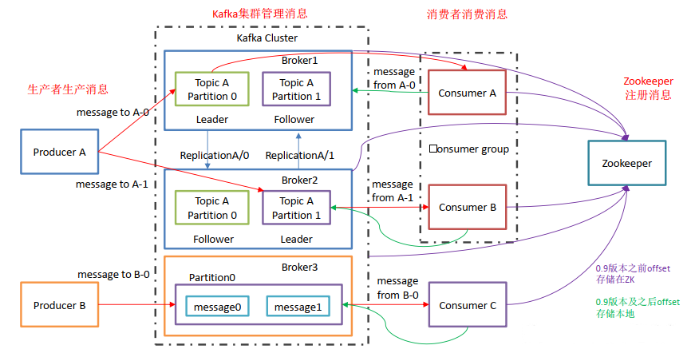
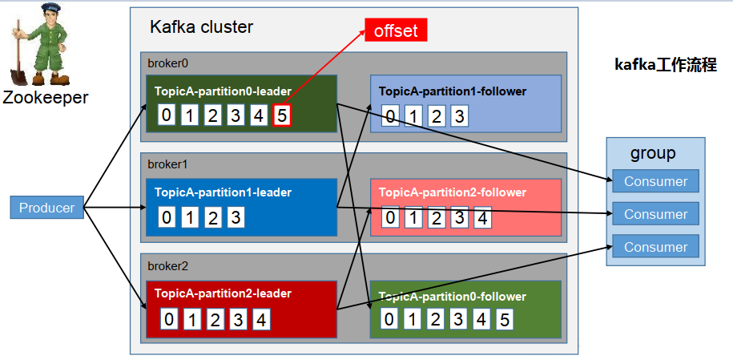
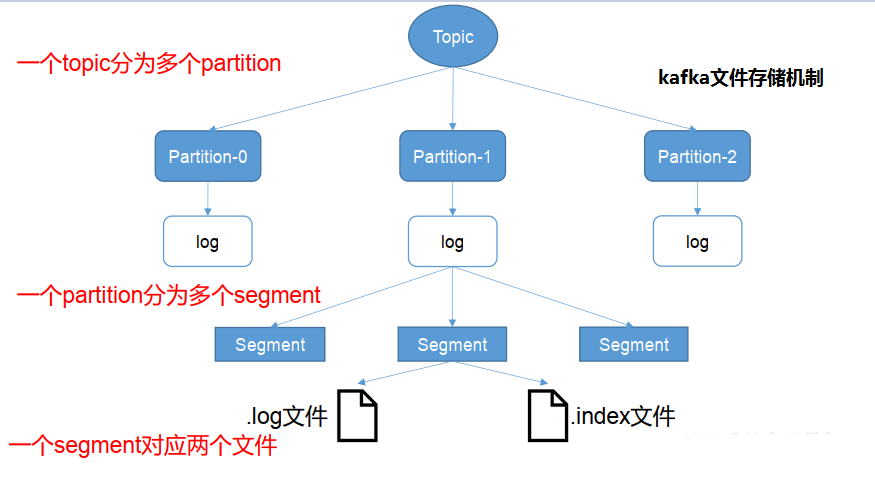
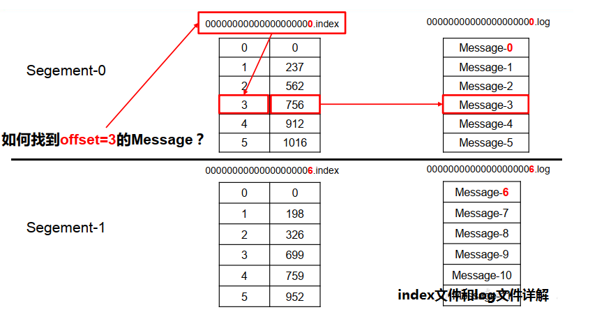
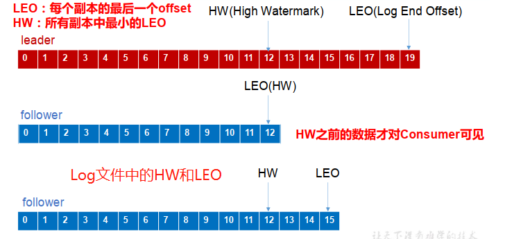
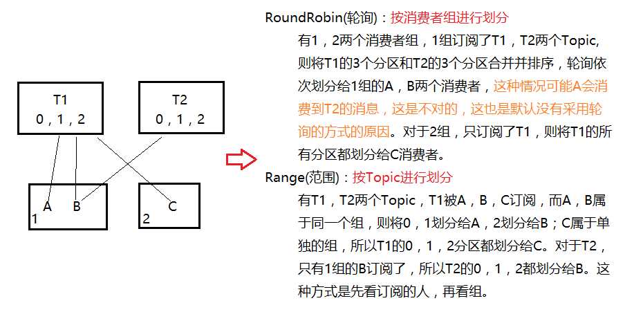
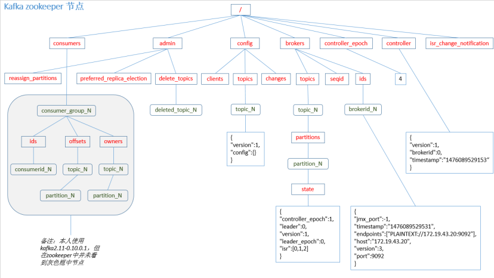
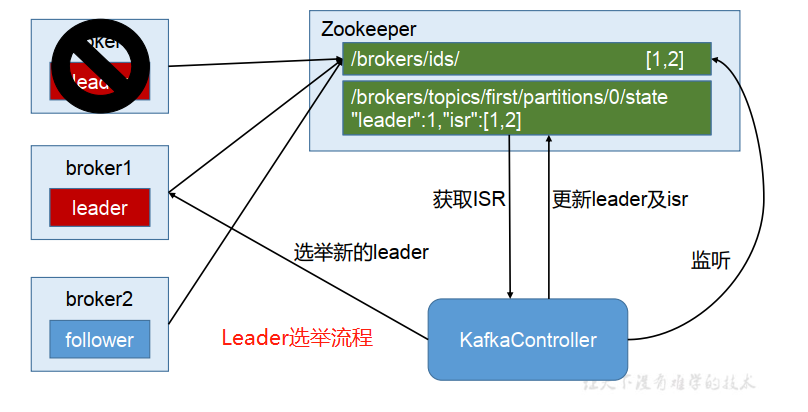
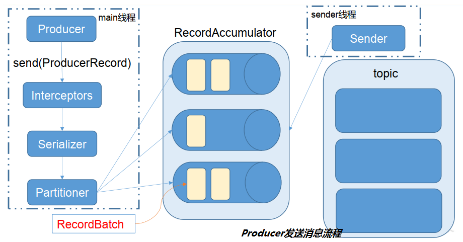

## 目录

- [概述](#概述)
- [快速入门](#快速入门)
- [架构深入](#架构深入)
- [kafka API](#kafka API)
- [kafka 监控](#kafka监控)
- [flume对接kafka](#flume对接kafka)
- [参考链接](#参考链接)
- [结束语](#结束语)

## 概述

- 定义
    ```
    Apache开源的使用Scala和Java编写的基于发布/订阅模式的以队列为模型的分布式消息中间件，主要应用于大数据实时处理领域。
    ```
- 维基百科

    >**K**afka是由Apache软件基金会开发的一个开源流处理平台，由Scala和Java编写。该项目的目标是为处理实时数据提供一个统一、高吞吐、低延迟的平台。**其**持久化层本质上是一个“按照分布式事务日志架构的大规模发布/订阅消息队列”，这使它作为企业级基础设施来处理流式数据非常有价值。**此**外，Kafka可以通过Kafka Connect连接到外部系统（用于数据输入/输出），并提供了Kafka Streams——一个Java流式处理库。  

- 发展历史
    ```
    1. Kafka最初是由领英开发，并随后于2011年初开源，并于2012年10月23日由Apache Incubator孵化出站。
    2. 2014年11月，几个曾在领英为Kafka工作的工程师，创建了名为Confluent的新公司，并着眼于Kafka。
    3. 根据2014年Quora的帖子，Jay Kreps似乎已经将它以作家弗朗茨·卡夫卡命名。
    4. Kreps选择将该系统以一个作家命名是因为，它是“一个用于优化写作的系统”，而且他很喜欢卡夫卡的作品。
    ```
- 消息队列的2种模式
    ```
    1.点对点模式（一对一，消费者主动拉取数据，消息收到后消息清除）
        消息生产者生产消息发送到Queue中，然后消息消费者从Queue中取出并且消费消息。
        消息被消费以后，queue中不再有存储，所以消息消费者不可能消费到已经被消费的消息。
        Queue支持存在多个消费者，但是对一个消息而言，只会有一个消费者可以消费。
    2.发布/订阅模式（一对多，消费者消费数据之后不会清除消息）
        消息生产者（发布）将消息发布到topic中，同时有多个消息消费者（订阅）消费该消息。
        和点对点方式不同，发布到topic的消息会被所有订阅者消费。
    ```
- 基础架构
    
    ```
    1. Producer ： 消息生产者，向kafka broker发消息的客户端；
    2. Consumer ： 消息消费者，向kafka broker取消息的客户端；
    3. Consumer Group（CG）： 消费者组，由多个consumer组成。
        消费者组内每个消费者负责消费不同分区的数据，同一时刻一个分区只能由一个组内消费者消费，消费者组之间互不影响。
        所有的消费者都属于某个消费者组，即消费者组是逻辑上的一个订阅者。
        消费者组的引用提高了消费能力。
    4. Broker ： 消息中转角色，负责接收、存储、转发消息，在JMS规范中称为Provider。
        一台kafka服务器就是一个broker。一个集群由多个broker组成。一个broker可以容纳多个topic。
    5. Topic ： 消息主题(逻辑分类)，可以理解为一个队列，生产者和消费者面向的都是一个topic；
    6. Partition： 分区，提高topic的负载均衡能力及扩展性。
        一个非常大的topic可以分布到多个broker（即服务器）上，一个topic可以分为多个partition，每个partition是一个有序的队列；
    7. Replica： 副本，提高冗余能力及高可用性。
        为保证集群中的某个节点发生故障时该节点上的partition数据不丢失，且kafka仍然能够继续工作，kafka提供了副本机制，一个topic的每个分区都有若干个副本，即一个leader和若干个follower。
    8. leader： 每个分区多个副本的“主”，生产者发送数据的对象，以及消费者消费数据的对象都是leader。
    9. follower： 每个分区多个副本中的“从”，实时从leader中同步数据，保持和leader数据的同步。leader发生故障时，某个follower会成为新的leader。
    ```

## 快速入门

### `安装部署`

```
集群规划：一台VPS上部署2个broker，组成集群
软件依赖：jdk,kafka
防火墙设置：如果是开发环境,直接关闭防火墙；如果是生产环境,就需要配置防火墙，增加端口规则
```
---
1. 安装JDK并配置环境变量（省略）
2. 下载[kafka程序包](http://kafka.apache.org/downloads.html)
    ```
    # wget -P /opt/setups https://mirrors.tuna.tsinghua.edu.cn/apache/kafka/2.5.0/kafka_2.12-2.5.0.tgz
    ```
3. 解压到指定目录
    ```
    # mkdir -pv /usr/program
    # tar -zxvf kafka_2.12-2.5.0.tgz -C /usr/program/
    ```
4. 配置环境变量
    ```
    [root@144 ~]# vim /etc/profile.d/my.sh
    # kafka
    KAFKA_HOME=/usr/program/kafka_2.12-2.5.0
    PATH=$KAFKA_HOME/bin:$PATH
    export KAFKA_HOME
    export PATH
    [root@144 ~]# source /etc/profile.d/my.sh
    ```
5. 创建相关日志文件夹
    ```
    # mkdir -pv /tmp/kafka-logs/{1,2}
    # mkdir -pv /tmp/zookeeper-logs
    ```
6. 配置集群参数
    ```
    [root@144 ~]# cp ${KAFKA_HOME}/config/server.properties ${KAFKA_HOME}/config/server-1.properties
    [root@144 ~]# vim ${KAFKA_HOME}/config/server-1.properties
    #broker的全局唯一编号，不能重复
    broker.id=1
    #服务端口号
    listeners=PLAINTEXT://:9093
    #是否开启删除topic功能，否则只是标记删除
    delete.topic.enable=true
    #处理网络请求的线程数量
    num.network.threads=3
    #处理磁盘IO的线程数量
    num.io.threads=8
    #发送套接字的缓冲区大小
    socket.send.buffer.bytes=102400
    #接收套接字的缓冲区大小
    socket.receive.buffer.bytes=102400
    #请求套接字的缓冲区大小
    socket.request.max.bytes=104857600
    #kafka存放暂存数据的路径，并非日志目录
    log.dirs=/tmp/kafka-logs/1
    #自动创建topic时默认的分区个数，默认为1个分区1个副本
    num.partitions=1
    #用来恢复和清理data下数据的线程数量
    num.recovery.threads.per.data.dir=1
    #segment文件保留的最长时间，超时将被删除，默认7天
    log.retention.hours=168
    # The maximum size of a log segment file. When this size is reached a new log segment will be created.
    log.segment.bytes=1073741824
    #配置连接Zookeeper集群地址，多个用逗号分隔
    zookeeper.connect=localhost:2181
    ```
    ```
    [root@144 ~]# cp ${KAFKA_HOME}/config/server-1.properties ${KAFKA_HOME}/config/server-2.properties
    [root@144 ~]# vim ${KAFKA_HOME}/config/server-2.properties
    #broker的全局唯一编号，不能重复
    broker.id=2
    #服务端口号
    listeners=PLAINTEXT://:9094
    #kafka运行日志存放的路径
    log.dirs=/tmp/kafka-logs/2
    ...
    ```
7. 启动集群
    ```
    [root@144 ~]# cd ${KAFKA_HOME}/bin
    [root@144 bin]# zookeeper-server-start.sh -daemon ../config/zookeeper.properties
    [root@144 bin]# kafka-server-start.sh -daemon ../config/server-1.properties
    [root@144 bin]# kafka-server-start.sh -daemon ../config/server-2.properties
    ```
8. 关闭集群
    ```
    [root@144 bin]# kafka-server-stop.sh stop
    ```
9. 群起脚本(附加)
    ```
    #!/bin/bash
    case $1 in
    "start"){
    for i in hadoop102 hadoop103 hadoop104
    do
        echo "*************$i*************"
        ssh $i "/usr/program/kafka/bin/kafka-server-start.sh -daemon /usr/program/kafka/config/server.properties"
    done
    };;
    "stop"){
    for i in hadoop102 hadoop103 hadoop104
    do
        echo "*************$i*************"
        ssh $i "/usr/program/kafka/bin/kafka-server-stop.sh /usr/program/kafka/config/server.properties"
    done
    };;
    esac
    ```
   
### `命令行操作`

- 查看当前服务器中的所有topic
    ```
    [root@144 bin]# kafka-topics.sh --zookeeper 127.0.0.1:2181 --list
    ```
- 创建topic
    ```
    # 副本数不能大于当前可用broker数量
    # 副本数是leader和follower加起来的总数，即副本包括leader和follower
    [root@144 bin]# kafka-topics.sh --zookeeper 127.0.0.1:2181 --create --replication-factor 2 --partitions 2 --topic test
    ```
- 查看某个topic详情
    ```
    [root@144 bin]# kafka-topics.sh --zookeeper 127.0.0.1:2181 --describe --topic test
    ```
- 删除topic
    ```
    [root@144 bin]# kafka-topics.sh --zookeeper 127.0.0.1:2181 --delete --topic test
    ```
- 修改分区数
    ```
    [root@144 bin]# kafka-topics.sh --zookeeper 127.0.0.1:2181 --alter --topic test --partitions 3
    ```
- 发送消息
    ```
    [root@144 bin]# kafka-console-producer.sh --broker-list 127.0.0.1:9093,127.0.0.1:9094 --topic test
    ```
- 消费消息
    ```
    [root@144 bin]# kafka-console-consumer.sh --bootstrap-server 127.0.0.1:9093 --topic test --from-beginning
    ```
    ```
    # 0.9版本之后就过时了，而且新版本也删除了这种启动方式
    [root@144 bin]# kafka-console-consumer.sh --zookeeper 127.0.0.1:2181 --topic test --from-beginning
    ```
       
## 架构深入

### `工作流程及文件存储机制`

- **kafka工作流程**


```
Kafka中的消息是以topic进行分类的，生产者生产消息，消费者消费消息，都是面向topic的。
topic是逻辑上的概念，而partition是物理上的概念，每个partition对应于一个log文件，该log文件中存储的就是producer生产的数据。 
Producer生产的数据会被不断追加到该log文件末端，且每条数据都有自己的offset。即kafka只能保证区内有序，并不能保证全局有序。
消费者组中的每个消费者，都会实时记录自己消费到了哪个offset，以便出错恢复时，从上次的位置继续消费。
```

- **kafka文件存储机制**


```
由于生产者生产的消息会不断追加到log文件末尾，为防止log文件过大导致数据定位效率低下，Kafka采取了分片和索引机制，将每个partition分为多个segment。
每个segment对应两个文件——“.index”文件和“.log”文件。这些文件位于一个文件夹下，该文件夹的命名规则为：topic名称+分区序号。
例如，test这个topic有2个分区，则其对应的文件夹为test-0,test-1。index和log文件以当前segment的第一条消息的offset命名。
---
00000000000000000000.index
00000000000000000000.log
00000000000000170410.index
00000000000000170410.log
00000000000000239430.index
00000000000000239430.log
```

```
index文件存储大量的索引信息，log文件存储大量的数据，索引文件中的元数据指向对应数据文件中message的物理偏移地址。
```

### `生产者`

- 分区策略
    ```
    1.分区的原因
        a.方便在集群中扩展，每个Partition可以通过调整以适应它所在的机器，而一个topic又可以有多个Partition组成，因此整个集群就可以适应任意大小的数据了；
        b.可以提高并发，因为可以以Partition为单位读写了。
    2.分区的原则
        我们需要将producer发送的数据封装成一个ProducerRecord对象。
        a.指明partition的情况下，直接将指明的值直接作为partiton值；
        b.没有指明partition值但有key的情况下，将key的hash值与topic的partition数进行取余得到partition值；
        c.既没有partition值又没有key值的情况下，第一次调用时随机生成一个整数（后面每次调用在这个整数上自增），将这个值与topic可用的partition总数取余得到partition值，也就是常说的round-robin算法。
    ```
- 数据可靠性保证
    - 副本数据同步策略
        ```
        为保证producer发送的数据，能可靠的发送到指定的topic，topic的每个partition收到producer发送的数据后，
        都需要向producer发送ack（acknowledgement确认收到），如果producer收到ack，就会进行下一轮的发送，否则重新发送数据。
        ---
        何时发送ack?
        确保有follower与leader同步完成，leader再发送ack，这样才能保证leader挂掉之后，能在follower中选举出新的leader。
        ---
        多少个follower同步完成后发送ack?
        一种方案是半数以上的follower同步完成，即可发送ack。优点是延迟低；缺点是选举新的leader时，容忍n台节点的故障，需要2n+1个副本
        另一种方案是全部的follower同步完成，才可以发送ack。优点是选举新的leader时，容忍n台节点的故障，需要n+1个副本；缺点是延迟高
        ---
        Kafka选择了第二种方案，原因如下：
        1.同样为了容忍n台节点的故障，第一种方案需要2n+1个副本，而第二种方案只需要n+1个副本，而Kafka的每个分区都有大量的数据，第一种方案会造成大量数据的冗余。
        2.虽然第二种方案的网络延迟会比较高，但网络延迟对Kafka的影响较小。
        ```
    - ISR
        ```
        采用第二种方案之后，设想以下情景：leader收到数据，所有follower都开始同步数据，但有一个follower，因为某种故障，迟迟不能与leader进行同步，
        那leader就要一直等下去，直到它完成同步，才能发送ack。这个问题怎么解决呢？
        Leader维护了一个动态的in-sync replica set(ISR)，意为和leader保持同步的follower集合。当ISR中的follower完成数据的同步之后，leader就
        会给producer发送ack。如果follower长时间未向leader同步数据，则该follower将被踢出ISR，该时间阈值由replica.lag.time.max.ms参数设定。 
        Leader发生故障之后，就会从ISR中选举新的leader。
        ```
    - ack应答机制
        ```
        对于某些不太重要的数据，对数据的可靠性要求不是很高，能够容忍数据的少量丢失，所以没必要等ISR中的follower全部接收成功。
        所以Kafka为用户提供了三种可靠性级别，用户根据对可靠性和延迟的要求进行权衡，对acks参数配置。
        ---
        0：producer不等待broker的ack，这一操作提供了一个最低的延迟，broker一接收到还没有写入磁盘就已经返回，当broker故障时有可能丢失数据；
        1：producer等待broker的ack，partition的leader落盘成功后返回ack，如果在follower同步成功之前leader故障，那么将会丢失数据；
        -1（all）：producer等待broker的ack，partition的leader和follower(ISR)全部落盘成功后才返回ack。但是如果在follower同步完成后，broker发送ack之前，leader发生故障，那么会造成数据重复。
        ```
    - 故障处理细节
        
        ```
        LEO：指的是每个副本最大的offset；
        HW：指的是消费者能见到的最大的offset，ISR队列中最小的LEO。只能保证消费者消费数据的一致性，生产者生产数据的一致性由ack来保证。
        ---
        1. follower故障
            follower发生故障后会被临时踢出ISR，待该follower恢复后，follower会读取本地磁盘记录的上次的HW，并将log文件高于HW的部分截取掉，
            从HW开始向leader进行同步。等该follower的LEO大于等于该Partition的HW，即follower追上leader之后，就可以重新加入ISR了。
        2. leader故障
            leader发生故障之后，会从ISR中选出一个新的leader，为保证多个副本之间的数据存储一致性，其余的follower会先将各自的log文件
            高于HW的部分截掉，然后从新的leader同步数据。这只能保证副本之间的数据一致性，并不能保证数据不丢失或者不重复。
        ```
- Exactly Once语义
    ```
    将服务器的ACK级别设置为-1，可以保证Producer到Server之间不会丢失数据，即AtLeast Once(最少一次)语义。相对的，将服务器ACK级别设置为0，
    可以保证生产者每条消息只会被发送一次，即AtMost Once(最多一次)语义。
    ---
    AtLeast Once可以保证数据不丢失，但是不能保证数据不重复；相对的，AtLeast Once可以保证数据不重复，但是不能保证数据不丢失。但是，对于一些
    非常重要的信息，比如说交易数据，下游数据消费者要求数据既不重复也不丢失，即Exactly Once(精准一次性)语义。在0.11版本以前的Kafka，对此是
    无能为力的，只能保证数据不丢失，再在下游消费者对数据做全局去重。对于多个下游应用的情况，每个都需要单独做全局去重，这就对性能造成了很大影响。
    ---
    0.11版本的Kafka，引入了一项重大特性：幂等性。所谓的幂等性就是指Producer不论向Server发送多少次重复数据，Server端都只会持久化一条。
    幂等性结合AtLeast Once语义，就构成了Kafka的Exactly Once语义。即：AtLeast Once + 幂等性 = Exactly Once
    ---
    要启用幂等性，只需要将Producer的参数中enable.idompotence设置为true即可。Kafka的幂等性实现其实就是将原来下游需要做的去重放在了数据上游。
    开启幂等性的Producer在初始化的时候会被分配一个PID，发往同一Partition的消息会附带Sequence Number。而Broker端会对
    <PID, Partition, SeqNumber>做缓存，当具有相同主键的消息提交时，Broker只会持久化一条。
    ---
    但是PID重启就会变化，同时不同的Partition也具有不同主键，所以幂等性无法保证跨分区跨会话的Exactly Once。
    ```
  
### `消费者`

- 消费方式
    ```
    发布订阅模式有推送和拉取2种消费方法，kafka consumer采用pull（拉）模式从broker中读取数据。
    ---
    push（推）模式很难适应消费速率不同的消费者，因为消息发送速率是由broker决定的。
    它的目标是尽可能以最快速度传递消息，但是这样很容易造成consumer来不及处理消息，典型的表现就是拒绝服务以及网络拥塞。
    ---
    pull（拉）模式则可以根据consumer的消费能力以适当的速率消费消息。
    不足之处是kafka消费者需要维护一个长轮询，比较耗资源。如果没有数据，消费者可能会陷入循环中，一直返回空数据。
    针对这一点，Kafka的消费者在消费数据时会传入一个时长参数timeout，如果当前没有数据可供消费，consumer会等待一段时间之后再返回，这段时长即为timeout。
    ```
- 分区分配策略
    ```
    一个consumer group中有多个consumer，一个topic有多个partition，所以必然会涉及到partition的分配问题，即确定哪个
    partition由哪个consumer来消费。Kafka有两种分配策略，一是RoundRobin(轮询)，一是Range(范围，默认)。
    ---
    一个分区同一时刻只能被同一个消费者组（ConsumerGroup）内的一个消费者消费，消费者组之间互不影响。
    当消费者组中的消费者个数发生变化时(增多或减少)或者Topic分区发生变化时，都会触发分区重新分配。 
    ```
    
- offset的维护
    ```
    由于consumer在消费过程中可能会出现断电宕机等故障，consumer恢复后，需要从故障前的位置的继续消费，所以consumer需要实时
    记录自己消费到了哪个offset，以便故障恢复后继续消费。所以offset的维护是Consumer消费数据是必须考虑的问题。
    kafka根据(Consumer Group+Topic+Partition)来确定唯一一个offset。
    ---
    Kafka 0.9版本之前，consumer默认将offset保存在Zookeeper中，从0.9版本开始，consumer默认将offset保存在Kafka一个内置
    的topic中，该topic为__consumer_offsets，默认有50个分区1个副本，分散在各个broker中。无论哪种方式,都只在消费者启动的时候访问一次。
    ```
    ```
    1）修改配置文件consumer.properties,让普通消费者可以消费系统的Topic
    exclude.internal.topics=false
    2）读取 offset
    0.11.0.0 之前版本:
    bin/kafka-console-consumer.sh --topic __consumer_offsets --zookeeper localhost:2181 --formatter
    "kafka.coordinator.GroupMetadataManager\$OffsetsMessageFormatter"
    --consumer.config config/consumer.properties --from-beginning
    0.11.0.0 之后版本(含):
    bin/kafka-console-consumer.sh --topic __consumer_offsets --zookeeper localhost:2181 --formatter
    "kafka.coordinator.group.GroupMetadataManager\$OffsetsMessageFormatter" 
    --consumer.config config/consumer.properties --frombeginning
    ```
    
  
### `高效读写数据`

```
1. 顺序写磁盘
    Kafka的producer生产数据，要写入到log文件中，写的过程是一直追加到文件末端，为顺序写。 
    官网有数据表明，同样的磁盘，顺序写能到600M/s，而随机写只有100K/s。这与磁盘的机械机构有关，顺序写之所以快，是因为其省去了大量磁头寻址的时间。
2. 零拷贝技术
```
    
### `zk的作用`

```
Kafka集群中有一个broker会被选举为Controller，负责管理集群broker的上下线，所有topic的分区副本分配和leader选举等工作。
Controller的管理工作都是依赖于Zookeeper的。 
```

    
### `事务`

```
Kafka从0.11版本开始引入了事务支持。事务可以保证Kafka在Exactly Once语义的基础上，生产和消费可以跨分区和会话，要么全部成功，要么全部失败。
---
Producer事务
为了实现跨分区跨会话的事务，需要引入一个全局唯一的Transaction ID，并将Producer获得的PID和Transaction ID绑定。这样当Producer重启后就
可以通过正在进行的Transaction ID获得原来的 PID。
为了管理Transaction，Kafka引入了一个新的组件Transaction Coordinator。Producer就是通过和Transaction Coordinator交互获得Transaction ID
对应的任务状态。TransactionCoordinator还负责将事务所有写入Kafka的一个内部Topic，这样即使整个服务重启，由于事务状态得到保存，进行中的事务状态
可以得到恢复，从而继续进行。
---
Consumer事务
上述事务机制主要是从Producer方面考虑，对于Consumer而言，事务的保证就会相对较弱，尤其是无法保证Commit的信息被精确消费。这是由于Consumer
可以通过offset访问任意信息，而且不同的Segment File生命周期不同，同一事务的消息可能会出现重启后被删除的情况。
```

## kafka API

### `Producer API`

- 消息发送流程
    ```
    Kafka的Producer发送消息采用的是异步发送的方式。在消息发送的过程中，涉及到了两个线程——main线程和Sender线程，
    以及一个线程共享变量——RecordAccumulator。main线程将消息发送给RecordAccumulator，Sender线程不断从RecordAccumulator
    中拉取消息发送到Kafka broker。
    ---
    batch.size： 只有数据积累到batch.size之后，sender才会发送数据。
    linger.ms： 如果数据迟迟未达到batch.size，sender等待linger.time之后就会发送数据。
    ```
    
- 异步发送API
    ```java
    @Slf4j
    public class Procuder {
        // 带回调函数的API
        public static void main(String[] args) {
            SimpleDateFormat sdf = new SimpleDateFormat("yyyy-MM-dd HH:mm:ss");
            // 1.读取kafka生产者的配置信息 具体配置参数可参考ProducerConfig,CommonClientConfigs
            Properties props = new Properties();
            props.load(ClassLoader.getSystemResourceAsStream("newProducer.properties"));
            // 1.1自定义分区拦截器,可选
            props.put(ProducerConfig.PARTITIONER_CLASS_CONFIG, "top.lvzhiqiang.testnewapi.CustomPartitioner");
            // 2.创建producer对象
            KafkaProducer<String, String> producer = new KafkaProducer<>(props);
            // 3.发送数据
            for (int i = 0; i < 10; i++) {
                String value = "testnewapi" + i;
                // 每条数据都要封装成一个ProducerRecord对象
                producer.send(new ProducerRecord<>("test", value), new Callback() {
                    // 回调函数，该方法会在Producer收到ack时调用，为异步调用。
                    // 该方法有两个参数，分别是RecordMetadata和Exception，如果Exception为null，说明消息发送成功，反之说明消息发送失败。
                    // 注：消息发送失败会自动重试，不需要我们在回调函数中手动重试。
                    @Override
                    public void onCompletion(RecordMetadata recordMetadata, Exception e) {
                        if (null == e) {
                            log.info("分区:{},偏移量:{},值:{}", recordMetadata.partition(), recordMetadata.offset(), value);
                        } else {
                            log.error("{}", sdf.format(new Date()), e);
                        }
                    }
                });
            }
            // 4.关闭资源 会做一些资源的回收,防止没达到send的要求时数据发送不出去
            producer.close();
        }
    }
    ```
    ```properties
    # 指定连接的kafka集群，broker-list
    bootstrap.servers=hexo.lvzhiqiang.top:9093,hexo.lvzhiqiang.top:9094
    # ack应答级别
    acks=-1
    # 重试次数
    retries=3
    # 批次大小，默认16k，只有数据积累到batch.size之后，sender才会发送数据
    batch.size=16384
    # 等待时间，默认1毫秒，如果数据迟迟未达到batch.size，sender等待linger.time之后就会发送数据
    linger.ms=1
    # RecordAccumulator缓冲区大小，默认32M
    buffer.memory=33554432
    # key,value的序列化类
    key.serializer=org.apache.kafka.common.serialization.StringSerializer
    value.serializer=org.apache.kafka.common.serialization.StringSerializer
    ```
- 同步发送API
    ```
    同步发送的意思就是，Sender线程在工作发送消息时，同时阻塞main线程，直至Sender线程返回ack来通知main线程继续执行。
    由于send方法返回的是一个Future对象，根据Futrue对象的特点，我们只需再调用Future对象的get方法即可实现同步发送的效果。
    ```
  
### `Consumer API`

- offset维护
    ```
    Consumer消费数据时的可靠性是很容易保证的，因为数据在Kafka中是持久化的，故不用担心数据丢失问题。
    为了使我们能够专注于自己的业务逻辑，Kafka提供了自动提交offset的功能。
    ---
    虽然自动提交offset十分简洁便利，但由于其是基于时间提交的，开发人员难以把握offset提交的时机。
    因此Kafka还提供了手动提交offset的API。手动提交offset的方法有两种：分别是commitSync（同步提交）和commitAsync（异步提交）。
    两者的相同点是，都会将本次poll的一批数据最高的偏移量提交；不同点是，commitSync阻塞当前线程，一直到提交成功，并且会自动失
    败重试（由不可控因素导致，也会出现提交失败）；而commitAsync则没有失败重试机制，故有可能提交失败。
    ---
    虽然同步提交offset有失败重试机制，更可靠一些，但是由于其会阻塞当前线程，直到提交成功。因此吞吐量会收到很大的影响。
    因此更多的情况下，会选用异步提交offset的方式。
    ---
    无论是同步提交还是异步提交offset，都有可能会造成数据的漏消费或者重复消费。先提交offset后消费，有可能造成数据的漏消费；
    而先消费后提交offset，有可能会造成数据的重复消费。
    ```
- 自动提交offset
    ```java
    @Slf4j
    public class Consumer {
        public static void main(String[] args) throws IOException {
            SimpleDateFormat sdf = new SimpleDateFormat("yyyy-MM-dd HH:mm:ss");
            // 1.读取kafka消费者的配置信息 具体配置参数可参考ConsumerConfig,CommonClientConfigs
            Properties props = new Properties();
            props.load(ClassLoader.getSystemResourceAsStream("newConsumer.properties"));
            // 1.1重置消费者的offset,可选earliest(最早的)和latest(最新的,默认)    换组(没有初始偏移量)或者offset过期(数据被删除)时该属性会生效
            // earliest:当各分区下有已提交的offset时，从提交的offset开始消费；无提交的offset时，从头开始消费
            // latest:当各分区下有已提交的offset时，从提交的offset开始消费；无提交的offset时，消费新产生的该分区下的数据
            props.put(ConsumerConfig.AUTO_OFFSET_RESET_CONFIG, "earliest");
            // 2.创建consumer对象
            KafkaConsumer<String, String> consumer = new KafkaConsumer<>(props);
            // 3.订阅主题
            consumer.subscribe(Collections.singletonList("test"));
            while (true) {
                // 4.拉取数据
                ConsumerRecords<String, String> records = consumer.poll(Duration.ofMillis(1000L));
                // 4.1消费数据
                for (ConsumerRecord<String, String> record : records) {
                    log.info("分区:{},偏移量:{},值:{}", record.partition(), record.offset(), record.value());
                }
            }
        }
    }
    ```
    ```properties
    # 指定连接的kafka集群，broker-list
    bootstrap.servers=144.34.207.84:9093,144.34.207.84:9094
    # 消费者组，只要group.id相同，就属于同一个消费者组
    group.id=test
    # 是否开启自动提交offset功能,默认true
    enable.auto.commit=true
    # 自动提交offset的时间间隔,默认1S
    auto.commit.interval.ms=1000
    # key,value反序列化类
    key.deserializer=org.apache.kafka.common.serialization.StringDeserializer
    value.deserializer=org.apache.kafka.common.serialization.StringDeserializer
    ```
- 手动提交offset
    ```java
    @Slf4j
    public class ManuallySubmitConsumer {
        public static void main(String[] args) throws IOException {
            SimpleDateFormat sdf = new SimpleDateFormat("yyyy-MM-dd HH:mm:ss");
            // 1.读取kafka消费者的配置信息 具体配置参数可参考ConsumerConfig,CommonClientConfigs
            Properties props = new Properties();
            props.load(ClassLoader.getSystemResourceAsStream("newConsumer.properties"));
            // 1.1重置消费者的offset,可选earliest(最早的)和latest(最新的,默认)
            props.put(ConsumerConfig.AUTO_OFFSET_RESET_CONFIG, "earliest");
            // 1.2关闭自动提交offset
            props.put("enable.auto.commit", "false");
            // 2.创建consumer对象
            KafkaConsumer<String, String> consumer = new KafkaConsumer<>(props);
            // 3.订阅主题
            consumer.subscribe(Arrays.asList("test"));
            while (true) {
                // 4.拉取数据
                ConsumerRecords<String, String> records = consumer.poll(Duration.ofMillis(1000L));
                // 4.1消费数据
                for (ConsumerRecord<String, String> record : records) {
                    log.info("分区:{},偏移量:{},值:{}", record.partition(), record.offset(), record.value());
                }
                // 4.2.a同步提交，当前线程会阻塞直到offset提交成功(重试)才会拉取新的数据
                consumer.commitSync();
                // 4.2.b异步提交
                consumer.commitAsync(new OffsetCommitCallback() {
                    @Override
                    public void onComplete(Map<TopicPartition, OffsetAndMetadata> offsets, Exception exception) {
                        if (exception != null) {
                            log.error("Commit failed for {}", offsets, exception);
                        }
                    }
                });
            }
        }
    }
    ```
- 自定义存储offset
    ```
    offset除了可以存储在zookeeper或者内置的topic中。Kafka还可以选择自定义存储offset。
    ---
    offset的维护是相当繁琐的，因为需要考虑到消费者的Rebalace。当有新的消费者加入消费者组、已有的消费者退出消费者组
    或者所订阅的主题的分区发生变化，就会触发到分区的重新分配，重新分配的过程叫做Rebalance。
    ---
    消费者发生Rebalance之后，每个消费者消费的分区就会发生变化。因此消费者要首先获取到自己被重新分配到的分区，并且定
    位到每个分区最近提交的offset位置继续消费。要实现自定义存储offset，需要借助ConsumerRebalanceListener，以下
    为示例代码，其中提交和获取offset的方法，需要根据所选的offset存储系统自行实现。
    ```
    ```java
    @Slf4j
    public class CustomConsumer {
        private static Map<TopicPartition, Long> currentOffset = new HashMap<>();
    
        public static void main(String[] args) {
            //创建配置信息
            Properties props = new Properties();
            //kafka集群，broker-list
            props.put("bootstrap.servers", "144.34.207.84:9093");
            //消费者组，只要group.id相同，就属于同一个消费者组
            props.put("group.id", "test");
            //关闭自动提交offset
            props.put("enable.auto.commit", "false");
            //Key和Value的反序列化类
            props.put("key.deserializer", "org.apache.kafka.common.serialization.StringDeserializer");
            props.put("value.deserializer", "org.apache.kafka.common.serialization.StringDeserializer");
            //创建一个消费者
            KafkaConsumer<String, String> consumer = new KafkaConsumer<>(props);
            SimpleDateFormat sdf = new SimpleDateFormat("yyyy-MM-dd HH:mm:ss");
            //消费者订阅主题
            consumer.subscribe(Arrays.asList("test"), new ConsumerRebalanceListener() {
                //该方法会在Rebalance之前调用
                @Override
                public void onPartitionsRevoked(Collection<TopicPartition> partitions) {
                    commitOffset(currentOffset);
                }
    
                //该方法会在Rebalance之后调用
                @Override
                public void onPartitionsAssigned(Collection<TopicPartition> partitions) {
                    currentOffset.clear();
                    for (TopicPartition partition : partitions) {
                        //定位到最近提交的offset位置继续消费
                        consumer.seek(partition, getOffset(partition));
                    }
                }
            });
            while (true) {
                //消费者拉取数据
                ConsumerRecords<String, String> records = consumer.poll(Duration.ofMillis(1000L));
                //消费数据
                for (ConsumerRecord<String, String> record : records) {
                    log.info("{},offset={},key={},value={}", sdf.format(new Date()), record.offset(), record.key(), record.value());
                    currentOffset.put(new TopicPartition(record.topic(), record.partition()), record.offset());
                }
                //异步提交
                commitOffset(currentOffset);
            }
        }
    
        //获取某分区的最新offset
        private static long getOffset(TopicPartition partition) {
            return 0;
        }
    
        //提交该消费者所有分区的offset
        private static void commitOffset(Map<TopicPartition, Long> currentOffset) {
        }
    }
    ```
  
### `自定义Interceptor`

## kafka监控

## flume对接kafka

## 参考链接

## 结束语

- 未完待续...
