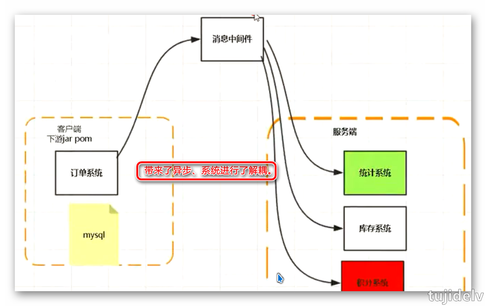
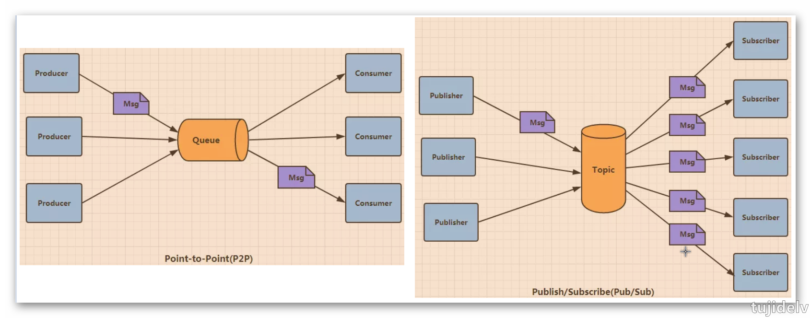
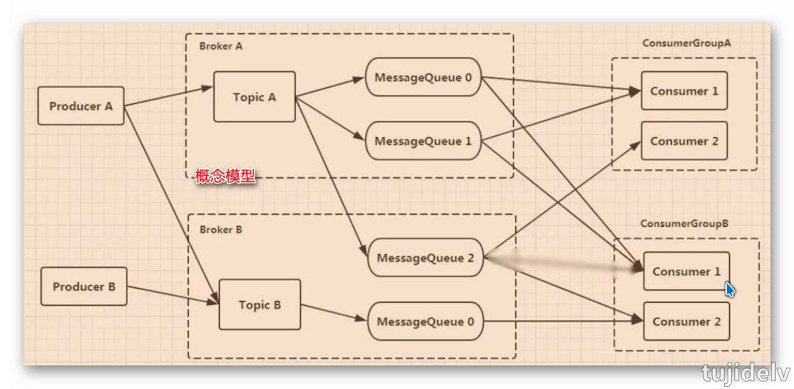
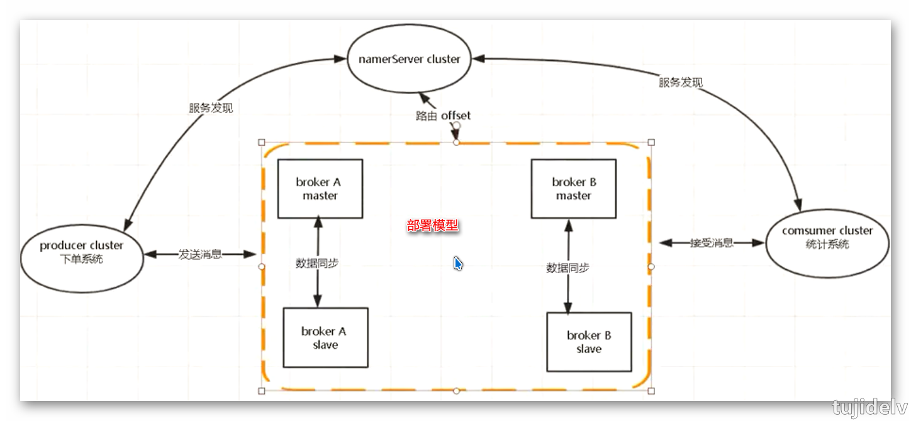
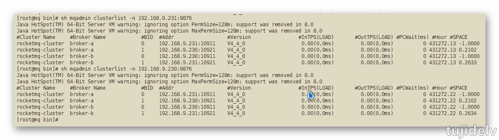

# 消息中间件之 RocketMQ

## 目录

- [简介](#简介)
- [正篇](#正篇)
- [参考链接](#参考链接)
- [结束语](#结束语)

## 简介

整理下学习RoctetMQ时的知识点.

## 正篇

### `简介及历史`

- 什么是RocketMQ
    ```
    阿里开源的用 java 编写的以队列为模型的分布式消息中间件，具有高可用、高吞吐量等特点。
    - 消息
        - 消息即为数据，数据就会有规则，有长度，有大小。
        - 标准JMS（JSR914）：https://www.jcp.org/en/jsr/detail?id=914
    - 中间件
        - 为我们提供发送消息的程序或者服务。
        - 主流的有： RocketMQ(没有严格遵循jms规范)、 Kafka、ActiveMQ（严格遵循jms规范）、RabbitMQ、zeroMQ
    ```
- 为什么要用消息中间件
     
- 为什么选择 RocketMQ
    ```
    1. 稳定无单点故障,原生支持分布式,不会因为某台机器或者某个节点宕机而影响系统正常使用
    2. 可严格保证消息的顺序性
    3. 经历过双十一
    4. java语言实现,java版本的kafka
    5. 架构轻,分布式协调采用NameServer来代替了Zookeeper
    6. 开源社区活跃
    ```
- 发展历史
    ```
    1. 2007年，淘宝实施了“五彩石”项目，“五彩石”用于将交易系统从单机变成分布式，也是在这个过程中产生了阿里巴巴第一代消息引擎——Notify。
    2. 2010年，阿里巴巴B2B部门基于ActiveMQ的5.1版本也开发了自己的一款消息引擎，称为Napoli。
        这款消息引擎在B2B里面广泛地被使用，不仅仅是在交易领域，在很多的后台异步解耦等方面也得到了广泛的应用。
    3. 2011年，业界出现了现在被很多大数据领域所推崇的Kafka消息引擎，阿里巴巴在研究了Kafka的整体机制和架构设计之后，基于Kafka的设计使用Java进行了完全重写并推出了MetaQ 1.0版本。
        主要是用于解决顺序消息和海量堆积的问题。
    4. 2012年，阿里巴巴对MetaQ进行了架构重组升级，开发出了MetaQ 2.0，这时就发现MetaQ原本基于Kafka的架构在阿里巴巴如此庞大的体系下很难进行水平扩展，所以在2012年的时候就开发了RocketMQ 3.0版本。
        RocketMQ 3.0和MetaQ 3.0这两者是等价的版本，只不过阿里内部使用的称为MetaQ 3.0，外部开源称之为RocketMQ 3.0。
    5. 2015年，又基于RocketMQ开发了阿里云上的Aliware MQ和Notify 3.0。
        MetaQ主要使用了拉模型，解决了顺序消息和海量堆积问题。
        Notify主要使用了推模型，解决了事务消息。
        Aliware MQ则是提供了商业化的版本。
    6. 2016年，阿里巴巴将RocketMQ的内核引擎捐赠给了Apache基金会。
    ```
    
### `JMS基本概念及使用`

- JMS全称`Java消息服务(Java Message Service)`，是Java平台上有关面向MOM的技术规范,旨在提供标准的生产、发布、订阅和消费消息的API简化企业应用的开发。
    - 类似于JDBC和关系型数据通信方式的抽象。
- JMS提供的元素
    ```
    Provider提供方：服务提供者
    Producer生产者：生产和发布JMS消息的客户端
    Consumer消费者：订阅和消费JMS消息的客户端
    Client客户端：生产或订阅消息的基于Java的应用&进程
    Message消息：服务端与客户端之间的传输数据对象
    Queue队列 ：包含待读取消息的准备区域（点对点）
    Topic主题：发布消息的分布机制（发布&订阅）
    Destination：消息被寻址,发送以及接受的对象
    ```
- JMS消息的组成
    ```
    消息头：提供消息的接受端和发送端两个客户端和JMS规范的元数据,JMS消息的复杂性在这里
        1. 由JMS规范提供的，客户端调用send()方法时，自动设置的消息头。
            JMSDestination：
                JMS发送消息的目的地。这对于使用来自多个目的地的消息的客户端很有价值。
                相关方法：public abstract Destination getJMSDestination()
            JMSDeliveryMode：
                JMS传送模式。支持两种模式：持久模式和非持久模式。默认的传递模式是持久。
                相关方法：public abstract int getJMSDeliveryMode()
            JMSMessageID：
                JMS消息ID。它是一个String类型的值，唯一标识了一条消息，并且必须以ID开头。
                相关方法：public abstract String getJMSMessageID()
            JMSTimestamp：
                JMS时间戳。它包含的是JMS提供者接受消息的时间，而不是该消息实际传送的时间。这条消息头用于确认发送消息和它被消费者实际接受的时间间隔。
                相关方法：public abstract long getJMSTimestamp()
            JMSExpiration：
                JMS消息的超时时间。这个头信息被用来阻止过期消息的传递。对于那些数据仅在某一个时间段内有效的消息来说，非常有用的。
                相关方法：public abstract long getJMSExpiration()
            JMSRedelivered：
                JMS重发。表示该消息将被重新传送给消费者。如果该消息被重新传送，JMSRedelivered消息头就为true，否则为false。
                相关方法：public abstract boolean getJMSRedelivered()
            JMSPriority：
                JMS优先级。在传送一条消息时，消息生产者能够为该消息分配一个优先级。
                相关方法：public abstract int getJMSPriority()
        2. 开发者分配的消息头。
            JMSReplyTo：
                JMS响应。一个JMS消息生产者可能会要求消费者对一条消息作出应答,JMSReplyTo消息头包含了一个javax.jms.Destination，表明JMS消费者应该应答的地址。
                相关方法：public abstract Destination getJMSReplyTo()。
            JMSCorrelationID：
                JMS关联ID。提供了一个消息头，用于将当前的消息和先前的某些消息或应用程序特定的ID关联起来，这个消息头通常用于将响应消息与请求消息。
                相关方法：public abstract String getJMSCorrelationID()。
            JMSType：
                JMS类型。用于语义标识消息类型，是由JMS客户端设置的一个可选消息头。它的主要作用是标示消息结构和有效负载的类型。
                相关方法：public abstract String getJMSType()。
    消息属性：消息属性就像可以分配一条消息的附加消息头一样。它们允许开发者添加有关消息的不透明附加消息。它们还用于暴露消息选择器在消息过滤时使用的数据。
        1. 应用程序特定的属性
        2. JMS定义的属性
        3. 提供者特定的属性
    消息体：消息的实际内容，JMS为消息体定义了六种类型载体,通过这个类型,你可以发送各种各样的数据。
        1. StreamMessage：Java原始类型的流数据
        2. MapMessage：key-value键值队作为数据载体。key一般使用字符串，value可以为Java原始类型。
        3. TextMessage：文本消息、字符串数据载体,一般用来发送简单的文本,XML数据
        4. ObjectMessage：序列化后的完整Java类。包括使用复杂Java类型。也支持集合
        5. BytesMessage：使用一个二进制数据来做数据载体。
        6. Message：最基础的消息体，没有数据载体。仅仅包含了消息体和属性，一般用做简单的时间通知。
    ```
- JMS消息模型(消息传递方式)
    ```
    点对点(P2P)：
        使用queue作为Destination,消息可被同步或异步的发送和接受,每个消息只会给一个Consumer传送一次。
    发布/订阅(Pub/Sub)：
        使用topic作为Destination,发布者向topic发送消息,订阅者接受来自topic的消息,发送到topic的任何消息都将自动传递给所有订阅者。
    ```
     
- 使用API创建一个应用程序的通用步骤
    ```
    1. 获取链接工厂ConnectionFactory
    2. 使用链接工厂创建连接Connection
    3. 启动连接并创建会话Session
    4. 获取Destination
    5. 创建Poducer或者Consumer
    6. 发送或者接收message
    7. 关闭资源
    ```

### `特性介绍`

- 官网：<http://rocketmq.apache.org/>
- Github: <https://github.com/apache/rocketmq>
---
- 基础特性
    ```
    1. 支持发布/订阅（Pub/Sub）和点对点（P2P）消息模型
    2. 在一个队列中可靠的先进先出（FIFO）和严格的顺序传递
    3. 支持拉（pull）和推（push）两种消息模式
    4. 单一队列百万消息的堆积能力
    5. 支持多种消息协议，如 JMS、MQTT 等
    7. 分布式高可用的部署架构,满足至少一次消息传递语义
    8. 提供docker镜像用于隔离测试和云集群部署
    9. 提供配置、指标和监控等功能丰富的Dashboard
    ```
- 相关术语
    ```
    - Message
        消息的载体。一个Message必须指定topic，相当于寄信的地址。
        Message还有一个可选的tag设置，以便消费端可以基于tag进行过滤消息。也可以添加额外的键值对，例如你需要一个业务key来查找broker上的消息，方便在开发过程中诊断问题。
    - Message Queue
        可以认为是一个长度无限的数组,offset就是下标。一个Topic下可以有多个Queue，Queue的引入使得消息存储可以分布式集群化，具有了水平扩展的能力。
    - Producer
        消息生产者，负责产生消息，一般由业务系统负责产生消息。
    - Producer Group
        生产者组，这类Producer通常发送一类消息，且发送逻辑一致。发送同一类消息的多个producer实例组成一个生产者组。
        可以是多台机器，也可以是一台机器的多个进程。
    - Consumer
        消息消费者，负责消费消息，一般是后台系统负责异步消费。
    - Consumer Group
        消费者组，这类Consumer通常消费一类消息，且消费逻辑一致。消费同一类消息的多个consumer实例组成一个消费者组。
        可以是多台机器，也可以是一台机器的多个进程。
    - Topic
        消息主题(逻辑分类)，比如说你有订单类的消息，也有库存类的消息，那么就需要进行分类，一个是订单Topic存放订单相关的消息，一个是库存Topic存储库存相关的消息。
    - Tag
        消息标签，可以被认为是对Topic进一步细化。一般在相同业务模块中通过引入标签来标记不同用途的消息。
    - Broker
        消息中转角色，负责接收、存储、转发消息，一般也称为Server，在JMS规范中称为Provider。
    - Name Server
        服务发现Server，用于生产者和消费者获取Broker路由信息的服务。
    ```
- 概念模型&部署模型
    ```
    Name Server：
        1. NameServer是一个几乎无状态节点，可集群部署，节点之间无任何信息同步（类似ZK）。
        2. NameServer用于存储Topic、Broker关系信息，功能简单，稳定性高。
            多个NameServer之间相互没有通信，单台NameServer宕机不影响其他NameServer与集群。
            即使整个NameServer集群宕机，已经正常工作的Producer，Consumer，Broker仍然能正常工作，但新起的Producer, Consumer，Broker就无法工作。
        3. NameServer压力不会太大，平时主要开销是在维持心跳和提供Topic-Broker的关系数据。
            但有一点需要注意，Broker向NameServer发心跳时，会带上当前自己所负责的所有Topic信息，如果Topic个数太多（万级别），
            会导致一次心跳中，就Topic的数据就几十M，网络情况差的话，网络传输失败，心跳失败，导致NameServer误认为Broker心跳失败。
    Broker：
        1. Broker 部署相对复杂，Broker分为Master 与 Slave，一个Master可以对应多个 Slave，但是一个Slave只能对应一个Master。
        2. Master 与 Slave 的对应关系通过指定相同的BrokerName，不同的 BrokerId 来定义，BrokerId为0表示Master，非 0 表示 Slave。
        3. Master可以部署多个。每个Broker与NameServer 集群中的所有节点建立长连接，定时注册Topic信息到所有NameServer。
        4. producer与NameServer集群中的其中一个节点（随机选择）建立长连接，定期从NameServer取Topic路由信息，并向提供Topic服务的Master建立长连接，且定时向Master发送心跳。
    Producer：
        1. Producer 完全无状态，可集群部署。
        2. Producer启动时，也需要指定NameServer的地址，从NameServer集群中选一台建立长连接。如果该NameServer宕机，会自动连其他NameServer。直到有可用的NameServer为止。
        3. Producer每30秒从NameServer获取Topic跟Broker的映射关系，更新到本地内存中。
            再跟Topic涉及的所有Broker建立长连接，每隔30秒发一次心跳。
            在Broker端也会每10秒扫描一次当前注册的Producer，如果发现某个Producer超过2分钟都没有发心跳，则断开连接。
        4. Producer发送时，会自动轮询当前所有可发送的broker，一条消息发送成功，下次换另外一个broker发送，以达到消息平均落到所有的broker上。
        5. 假如某个Broker宕机，意味生产者最长需要30秒才能感知到。在这期间会向宕机的Broker发送消息。
            当一条消息发送到某个Broker失败后，会往该broker自动再重发2次，假如还是发送失败，则抛出发送失败异常。业务捕获异常，重新发送即可。
            客户端里会自动轮询另外一个Broker重新发送，这个对于用户是透明的。
    Consumer：
        1. Consumer与NameServer集群中的其中一个节点（随机选择）建立长连接，定期从NameServer取Topic路由信息，并向提供Topic服务的Master、Slave建立长连接，且定时向 Master、Slave发送心跳。
        2. Consumer既可以从Master订阅消息，也可以从Slave订阅消息，订阅规则由Broker配置决定。
        3. Consumer启动时需要指定NameServer地址，与其中一个NameServer建立长连接。
            消费者每隔30秒从NameServer获取所有Topic的最新队列情况，这意味着某个Broker如果宕机，客户端最多要30秒才能感知。
            连接建立后，从NameServer中获取当前消费Topic所涉及的Broker，直连Broker。
        4. Consumer跟Broker是长连接，会每隔30秒发心跳信息到Broker。
            Broker端每10秒检查一次当前存活的Consumer，若发现某个Consumer 2分钟内没有心跳，就断开与该Consumer的连接，并且向该消费组的其他实例发送通知，触发该Consumer集群的负载均衡。
    ```
     
    
- RocketMQ高可用
---
   | 情况 | 发送消息 | 存储消息 | 接收消息 |
   |:---------|:---------|:---------|:---------|
   | 停掉一个namesrv | 不受影响 | 不受影响 | 不受影响 |
   | 停掉全部namesrv | 受影响 | 不受影响 | 受影响 |
   | 停掉单个master broker | 不受影响 | 受影响(很小) | 不受影响 |
   | 停掉全部master broker | 受影响 | 受影响 | 受影响 |
   | 停掉全部salve broker | 不受影响 | 不受影响 | 不受影响 |
   | 恢复任意master broker | 不受影响 | 受影响(很小) | 不受影响 |
- 消息发布
    ```
    producer将消息发送给Broker时，会轮询的将消息发送到每个队列中（所有broker下的Queue合并成一个List去轮询）,来实现发送方的负载均衡。
    ```
- 消息存储
    ```
    RocketMQ的消息的存储是由Consume Queue和Commit Log配合来完成的。
        Consume Queue中只存储很少的数据，消息主体都是通过Commit Log来进行读写。
    Consume Queue：
        消息的逻辑队列，相当于字典的目录，用来指定消息在物理文件commit log上的位置。
        存储了这个Queue在Commit Log中的起始offset，log大小和MessageTag的hashCode。
        每个Topic下的每个Queue都有一个对应的ConsumeQueue文件，默认位置如下，仍然可通过配置文件修改：${rocketmq.home}/store/consumequeue/${topicName}/${queueId}/${fileName}
        ---------------------
        1. 根据topic和queueId来组织文件,TopicA和QueueId=0组成一个ConsumeQueue,TopicA和QueueId=1组成另-个ConsumeQueue
        2. 按照消费端的GroupName来分组重试队列，如果消费端消费失败，消息将被发往重试队列中，比如图中的%RETRY%ConsumerGroupA
        3. 按照消费端的GroupName来分组死信队列，如果消费端消费失败，并重试指定次数后，仍然失败，则发往死信队列，比如图中的%DLQ%ConsumerGroupA
            注：死信队列（Dead Letter Queue）一般用于存放由于某种原因无法传递的消息，比如处理失败或者已经过期的消息。
        4. Consume Queue文件中的存储单元是一个20字节定长的二进制数据，顺序写顺序读,包括
            CommitLog Offset：8 Byte,存储这条消息在Commit Log文件中的实际偏移量
            Size：4 Byte,存储消息的大小
            Message Tag HashCode：8 Byte,存储消息的Tag的哈希值，主要用于订阅时消息过滤（订阅时如果指定了Tag，会根据HashCode来快速查找到订阅的消息）
    Commit Log：
        消息存放的物理文件，每台broker上的commitlog被本机所有的queue共享，不做任何区分。
        文件的默认位置如下，仍然可通过配置文件修改：${user.home} \store\${commitlog}\${fileName}
        ---------------------
        1. CommitLog文件中的存储单元长度不固定，文件顺序写，随机读。按照顺序以及编号对应的内容依次存储。
    Consumer消费消息过程中使用了零拷贝中的mmap+write方式,因为有小块数据传输的需求，效果会比 sendfile 更好。
        1. 使用 mmap + write 方式
            优点：即使频繁调用，使用小块文件传输，效率也很高。
            缺点：不能很好的利用DMA方式，会比sendfile多消耗CPU，内存安全性控制复杂，需要避免JVM Crash问题。
        2. 使用 sendfile 方式
            优点：可以利用DMA方式，消耗CPU较少，大块文件传输效率高，无内存安全新问题。
            缺点：小块文件效率低于mmap方式，只能是BIO方式传输，不能使用NIO。
    ```
    ```
    RocketMQ存储目录结构
    |-- abort 
    |-- checkpoint 
    |-- config
    | |-- consumerOffset.json
    | |-- consumerOffset.json.bak
    | |-- delayOffset.json
    | |-- delayOffset.json.bak
    | |-- subscriptionGroup.json.bak
    | |-- topics.json
    | |-- topics.json.bak 
    |-- commitlog
    | |-- 00000003384434229248
    | |-- 000000033855079710
    | |-- 0000000338658171289
    |-- consumequeue
      |-- %DLQ%ConsumerGroupA
      | |-- 0
      | | |-- 00000000000006000000
      |-- %RETRY%ConsumerGroupA
      | |-- 0
      | | |-- 00000000000000000000
      |-- %RETRY%ConsumerGroupB
      | |-- 0
      | | |-- 00000000000000000000
      |-- SCHEDULE_TOPIC_XXXX
      | |-- 2
      | | |-- 00000000000006000000
      | |-- 3
      | | |-- 00000000000006000000
      |-- TopicA
      | |-- 0
      | | |-- 00000000002604000000
      | | |-- 00000000002610000000
      | | |-- 00000000002616000000
      | |-- 1
      | | |-- 00000000002610000000
      | | |-- 00000000002610000000
      |-- TopicB
      | |-- 0
      | | |-- 00000000000732000000
      | |-- 1
      | | |-- 00000000000732000000
      | |-- 2
      | | |-- 00000000000732000000
    ```
    ```
    RocketMQ消息存储实现
    // Set the storage time
    msg.setStoreTimestamp(System.currentTimeMillis());
    // Set the message body BODY CRC (consider the most appropriate setting
    msg.setBodyCRC(UtilAll.crc32(msg.getBody()));
    StoreStatsService storeStatsService = this.defaultMessageStore.getStoreStatsService();
    synchronized (this) {
        long beginLockTimestamp = this.defaultMessageStore.getSystemClock().now();
        // Here settings are stored timestamp, in order to ensure an orderly global
        msg.setStoreTimestamp(beginLockTimestamp);
        // MapedFile：操作物理文件在内存中的映射以及将内存数据持久化到物理文件中
        MapedFile mapedFile = this.mapedFileQueue.getLastMapedFile();
        // 将Message追加到文件commitlog
        result = mapedFile.appendMessage(msg, this.appendMessageCallback);
        switch (result.getStatus()) {
        case PUT_OK:break;
        case END_OF_FILE:
             // Create a new file, re-write the message
             mapedFile = this.mapedFileQueue.getLastMapedFile();
             result = mapedFile.appendMessage(msg, this.appendMessageCallback);
         break;
         DispatchRequest dispatchRequest = new DispatchRequest(
                    topic,// 1
                    queueId,// 2
                    result.getWroteOffset(),// 3
                    result.getWroteBytes(),// 4
                    tagsCode,// 5
                    msg.getStoreTimestamp(),// 6
                    result.getLogicsOffset(),// 7
                    msg.getKeys(),// 8
                    /**
                     * Transaction
                     */
                    msg.getSysFlag(),// 9
                    msg.getPreparedTransactionOffset());// 10
        // 1.分发消息位置到ConsumeQueue
        // 2.分发到IndexService建立索引
        this.defaultMessageStore.putDispatchRequest(dispatchRequest);
    }
    ```
- 消息订阅
    ```
    RocketMQ消息订阅有两种模式，一种是Push模式，即MQServer主动向消费端推送；另外一种是Pull模式，即消费端在需要时，主动到MQServer拉取。
        但在具体实现时，Push和Pull模式都是采用消费端主动拉取的方式。
    ```
- 刷盘策略&复制策略
    ```
    刷盘策略：
        异步刷盘：ASYNC_FLUSH
            消息被写入内存pagecache后，立即返回消息写成功的状态，吞吐量大；当内存里的消息积累到一定程度时，统一发出写磁盘动作，快速写入。
        同步刷盘：SYNC_FLUSH
            消息被写入内存pagecache后，线程等待,立即通知刷盘线程，刷盘完成后，唤醒等待线程,返回消息写成功的状态，此时消息已经被写入磁盘。
    ```
    ```
    复制策略：
        异步复制：ASYNC_MASTER
            只要master写成功就返回成功状态。好处是低延迟、高吞吐，缺点是如果master出故障，数据没有写入slave，就会有丢失。
        同步复制(双写)：SYNC_MASTER
            master和slave都写成功后返回成功状态。好处是如果master出故障，slave上有全部备份，容易恢复。缺点是增大延迟，降低吞吐量。
    ```
    ```
    推荐策略： 异步刷盘 + 同步复制。
        如果要严格保证数据可靠，需采用同步刷盘和同步双写的方式，但性能会较其他方式低。
    ```
    
### `集群搭建`
- 集群部署模式
    ```
    单master：
        优点：除了配置简单没什么优点，适合个人学习使用。
        缺点：不可靠，该机器重启或宕机，将导致整个服务不可用。
    多master：
        多个master节点组成集群，单个master节点宕机或者重启对应用没有影响。
        优点：所有模式中性能最高。
        缺点：单个master节点宕机期间，未被消费的消息在节点恢复之前不可用，消息的实时性就受到影响。
    多master多slave异步复制：
        在多master模式的基础上，每个master节点都有至少一个对应的slave。master节点可读可写，但是slave只能读不能写，类似于mysql的主备模式。
        优点：在master宕机时，消费者可以从slave读取消息，消息的实时性不会受影响，性能几乎和多master一样。
        缺点：使用异步复制的同步方式有可能会有消息丢失的问题。
    多master多slave同步双写：
        同多master多slave异步复制模式类似，区别在于master和slave之间的数据同步方式。
        优点：同步双写的同步模式能保证数据不丢失。
        缺点：发送单个消息RT会略长，性能相比异步复制低10%左右。
    ```
- 软件依赖
    ```
    rocketmq：https://www.apache.org/dyn/closer.cgi?path=rocketmq/4.4.0/rocketmq-all-4.4.0-bin-release.zip
    jdk：https://www.oracle.com/technetwork/java/javase/downloads/jdk8-downloads-2133151.html
    ```
- 环境介绍(2M-2S-SYNC)
    ```
    192.168.9.230
        NameServer、broker-a(master)、broker-b-s(slave)
    192.168.9.231
        NameServer、broker-b(master)、broker-a-s(slave)
    ```
    ```
    防火墙设置：
        如果是开发环境,直接关闭防火墙
            CentOS6：# service iptables stop
            CentOS7：# service firewalld stop
        如果是生产环境,就需要配置防火墙，增加端口规则，默认nameserver端口是9876
    ```
- 开始部署
    1. 安装jdk并配置环境变量(省略,2台机器都要配置)
    2. 下载RocketMQ程序包(只需在一台服务器上执行操作)
        ```
        方法1：
            1. 去RocketMQ官网找到并复制其链接地址
            2. wget -P /opt/setups/ http://mirrors.shu.edu.cn/apache/rocketmq/4.4.0/rocketmq-all-4.4.0-bin-release.zip
        方法2：
            1. 去RocketMQ官网找到指定版本的zip包,下载到本地
            2. 通过rz等上传工具将程序包上传到/opt/setups目录中去
        方法3：
            1. 从GitHub中checkout源码
            2. 打开BUILDING文件找到"Build distribution packages"处的mvn命令
            3. 在Maven窗口执行命令,生成的压缩包在rockemq目录下的"distribution\target"
        ```
    3. 解压到指定目录
        ```
        # mkdir -pv /usr/program
        # unzip rocketmq-all-4.4.0-bin-release.zip -d /usr/program/
        ```
    4. 配置环境变量,使用vim编辑/etc/profile.d/my.sh文件
        ```
        # RocketMQ
        ROCKETMQ_HOME=/usr/program/rocketmq-all-4.4.0-bin-release
        PATH=$ROCKETMQ_HOME/bin:$PATH
        export ROCKETMQ_HOME
        export PATH
        ```
        ```
        # source /etc/profile.d/my.sh
        ```
    5. 创建存储等相关目录
        ```
        # mkdir -pv ${ROCKETMQ_HOME}/data/store/{commitlog,consumequeue,index,checkpoint,slave/{commitlog,consumequeue,index,checkpoint}}
        # tree -d ${ROCKETMQ_HOME}
        ```
    6. 配置集群参数
        ```
        # vim ${ROCKETMQ_HOME}/conf/2m-2s-sync/broker-a.properties
        -----------------
        #整个broker集群的名字，创建topic时需要指定
        brokerClusterName=rocketmq-cluster
        ##broker名字，注意此处不同的配置文件填写的不一样
        brokerName=broker-a
        ##0表示master,>0表示Slave
        brokerId=0
        #nameServer地址,分号分割
        namesrvAddr=192.168.9.230:9876;192.168.9.231:9876
        #强制指定本机IP，需要根据每台机器进行修改。官方介绍可为空，系统默认自动识别，但多网卡时IP地址可能读取错误
        #brokerIP=192.168.0.1
        #在发送消息时，自动创建服务器不存在的topic，默认创建的队列数
        defaultTopicQueueNums=4
        #是否允许Broker自动创建topic，建议线下开启，线上关闭
        autoCreateTopicEnable=true
        #是否允许Broker自动创订阅组，建议线下开启，线上关闭
        autoCreateSubscriptionGroup=true
        ##Broker对外服务的监听端口,同一台机器部署多个broker，端口号要不同，且端口号之间要相距大些
        listenPort=10911
        #删除文件时间点，默认凌晨4点
        deleteWhen=04
        #文件保留时间，默认72小时
        fileReservedTime=120
        #commitLog每个文件的大小,默认为1G
        mapedFileSizeCommitLog=1073741824
        #ConsumeQueue每个文件默认存30W条，根据业务情况调整
        mapedFileSizeConsumeQueue=3000000
        destoryMaoedFileIntervalForcibly=120000
        redeleteHangedFileInterval=120000
        #检测物理文件磁盘空间
        diskMaxUsedSpaceRatio=88
        ##store存储路径,master与slave目录要不同
        storePathRootDir=${ROCKETMQ_HOME}/data/store
        ##commitLog存储路径
        storePathCommitLog=${ROCKETMQ_HOME}/data/store/commitlog
        ##消息队列存储路径
        storePathConsumeQueue=${ROCKETMQ_HOME}/data/store/consumequeue
        ##消息索引储路径
        storePathIndex=${ROCKETMQ_HOME}/data/store/index
        ##checkpoint文件存储路径
        storeCheckpoint=${ROCKETMQ_HOME}/data/store/checkpoint
        #限制的消息大小
        maxMessageSize=65536
        flushCommitLogLeastPages=4
        flushConsumeQueueLeastPages=2
        flushCommitLogThoroughInterval=10000
        flushConsumeQueueThoroughInterval=60000
        checkTransactionMessageEnable=false
        #发消息线程池数量
        sendMessageThreadPoolNums=128
        #拉消息线程池数量
        pullMessageThreadPoolNums=128
        ##Broker的角色
        #ASYNC_MASTER 异步复制master
        #SYNC_MASTER 同步双写master
        #SLAVE 从
        brokerRole=SYNC_MASTER
        ##刷盘方式
        #ASYNC_FLUSH 异步刷盘
        #SYNC_FLUSH 同步刷盘
        flushDiskType=ASYNC_FLUSH
        ```
        ```
        # vim ${ROCKETMQ_HOME}/conf/2m-2s-sync/broker-b-s.properties
        -----------------
        brokerClusterName=rocketmq-cluster
        brokerName=broker-b
        brokerId=1
        namesrvAddr=192.168.9.230:9876;192.168.9.231:9876
        defaultTopicQueueNums=4
        autoCreateTopicEnable=true
        autoCreateSubscriptionGroup=true
        listenPort=10921
        deleteWhen=04
        fileReservedTime=120
        mapedFileSizeCommitLog=1073741824
        mapedFileSizeConsumeQueue=3000000
        destoryMaoedFileIntervalForcibly=120000
        redeleteHangedFileInterval=120000
        diskMaxUsedSpaceRatio=88
        storePathRootDir=${ROCKETMQ_HOME}/data/store/slave
        storePathCommitLog=${ROCKETMQ_HOME}/data/store/slave/commitlog
        storePathConsumeQueue=${ROCKETMQ_HOME}/data/store/slave/consumequeue
        storePathIndex=${ROCKETMQ_HOME}/data/store/slave/index
        storeCheckpoint=${ROCKETMQ_HOME}/data/store/slave/checkpoint
        maxMessageSize=65536
        flushCommitLogLeastPages=4
        flushConsumeQueueLeastPages=2
        flushCommitLogThoroughInterval=10000
        flushConsumeQueueThoroughInterval=60000
        checkTransactionMessageEnable=false
        sendMessageThreadPoolNums=128
        pullMessageThreadPoolNums=128
        brokerRole=SLAVE
        flushDiskType=ASYNC_FLUSH
        ```
        ```
        # vim ${ROCKETMQ_HOME}/conf/2m-2s-sync/broker-a-s.properties
        -----------------
        brokerClusterName=rocketmq-cluster
        brokerName=broker-a
        brokerId=1
        namesrvAddr=192.168.9.230:9876;192.168.9.231:9876
        defaultTopicQueueNums=4
        autoCreateTopicEnable=true
        autoCreateSubscriptionGroup=true
        listenPort=10921
        deleteWhen=04
        fileReservedTime=120
        mapedFileSizeCommitLog=1073741824
        mapedFileSizeConsumeQueue=3000000
        destoryMaoedFileIntervalForcibly=120000
        redeleteHangedFileInterval=120000
        diskMaxUsedSpaceRatio=88
        storePathRootDir=${ROCKETMQ_HOME}/data/store/slave
        storePathCommitLog=${ROCKETMQ_HOME}/data/store/slave/commitlog
        storePathConsumeQueue=${ROCKETMQ_HOME}/data/store/slave/consumequeue
        storePathIndex=${ROCKETMQ_HOME}/data/store/slave/index
        storeCheckpoint=${ROCKETMQ_HOME}/data/store/slave/checkpoint
        maxMessageSize=65536
        flushCommitLogLeastPages=4
        flushConsumeQueueLeastPages=2
        flushCommitLogThoroughInterval=10000
        flushConsumeQueueThoroughInterval=60000
        checkTransactionMessageEnable=false
        sendMessageThreadPoolNums=128
        pullMessageThreadPoolNums=128
        brokerRole=SLAVE
        flushDiskType=ASYNC_FLUSH
        ```
        ```
        # vim ${ROCKETMQ_HOME}/conf/2m-2s-sync/broker-b.properties
        -----------------
        brokerClusterName=rocketmq-cluster
        brokerName=broker-b
        brokerId=0
        namesrvAddr=192.168.9.230:9876;192.168.9.231:9876
        defaultTopicQueueNums=4
        autoCreateTopicEnable=true
        autoCreateSubscriptionGroup=true
        listenPort=10911
        deleteWhen=04
        fileReservedTime=120
        mapedFileSizeCommitLog=1073741824
        mapedFileSizeConsumeQueue=3000000
        destoryMaoedFileIntervalForcibly=120000
        redeleteHangedFileInterval=120000
        diskMaxUsedSpaceRatio=88
        storePathRootDir=${ROCKETMQ_HOME}/data/store
        storePathCommitLog=${ROCKETMQ_HOME}/data/store/commitlog
        storePathConsumeQueue=${ROCKETMQ_HOME}/data/store/consumequeue
        storePathIndex=${ROCKETMQ_HOME}/data/store/index
        storeCheckpoint=${ROCKETMQ_HOME}/data/store/checkpoint
        maxMessageSize=65536
        flushCommitLogLeastPages=4
        flushConsumeQueueLeastPages=2
        flushCommitLogThoroughInterval=10000
        flushConsumeQueueThoroughInterval=60000
        checkTransactionMessageEnable=false
        sendMessageThreadPoolNums=128
        pullMessageThreadPoolNums=128
        brokerRole=SYNC_MASTER
        flushDiskType=ASYNC_FLUSH
        ```
    7. 修改日志配置文件
        ```
        # mkdir -pv ${ROCKETMQ_HOME}/logs
        # cd ${ROCKETMQ_HOME}/conf && sed -i 's#${user.home}#${ROCKETMQ_HOME}#g' *.xml
        ```
    8. 修改启动参数
        ```
        # vim ${ROCKETMQ_HOME}/bin/runserver.sh
        -----------------
        JAVA_OPT="${JAVA_OPT} -server -Xms512m -Xmx512m -Xmn256m -XX:MetaspaceSize=128m -XX:MaxMetaspaceSize=320m"
        ```
        ```
        # vim ${ROCKETMQ_HOME}/bin/runbroker.sh
        -----------------
        JAVA_OPT="${JAVA_OPT} -server -Xms1g -Xmx1g -Xmn512m"
        ```
    9. 使用scp命令将mq项目复制到另一台服务器,并在另一台机器上执行`步骤4`
        ```
        # scp -r ${ROCKETMQ_HOME} root@192.168.9.230:/usr/program/
        ```
    10. 启动nameserver和broker服务(2台机器都要执行)
        ```
        输入命令jps或者查看${ROCKETMQ_HOME}/logs下日志是否输出正常
        -----------------
        # nohup sh mqnamesrv &
        # jps
        # nohup sh mqbroker -c ${ROCKETMQ_HOME}/conf/2m-2s-sync/broker-a.properties &
        # nohup sh mqbroker -c ${ROCKETMQ_HOME}/conf/2m-2s-sync/broker-b-s.properties &
        # jps
        ```
        ```
        查看集群监控状态
        -----------------
        # sh mqadmin clusterlist -n 192.168.9.231:9876
        ```
         
    11. 停止nameserver和broker服务
        ```
        或者通过jps命令查看进程号,kill -9 pid
        -----------------
        # sh mqshutdown broker
        # sh mqshutdown namesrv
        ```
        
### `性能测试`

### `API&源码分析`

- mq源码模块划分
---
   | 名称 | 	作用 |
   |:---------|:---------|
   | `broker` | `broker模块：c和p端消息存储逻辑` |
   | client	| 客户端api：produce、consumer端 接受与发送api |
   | common	| 公共组件：常量、基类、数据结构 |
   | tools | 运维tools：命令行工具模块 |
   | `store` | `存储模块：消息、索引、commitlog存储` |
   | `namesrv` | `服务管理模块：服务注册topic等信息存储` |
   | remoting | 远程通讯模块：netty+fastjson |
   | logappender | 日志适配模块 |
   | `example` | `Demo列子` |
   | filtersrv | 消息过滤器模块 |
   | srvutil | 辅助模块 |
   | filter | 过滤模块：消息过滤模块 |
   | `distribution` | `部署、运维相关zip包中的代码` |
   | openmessaging | 兼容openmessaging分布式消息模块 |


## 参考链接

<https://www.jianshu.com/p/453c6e7ff81c>
<https://www.jianshu.com/p/b090138cf52c>

## 结束语

- 未完待续...

