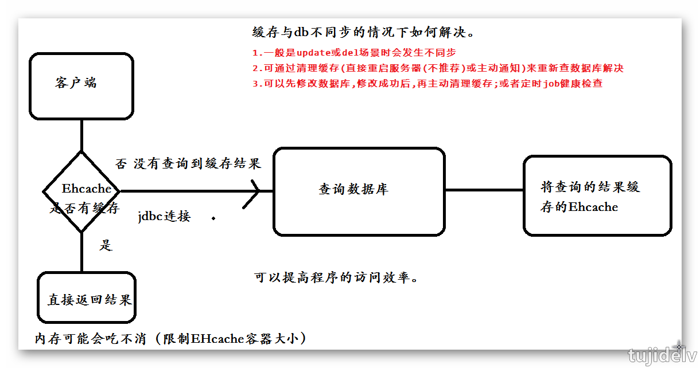
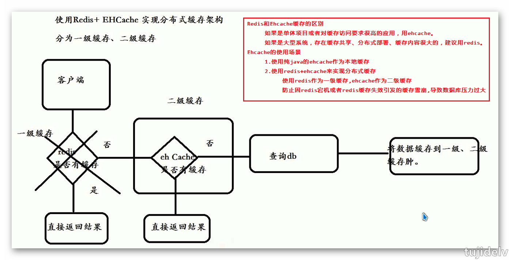
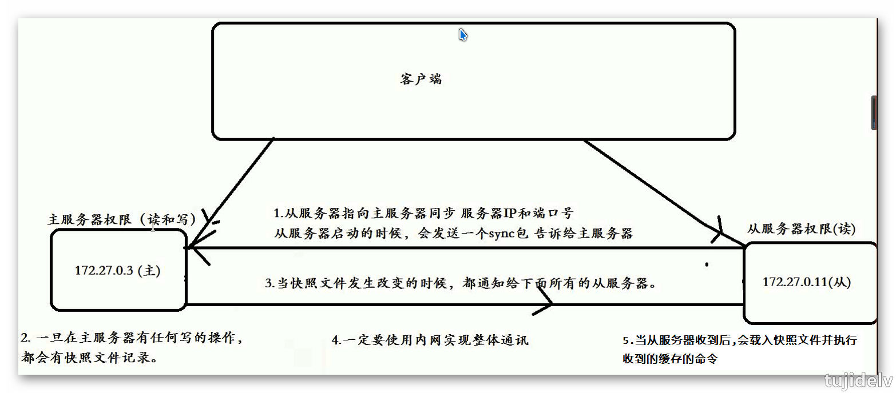

# 分布式系列之 Redis&Ehcache

## 目录

- [简介](#简介)
- [Ehcache](#Ehcache)
- [Redis](#Redis)
- [参考链接](#参考链接)
- [结束语](#结束语)

## 简介

- 缓存的分类
    ```
    客户端缓存
        浏览器页面缓存
        App客户端缓存
    网络缓存
        CDN内容分发缓存
        Nginx代理缓存
    服务器缓存
        数据库缓存
        平台缓存
    ```
- 为什么使用缓存
    ```
    减轻服务器端压力，减少网络传输请求
    ```
- 缓存框架的分类
    ```
    单体式缓存框架/内置缓存框架/JVM缓存框架(只能针对于单个JVM中,缓存容器存放在JVM中,每个JVM互不影响)
        Ehcache、Oscahche、Guava Caache
        可自己基于Map集合来实现JVM缓存框架
    分布式缓存框架(共享缓存数据)
        Redis、MemCache
    ```

## Ehcache

### `什么是Ehcache`

```
Ehcache是纯java的开源缓存框架，具有快速、精干等特点，是Hibernate中默认的CacheProvider。
它主要面向通用缓存、Java EE和轻量级容器，具有内存和磁盘存储、缓存加载器、缓存扩展、缓存异常处理程序。 
Ehcache最初由Greg Luck于2003年开始开发。2009年,该项目被Terracotta购买。软件仍然开源,但一些新的主要功能(例如，快速可重启性之间的一致性的)只能在商业产品中使用。
Ehcache 被广泛用于在Hibernate、Spring、Cocoon等其他开源系统。
```

### `Ehcache的主要特性`

```
1.快速；
2.简单；
3.多种缓存策略；
4.缓存数据有两级：内存和磁盘，因此无需担心容量问题；
5.缓存数据会在虚拟机重启的过程中写入磁盘；
6.可以通过 RMI、可插入 API 等方式进行分布式集群缓存；
7.具有缓存和缓存管理器的侦听接口；
8.支持多缓存管理器实例，以及一个实例的多个缓存区域；
9.提供 Hibernate 的缓存实现；
```

### `Ehcache使用介绍`

```
Ehcache是用来管理缓存的一个工具，其缓存的数据可以是存放在内存里面的，也可以是存放在硬盘上的。
其核心是CacheManager，一切Ehcache的应用都是从CacheManager开始的。
它是用来管理Cache（缓存）的，一个应用可以有多个CacheManager，而一个CacheManager下又可以有多个Cache。
Cache内部保存的是一个个的Element，而一个Element中保存的是一个key和value的配对，相当于Map里面的一个Entry。
```

### `Ehcache缓存过期策略`

```
当缓存需要被清理时（比如空间占用已经接近临界值了），需要使用某种淘汰算法来决定清理掉哪些数据。常用的淘汰算法有下面几种：
    FIFO：First In First Out，先进先出。判断被存储的时间，离目前最远的数据优先被淘汰。
    LRU：Least Recently Used，最近最少使用。判断最近被使用的时间，目前最远的数据优先被淘汰。
    LFU：Least Frequently Used，最不经常使用。在一段时间内，数据被使用次数最少的，优先被淘汰。
```

### `springboot整合ehcache`

1. 添加maven依赖
    ```
    <!--开启 cache 缓存 -->
    <dependency>
        <groupId>org.springframework.boot</groupId>
        <artifactId>spring-boot-starter-cache</artifactId>
    </dependency>
    <!-- ehcache缓存 -->
    <dependency>
        <groupId>net.sf.ehcache</groupId>
        <artifactId>ehcache</artifactId>
        <version>2.9.1</version>
    </dependency>
    ```
2. 添加Ehcache配置文件app1_ehcache.xml
    ```
    <?xml version="1.0" encoding="UTF-8"?>
    <ehcache xmlns:xsi="http://www.w3.org/2001/XMLSchema-instance"
    	xsi:noNamespaceSchemaLocation="http://ehcache.org/ehcache.xsd">
    
    	<diskStore path="java.io.tmpdir/ehcache-rmi-4000" />
    
    	<!-- 默认缓存 -->
    	<defaultCache maxElementsInMemory="1000" eternal="true"
    		timeToIdleSeconds="120" timeToLiveSeconds="120" overflowToDisk="true"
    		diskSpoolBufferSizeMB="30" maxElementsOnDisk="10000000"
    		diskPersistent="true" diskExpiryThreadIntervalSeconds="120"
    		memoryStoreEvictionPolicy="LRU">
    	</defaultCache>
    
    	<!-- 自定义缓存 -->
    	<cache name="userCache" maxElementsInMemory="1000" eternal="false"
    		timeToIdleSeconds="120" timeToLiveSeconds="120" overflowToDisk="true"
    		diskSpoolBufferSizeMB="30" maxElementsOnDisk="10000000"
    		diskPersistent="false" diskExpiryThreadIntervalSeconds="120"
    		memoryStoreEvictionPolicy="LRU">
    		<cacheEventListenerFactory class="net.sf.ehcache.distribution.RMICacheReplicatorFactory" />
    		<!-- 用于在初始化缓存，以及自动设置 -->
    		<bootstrapCacheLoaderFactory class="net.sf.ehcache.distribution.RMIBootstrapCacheLoaderFactory" />
    	</cache>
    </ehcache>
    ```
    ```
    参数相关配置
        1、diskStore ：
            指定数据(.data and .index)存储位置，可指定磁盘中的文件夹位置
        2、defaultCache ： 默认的管理策略
            一、以下属性是必须的：
            　　1、name： Cache的名称，必须是唯一的(ehcache会把这个cache放到HashMap里)。
            　　2、maxElementsInMemory：在内存中缓存的element的最大数目。 
            　　3、maxElementsOnDisk：在磁盘上缓存的element的最大数目，默认值为0，表示不限制。 
            　　4、eternal：设定缓存的elements是否永远不过期。如果为true，则缓存的数据始终有效，如果为false那么还要根据timeToIdleSeconds，timeToLiveSeconds判断。 
            　　5、overflowToDisk： 如果内存中数据超过内存限制，是否要缓存到磁盘上。 
            二、以下属性是可选的：
            　　1、timeToIdleSeconds： 对象空闲时间，指对象在多长时间没有被访问就会失效。只对eternal为false的有效。默认值0，表示一直可以访问。
            　　2、timeToLiveSeconds： 对象存活时间，指对象从创建到失效所需要的时间。只对eternal为false的有效。默认值0，表示一直可以访问。
            　　3、diskPersistent： 是否在磁盘上持久化。指重启jvm后，数据是否有效。默认为false。 
            　　4、diskExpiryThreadIntervalSeconds： 对象检测线程运行时间间隔。标识对象状态的线程多长时间运行一次。
            　　5、diskSpoolBufferSizeMB： DiskStore使用的磁盘大小，默认值30MB。每个cache使用各自的DiskStore。
            　　6、memoryStoreEvictionPolicy： 如果内存中数据超过内存限制，向磁盘缓存时的策略。默认值LRU，可选FIFO、LFU。
    ```
3. 配置yml
    ```
    ### 读取缓存配置
    cache:
        type: ehcache
        ehcache:
            config: classpath:app1_ehcache.xml
    ```
4. 项目使用
    ```
    @CacheConfig(cacheNames = "userCache")
    public interface UserMapper {
    	@Select("SELECT ID ,NAME,AGE FROM users where id=#{id}")
    	@Cacheable
    	List<Users> getUser(@Param("id") Long id);
    }
    ```
    ```
    @Cacheable  加了该注解的方法表示可以缓存
    @CacheConfig 表示创建缓存配置，Key为userCache
    ```
4. 启动
    ```
    //开启ehcache缓存模式
    @EnableCaching
    @MapperScan(basePackages = { "top.lvzhiqiang.mapper" })
    @SpringBootApplication
    public class App {
    	public static void main(String[] args) {
    		SpringApplication.run(App.class, args);
    	}
    }
    ```
5. 清除缓存
    ```
    @Autowired
    private CacheManager cacheManager;

    @RequestMapping("/remoKey")
    public void remoKey() {
        cacheManager.getCache("userCache").clear();
    }
    ```

### `总结`

 
 

## Redis

### `什么是Redis`

```
Redis是由意大利人Salvatore Sanfilippo（网名：antirez）开发的一款开源、高性能的的非关系型内存数据库,并以key-value方式进行存储。
Redis全称为：Remote Dictionary Server（远程数据服务），该软件使用C语言编写，官方提供的数据是可以达到100000+的qps。
它支持数据的持久化来保证数据高可用、支持丰富的数据类型进行存储。并采用单线程模式来保证线程安全问题。
-----------------------
集群方式：
    Redis主从复制+哨兵机制
    Redis3.0分片集群
```
### `Redis的应用场景`

- 会话session的一致性管理
- 短信验证码,保证有效期
- 缓存热点数据(经常被查询又不经常被修改)
- 基于redis实现分布式锁
- 网站计数器(由于单线程,高并发场景下,保证全局count唯一
- 实现消息中间件的发布订阅功能(不推荐)

### `Redis支持的数据类型`

```
相关命令
    ping：测试连接是否可以成功
    quit：退出连接
    dbsize：返回key的数量
    info：输出redis信息
    type key：返回数据类型
    rename oldkey newkey：重命名
    randomkey：随机返回一个key
    select 0-15：选择数据库
    move key 0-15：把key 移动到其他库
    del key：删除某个key
    key *：匹配显示所有key,支持正则
    exists key：查看key是否存在
```
- String（字符串）
    ```
    set key value
    get key
    ```
- Hash（字典）
    ```
    hmset key  key1 value1 key2 value2
    hgetall key
    hget key key1
    ```
- List（列表）
    ```
    lpush/rpush key value
    lrange key
    ```
- Set（集合）
    ```
    sadd key value
    smembers key
    ```
- Sorted Set（有序集合）
    ```
    zadd key value
    zrange key
    ```
    
### `springboot整合redis`

1. 添加maven依赖
    ```
    <dependency>
        <groupId>org.springframework.boot</groupId>
        <artifactId>spring-boot-starter-data-redis</artifactId>
    </dependency>
    ```
2. 修改yml文件
    ```
    spring:
        redis:
            database: 0
            host: 192.168.1.103
            port: 6379
            password: 123456
            jedis:
                pool:
                    max-active: 8
                    max-wait: -1
                    max-idle: 8
                    min-idle: 0
            timeout: 10000
    ```
3. 代码
    ```
    @Service
    public class RedisService {
    	@Autowired
    	private StringRedisTemplate stringRedisTemplate;
    	
    	public void set(String key, Object object, Long time) {
    		if (object instanceof String) {// 存放String 类型
    			setString(key, object);
    		}
    		if (object instanceof Set) {// 存放 set类型
    			setSet(key, object);
    		}
    		stringRedisTemplate.expire(key, time, TimeUnit.SECONDS);// 设置有效期 以秒为单位
    	}
    	public void setString(String key, Object object) {
    		String value = (String) object;// 如果是String 类型
    		stringRedisTemplate.opsForValue().set(key, value);
    	}
    	public void setSet(String key, Object object) {
    		Set<String> value = (Set<String>) object;
    		for (String oj : value) {
    			stringRedisTemplate.opsForSet().add(key, oj);
    		}
    	}
    	public String getString(String key) {
    		return stringRedisTemplate.opsForValue().get(key);
    	}
    }
    @RestController
    public class IndexControler {
    	@Autowired
    	private RedisService redisService;
    
    	@RequestMapping("/setString")
    	public String setString(String key, String value) {
    		redisService.set(key, value, 60l);
    		return "success";
    	}
    	@RequestMapping("/getString")
    	public String getString(String key) {
    		return redisService.getString(key);
    	}
    	...
    }
    ```

### `Redis发布订阅`

```
Redis发布订阅(pub/sub)是一种消息通信模式：发送者(pub)发送消息，订阅者(sub)接收消息。
这点和设计模式中的观察者模式比较相似,pub/sub不仅仅解决发布者和订阅者直接代码级别耦合也解决两者在物理部署上的耦合。
Redis客户端可以订阅任意数量的频道。
----------------
redis 127.0.0.1:6379> SUBSCRIBE redisChat
redis 127.0.0.1:6379> UNSUBSCRIBE redisChat
redis 127.0.0.1:6379> PUBLISH redisChat "Redis is a great caching technique"
```

### `Redis事务`

```
redis对事务的支持目前还比较简单。redis只能保证一个client发起的事务中的命令可以连续的执行，而中间不会插入其他client的命令。
由于redis是单线程来处理所有client的请求的所以做到这点是很容易的。一般情况下redis在接受到一个client发来的命令后会立即处理并返回处理结果，
但是当一个client在一个连接中发出multi命令时，这个连接会进入一个事务上下文，该连接后续的命令并不是立即执行，而是先放到一个队列中。当从此连接
受到exec命令后，redis会顺序的执行队列中的所有命令。并将所有命令的运行结果打包到一起返回给client.然后此连接就结束事务上下文。
----------------
redis集群对象JedisCluster不支持事务，但是，集群里边的每个节点支持事务
----------------
开启事物：multi
回滚事物：discard
提交事物：exec
```
```
//SpringBoot操作Redis事务
public void setString(String key, Object object) {
    stringRedisTemplate.setEnableTransactionSupport(true);
    stringRedisTemplate.multi();// 开启事务
    try {
        // 如果是String 类型
        String value = (String) object;
        stringRedisTemplate.opsForValue().set(key, value);
    } catch (Exception e) {
        stringRedisTemplate.discard();// 回滚事务
    } finally {
        stringRedisTemplate.exec();// 提交事务
    }
}
```

### `Redis主从复制`

- 概述
    ```
    1、将redis数据库分为主数据库（master）和从数据库（slave），主数据库可以进行读写操作，当发生写操作的时候自动将数据同步到从数
    据库，而从数据库一般是只读的，并接收主数据库同步过来的数据，一个主数据库可以有多个从数据库，而一个从数据库只能有一个主数据库。
    2、通过redis的主从复制功能可以很好的实现数据库的读写分离，提高服务器的负载能力。主数据库主要进行写操作，而从数据库负责读操作。
    3、redis非集群模式只允许有一个主服务器,允许有多个从服务器。
    ```
- 图
     
- 搭建
    ```
    0.关闭防火墙
    1.下载Redis程序包
    2.解压到指定目录并编译安装
        # cd /usr/program/redis-3.2.9
        # make
        # cd src
        # make install PREFIX=/usr/program/redis-3.2.9
    3.配置环境变量,使用vim编辑/etc/profile.d/my.sh文件
        REDIS_HOME=/usr/program/redis-3.2.9
        PATH=$REDIS_HOME/bin:$PATH
        export REDIS_HOME
        export PATH
    4.配置redis为后台启动
        # vim ${REDIS_HOME}/redis.conf //将daemonize no 改成daemonize yes
        # vim ${REDIS_HOME}/redis.conf // requirepass 123456,指定密码
        # vim ${REDIS_HOME}/redis.conf //将bind 127.0.0.1注释掉,开启外网访问
    5.开启redis
        # redis-server ${REDIS_HOME}/redis.conf
    6.连接Redis客户端
        # ./redis-cli -h 127.0.0.1 -p 6379 -a "123456"
        PING 结果表示成功
    7.从服务器上修改redis.conf配置文件
        # vim ${REDIS_HOME}/redis.conf //打开slaveof 192.168.33.130 6379,
        # vim ${REDIS_HOME}/redis.conf //打开masterauth 123456,主redis服务器如果配置了密码,则需要配置
    ```
    
### `Redis哨兵机制`

- 概述
    ```
    1.redis的哨兵(sentinel) 系统用于管理多个Redis服务器,该系统执行以下三个任务:
        监控(Monitoring): 哨兵(sentinel) 会不断地检查你的Master和Slave是否运作正常。
        提醒(Notification):当被监控的某个Redis出现问题时, 哨兵(sentinel) 可以通过API向管理员或者其他应用程序发送通知。
        自动故障迁移(Automatic failover):当一个Master不能正常工作时，哨兵(sentinel)会开始一次自动故障迁移操作,它会将失效Master的
            其中一个Slave升级为新的Master, 并让失效Master的其他Slave改为复制新的Master; 
            当客户端试图连接失效的Master时,集群也会向客户端返回新Master的地址,使得集群可以使用Master代替失效Master。
    2.哨兵(sentinel) 的一些设计思路和zookeeper非常类似
    3.哨兵是独立的一个应用程序(进程)
    ```
- 配置
    ```
    0.集群的所有服务器都要开启密码,即主服务器也要打开设置masterauth属性
    1.拷贝到etc目录
        cp sentinel.conf  /usr/local/redis/etc
    2.修改sentinel.conf配置文件
        sentinel monitor mymaster  192.168.110.133 6379 1  #主节点 名称 IP 端口号 选举次数
        sentinel auth-pass mymaster 123456  
        sentinel down-after-milliseconds mymaster 30  #修改心跳检测,默认为30秒,此改为30毫秒
        sentinel parallel-syncs mymaster 2  #做多多少合格节点,可不配置
    3.启动哨兵模式
        ./redis-server /usr/local/redis/etc/sentinel.conf --sentinel &
    4.停止哨兵模式
        kill
    ```

### `Redis持久化`

- 概念
    ```
    持久化就是把内存中的数据写到磁盘中去，防止服务宕机了内存数据丢失。
    Redis提供了两种持久化方式:RDB（默认开启）和AOF。
    ```
- RDB持久化
    - RDB全称Redis DataBase,是以二进制文件形式在某个时间点将数据写入一个临时文件(会替换上次持久化的文件)，来达到数据恢复。
    - RDB功能核心函数rdbSave(生成RDB文件)和rdbLoad（从文件加载内存）两个函数
    - 更多请参考<http://redisbook.readthedocs.io/en/latest/internal/rdb.html#id4>
    ```
    ##持久化数据存储在本地的文件
    dbfilename dump.rdb
    ##持久化数据存储在本地的路径，如果是在/redis/redis-3.0.6/src下启动的redis-cli，则数据会存储在当前src目录下
    dir ./
    ##保存策略,即snapshot触发的时机
    ###如下为900秒后，至少有一个变更操作，才会snapshot
    ###可以通过“save “””来关闭snapshot功能  
    #以下分别表示更改了1个key时间隔900s进行持久化存储；300s内更改了10个key则发起快照保存；更改10000个key60s进行存储
    save 900 1
    save 300 10
    save 60 10000
    ##当snapshot时出现错误无法继续时，是否阻塞客户端“变更操作”，“错误”可能因为磁盘已满/磁盘故障/OS级别异常等
    stop-writes-on-bgsave-error yes  
    ##是否启用rdb文件压缩，默认为“yes”，压缩往往意味着“额外的cpu消耗”，同时也意味这较小的文件尺寸以及较短的网络传输时间
    rdbcompression yes
    ```
- AOF持久化
    - AOF全称Append-only file,将“操作+数据”以格式化指令的方式追加到操作日志文件的尾部，“日志文件”保存了历史所有的操作过程
    - 采用redis通讯协议(RESP)格式的命令文本进行存储
    ```
    ##此选项为aof功能的开关，默认为“no”，可以通过“yes”来开启aof功能  
    appendonly yes
    ##指定aof文件名称  
    appendfilename appendonly.aof
    ##指定aof方式文件同步(保存)策略，有三个合法值：always everysec no,默认为everysec
    ###always代表每执行一个命令保存一次,停机时最多只丢失一个命令的数据。
    ###everysec代表每一秒钟保存一次 ,停机时一般情况下会丢失不超过2秒钟的数据,推荐。
    ###no代表不保存,停机时会丢失操作系统最后一次对AOF文件触发SAVE操作之后的数据。
    appendfsync everysec  
    ##在aof-rewrite期间，appendfsync是否暂缓文件同步，"no"表示“不暂缓”，“yes”表示“暂缓”，默认为“no”
    no-appendfsync-on-rewrite no  
    ##aof文件rewrite触发的最小文件尺寸(mb,gb),只有大于此aof文件大于此尺寸是才会触发rewrite，默认“64mb”，建议“512mb”  
    auto-aof-rewrite-min-size 64mb  
    ##相对于“上一次”rewrite，本次rewrite触发时aof文件应该增长的百分比。  
    ###每一次rewrite之后，redis都会记录下此时“新aof”文件的大小(例如A)，那么当aof文件增长到A*(1 + p)之后  
    ###触发下一次rewrite，每一次aof记录的添加，都会检测当前aof文件的尺寸。  
    auto-aof-rewrite-percentage 100
    ```
- RDB和AOF区别
    ```
    RDB
        优点：使用单独子进程来进行持久化，主进程不会进行任何IO操作，保证了redis的高性能 
        缺点：RDB是间隔一段时间进行持久化，如果持久化之间redis发生故障，会发生数据丢失。所以这种方式更适合数据要求不严谨的时候
    AOF
        优点：可以保持更高的数据完整性
        缺点：AOF文件比RDB文件大，加载(恢复速度)慢。
    ```

### `Redis的集群部署(推荐3主3从)`

1. 下载Redis程序包(只需在一台服务器上执行操作)
    ```
    方法1：
        1. 去Redis官网找到并复制其链接地址
        2. wget -P /opt/setups/ http://download.redis.io/releases/redis-3.2.9.tar.gz
    方法2：
        1. 去Redis官网找到指定版本的gz包,下载到本地
        2. 通过rz等上传工具将程序包上传到/opt/setups目录中去
    ```
2. 解压到指定目录并编译安装
    ```
    # mkdir -pv /usr/program
    # tar -xzf redis-3.2.9.tar.gz -C /usr/program/
    # cd /usr/program/redis-3.2.9
    # make
    ```
3. 配置环境变量,使用vim编辑/etc/profile.d/my.sh文件
    ```
    # Redis
    REDIS_HOME=/usr/program/redis-3.2.9
    PATH=$REDIS_HOME/src:$PATH
    export REDIS_HOME
    export PATH
    ```
    ```
    # source /etc/profile.d/my.sh
    ```
4. 创建集群等相关目录
    ```
    # mkdir -pv ${REDIS_HOME}/cluster-conf/{6379,6389}
    # tree -d ${REDIS_HOME}
    # cp ${REDIS_HOME}/redis.conf ${REDIS_HOME}/cluster-conf/6379
    # cp ${REDIS_HOME}/redis.conf ${REDIS_HOME}/cluster-conf/6389
    ```
5. 配置集群参数
    ```
    # vim ${REDIS_HOME}/cluster-conf/6379/redis.conf
    -----------------
    # myself
    ##端口号
    port 6379
    ##指定了记录日志的文件
    logfile "/usr/program/redis-3.2.9/cluster-conf/6379/redis.log"
    ##数据目录，数据库的写入会在这个目录
    ##rdb、aof文件也会写在这个目录
    dir /usr/program/redis-3.2.9/cluster-conf/6379/
    ##是否开启集群
    cluster-enabled yes
    ##集群配置文件的名称，每个节点都有一个集群相关的配置文件，持久化保存集群的信息。
    ##这个文件并不需要手动配置，这个配置文件有Redis生成并更新，每个Redis集群节点需要
    ##一个单独的配置文件，请确保与实例运行的系统中配置文件名称不冲突
    cluster-config-file nodes.conf
    ##节点互连超时的阀值。集群节点超时毫秒数
    cluster-node-timeout 5000
    ##默认redis使用的是rdb方式持久化，这种方式在许多应用中已经足够用了。
    ##但是redis如果中途宕机，会导致可能有几分钟的数据丢失，根据save来策略进行持久化，
    ##Append Only File是另一种持久化方式，可以提供更好的持久化特性。
    ##Redis会把每次写入的数据在接收后都写入appendonly.aof 文件，每次启动时Redis都会
    ##先把这个文件的数据读入内存里，先忽略RDB文件。
    appendonly yes
    ##指定Redis只接收来自于该IP 地址的请求，如果不进行设置，那么将处理所有请求，
    ##在生产环境中最好设置该项
    bind 0.0.0.0
    ```
    ```
    # vim ${REDIS_HOME}/cluster-conf/6389/redis.conf
    -----------------
    # myself
    port 6389
    logfile "/usr/program/redis-3.2.9/cluster-conf/6389/redis.log"
    dir /usr/program/redis-3.2.9/cluster-conf/6389/
    cluster-enabled yes
    cluster-config-file nodes.conf
    cluster-node-timeout 5000
    appendonly yes
    bind 0.0.0.0
    ```
6. 使用scp命令将redis项目复制到另一台服务器,并在另一台机器上执行`步骤3`
    ```
    # scp -r ${REDIS_HOME} root@192.168.9.230:/usr/program/
    ```
7. 启动
    ```
    另一台机器也要执行
    -----------------
    # redis-server ${REDIS_HOME}/cluster-conf/6379/redis.conf &
    # redis-server ${REDIS_HOME}/cluster-conf/6389/redis.conf &
    ```
8. 创建集群Cluster
    ```
    让redis-trib程序创建一个包含二个主节点和二个从节点的集群。
        给定redis-trib.rb程序的命令是create，表示希望创建一个新的集群。
        选项--replicas 1表示为集群中的每个主节点创建一个从节点（百分比选举master,按先后顺序）。
        之后跟着的其他参数则是实例的地址列表，我们希望程序使用这些地址所指示的实例来创建新集群。
    -----------------
    如在执行时提示/usr/bin/env: ruby: No such file or directory,需要安装ruby,因为redis-trib是用ruby写的
        # yum install ruby
    -----------------
    如在执行时提示/usr/program/redis-3.2.9/src/redis-trib.rb:24:in `require': no such file to load -- rubygems (LoadError)
        # yum install rubygems
    -----------------
    如在执行时提示/usr/lib/ruby/site_ruby/1.8/rubygems/custom_require.rb:31:in `gem_original_require': no such file to load -- redis (LoadError)
        # gem install redis
    -----------------
    如在执行gem install redis提示redis requires Ruby version >= 2.2.2.
        1. 安装curl
            yum install curl
        2. 安装RVM
            curl -L get.rvm.io | bash -s stable
            gpg2 --keyserver hkp://pool.sks-keyservers.net --recv-keys 409B6B1796C2..(此命令可通过上个命令的输出中找到)
            curl -L get.rvm.io | bash -s stable
            echo "ruby_url=https://cache.ruby-china.org/pub/ruby" > ~/.rvm/user/db(修改RVM的Ruby安装源到Ruby China的Ruby镜像服务器，这样能提高安装速度)
            source /usr/local/rvm/scripts/rvm
        3. 查看rvm库中已知的ruby版本
            rvm list known
        4. 安装一个ruby版本(贼TM慢)
            rvm install 2.3.3
        5. 使用一个ruby版本
            rvm use 2.3.3
        6. 设置默认版本
            rvm use 2.3.3 --default
        7. 卸载一个已知版本
            rvm remove 2.0.0
        8. 查看Ruby版本
            ruby --version
    -----------------
    ```
    ```
    # redis-trib.rb create --replicas 1 192.168.9.231:6379 192.168.9.230:6379 192.168.9.232:6379 192.168.9.231:6389 192.168.9.230:6389 192.168.9.232:6389
    ```
9. 查看
    ```
    
    ```
10. 关闭服务
    ```
    # redis-cli -h 192.168.9.231 -p 6379 shutdown
    ```

## 参考链接

## 结束语

- 未完待续...