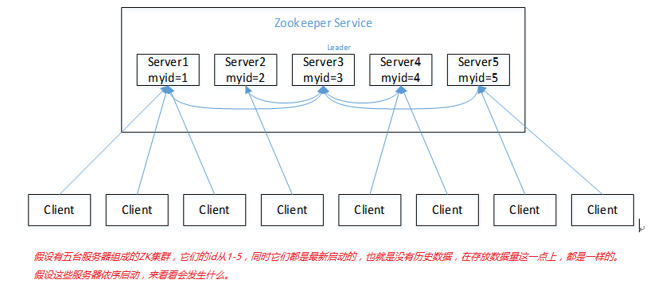
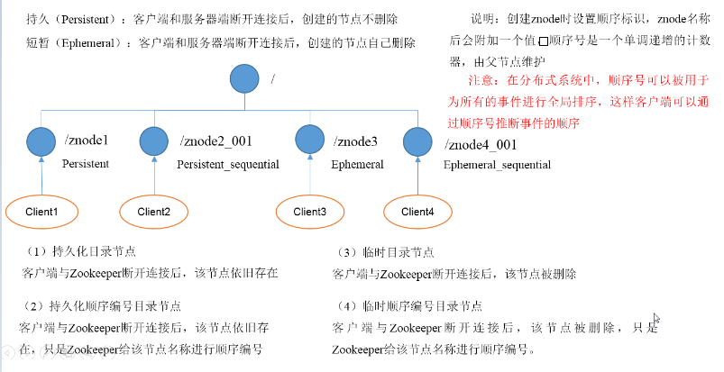
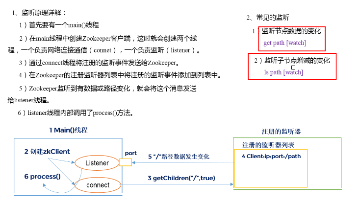
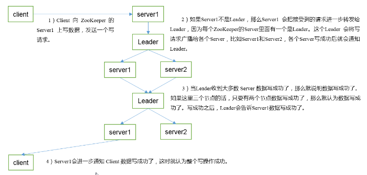
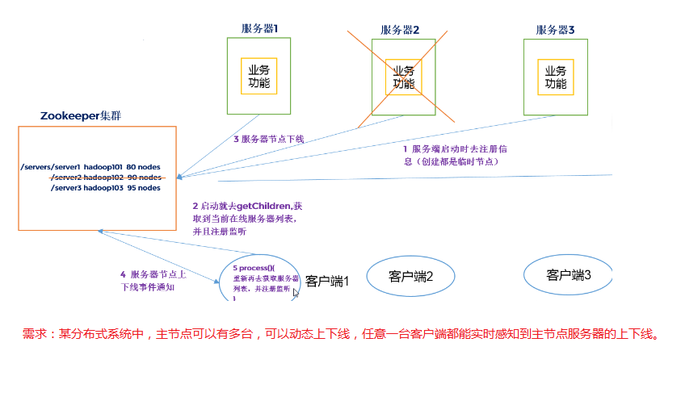

# 分布式协调工具之 Zookeeper

## 目录

- [入门](#入门)
- [安装](#安装)
- [内部原理](#内部原理)
- [实战](#实战)
- [参考链接](#参考链接)
- [结束语](#结束语)

## 入门

### 概述

- Zookeeper是一个开源分布式的为分布式应用提供协调服务的Apache项目。
- Zookeeper = 文件系统 + 通知机制。
- 工作机制
    ```
    从设计模式角度理解，它是一个基于观察者模式设计的分布式服务管理框架。它负责存储和管理大家都关心的数据，
    然后接受观察者的注册，一旦这些数据的状态发生变化，它就负责通知已经在zk上注册的那些观察者做出相应的反应。
    ```
### 特点

1. 一个领导者（leader）多个跟随者（follower）组成的集群。
2. 集群中只要有**半数以上（不包括半数）**节点存活，zk集群就能正常服务。
3. 全局唯一性，每个server保存一份相同的数据副本，client无论连接到哪个server，数据都是一致的。
4. 顺序性，来自同一个client的更新请求按其发送顺序依次执行。
5. 原子性，一次数据更新要么成功，要么失败。
6. 实时性，在一定时间范围内，client能读到最新数据。

### 数据结构

zk的数据模型的结构与`unix文件系统很类似`，整体上可以看作是一棵树，每个节点称作一个ZNode。
每一个ZNode默认能够存储`1MB`的数据，每个ZNode都可以`通过其路径唯一标识`。

### 应用场景

提供的服务包括：统一命名服务、统一配置管理、统一集群管理、服务器节点动态上下线、软负载均衡等。

```
1.统一命名服务
    在分布式环境下，经常需要对应用/服务进行统一命名，便于识别。
    例如IP不容易记住，而域名容易记住。
2. 统一配置管理
    1）分布式环境下，配置文件同步非常常见。
        1）一般要求一个集群中，所有节点的配置信息是一致的，比如kafka集群。
        2）对配置文件修改后，希望能够快速同步到各个节点上。
    2）配置管理可交由zk实现。
        1）可将配置信息写入zk上的一个ZNode。
        2）各个客户端服务器监听这个ZNode。
        3）一旦ZNode中的数据被修改，zk将通知各个客户端服务器。
3. 统一集群管理
    1）分布式环境中，实时掌握每个节点的状态是必要的。
        1）可根据节点实时状态做出一些调整。
    2）zk可以实现实时监控节点状态变化。
        1）可将节点信息写入zk上的一个ZNode。
        2）监听这个ZNode可获取它的实时状态变化。
4. 服务器节点动态上下线
    1）服务器启动时去注册信息（创建都是临时节点）。
    2）客户端获取到当前在线服务器列表，并且注册监听。
    3）服务器节点下线。
    4）zk将服务器节点上下线事件通知给客户端。
    5）客户端重新再去获取服务器列表，并注册监听。
5. 软负载均衡
    在zk中记录每台服务器列表的访问数，让访问数最少的服务器去处理最新的客户端请求。
```

## 安装

地址：<https://zookeeper.apache.org>

### 本地安装模式

1. 安装前准备
    - 安装jdk
    - 下载解压：tar -zxvf zookeeper-3.4.10.tar.gz -C /usr/program
2. 配置修改
    - 将conf目录的zoo_sample.cfg修改为zoo.cfg
    - 打开zoo.cfg文件，修改dataDir路径，最好放在zk目录下且目录必须事先存在
3. 操作zk
    - 启动服务端：bin/zkServer.sh start
    - 查看状态：bin/zkServer.sh status
    - 停止服务端：bin/zkServer.sh stop
    - 启动客户端：bin/zkCli.sh
    - 退出客户端：quit

### 配置参数

1. tickTime=2000
    ```
    通信心跳数，Zookeeper服务器与客户端心跳时间，单位毫秒。
    Zookeeper使用的基本时间，服务器之间或客户端与服务器之间维持心跳的时间间隔，也就是每个tickTime时间就会发送一个心跳，时间单位为毫秒。
    它用于心跳机制，并且设置最小的session超时时间为两倍心跳时间。(session的最小超时时间是2*tickTime)
    ```
2. initLimit=10
    ```
    Leader与Follower初始通信时限。
    集群中的Follower与Leader之间初始连接时能容忍的最多心跳数（tickTime的数量），用它来限定集群中的Zookeeper服务器连接到Leader的时限。
    ```
3. syncLimit=5
    ```
    Leader与Follower启动之后的同步通信时限。
    集群中Leader与Follower之间的最大响应时间单位，假如响应超过syncLimit * tickTime，Leader认为Follwer死掉，从服务器列表中删除Follwer。
    ```
4. dataDir
    ```
    数据文件目录+数据持久化路径。
    主要用于保存Zookeeper中的数据。
    ```
5. clientPort=2181
    ```
    客户端连接端口。
    监听客户端连接的端口。
    ```
   
### 分布式安装模式

```
1．集群规划
    在hadoop102、hadoop103和hadoop104三个节点上部署Zookeeper。
2．解压安装
   （1）解压Zookeeper安装包到/usr/program/目录下
   （2）同步/usr/program/zookeeper-3.4.10目录内容到hadoop103、hadoop104
3．配置服务器编号
   （1）在/usr/program/zookeeper-3.4.10/这个目录下创建zkData
   （2）在/usr/program/zookeeper-3.4.10/zkData目录下创建一个myid的文件
   （3）编辑myid文件，在文件中添加与server对应的编号：2
   （4）拷贝配置好的zookeeper到其他机器上，并分别在hadoop102、hadoop103上修改myid文件中内容为3、4
4．配置zoo.cfg文件
   （1）重命名/usr/program/zookeeper-3.4.10/conf这个目录下的zoo_sample.cfg为zoo.cfg
   （2）打开zoo.cfg文件
        修改数据存储路径配置
        dataDir=/usr/program/zookeeper-3.4.10/zkData
        增加如下配置
        #######################cluster##########################
        server.2=hadoop102:2888:3888
        server.3=hadoop103:2888:3888
        server.4=hadoop104:2888:3888
   （3）同步zoo.cfg配置文件
   （4）配置参数解读
        server.A=B:C:D。
        A是一个数字，表示这个是第几号服务器；
            集群模式下配置一个文件myid，这个文件在dataDir目录下，这个文件里面有一个数据就是A的值，
            Zookeeper启动时读取此文件，拿到里面的数据与zoo.cfg里面的配置信息比较从而判断到底是哪个server。
        B是这个服务器的ip地址；
        C是这个服务器与集群中的Leader服务器交换信息的端口；
        D是万一集群中的Leader服务器挂了，需要一个端口来重新进行选举，选出一个新的Leader，而这个端口就是用来执行选举时服务器相互通信的端口。
5. 集群操作
   （1）分别启动Zookeeper
        [hadoop102 zookeeper-3.4.10]$ bin/zkServer.sh start
        [hadoop103 zookeeper-3.4.10]$ bin/zkServer.sh start
        [hadoop104 zookeeper-3.4.10]$ bin/zkServer.sh start
   （2）查看状态
        [hadoop102 zookeeper-3.4.10]$ bin/zkServer.sh status
        [hadoop103 zookeeper-3.4.10]$ bin/zkServer.sh status
        [hadoop104 zookeeper-3.4.10]$ bin/zkServer.sh status
```

### 客户端命令行操作

| 命令基本语法 | 功能描述 |
|:---------|:---------|
| bin/zkCli.sh | 启动客户端 |
| help | 显示所有操作命令 |
| ls path [watch] | 查看当前znode中所包含的内容（子节点） |
| ls2 path [watch] | 查看当前节点详细数据（包括更新次数等数据） |
| create path 节点内容| 创建节点，-s 含有序列 -e 临时（重启或者超时消失）|
| get path [watch] | 获得节点的值 |
| set path 节点内容| 修改节点数据值 |
| stat path| 查看节点状态 |
| delete path| 删除节点 |
| rmr path| 递归删除节点 |

```
1. 创建带序号的节点时，如果原来没有序号节点，序号从0开始依次递增。如果原节点下已有2个节点，则再排序时从2开始，以此类推。
2. watch代表监听，可以监听节点值的变化、节点的子节点变化（路径变化）等。
```
   
## 内部原理

### `选举机制`

1. **半数机制**：集群中半数以上机器存活，集群可用，所以ZK适合安装奇数台服务器。
2. ZK虽然在配置文件中并没有指定Master和Slave，但是ZK工作时，是有一个节点为Leader，其他则为Follower，Leader是通过内部的选举机制临时产生的。


```
（1）服务器1启动，此时只有它一台服务器启动了，它发出去的报文没有任何响应，所以它的选举状态一直是LOOKING状态。
（2）服务器2启动，它与最开始启动的服务器1进行通信，互相交换自己的选举结果，由于两者都没有历史数据，所以id值较大的服务器2胜出，
但是由于没有达到超过半数以上的服务器都同意选举它(这个例子中的半数以上是3)，所以服务器1、2还是继续保持LOOKING状态。
（3）服务器3启动，根据前面的理论分析，服务器3成为服务器1、2、3中的老大，而与上面不同的是，此时有三台服务器选举了它，
所以它成为了这次选举的Leader。
（4）服务器4启动，根据前面的分析，理论上服务器4应该是服务器1、2、3、4中最大的，但是由于前面已经有半数以上的服务器选举了服务器3，
所以它只能接收当小弟的命了。
（5）服务器5启动，同4一样当小弟。
```

### 节点类型



### Stat结构体

```
1）czxid - 创建节点的事务zxid
    每次修改ZooKeeper状态都会收到一个zxid形式的时间戳，也就是ZooKeeper事务ID。
    事务ID是ZooKeeper中所有修改总的次序。每个修改都有唯一的zxid，如果zxid1小于zxid2，那么zxid1在zxid2之前发生。
2）ctime - znode被创建的毫秒数(从1970年开始)
3）mzxid - znode最后更新的事务zxid
4）mtime - znode最后修改的毫秒数(从1970年开始)
5）pZxid - znode最后更新的子节点zxid
6）cversion - znode子节点变化号，znode子节点修改次数
7）dataversion - znode数据变化号
8）aclVersion - znode访问控制列表的变化号
9）ephemeralOwner - 如果是临时节点，这个是znode拥有者的session id。如果不是临时节点则是0。
10）dataLength - znode的数据长度
11）numChildren - znode子节点数量
```

### `监听器原理`



### 写数据流程



## 实战

### API应用

- 创建ZooKeeper客户端
    ```java
    private static String connectString = "hadoop102:2181,hadoop103:2181,hadoop104:2181";
    private static int sessionTimeout = 2000;
    private ZooKeeper zkClient = null;
    
    @Before
    public void init() throws Exception {
        zkClient = new ZooKeeper(connectString, sessionTimeout, new Watcher() {
            @Override
            public void process(WatchedEvent event) {
                // 收到事件通知后的回调函数（用户的业务逻辑）
                System.out.println(event.getType() + "--" + event.getPath());
                // 再次启动监听
                try {
                    zkClient.getChildren("/", true);
                } catch (Exception e) {
                    e.printStackTrace();
                }
            }
        });
    }
    ```
- 创建子节点
    ```java
    @Test
    public void create() throws Exception {
        // 参数1：要创建的节点的路径； 参数2：节点数据 ； 参数3：节点权限 ；参数4：节点的类型
        String nodeCreated = zkClient.create("/aa", "jinlian".getBytes(), Ids.OPEN_ACL_UNSAFE, CreateMode.PERSISTENT);
    }
    ```
- 获取子节点并监听节点变化
    ```java
    @Test
    public void getChildren() throws Exception {
        List<String> children = zkClient.getChildren("/", true);
        for (String child : children) {
            System.out.println(child);
        }
        // 延时阻塞
        Thread.sleep(Long.MAX_VALUE);
    }
    ```
- 判断Znode是否存在
    ```java
    @Test
    public void exist() throws Exception {
        Stat stat = zkClient.exists("/eclipse", false);
        System.out.println(stat == null ? "not exist" : "exist");
    }
    ```
  
### 监听服务器节点动态上下线



- 在集群上创建/servers节点
    ```
    [zk: localhost:2181(CONNECTED) 10] create /servers "servers"
    ```
- 服务器端向ZK注册并写入信息
    ```java
    import java.io.IOException;
    import org.apache.zookeeper.CreateMode;
    import org.apache.zookeeper.WatchedEvent;
    import org.apache.zookeeper.Watcher;
    import org.apache.zookeeper.ZooKeeper;
    import org.apache.zookeeper.ZooDefs.Ids;
    
    public class DistributeServer {
        private static String connectString = "hadoop102:2181,hadoop103:2181,hadoop104:2181";
        private static int sessionTimeout = 2000;
        private ZooKeeper zk = null;
        private String parentNode = "/servers";
        
        // 创建到zk的客户端连接
        public void getConnect() throws IOException{
            zk = new ZooKeeper(connectString, sessionTimeout, new Watcher() {
                @Override
                public void process(WatchedEvent event) {
                }
            });
        }
        // 注册服务器
        public void registServer(String hostname) throws Exception{
            String create = zk.create(parentNode + "/server", hostname.getBytes(), Ids.OPEN_ACL_UNSAFE, CreateMode.EPHEMERAL_SEQUENTIAL);
            System.out.println(hostname +" is online "+ create);
        }
        // 业务功能
        public void business(String hostname) throws Exception{
            System.out.println(hostname+" is working ...");
            Thread.sleep(Long.MAX_VALUE);
        }
        
        public static void main(String[] args) throws Exception {
            // 1获取zk连接
            DistributeServer server = new DistributeServer();
            server.getConnect();
            // 2 利用zk连接注册服务器信息
            server.registServer(args[0]);
            // 3 启动业务功能
            server.business(args[0]);
        }
    }
    ```
- 客户端向ZK注册并监听
    ```java
    import java.io.IOException;
    import java.util.ArrayList;
    import java.util.List;
    import org.apache.zookeeper.WatchedEvent;
    import org.apache.zookeeper.Watcher;
    import org.apache.zookeeper.ZooKeeper;
    
    public class DistributeClient {
        private static String connectString = "hadoop102:2181,hadoop103:2181,hadoop104:2181";
        private static int sessionTimeout = 2000;
        private ZooKeeper zk = null;
        private String parentNode = "/servers";
    
        // 创建到zk的客户端连接
        public void getConnect() throws IOException {
            zk = new ZooKeeper(connectString, sessionTimeout, new Watcher() {
                @Override
                public void process(WatchedEvent event) {
                    // 再次启动监听
                    try {
                        getServerList();
                    } catch (Exception e) {
                        e.printStackTrace();
                    }
                }
            });
        }
        // 获取服务器列表信息
        public void getServerList() throws Exception {
            // 1获取服务器子节点信息，并且对父节点进行监听
            List<String> children = zk.getChildren(parentNode, true);
            // 2存储服务器信息列表
            ArrayList<String> servers = new ArrayList<>();
            // 3遍历所有节点，获取节点中的主机名称信息
            for (String child : children) {
                byte[] data = zk.getData(parentNode + "/" + child, false, null);
                servers.add(new String(data));
            }
            // 4打印服务器列表信息
            System.out.println(servers);
        }
        // 业务功能
        public void business() throws Exception{
            System.out.println("client is working ...");
            Thread.sleep(Long.MAX_VALUE);
        }
    
        public static void main(String[] args) throws Exception {
            // 1获取zk连接
            DistributeClient client = new DistributeClient();
            client.getConnect();
            // 2获取servers的子节点信息，从中获取服务器信息列表
            client.getServerList();
            // 3业务进程启动
            client.business();
        }
    }
    ```

## 参考链接

## 结束语
