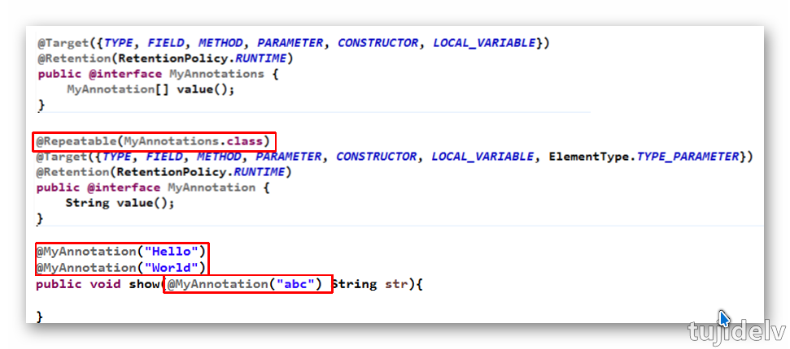

# JJava 新特性：8

## 目录

- [简介](#简介)
- [正篇](#正篇)
- [参考链接](#参考链接)
- [结束语](#结束语)

## 简介

- 整理下 Java8 的所有新特性。 
    - `Lambda表达式`
    - `Stream API`
    - 全新时间日期 API
    - ConcurrentHashMap
    - MetaSpace
- Java8 的新特性对 java 的影响。
    - 更安全(Optional)
    - 更效率(HashMap,HashSet,ConcurrentHashMap,MetaSpace)
    - 简化书写(Lambda,Stream API)

## 正篇

### `Lambda 表达式`

```
一、简介：
    Lambda表达式相当于匿名内部类的更简化的写法，并且可以像数据一样进行传递。
    它需要函数式接口的支持。
二、基础语法：
    Java8中引入了一个新的操作符 "->"，该操作符被称为箭头操作符或Lambda操作符，箭头操作符将Lambda表达式拆分成两部分：
        左侧：指定了Lambda表达式需要的所有参数 
        右侧：指定了Lambda体，即Lambda表达式要执行的功能。
    上联：左右遇一括号省
    下联：左侧推断类型省
    横批：能省则省
```
```
语法格式一：无参数，无返回值，Lambda体只需一条语句
    Runnable r1 = () -> System.err.println("Hello Lambda!r1");
    r1.run();
语法格式二：有一个参数，无返回值
    Consumer<String> con = (arg) -> System.err.println("hello " + arg);
	con.accept("consumer!");
    
    若只有一个参数，参数的小括号可以省略不写
        Consumer<String> con = arg -> System.err.println("hello " + arg);
语法格式三：有两个以上的参数，有返回值，并且Lambda体中有多条语句
    Comparator<Integer> com = (x, y) -> {
        System.out.println("函数式接口");
        return Integer.compare(x, y);
    };
    
    若Lambda体中只有一条语句，return和大括号都可以省略不写
        Comparator<Integer> com = (x, y) -> Integer.compare(x, y);
语法格式四：Lambda表达式的参数列表的数据类型可以省略不写，因为JVM编译器根据程序的上下文推断出参数的数据类型，即“类型推断”
    Comparator<Integer> com = (Integer x, Integer y) -> Integer.compare(x, y);
    
    例如：
        String[] str = {"aaa","bbb","ccc"};
        List<String> list = new ArrayList<>();
```

### `函数式接口`

```
一、简介
    1. 只包含一个抽象方法的接口，称为函数式接口。 
    2. 可以通过Lambda表达式来创建该接口的对象。（若Lambda表达式抛出一个受检异常，那么该异常需要在目标接口的抽象方法上进行声明）。
    3. 可以在任意函数式接口上使用@FunctionalInterface注解，可以检查它是否是一个函数式接口，同时javadoc也会包含一条声明，说明这个接口是一个函数式接口。
二、自定义函数式接口
    @FunctionalInterface
    public interface MyFun<T>{
        public T getValue(T t);
    }
    public String toUpperString(MyFun<String> mf, String str){
        return mf.getValue(str);
    }
    @Test
    public void test(){
        String newStr = toUpperString((x) -> str.toUpperCase, "abcdeF");
    }
```
```
Java8内置四大核心函数式接口
    Consumer<T> 消费型接口
        包含方法： void accept(T t)
    Supplier<T> 供给型接口
        包含方法：T get();
    Function<T, R> 函数型接口
        包含方法：R apply(T t);
    Predicate<T> 断言型接口
        包含方法：boolean test(T t)
-------------------
@Test
public void test1(){
    happy(10000, (m) -> System.out.println("团建每次消费：" + m + "元"));
} 
public void happy(double money, Consumer<Double> con){
    con.accept(money);
}
@Test
public void test2(){
    String newStr = strHandler("\t\t\t 函数型接口   ", (str) -> str.trim());
    System.out.println(newStr);
}
public String strHandler(String str, Function<String, String> fun){
    return fun.apply(str);
}
...
```

### `方法引用与构造器引用`

```
方法引用：若Lambda体中的功能，已经有方法提供了实现，可以使用方法引用(可以将方法引用理解为Lambda表达式的另外一种表现形式)
    对象::实例方法
    类::静态方法
    类::实例方法
注意：
    ①方法引用所引用的方法的参数列表与返回值类型，需要与函数式接口中抽象方法的参数列表和返回值类型保持一致！
    ②若Lambda的参数列表的第一个参数，是实例方法的调用者，第二个参数(或无参)是实例方法的参数时，格式： ClassName::MethodName
------------------
Consumer<String> con = (x) -> System.out.println(x);
    等价于：Consumer<String> con = System.out::println;
BinaryOperator<Double> bo = (x,y) -> Math.pow(x,y);
    等价于：BinaryOperator<Double> bo = Math::pow;
BiPredicate<String,String> bp = (x,y) -> x.equals(y);
    等价于：BinaryOperator<Double> bo = String::equals;
```
```
构造器引用：构造器的参数列表，需要与函数式接口中参数列表保持一致！
    ClassName::new 
------------------
Function<Integer,MyClass> fun = (x) -> new MyClass(x);
    等价于：Function<Integer,MyClass> fun = Myclass::new;
```
```
数组引用：
    type[] :: new
------------------
Function<Integer,String[]> fun = (x) -> new String[x];
    等价于：Function<Integer,String[]> fun = String[]::new;
```

###  `Stream API`

```
一、简介：
    Stream是数据渠道，用于操作数据源（集合、数组等）所生成的元素序列。
    通过操作Stream API,可以非常高效且方便对数据源进行查找、过滤和映射数据等操作。类似于写sql一样。
二、注意：
    Stream 自己不会存储元素。
    Stream 不会改变源对象。相反，他们会返回一个持有结果的新Stream。
    Stream 操作是延迟执行的。这意味着他们会等到需要结果的时候才执行。
三、操作步骤：
    1.创建 Stream
        通过一个数据源（如：集合、数组），来获取一个流
    2.中间操作
        一个中间操作链，对数据源的数据进行处理 
    3.终止操作(终端操作)
        通过一个终止操作，来执行中间操作链，并产生结果
```
- ***创建 Stream***

```
1.使用Collection集合提供的stream()和parallelStream()
     default Stream<E> stream() : 返回一个串行(顺序)流
     default Stream<E> parallelStream() : 返回一个并行流
2.使用Arrays类中的静态方法stream()获取数组流
     static <T> Stream<T> stream(T[] array): 返回一个流
3.使用Stream类中的静态方法of(),通过显示值创建一个流,它可以接收任意数量的参数。
     public static<T> Stream<T> of(T... values) : 返回一个流
4.使用Stream类中的静态方法iterate()或者generate()创建无限流
    迭代：public static<T> Stream<T> iterate(final T seed, final UnaryOperator<T> f) 
        eg：Stream<Integer> steram = Stream.iterate(0,(x) -> x+2);
    生成：public static<T> Stream<T> generate(Supplier<T> s)
        eg：Stream<Integer> steram = Stream.generate(() -> Math.random());
```

- ***中间操作***

```
多个中间操作可以连接起来形成一个流水线，除非流水线上触发终止操作，否则中间操作不会执行任何的处理！而在终止操作时一次性全部处理，称为“惰性求值”。
------------------
1.筛选与切片
    filter(Predicate p)：接收Lambda，从流中排除某些元素。
    limit(long maxSize)：截断流，使其元素不超过给定数量。
    skip(long n)：跳过元素，返回一个扔掉了前n个元素的流。若流中元素不足n个，则返回一个空流。与limit(n)互补。
    distinct()：筛选，通过流所生成元素的hashCode()和equals()去除重复元素。
2.映射(提取)
    map(Function f)：接收一个函数作为参数，该函数会被应用到每个元素上，并将其映射成一个新的元素。
        mapToDouble(ToDoubleFunction f)：接收一个函数作为参数，该函数会被应用到每个元素上，产生一个新的DoubleStream。 
        mapToInt(ToIntFunction f)：接收一个函数作为参数，该函数会被应用到每个元素上，产生一个新的IntStream。 
        mapToLong(ToLongFunction f)：接收一个函数作为参数，该函数会被应用到每个元素上，产生一个新的LongStream。
    flatMap(Function f)：接收一个函数作为参数，将流中的每个值都换成另一个流，然后把所有流连接成一个流。
        注：map与flatMap类似于集合中的add和addAll之间的关系。
3.排序
    sorted()：产生一个新流，其中按自然顺序排序。
    sorted(Comparator comp)：产生一个新流，其中按比较器顺序排序。
```

- ***终止操作***

```
终端操作会从流的流水线生成结果。其结果可以是任何不是流的值，例如：List、Integer，甚至是void。
------------------
1.查找与匹配
    allMatch(Predicate p)：检查是否匹配所有元素。
    anyMatch(Predicate p)：检查是否至少匹配一个元素。
    noneMatch(Predicate p)：检查是否没有匹配所有元素。
    findFirst()：返回第一个元素。
    findAny()：返回当前流中的任意元素。
    count()：返回流中元素总数。
    max(Comparator c)：返回流中最大值。
    min(Comparator c)：返回流中最小值。
    forEach(Consumer c)：内部迭代(使用Collection接口需要用户去做迭代，称为外部迭代。相反，Stream API使用内部迭代——它帮你把迭代做了)。
2.归约
    reduce(T iden, BinaryOperator b)：可以将流中元素反复结合起来，得到一个值。返回T 
    reduce(BinaryOperator b)：可以将流中元素反复结合起来，得到一个值。 返回 Optional<T> 
    注：map和reduce的连接通常称为map-reduce模式，因Google用它来进行网络搜索而出名。
3.收集
    collect(Collector c)：将流转换为其他形式。接收一个Collector接口的实现，用于给Stream中元素做汇总的方法。
    注：Collector接口中方法的实现决定了如何对流执行收集操作(如收集到List、Set、Map)。但是Collectors实用类提供了很多静态方法，可以方便地创建常见收集器实例，具体方法与实例如下表：
        List<T> toList  把流中元素收集到List
            List<Employee> emps= list.stream().collect(Collectors.toList()); 
        Set<T> toSet  把流中元素收集到Set
            Set<Employee> emps= list.stream().collect(Collectors.toSet()); 
        Collection<T> toCollection  把流中元素收集到创建的集合
            Collection<Employee> emps =list.stream().collect(Collectors.toCollection(ArrayList::new));
        Long counting  计算流中元素的个数
            long count = list.stream().collect(Collectors.counting()); 
        Integer summingInt  对流中元素的整数属性求和
            int total=list.stream().collect(Collectors.summingInt(Employee::getSalary)); 
        Double averagingInt  计算流中元素Integer属性的平均值 
            double avg= list.stream().collect(Collectors.averagingInt(Employee::getSalary));
        IntSummaryStatistics summarizingInt  收集流中Integer属性的统计值。如：平均值 
            IntSummaryStatistics iss= list.stream().collect(Collectors.summarizingInt(Employee::getSalary));
        String joining  连接流中每个字符串 
            String str= list.stream().map(Employee::getName).collect(Collectors.joining());
        Optional<T> maxBy  根据比较器选择最大值 
            Optional<Emp> max= list.stream().collect(Collectors.maxBy(comparingInt(Employee::getSalary))); 
        Optional<T> minBy  根据比较器选择最小值 
            Optional<Emp> min = list.stream().collect(Collectors.minBy(comparingInt(Employee::getSalary))); 
        归约产生的类型 reducing  从一个作为累加器的初始值开始，利用BinaryOperator与流中元素逐个结合，从而归约成单个值 
            int total=list.stream().collect(Collectors.reducing(0, Employee::getSalar, Integer::sum)); 
        转换函数返回的类型 collectingAndThen  包裹另一个收集器，对其结果转换函数 
            int how= list.stream().collect(Collectors.collectingAndThen(Collectors.toList(), List::size)); 
        Map<K, List<T>> groupingBy  根据某属性值对流分组，属 性为K，结果为V 
            Map<Emp.Status, List<Emp>> map= list.stream().collect(Collectors.groupingBy(Employee::getStatus)); 
        Map<Boolean, List<T>> partitioningBy  根据true或false进行分区 
            Map<Boolean,List<Emp>> vd= list.stream().collect(Collectors.partitioningBy(Employee::getManage));
```

- ***并行流与串行流***

```
- 并行流就是把一个内容分成多个数据块，并用不同的线程分别处理每个数据块的流。
- Java 8 中将并行进行了优化，我们可以很容易的对数据进行并行操作。Stream API可以声明性地通过parallel()与sequential()在并行流与顺序流之间进行切换。
```

```
了解Fork/Join框架
    Fork/Join 框架,就是在必要的情况下，将一个大任务，进行拆分(fork)成若干个小任务（拆到不可再拆时），再将一个个的小任务运算的结果进行join汇总。
Fork/Join框架与传统线程池的区别
    采用 “工作窃取”模式（work-stealing）,
        当执行新的任务时它可以将其拆分成更小的任务执行，并将小任务加到线程队列中，然后再从一个随机线程的队列中偷一个并把它放在自己的队列中。
    相对于一般的线程池实现,fork/join框架的优势体现在对其中包含的任务的处理方式上,在一般的线程池中,如果一个线程正在执行的任务由于某些原因
        无法继续运行,那么该线程会处于等待状态.而在fork/join框架实现中,如果某个子问题由于等待另外一个子问题的完成而无法继续运行.那么处理该子
        问题的线程会主动寻找其他尚未运行的子问题来执行.这种方式减少了线程的等待时间,提高了性能。
```
---
```java
public class Test {
    public static void main(String[] args) {
        Instant start = Instant.now();
        long reduce = LongStream.rangeClosed(0L, 100000000000L)
                .parallel()
                .reduce(0L, Long::sum);
        System.out.println(reduce);
        Instant end = Instant.now();
        System.out.println("耗费时间:" + Duration.between(start, end).toMillis());
    }
}
```

### `接口中的默认方法与静态方法`

- 接口中的默认方法

```
- Java 8中允许接口中包含具有具体实现的方法，该方法称为“默认方法”，默认方法使用default关键字修饰。
- 接口默认方法的”类优先”原则
    若一个接口中定义了一个默认方法，而另外一个父类或接口中又定义了一个同名的方法时,
    1.选择父类中的方法。如果一个父类提供了具体的实现，那么接口中具有相同名称和参数的默认方法会被忽略。 
    2.接口冲突。如果一个父接口提供一个默认方法，而另一个接口也提供了一个具有相同名称和参数列表的方法（不管方法是否是默认方法），那么必须覆盖该方法来解决冲突。
```
- 接口中的静态方法

```
- Java8 中，接口中允许添加静态方法。静态方法使用static关键字修饰。
```

### `新时间日期 API`

- LocalDate、LocalTime、LocalDateTime

```
LocalDate、LocalTime、LocalDateTime类的实例是不可变的对象，分别表示使用ISO-8601日历系统的日期、时间、日期和时间。
    它们提供了简单的日期或时间，并不包含当前的时间信息，也不包含与时区相关的信息。
注：ISO-8601日历系统是国际标准化组织制定的现代公民的日期和时间的表示法。
```
```
now() 静态方法，根据当前时间创建对象 
    LocalDate localDate = LocalDate.now(); 
    LocalTime localTime = LocalTime.now(); 
    LocalDateTime localDateTime = LocalDateTime.now(); 
of() 静态方法，根据指定日期/时间创建对象 
    LocalDate localDate = LocalDate.of(2016, 10, 26); 
    LocalTime localTime = LocalTime.of(02, 22, 56); 
    LocalDateTime localDateTime = LocalDateTime.of(2016, 10, 26, 12, 10, 55);
plusDays, plusWeeks, plusMonths, plusYears  向当前LocalDate对象添加几天、几周、几个月、几年
minusDays, minusWeeks, minusMonths, minusYears  从当前LocalDate对象减去几天、几周、几个月、几年 
plus, minus 添加或减少一个Duration或Period 
withDayOfMonth, withDayOfYear, withMonth, withYear  将月份天数、年份天数、月份、年份修改为指定的值并返回新的LocalDate对象
---------
getYear 获得年份 
getMonthValue 获得月份(1-12) 
    getMonth 获得月份, 返回一个Month枚举值 
getDayOfMonth 获得月份天数(1-31) 
    getDayOfYear 获得年份天数(1-366) 
getDayOfWeek 获得星期几(返回一个DayOfWeek枚举值) 
until 获得两个日期之间的 Period 对象，或者指定ChronoUnits的数字 
isBefore, isAfter 比较两个LocalDate
isLeapYear 判断是否是闰年
```

- Instant

```
用于“时间戳”的运算。它是以Unix元年(UTC时区1970年1月1日午夜时分)开始所经历的时间进行运算
```
```
now() 静态方法，默认获取UTC时区
```

- Duration、Period

```
Duration:用于计算两个“时间”间隔
    between(Temporal,Temporal)
    toMillis()
Period:用于计算两个“日期”间隔
    between(LocalDate,LocalDate)
    getYears
    getMonths
    getDays
```

- 日期的操纵

```
TemporalAdjuster : 时间校正器。有时我们可能需要获取例如：将日期调整到“下个周日”等操作。
TemporalAdjusters : 该类通过静态方法提供了大量的常用TemporalAdjuster的实现。
```
```
LocalDate nextSunday = LocalDate.now().with(TemporalAdjusters.next(DayOfWeek.FRIDAY));
```

- 解析与格式化

```
java.time.format.DateTimeFormatter 类：该类提供了三种格式化方法：
    预定义的标准格式
    语言环境相关的格式
    自定义的格式 ofPattern
```

- 时区的处理

```
Java8 中加入了对时区的支持，带时区的时间为分别为：ZonedDate、ZonedTime、ZonedDateTime
其中每个时区都对应着ID，地区ID都为“{区域}/{城市}”的格式,例如 ：Asia/Shanghai等
----
ZoneId类中包含了所有的时区信息
    getAvailableZoneIds() : 可以获取所有时区时区信息
    of(id) : 用指定的时区信息获取ZoneId对象
例如指定时区构建时间：LocalDateTime now = LocalDateTime.now(ZoneId.of("Europe/Tallinn"));
```

### `其他新特性`

- Optional 类

```
Optional<T> 类(java.util.Optional)是一个容器类，代表一个值存在或不存在。
    原来用null表示一个值不存在，现在Optional可以更好的表达这个概念。并且可以避免空指针异常。
```
```
常用方法：
    Optional.of(T t) : 创建一个Optional实例
    Optional.empty() : 创建一个空的Optional实例
    Optional.ofNullable(T t) : 若t不为null,创建Optional实例,否则创建空实例
    isPresent() : 判断是否包含值
    orElse(T t) :  如果调用对象包含值，返回该值，否则返回t,类似mysql中的ifnull函数
    orElseGet(Supplier s) : 如果调用对象包含值，返回该值，否则返回s获取的值
    map(Function f) : 如果有值对其处理，并返回处理后的Optional，否则返回 Optional.empty()
    flatMap(Function mapper) : 与map类似，要求返回值必须是Optional
```

- 重复注解与类型注解

```
Java 8对注解处理提供了两点改进：可重复的注解及可用于类型的注解。
```
 

## 参考链接

## 结束语

- 未完待续...
