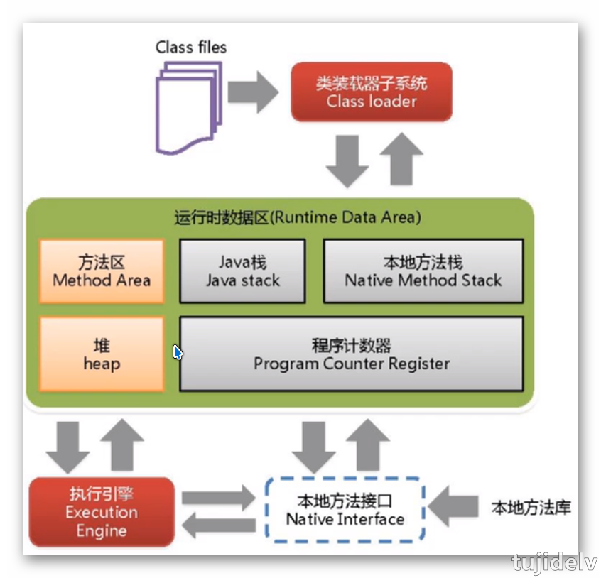
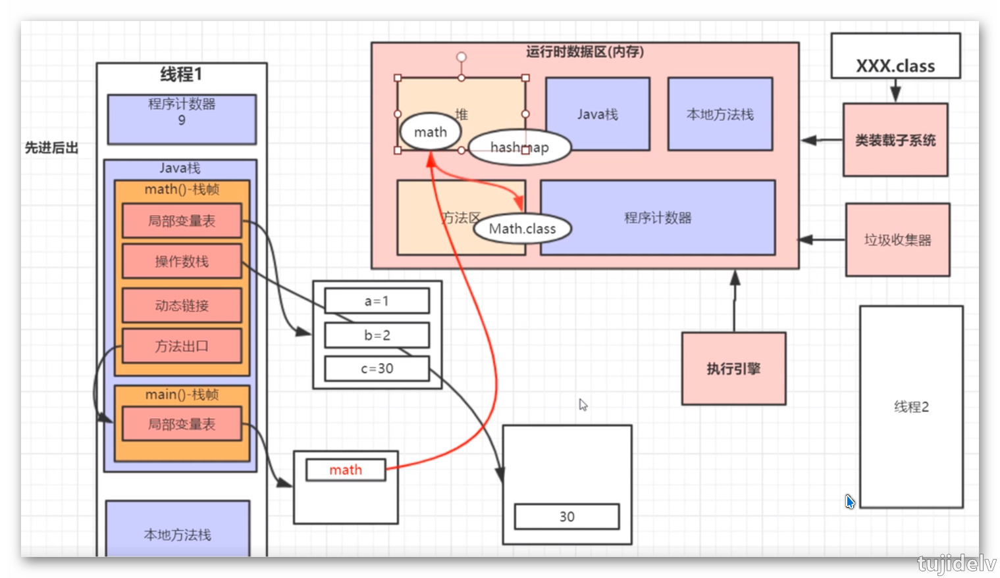
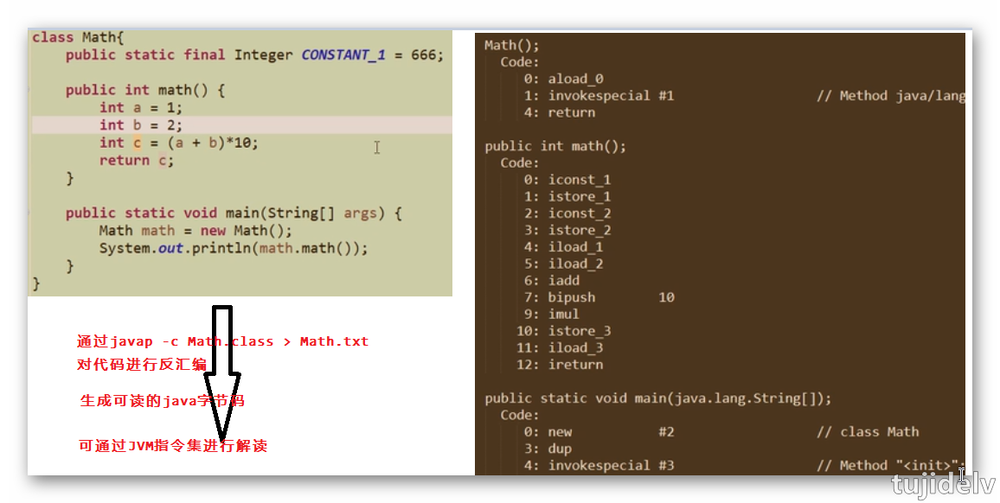
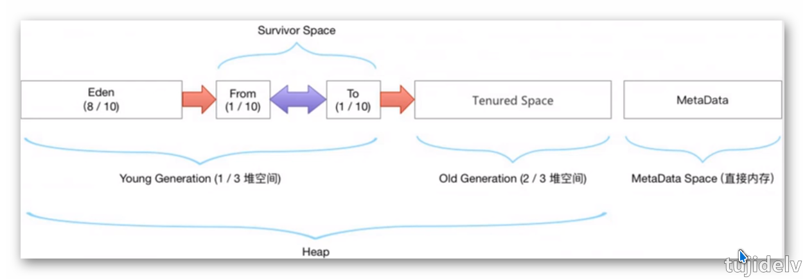
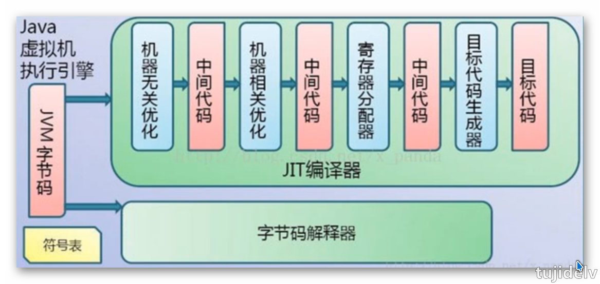

# Java 性能调优：JVM

## 目录

- [简介](#简介)
- [正篇](#正篇)
- [参考链接](#参考链接)
- [结束语](#结束语)

## 简介

整理下学习JVM时的知识点. 

## 正篇

### `JVM的整体架构`

```
1. 虚拟机是指以软件的方式模拟具有完整硬件系统功能、运行在一个完全隔离环境中的完整计算机系统，是物理机的软件实现。
2. 常用的虚拟机有Vmware，Virtual Box，Java Virtual Machine(JVM)。
3. JVM阵营：Sun HotSpot VM(oracle收购)、BEA JRockit VM(oracle收购)、IBM J9 VM、AZul VM、Apache Harmony、Google Dalvik VM、Microsoft JVM...。
    jdk8用元空间取代了永久代,是为融合HotSpot JVM和JRockit JVM而做出的努力,因为JRockit没有永久代,不需要配置永久代。
    jdk11出了一个zgc垃圾收集器。
----------------------
JVM由3个主要的子系统构成
    类加载器子系统
    运行时数据区(内存结构)
    执行引擎
```
 

### `类加载器子系统`

### `运行时数据区(内存结构)`

```
本地方法栈(线程私有)
    登记native方法,在Execution Engine执行时加载本地方法库。
程序计数器(线程私有)
    当前线程执行的字节码的行号指示器，通过改变此指示器由执行引擎来读取下一个需要执行的字节码指令,是一个非常小的内存空间,几乎可以忽略不记。
    ------------------
    特征：
        在线程创建时创建;每个线程拥有一个;指向下一条指令的地址。
Java栈(线程私有)
    一个线程对应一个栈,每个方法在执行的同时都会创建一个栈帧(用于存储局部变量表,操作数栈,动态链接,方法出口等信息)。
    方法从调用直至执行完成的过程,就对应着一个栈帧在虚拟机栈中入栈到出栈的过程。
    局部变量表所需的内存空间在编译期间完成分配,而且分配多大的局部变量空间是完全确定的,在方法运行期间不会改变其大小。
    只要线程一结束该栈就释放了,不存在垃圾回收问题。
    ------------------
    JVM对该区域规范了2种异常：
        1.线程请求的栈深度大于虚拟机栈所允许的深度,将抛出StackOverFlowError异常
        2.若JVM栈可动态扩展,当无法申请到足够的内存空间时将抛出OutOfMemoryError,通过jvm参数-Xss指定栈空间,空间大小决定函数调用的深度
方法区(线程共享)
    存储静态变量+常量+类信息(构造方法/接口定义)+方法字节码。虽然JVM规范把方法区描述为堆的一个逻辑部分,但是它却有一个别名叫做Non-Heap(非堆),
    目的是与Java堆区分开来。
堆(线程共享)
    虚拟机启动时创建,用于存放对象实例,几乎所有的对象(包含常量池)都在堆上分配内存,当对象无法在该空间申请到内存时将抛出OOM异常.同时也是GC管理
    的主要区域.可通过-Xms -Xmx参数来分别指定最大堆和最小堆
    ------------------
    新生区：
        类诞生,成长,消亡的区域,一个类在这里产生,应用,最后被垃圾回收器收集,结束生命。
        包括伊甸区(Eden space)和幸存者区(Survivor space),所有的类都是在伊甸区被new出来的,幸存者区包括0区和1区,当伊甸区的空间用完时,程序还
        需要创建对象,JVM的GC将对伊甸区进行Minor GC,将伊甸区中的不再被其他对象所引用的对象进行销毁,然后将伊甸区中剩余的对象移动到幸存0区.若0区
        也满了,再对该区进行GC,然后移动到幸存1区,此时1区和0区的位置对调。
    老年区：
        当0区和1区GC依次轮询15次(可配置)后,新生区中的1区还有存活的对象时,对象将移动到老年区,若老年区也满了,这个时候将产生Major GC(Full GC),
        来进行老年区的内存清理.若老年区执行了Full GC之后发现依然无法进行对象的保存,就会产生OOM异常。
    元数据区：
        取代了永久代(jdk1.8以前的),本质和永久代类似,都是对JVM规范中方法区(抽象)的实现,区别在于元数据区并不在虚拟机中,而是使用本地物理内存,永久代在虚拟
        机中,永久代逻辑结构上属于堆,但物理上不属于堆,堆大小=新生生+老年代.元数据区也有可能发生OOM异常。
        jdk6及之前：有永久代,常量池在方法区
        jdk7：有永久代,但已逐步"去永久代",常量池在堆
        jdk8及之后：无永久代,常量池在元空间
```

 
  

### `执行引擎`

```
读取运行时数据区的java字节码并逐个执行
```
 


### `GC`

GC调优的目的：尽量让Full GC的次数变少,并且每一次Full GC的时间长度越短越好

## 参考链接

## 结束语

- 未完待续...
