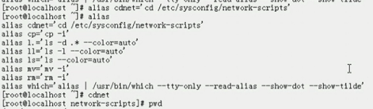
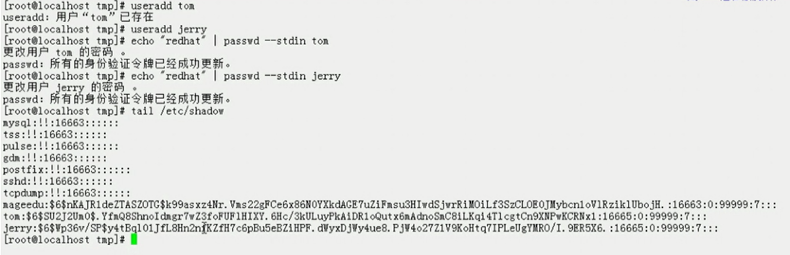
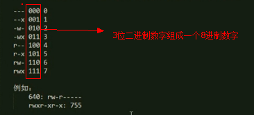

# Linux 札记：基础

## 目录

- [简介](#简介)
- [正篇](#正篇)
- [参考链接](#参考链接)
- [结束语](#结束语)

## 简介

记录一些基础知识...

## 正篇

### 前言1

```
-RedHat：
    认证考试：
        RHCSA：红帽认证助理工程师（管理员）
        RHCE：红帽认证工程师
        RHCA：红帽认证架构师
-IT技术领域：
	研发：
		硬件：接口
			机器语言：二进制指令，二进制数据
		软件：																	
			低级语言：汇编语言,汇编器,移植性差
				系统中某些与硬件相关的特有代码,驱动程序开发
			高级语言：C,C++,编译器,移植性好
				系统级：C,C++,
					操作系统，对性能要求较高的服务类程序(如mysql等),驱动程序
				应用级：Java,Python,Ruby,php,
					应用程序：ansible,puppet,......
					程序越高级,程序员写程序越容易,写出来的程序性能就越差,运行在解释器或虚拟机上的程序必然有性能损耗,这是不可避免的
	应用：																		
		Linux运维：Linux生态圈中的各应用程序的应用
			Shell脚本编程：让某些应用工作能自动完成
			Python：专业编程语言
				ansible,openstack
		DevOps（Development Operations）:
-推荐的书籍出版社：
    O'Reiley
	Wrox
	机械工业、电子工业、人邮、清华大学、水利水电
-推荐的书籍：
    《穿越计算机的迷雾》
	《量子物理史话》
	《三体》
	《奇点临近》
-5w1h:博客作业
	what\why\when\where\who
	how
```

### 前言2

```
-现代计算机设备的组成部分：5大基本部件，遵循冯诺依曼体系(ENIAC埃尼阿克是世界上第一台现代电子计算机)	
	CPU：运算器、控制器、(寄存器、缓存)	
	内存：存储器，RAM（Ramdom Access Memory）
	Input：下指令，提供数据等
	Output：输出数据加工的结果
-32位CPU只能使用４G内存：
	2^10 = 1024
	2^32 = 1024*1024*1024*4 Bytes = 1024*1024*4 KB = 1024*4 MB = 4 GB
-OS:Operating System(在linux上称为内核kernel)	
	软件程序
	通用目的:将底层各种不同的硬件抽象为统一接口,要实现底层很多功能,如
		硬件驱动(让各种硬件工作起来)
		进程管理(把cpu提供的计算能力分配给多个程序来运行,即cpu的时间片切割和分配)
		内存管理(将有限的内存资源分配给多个同时运行的程序)
		网络管理(能够跟其他主机进行网络通信)
		安全管理...
	编程层次:现在绝大多数程序都是基于库调用和一部分系统调用研发的
		硬件规格:hardware specifiacation
		系统调用:system call
		库调用(c或c++):library call
		解释器或虚拟机:java,python,php等
		    android系统是跑在java虚拟机上的java程序,有gc,非常耗资源,ios系统是用底层语言object-c写的,内存分配完全由程序员手动完成
	运行程序格式:	
		window:exe,dll(dynamic link library)
		Linux:elf,so(shared object)
-程序：指令+数据（冯诺依曼体系中定义）||算法+数据结构（shell脚本编程中用到）
	CPU指令:指令集
		特权指令:拥有管理功能
		普通指令:完成基本操作
	程序员在OS上写的应用程序只能操作普通指令,只有操作系统可以运行特权指令,当然也可以运行普通指令
	
	程序的编程风格：
		过程式：以指令为中心,数据服务于指令
			顺序执行
			循环执行
			选择执行
		对象式：以数据为中心,指令服务于数据
	程序的执行方式：
		计算机：运行二进制指令
		编程语言：
			低级：汇编
			高级：
				编译：高级语言-->编译器-->目标代码
					C,C++,java
				解释：高级语言-->解释器-->机器代码
					SHELL,PERL,PYTHON
-CPU架构类型：提供的指令集不一样
	intel和amd
	    x86
	    x64(amd64)
	m68000,简称m68k(摩托罗拉公司的,早期因特尔的处理器较丑陋)
	arm(android底层是linux,ios底层是unix,相应的如高通等都是基于arm)
	ultrasparc solaris(sun公司的)
	power aix(IBM公司的)
	powerpc,ppc(苹果,摩托罗拉,IBM公司3者联合研发的简装版的power,性能非常强大,但被后来的intel i5,i7赶上了)
	MIPS
	alpha hp-ux(惠普公司的)
	.......
```

### unix发展简史

- 完整的OS：kernel(内核) + Application
- 狭义上的OS：kernel
- `Linux = GNU/Linux = linux内核 + GNU组织提供的各种开源软件 = 通常以源码(文本格式)方式提供，自由、灵活`

```
-1946年，世界上第一台电脑ENIAC在美国宾夕法尼亚大学诞生，目的是用来计算炮弹弹道，重达30吨。
-1947年，BELL实验室发明晶体管。
-1958年，TI发明集成电路。
-1969年以前，Bell(AT&T),MIT(麻省理工),GE（通用电器）3大实验室联合研发Multics项目 = 试图建立一个具备众多功能的一个信息功能应用工具。
    Ken Thompson（Bell实验室人员）：Space Travel（一款游戏）
	DEC（一个公司）：PDP-11（小型机）,VAX（VMS）
	PDP-7：Ken在该设备上用汇编语言写了一个程序Unics（与Multics相比功能更单一,这个是戏称的非正式的名称，因为思想源自Multics），用来跑Space Travel	
-1971年，Ken等人承包了nroff（文字处理程序）项目,运行在Unics上;Intel发布第一微处理器4004。
-1972年，unix装机量在Bell实验室达到10台，跑在它上面的应用程序是用B语言写的。
	B（解释型编程语言）：Dennis Ritch（Bell实验室另一个人员）升级成C语言（B+）
-1973/1974年，Ken和Dennis联合用c重写Unics,正式取名UNIX,unix诞生。
-1974年后，2人联合在《美国计算机通信》杂志上发布论文将unix公之于众。
-1976年，ken趁年休去美国加州大学Berkeley分校去支教,让该分校在unix研究上走在了前列。	
	Bill Joy(该分校研究生)成立了BSRG组织
-1977年，BSRG组织发行了BSD（Berkeley System Distribution）系统,UNIX分支--BSD诞生。
	Bill Joy取得了UNIX的源代码，加以修改和完善，得到合适自己机器的版本并增加了很多工具软件和编译程序，命名为BSD。
	Bill Joy也是Sun的创办者。Sun是以BSD开发的内核进行自己的商业UNIX版本开发的。（可用于x86硬件架构的FreeBSD即由BSD改版而来）
-1978年，全球第一家以包装发行商业发行版unix的公司诞生了（SCO公司）。
-1979年，AT&T(bell实验室东家)宣布收回UNIX版权，特别声明“不可对学生提供源码”。同时发布第七版System V的UNIX,支持x86架构。期间众多公司的UNIX系统纷纷出现。
    同年Intel推出8086/8088 CPU。
-1980年，西雅图一家不起眼的公司诞生了（Microsoft）,出售XENIX(unix的变种)。
	BSD成为Berkeley分校整个校园网的核心系统
	DARPA(美国国防部高级研究计划局)要实现TCP/IP协议，将这项研究交给了BSD，给了BSRG组织
-1981年，IBM发布IBM PC，x86架构的PC机开始流行。
	Microsoft公司的CEO（Bill Gates）另一位合伙人的朋友在SCP公司
	该公司的一位程序员花了6周时间研发了一个系统QDOS，当时unix系统主要跑在摩托罗拉的cpu上，intel cpu芯片上跑不动，
	QDOS可以运行Intel的cpu，Bill Gates看到商机，买断了该系统的版权，并在此基础上修改，该系统打上了microsoft的版权，
	并与IBM公司签订了合同,IBM每卖出一台PC兼容机就装上该系统，只需支付20美元左右，PC机卖火了，Microsoft也赚火了。
	至此，DOS 2.0盖过了CP/M（一位教授改写的QDOS）
-1983年，TCP/IP协议诞生在BSD系列的unix系统上。
-1984年，谭邦宁（Andrew Tanenbaum）教授编写出基于X86架构的与UNIX兼容的MINIX系统。
-1985年，MIT的RIchard Stallman为了“创建一个自由、开放的UNIX操作系统”,启动了GNU(GNU is Not Unix)项目。由于工程浩大，Stallman决定先编写应用程序如EMACS、GNU C（GCC）、GNU C LIBRARY （GLIBC）、Bash Shell。	
    并于1985年草拟了GPL（general public license）。但当时开发的软件只能运行在授权的UNIX平台上，一直到Linux出现。
-1988年，XFree86诞生，即x86版UNIX上的GUI系统。
-1990年，Microsoft公司的写程序用的开发环境还是unix，连开发dos系统也是用的unix。
	SUN公司的Bill Joy出售workstation PC机
-1991年8月，Linus Torvalds (李纳斯.托瓦兹)宣布成立Linux。
	Linus Torvalds宣布他以bash/gcc等工具写出了可运行在Intel386上的内核程序。因为Linux用了很多的GNU相关软件，Stallman认为Linux的全名应该是GNU/Linux。
-2008年，Google发布基于Linux的手机操作系统Android。
```

### stallman运动：GNU

```
闭源：
开源：提供源代码
    开源协定：
        GPL：General Public License
            LGPL：Lesser GPL	
            GPLv2,GPLv3
            FSF：Free
        BSD：
            1.如果二次发布的产品中包含源代码，则在源代码中必须带有原来的代码中的BSD协定
            2.如果二次发布的产品是二进制格式的库或程序，则需要在发布的文档或版权声明中说明包含原来的代码中的BSD协定
            3.不可以用开源代码的作者或组织以及原来的产品的名字做市场推广
        Apache：
            ASF：Apache Software Foundation
    双线授权：
        Community:遵循开源协定
        Enterprise:
开源程序的作者收入方式：服务、捐赠
    linux内核背后的捐赠者：IBM、Google、FaceBook、RedHat
```

### linux发行版

- 提供的各种程序如gcc、glibc、vi、linux内核等等都是源码，必须编译成为二进制格式才能运行，而要编译必须有编译器，而编译器又必须运行在OS上，而编译过程又非常复杂，非常人所能为之。
- 因此一些商业公司或社区组织按照他们自己理解负责将源代码程序编译成二进制格式并打包提供给用户使用，这就是linux的发行版，这些组织就成了linux的发行商。
- linux发行版有数百种之多。可在 [Linux Distirbution Timeline](http://futurist.se/gldt/) 上查看

```
三大主流发行版及重要分支：											
    Debian：唯一一个以社区方式运作的，没有商业公司支持。下面分支都是基于Debian的二次发行版
		Ubuntu：以桌面应用而发行，现在server方面也做的不错
			Mint
		Knopix：以安全著称的，短小精悍
	Slackware：
		S.u.S.E：由商业公司支持，界面华丽，欧美流行
			OpenSUSE
	RedHat：由商业公司支持，1994年成立时主要就以个人桌面版发行，发行版稳定后，开始发行企业版，直到RedHat 7.0前后，出现下面2个分支
		RedHat Enterprise Linux（RHEL）：企业版，18个月或更久,所以现在才到RHEL 7左右
			CentOS（Community Enterprise OS）：RHEL的山寨版，完全兼容RHEL，2015年3月被RedHat收购
		Fedora Core：个人桌面版 ，6个月,到9.0以后,个人版不在维护,2003年左右捐给了fedora组织,主要测试新程序,发行周期很快
    Gentoo
    ArchLinux
    LFS
    Android:kernel+busybox+java虚拟机
```

```
-软件程序：有版本号标示着
	major(主版本号).minor(次版本号).release(发行号修正号)
		Linux:0.99,2.2,2.4,2.6,3.0,4.0,4.18.8
			www.kernel.org
		GNU:
			vi
			gcc	
			...
-发行版本也有自己的版本号：
	RHEL：5.x,6.x,7.x
	Fedora：23
	Debian：8.x	
	OpenSUSE：13.x
-如何获取CentOS的发行版：CentOS的镜像站点
	http://mirrors.aliyun.com
	http://mirrors.sohu.com
	http://mirrors.163.com
```

### 程序管理

```
linux应用程序的组成部分：二进制程序、库文件、配置文件、帮助文件
	二进制程序：可执行文件,一个应用程序可有多个二进制程序
		/bin,/sbin,/usr/bin,/usr/sbin,/usr/local/bin,/usr/local/sbin
	库文件：可执行文件,不能独立执行，只能被调用时执行,一般有2类,一类是多个程序之间的共享库,一类是自己能够被其他人做二次开发时调用的接口
		/lib,/lib64,/usr/lib,/usr/lib64,/usr/local/lib,/usr/local/lib64
	配置文件：可被查看其内容的文件
		/etc,/etc/DIRECTORY,/usr/local/etc
	帮助文件：可被查看其内容的文件
		/usr/share/man,/usr/share/doc,/usr/local/share/man,/usr/local/share/doc
程序包管理器：不同的发行版所用的包管理器是不一样的
	程序的组成文件打包成一个或有限几个文件
	安装
	卸载
	查询
rpm:rhel,fedora,centos,S.u.S.e
dpt:debian,ubuntu
```

### linux的哲学思想

- 一切皆文件。把几乎所有资源统统抽象为文件形式，包括硬件设备，甚至通信接口等。
    - 表现之一：硬件设备也通过文件表示				
- 由众多功能单一的程序组成。
    - 目的：一个程序只做一件事，并且做好，组合小程序完成复杂任务（管道中体现）
- 尽量避免跟用户交互。
	- 目标：易于以编程的方式实现自动化任务,实现脚本编程
- 使用纯文本文件保存配置信息。
	- 目标：一款使用的文本编辑器即能完成系统配置工作
	
### 终端(terminal)设备

- `多任务(Multi-tasks)、多用户(Multi-users)`
---
- `物理终端`：/dev/console
    - 直接接入本机的显示器和键盘设备,也叫控制台(console),只在Linux系统启动过程当中被使用
- `虚拟终端`：/dev/tty# [1,6]	
    - 附加在物理终端之上的以软件方式虚拟实现的终端(linux为了兼容unix某些早期的特性并保持一致)
    - CentOS6默认启动6个虚拟终端(tty)
    ```
    Ctrl + Alt + F[1-6]
    启动GUI：在某一虚拟终端接口运行命令 startx
    图形终端：附加在物理终端之上的以软件方式虚拟实现的终端,但额外会提供桌面环境,从本质上也是虚拟终端的一种
        CentOS 6: Ctrl + Alt + F7
        CentOS 7: 在哪个虚拟终端启动，即位于哪个虚拟终端
    ```
- `模拟终端`: /dev/pts/# [0,无穷大]
    - 图形界面下打开命令行接口||基于ssh协议或telnet协议等远程打开的界面
- `串行终端`：/dev/ttyS#
---
- 在启动终端设备之后，默认会在其上关联一个交互式应用程序，即可实现与用户交互。											
    - 查看当前的终端设备：`~]# tty`
    - 查看当前使用的shell接口程序：`~]# echo $SHELL`
    - 查看当前系统使用的所有shell：`~]# cat /etc/shells`
---
- OS的交互式接口(应用程序)有2类
    - GUI：Graphical User Interface 图形用户接口
        ```
        GNome：用c研发的,研发环境为gtk
        KDE：用c++研发的，研发环境为qt
        XFCE:轻量级桌面
        ```
    - CLI：Command Line Interface  命令行接口
        ```
        shell程序:bash(Bourne-Again SHell)、zsh、sh(Bourne shell)、csh、tcsh、ksh
        [root@nodel ~]#  COMMAND
            root：当前登录的用户
            nodel：当前主机的主机名，非完整格式，此处的完整格式为：nodel.magedu.com
            ~：用户当前所在的目录（current directory）,也称为工作目录（working directory）
            #：命令提示符
                #：管理员帐号，为root，拥有最高权限，能执行所有操作，如删除某个设备等。
                $：普通帐号，非root用户，不具有管理权限，不能执行系统管理类操作。
            注意：建议使用非管理员帐号登录，执行管理操作时可临时切换至管理员，操作完成即退回。
        ```
- 远程连接
    ```
    ssh协议：secure shell    Xshell就是ssh协议的一个客户端程序
    ~]# ss -tnl
        查看系统是否监听于tcp协议的22号端口
    ~]# ip addr list 或 ~]# ifconfig
        查看活动接口的IP地址
    ~]# ping
        探测网络的目标主机与当前主机之间的连通性
    ---
    确保防火墙处于关闭状态：
        ~]# iptables -L -n
        CentOS 7:
            ~]# systemctl disable firewalld.service	
            ~]# systemctl stop firewalld.service
        CentOS 6:
            ~]# service iptables stop
            ~]# chkconfig iptables off
    ---
    连接：ssh root@172.16.249.74
    ```

### 文件系统

- `是由/（原始起点）（根目录）开始的一个倒置树状结构`
    ```
    目录：路径映射
    文件：存储空间存储的一段流式数据，对数据可以做到按名存取
    文件的路径表示：
    	绝对路径：从根开始表示出的路径
    	相对路径：从当前位置开始表示出的路径	
    		当前位置的表示方式:
    			(1)./:			./sysconfig/network-scripts			
    			(2)省略上述符号:			sysconfig/network-scripts
    		.：当前目录
    		..：当前目录的上一级目录
    ```
- 文件名使用法则
    ```
    1.严格区分字符大小写：file1,File1,FILE1
    2.目录也是文件，在同一路径下，两个文件不能同名
    3.支持使用除/以外的任意字符,不建议使用特殊字符
    	/:根目录,路径分隔符
    4.最长不能超过255个字符
    5.以.开头的文件为隐藏文件
    ```
- 根文件系统(rootfs)：root filesystem
    ```
    Linux组成部分由内而外：
    	硬件
    	内核（只有它能直接操作硬件），内核把整个硬件封装了起来，把所有硬件提供的功能转换成了系统调用
    	系统调用
    	库函数，由程序员开发的一堆程序片断，不能独立运行，只有被调用时运行。由glibc提供
    	应用程序，编译方式如下：
    		动态编译：程序研发时调用了库函数，程序单独编译完后，明确指明库的调用入口，程序要运行必要要把库装在进内存
    			能够大大节约内存资源
    		静态编译：程序在编译时直接把要调用的库复制到程序内部来，程序体积比动态编译体积大
    			程序挪到任何系统上都能运行，缺点是对内存和体积都不利
    进程的类型：
    	与终端相关：通过终端启动
    	与终端无关：操作系统引导启动过程当中自动启动
    ```
    ```
    根文件系统层级结构标准FHS：Filesystem Hierarchy Standard,可参考fhs-2.3.pdf
    	/boot：引导文件存放目录;一般来讲是个独立的分区,在/上创建boot目录然后挂载或关联到该分区上;如内核文件(vmlinuz),引导加载器(bootloader,grub)等
    	/bin：存放供所有用户使用的基本命令程序文件,不能关联至独立分区,OS启动即会用到的程序
    	/sbin：存放供系统管理员使用的基本命令程序文件,不能关联至独立分区,OS启动即会用到的程序	
    	/lib：存放系统启动或根文件系统上的应用程序（/bin,/sbin等）依赖的基本共享库文件，以及为内核提供的内核模块文件
    		libc.so.*：动态链接的C库
    		ld*：运行时链接器/加载器
    		modules：用于存储内核模块的目录（对于CentOS 64位系统的内核模块也在此）
    	/lib64：专用于x86_64系统上的辅助共享库文件存放位置,是64位系统下存放库文件最多的一个目录
    	/etc：存放配置文件的目录(纯文本文件)，只能为静态，有自己独立的层级结构
    	/home：普通用户的家目录的集中位置
    		一般每个普通用户的家目录默认为此目录下与用户名同名的子目录，/home/USERNAME
    	/root：管理员的家目录，可选
    	/media：便携式移动设备挂载点，如cdrom（软盘）、floppy（光盘）、cdrecorder（刻录机）、zip等
    	/mnt：临时文件系统的挂载点，如一块新的硬盘等
    	/dev：存储特殊文件或设备文件
    		设备有2种类型:字符设备（线性设备）（如键盘、显示器等），块设备（随机设备）（如硬盘等）
    	/opt：第三方应用程序的安装位置，可选路径，早些时候第三方程序安装在此目录
    	/srv：系统上运行的服务所用到的中间数据
    	/tmp：为那些会产生临时文件的程序提供用于存储临时文件的目录，可供所有用户执行写入操作，有特殊权限
    	/usr：universal shared read-only data,全局共享的只读数据路径,除/以外最重要的,可关联至一个独立的分区上
    		bin,sbin：保证系统拥有完整功能而提供的应用程序
    		lib,lib64：
    		include：C程序头文件(header files)
    		share：命令手册页和自带文档等结构化独立的文件的存储位置,例如doc,man等
    		local：第三方应用程序的安装位置,取代了/opt,可关联至一个独立的分区上
    			bin,sbin,lib,lib64,etc,share
    		X11R6：X-Window程序的安装位置
    		src：程序源码文件的存储位置
    	/var：variable data files,存储经常发生变化的数据的目录,可关联至一个独立的分区上
    		cache：Application cache data(应用程序缓存数据目录)
    		lib：Variable state information(应用程序状态信息数据)
    		local：Variable data for /usr/local(专用于/usr/local下的应用程序存储可变数据)
    		lock：Lock files(锁文件)
    		log：Log file and directories(日志目录及文件)
    		opt：Variable data for /opt(专用于/opt下的应用程序存储可变数据)
    		run：Data relevant to running processes(运行中的进程相关的数据,通常用于存储进程的pid文件)
    		spool：Application spool data(应用程序数据池)
    		tmp：Temporary files preserved between system reboots(保存系统两次重启之间产生的临时数据)
    	/proc：用于输出内核与进程信息相关的虚拟文件系统，它们多为内核参数，例如net.ipv4.ip_forward,虚拟为net/ipv4/ip_forward，存储于/proc/sys,
    		因此其完整路径为/proc/sys/net/ipv4/ip_forward
    	/sys：用于输出当前系统上硬件设备相关信息的虚拟文件系统,sysfs虚拟文件系统提供了一种比proc更为理想的访问内核数据的途径
    		参考：https://www.ibm.com/developerworks/cn/linux/l-cn-sysfs/
    	----------------------										
    	/misc：存放备用的杂项文件
    	/lost+found：linux上ext系列文件系统任何一个分区格式化以后默认产生的目录,跟当前系统无关
    	/selinux：security enhanced linux,selinux相关的安全策略等信息的存储位置
    ```

### 命令的语法通用格式

- `~]# COMMAND [OPTIONS...] [ARGUMENTS...]`
    ```
    输入命令并回车:用户发起一个执行命令的请求
    会提请shell程序先在内部命令中查找，然后根据path环境变量提供的路径中查找有没有相同的可执行程序或代码，找到了就请求内核将某个二进制程序运行为一个或多个进程,命令运行当中的特性由OPTIONS进行修正，并且作用在所给的参数之上。
    	程序 --> 进程
    	静态 --> 动态（有生命周期）
    ```
- `COMMAND`
    ```
    命令本身是一个二进制格式的可执行的程序文件，有可能会调用共享库文件
    	多数系统程序文件都存放在：/bin,/sbin,/usr/bin,/usr/sbin,/usr/local/bin,/usr/local/sbin
    		普通命令：/bin,/usr/bin,/usr/local/bin
    		管理命令：/sbin,/usr/sbin,/usr/local/sbin
    	共享库：/lib,/lib64,/usr/lib,/usr/lib64,/usr/local/lib,/usr/local/lib64
    		32bits的库：/lib,/usr/lib,/usr/local/lib
    		64bits的库：/lib64,/usr/lib64,/usr/local/lib64
    	注意：并非所有的命令都有一个在某目录与之对应的可执行程序文件
    在shell中可执行的命令分为2类：
    	Shell内嵌命令（builtin）：由shell程序（如bash）的自带的命令
    	外部命令：在当前系统的某文件系统路径下有对应的独立的可执行程序文件,可用which,whereis查看路径
    查看命令类型：type COMMAND
    命令必须遵循特定格式规范：exe,msi,ELF(Linux)
    	~]# file /bin/ls   查看文件内容格式的类型
    SHELL程序是独特的程序，负责解析用户提供的命令
    	环境变量：
    		PATH：shell程序从哪些路径中查找用户键入的命令字符串所对应的命令文件。查找次序自左而右。
    			~]# echo $PATH
    			/usr/lib64/qt-3.3/bin:/usr/local/sbin:/usr/local/bin:/usr/sbin:/usr/bin:/root/bin
    ```
- `OPTIONS`
    ```
    用于启用或关闭命令的某个或某些功能(运行特性)
    选项有2种表现形式：
    	短选项：-C，例如-l, -d
    		注意：有些命令的选项没有-
    		如果同一命令同时使用多个短选项，多数可合并： -l -d = -ld
    	长选项：--word，例如--help, --human-readable
    		注意：长选项不能合并
    注意：有些选项可以带参数，此称为选项参数，而不是命令参数。长选项参数一般用=来等于，短选项参数一般用空格来分隔
    ```
- `ARGUMENTS`
    ```
    命令的作用对象，指定命令对什么生效
    注意：不同的命令的参数，有些命令可同时带多个参数，多个之间以空白字符分隔
    ```

### 获取命令的使用帮助

- 内部命令
    ```bash
    ~]# help COMMAND
    ```
- 外部命令
    ```
    通常一个命令运行时,只有第一次才会去目录中找,一旦找到后,会被记录下来放到缓存(内存中的一段空间)中,即shell搜寻到的外部命令的路径结果会缓存至kv(key-value)存储中	
    	命令每运行一次,hits都会加一,表示在缓存中找到了一次(也叫缓存命中);缓存也有副作用,如缓存的命令文件路径发生了改变,缓存中的内容是错误的,需要清空缓存:hash -r	
    a.命令自带简要格式的使用帮助
    	~]# COMMAND --help
    b.使用手册manual，位置在/usr/share/man
    	~]# man COMMAND
    		SECTION:
    			NAME:功能性说明
    			SYNOPSIS:语法格式
    				[]:可选内容
    				<>:必须提供的内容
    				a|b|c:多选一
    				...:同类内容可出现多个	
    			DESCRIPTION:描述	
    			OPTIONS:选项
    			EXAMPLES:使用示例
    			AUTHOR:作者
    			BUGS:报告程序bug的方式
    			REPORTING BUGS:报告bug的位置
    			COPYRIGTH:版权
    			SEE ALSO:参考
    	使用手册是压缩格式的文件(为了避免大量的命令造成大量的文档,才会压缩存放)，有章节之分：
    		/usr/share/man   man1,man2,...
    			1：用户命令(User Commands)		如man ls执行后会在/usr/share/man/man1章节下找到ls.1.gz压缩文件然后自动解压缩打开并展示
    			2：系统调用
    			3：C库调用
    			4：设备文件及特殊文件
    			5：文件格式（配置文件格式）
    			6：游戏使用帮助
    			7：杂项
    			8：管理类的命令
    		~]# man CHAPTER COMMAND    查看该命令指定章节下的手册
    			注意：有些COMMAND不止在一个章节中存在帮助手册;并非每个COMMAND在所有章节下都有手册
    			查看COMMAND在哪些章节下有手册：
    				~]# whatis COMMAND
    				注意：其执行过程是查询数据库进行的,有时需要手动更新数据库(makewhatis)
    		man命令的配置文件:/etc/man.config
    			MANPATH /PATH/TO/SOMEWHERE:指定新的手册文件搜索位置
    			~]# man -M /PATH/TO/SOMEWHERE COMMOND   到指定位置下搜索COMMAND命令的手册页并显示之
    	man命令打开手册以后的操作方法：
    		翻屏：
    			空格键：向文件尾翻一屏
    			b：向文件首部翻一屏
    			回车键：向文件尾部翻一行
    			k：向文件首部翻一行
    			G：跳转至最后一行
    			1G：跳转至文件首部
    		文本搜索：
    			/keyword:从文件首部向文件尾部依次查找,不区分字符大小写
    			?keyword:从文件尾部向文件首部依次查找,不区分字符大小写
    				n:与查找命令方向相同
    				N:与查找命令方向相反
    		退出：
    			q:quit
    c.info COMMAND
    	获取命令的在线文档	
    d.很多应用程序会自带帮助文档：/usr/share/doc/COMMAND-VERSION
    	RENAME:程序的相关的信息
    	INSTALL:安装帮助
    	CHANGELOG:版本迭代时的改动信息
    e.程序官方的文档
    	官方站点上的“Documentation”
    f.主流发行版官方文档
    	http://www.redhat.com/docs
    g.搜索引擎google
    	keyword filetype:pdf
    	keyword site:domain.tld
    	...
    h.slideshare
    	https://www.slideshare.net/
    ```
    
### bash的基础特性

`能帮我们更好的完成系统管理`
- ***命令历史***
    ```
    shell程序会在其会话中保存此前用户提交执行过的命令到缓存中,并在登出时保存到命令历史文件中
    ------------
    ~]# history ，第一次会加载命令历史文件中的命令历史记录到内存中，再加载当前shell中执行过的命令历史记录
    	定制history的功能，可通过环境变量实现
    		HISTSIZE：shell进程可保留的命令历史的条数
    		    eg1：export HISTSIZE=10000
    		HISTFILE：持久保存命令历史的文件（~/.bash_history），是在用户shell登出时自动进行保存的
    		    eg1：export HISTFILE=/var/log/histlog/${LOGNAME}/hist_${ip}
    		HISTFILESIZE：命令历史文件的大小
    		    eg1：export HISTFILESIZE=10000
    		HISTTIMEFORMAT：显示历史命令的时间戳(当HISTTIMEFORMAT这个环境变量被设置之后，之后的那些新执行的bash命令才会被打上正确的时间戳。在此之前的所有命令，都将会显示成设置HISTTIMEFORMAT变量的时间)
    		    eg1：export HISTTIMEFORMAT='%F %T'
    		    eg2：export HISTTIMEFORMAT="[%Y.%m.%d %H:%M:%S `whoami`] :"
    用法：
    	history [-c] [-d 偏移量] [n] 或 history -anrw [文件名] 或 history -ps 参数 [参数...]
    	-a：追加本次会话新执行的命令历史列表至历史文件中
    	-c：清空内存中的命令历史记录
    	-d offset：删除内存中的指定位置命令	
    		~]# history -d 676 5 删除内存中从第676条开始之后的5条
    	-r：将历史文件的记录读取到内存并追加到历史列表中
    	-w：将内存中的历史列表写入并追加到历史文件中
    	history #：显示最近的#条命令
    调用命令历史列表中的命令：
    	!#：再一次执行历史列表中的第#条命令
    	!!：再一次执行上一条命令
    	!STRING：再一次执行命令历史列表中最近一个以STRING开头的命令
    调用上一条命令的最后一个参数：
    	快捷键：按下ESC松开再按.
    	字符串：!$
    控制命令历史的记录方式：
    	环境变量：HISTCONTROL	
    		ignoredups：忽略重复（连续且相同）的命令
    		ignorespace：忽略以空白字符开头的命令,可以不记录命令到内存和命令历史文件中去
    		ignoreboth：以上两者同时生效
    	修改环境变量的方式：exprot 变量名="值"
    		如：export HISTCONTROL='ignorespace'	
    ```
- ***命令补全***
    ```
    给定的打头字符串如果能根据path环境变量来惟一标识某命令程序文件，按下tab键，
    则直接补全，如果不能惟一标识某命令程序文件，再击tab键一次，会给出列表
    ```
- ***路径补全***
    ```
    以用户给出的字符串当做路径开头,并在其指定上级目录下搜索以指定的字符串开头的文件名，如果能惟一标识，按下tab键，
    则直接补全，否则再击tab键一次，会给出列表
    ```
- ***命令行展开***
    ```
    ~：自动展开为用户的家目录，或指定的用户的家目录
    {}：可承载一个以逗号分隔的路径列表，并能够将其展开为多个路径
    	练习1：如何创建/tmp/x/y1,/tmp/x/y2,/tmp/x/y1/a,/tmp/x/y1/b ?
    		~]# mkdir -pv /tmp/x/{y1/{a,b},y2}
    	练习2：如何创建/tmp/x/y1,/tmp/x/y2,/tmp/x/y1/a,/tmp/x/y1/b,/tmp/x/y2/a,/tmp/x/y2/b ?
    		~]# mkdir -pv /tmp/x/{y1,y2}/{a,b}
    	练习3：如何创建a_c,a_d,b_c,b_d ?
    		~]# mkdir -v {a,b}_{c,d}
    	练习4：如何创建/tmp/bin,/tmp/sbin,/tmp/usr/bin,/tmp/usr/bin,/tmp/usr/sbin	
    		~]# mkdir -pv /tmp/{bin,sbin,usr/{bin,sbin}}
    ```
- ***命令执行的两类结果***
    ```
    命令执行的状态结果：
    	命令执行完成之后，bash会在其内部将其状态返回值保存于bash的特殊变量$?中，echo $?只能获取最近一条命令的执行状态结果
    		成功：0
    		失败：1-255
    命令执行的返回值：
    	命令正常执行时，有的还会有命令返回值，根据命令及其功能不同，结果各不相同
    ```
- ***命令别名***
    ```
    命令可以有别名，别名可以与原名相同，此时原名被隐藏，如果要运行原命令，则使用\COMMAND
    显示当前shell进程所有可用的命令别名：
    	~]# alias
    定义别名NAME,相当于执行命令VALUE,仅对当前shell进程有效
    	~]# alias NAME='VALUE'
    撤销别名：
    	~]# unalias NAME
    ----------------------					
    注意：如果想永久有效，要定义在配置文件中
    	编辑配置文件给出的新配置不会立即生效,需要bash进程重新读取配置文件：
    		~]# source /path/to/config_file
    ```
    
- ***引用***
    ```
    强引用：''
        其中的变量引用不会被替换为变量值,而保持原字符串
    弱引用：""
        其中的变量引用会被替换为变量值
    命令引用：``
    ```
- ***快捷键***
    ```
    Ctrl + l：清屏，相当于clear命令
    Ctrl + c  取消/终止命令执行
    ------------------
    Ctrl + a：跳转至命令行行首
    Ctrl + e：跳转至命令行行尾
    Ctrl + u：删除行首至光标所在处之间的所有字符
    Ctrl + k：删除光标所在处至行尾的所有字符
    ```
- ***文件名通配（globbing）***
    ```
    整体文件名匹配，而非部分
    -------------
    匹配模式：元字符
    	*：匹配任意长度的任意字符
    		pa*,*pa*,*pa,*p*a*
    	?：匹配任意单个字符
    		pa?,??pa,p?a,p?a?
    	[]：匹配指定范围内的任意单个字符
    		有几种特殊格式：
    			[a-z],[A-Z],[0-9],[a-z0-9]    这里不区分大小写，要区分大小写用下面的格式
    			[[:upper:]]   所有大写字母
    			[[:lower:]]   所有小写字母
    			[[:alpha:]]   所有字母
    			[[:digit:]]   所有数字,相当于[0-9]
    			[[:alnum:]]   所有字母和数字
    			[[:space:]]   所有空白字符
    			[[:punct:]]   所有标点符号
    	[^]：匹配指定范围外的任意单个字符
    -------------
    练习1：显示/var目录下所有以l开头，以一个小写字母结尾，且中间出现一位任意字符的文件或目录
        ls -d /var/l?[[:lower:]]
    练习2：显示/etc目录下，以任意一位数字开头，且以非数字结尾的文件或目录
        ls -d /etc/[0-9]*[^0-9]
    练习3：显示/etc目录下，以非字母开头，后面跟一个字母及其它任意长度任意字符的文件或目录
        ls -d /etc/[^a-z][a-z]*
    练习4：复制/etc目录下，所有以m开头，以非数字结尾的文件或目录至/tmp/magedu.com目录
        mkdir /tmp/magedu.com
        cp -r /etc/m*[^0-9] /tmp/magedu.com/
    练习5：复制/usr/share/man目录下，所有以man开头，后跟一个数字结尾的文件或目录至/tmp/man目录下
        mkdir /tmp/man
        cp -r /usr/share/man/man[0-9] /tmp/man/	
    练习6：复制/etc目录下，所有以.conf结尾，且以m,n,r,p开头的文件或目录至/tmp/conf.d目录下
        mkdir /tmp/conf.d
        cp -r /etc/[mnrp]*.conf /tmp/conf.d
    ```
- ***IO重定向及管道***
    ```
    程序=指令+数据
    	可用于输入的设备：文件（键盘设备、文件系统上的常规文件、网卡等）
    	可用于输出的设备：文件（显示器、文件系统上的常规文件、网卡、终端设备等）
    	程序的数据流有3种：
    		输入的数据流：<-- 标准输入（stdin），键盘(keyborad)
    		输出的数据流：--> 标准输出（stdout），显示器(monitor)
    		错误输出流：--> 标准错误输出（stderr），显示器(monitor)
    	每个通过内核打开的文件都有一个fd：file descriptor，文件描述符
    		标准输入：0
    		标准输出：1
    		标准错误输出：2
    ```
    ```
    IO重定向：改变标准位置(不从标准输入读入数据,不往标准输出输出数据)
    ---------------------
    输出重定向：
        >：覆盖重定向(目标文件中的原有内容会被清除)
            eg：~]# ls /etc > /tmp/etc.out
        >>：追加重定向(新内容会追加至目标文件尾部)
            eg：~]# ls /var/log >> /tmp/etc.out
    错误输出重定向：2>，2>>

    ~]# set -C     禁止将内容覆盖输出至已有文件中
        仅对当前shell进程有效
        此时可使用强制覆盖输出：>|
    ~]# set +C     关闭上述特性

    合并标准输出和错误输出为同一个数据流进行重定向：
        (1) &>，&>>
        (2) COMMAND > /path/to/file.out 2> &1   前面是覆盖，后面的>代表覆盖;&1代表1号数据流,即标准输出
            COMMAND >> /path/file.out 2>> &1
        特殊设备(数据黑洞，常用作输出重定向到此)：/dev/null
            例如：判断一个文件有没有内容时可以用下面的命令
                ~]# head -1 /etc/passwd &> /dev/null
                ~]# echo $?
            后面的shell脚本编程中会有大量的判断，就是基于命令的执行状态结果是成功还是失败来判断要不要继续下去
	---------------------
    输入重定向：<	
        tr：转换或删除字符
            tr [OPTION] ... SET1 [SET2]   当只有使用OPTION时，SET2才可省略
                把输入的数据当中的字符，凡是在SET1定义范围内出现的，通通对位转换为SET2出现的字符，并输出到屏幕上来，不会修改源文件
            用法1：tr SET1 SET2 < /PATH/FROM/SOMEFILE
                例如：~]# tr [a-z] [A-Z] < /etc/issue
            用法2：tr -d SET1 > /PATH/FROM/SOMEFILE   删除SET1定义范围内出现的字符
        对于默认只能从标准输入(键盘等)读数据的命令(如tr等),可以强行使用输入重定向来改变它
    Here Documentation（此处创建文档）：<<
        cat << EOF
        cat >> /PATH/TO/SOMEFILE << EOF
            例如：~]# cat >> /tmp/cat.out << EOF
        常用于在脚本中需要输出一大堆信息到文本文件中,可使用此方式
    ```
    ```
    管道：连接程序，实现将前一个命令的输出作为后一个命令的输入，并能多级连接
        有了管道以后,就能组合众多目的单一的小程序来完成复杂任务,linux的哲学思想之一
    ---------------------
    COMMAND1 | COMMAND2 | COMMAND3 ...						最后一个命令会在当前shell进程的子shell进程中执行
        例如1：~]# echo "$PATH" | tr 'a-z' 'A-Z' | tr -d 'U'
        例如2: ~]# cat /etc/rc.d/rc.sysinit | tr 'a-z' 'A-Z' | more

    tee：一路输入产生两路输出(从标准输入读数据,输出至标准输出及指定的文件中)	
        tee [OPTION...] FILE...
        例如1：将echo命令的结果输出到屏幕上，并且又保存至指定文件中
            ~]# echo "$PATH" | tr 'a-z' 'A-Z' | tee /tmp/path.out
            ~]# echo "$PATH" | tee /tmp/path.out | tr 'a-z' 'A-Z'
    ---------------------
    练习1：把/etc/passwd文件的前6行的信息转换为大写字符后保存至/tmp/passwd.out文件中
        ~]# head -6 /etc/passwd | tr [a-z] [A-Z] > /tmp/passwd.out
    练习2：将登录到当前系统上用户信息中的后3位的信自己转换为大写后保存至tmp/who.out文件中
        ~]# who | tail -3 | tr 'a-z' 'A-Z' > /tmp/who.out
    ```
- ***提供了编程环境***
    ```
    SHELL程序：提供了编程能力,主要通过调用当前系统上已有的二进制程序组织罗列(过程式),然后解释执行
    ```

### 用户、组和权限管理

```
资源分派：3A
	Authentication（认证）
	Authorization（授权）
	Audition（审计）
Linux安全上下文：
	进程的执行是以进程发起者的身份运行，进程对文件的访问权限，取决于发起此进程的用户的权限
```
- 用户类别：Username/UID
    ```
    管理员
    普通用户
    	系统用户
    	登录用户
    ------------------
    用户标识：UserID，UID
    	16bits二进制数字：0-65535
    		管理员：0
    		普通用户：1-65535	
    			系统用户：1-499(CentOS6),1-999(CentOS7)
    				为了能够让那些后台进程或服务类进程以非管理员的身份运行，通常需要为此创建多个普通用户，
    				这类用户从不用登录系统，仅仅是用来让其他进程以他的身份来运行，从而仅能获取普通权限，这类用户就是系统用户。
    			登录用户：500-60000(CentOS6),1000-60000(CentOS7)
    				交互式登录
    	名称解析(名称转换)：登录后，计算机内部会根据名称解析库(/etc/passwd)将每个用户自动转换为数字标识进行使用
    		Username <--> UID
    		/etc/passwd：用户及其属性信息(名称,UID,基本组ID等等)
    			name:password:UID:GID:GECOS:directory:shell
    				name：用户名
    				password：可以是加密的密码，也可是密码占位符	
    				UID：
    				GID：用户所属的主组的ID号
    				GECOS：注释信息
    				directory：用户的家目录
    				shell：用户的默认shell，登录时默认shell程序
    ```
- 组：Groupname/GID,将多个用户和某一类权限建立关联关系
    ```
    组类别1：
    	管理员组
    	普通用户组
    		系统组
    		登录组
        ------------------
    	组标识：GroupID，GID
    		16bits二进制数字：0-65535
    			管理员组：0
    			普通用户组：1-65535
    				系统用户组：1-499(CentOS6),1-999(CentOS7)
    				登录用户组：500-60000(CentOS6),1000-60000(CentOS7)
    		名称解析：Groupname <--> GID
    			/etc/group：组及其属性信息
    				group_name:password:GID:user_list
    					group_name：组名
    					password：组密码占位符
    					GID：
    					user_list：以当前组为附加组的用户列表(分隔符为逗号)
    组类别2：
    	用户的基本组(主组)
    	用户的附加组(额外组)
    组类别3：
    	私有组：组名同用户名，且只包含一个用户
    	公共组：组内包含了多个用户
    ```
- 认证信息：通过比对事先存储的与登录时提供的信息是否一致
    ```
    password: 
    	/etc/shadow：用户密码及其相关属性
    		用户名：加密了的密码：最近一次修改密码的时间：最短使用期限：最长使用期限：警告期段：密码禁用期(非活动时间)：账户过期日期：保留字段
    			按时间轴：最近一次修改密码的时间，最短使用期限，警告期段，最长使用期限，密码禁用期(非活动时间)，账户过期日期
    	/etc/gshadow：组密码及其相关属性
    密码的复杂性策略：防穷举破解、暴力破解
    	1.使用随机密码
    	2.最短长度不要低于8位
    	3.应该使用大写字母、小写字母、数字和标点符号四类字符中至少3种
    	4.定期更换
    加密：
    	注意：密钥长度越长，加密时所需要的计算量越大，所以也就越慢，所以非对称加密比对称加密据说慢3个数量级（10^3）
    	对称加密：加密和解密使用同一个密钥
    		plain text(明文) -->加密算法+密钥 -->cipher text(密文)	
    		cipher text(密文) -->解密算法+密钥 -->plain text(明文)
    	非对称加密：加密和解密使用一对儿密钥(使用公钥加密的只能使用与之配对的私钥解密)
    		密钥对儿：
    			公钥：public key
    			私钥：private key
    	单向加密：只能加密，不能解密；用于提取数据特征码。例如人来了可以提取指纹，却不能通过指纹把人还原出来
    		特性：
    			定长输出：跟原来的数据量的多少没关系
    			雪崩效应：初始条件的微小改变将会引起结果的巨大变化
    		常见单向加密算法：
    			md5：message digest(消息摘要)，5是版本号，定长输出128bits (1个字节包含8个2进制位,1个16进制可表示4个2进制位,1个字节由2个16进制表示,32位16进制数)	
    			sha或sha1：secure hash algorithm(安全的哈希算法)，定长输出160bits,常被用来验证文件
    			sha224：224bits
    			sha256：256bits
    			sha384：384bits
    			sha512：512bits           sha512sum     2^512 =(2^4)^128 =16^128 > 10^80	
    		密码加密时为了避免多个用户密码相同时密码一样，真正在计算之时加salt，添加随机数。而且不是以16进制数字保存的，而是以文本编码以后存放的（任何文本字符）
    ```
    
- 权限管理
    ```
    文件的权限主要针对3类对象进行定义：
    	owner：属主,u
    	group：属组,g
    	other：其他,o
    每个文件针对每类访问者都定义了3种权限：
    	r：Readable,可读
    		文件：可使用文件查看工具获取其内容
    		目录：可以使用ls查看此目录中的文件列表
    	w：Writable,可写
    		文件：可修改其内容	
    		目录：可以在此目录中创建文件,也可删除此目录中的文件
    	x：eXcutable,可执行
    		文件：可以把此文件提请内核启动为一个进程
    		目录：可以使用ls -l查看此目录中的文件列表,可以cd进入此目录
    文件或目录创建时的遮罩码：umask
    	FILE：666-umask
    		如果某类的用户的权限减得的结果中存在x权限,则将其权限+1	
    	DIR：777-umask
    ```
    

### bash的配置文件

- 按生效范围划分
    ```
    全局配置：
    	/etc/profile
    		/etc/profile.d/*.sh
    	/etc/bashrc
    个人配置：
    	~/.bash_profile
    	~/.bashrc
    ```
- 按功能划分
    ```
    profile类：为交互式登录的shell提供配置
    	功用：
    		1.用于定义环境变量
    		2.运行命令或脚本
    bashrc类：为非交互式登录的shell提供配置	
    	功用：
    		1.用于定义命令别名
    		2.用于定义本地变量
    ```
---
- shell登录
    ```
    交互式登录：
    	直接通过终端输入账号密码登录
    	使用"su - UserName"或"su -l UserName"切换的用户
    	
    	/etc/profile --> /etc/profile.d/*.sh --> ~/.bash_profile --> ~/.bashrc --> /etc/bashrc
    -----------------------
    非交互式登录：
    	su UserName
    	图形界面下打开的终端
    	执行脚本
    								
    	~/.bashrc --> /etc/bashrc --> /etc/profile.d/*.sh
    ```

## 参考链接

## 结束语

- 未完待续...
