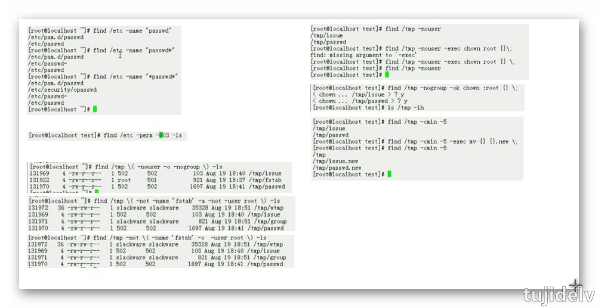

# Linux 系统入门：常用命令

## 目录

- [简介](#简介)
- [正篇](#正篇)
- [参考链接](#参考链接)
- [结束语](#结束语)

## 简介

记录一些常用命令...

## 正篇

### ***未分类***

- `which`
    - 命令功能
        ```
        显示命令的完整路径
        ```
    - 命令格式
        ```
        ~]# which [options] [--] programname [...]
        ```
    - 命令参数
        ```
        --skip-alias:忽略别名
        ```
- `whereis`
    - 命令功能
        ```
        增强版的which命令，会显示路径、源码文件、手册页
        ```
    - 命令格式
        ```
        ~]# whereis [options] [-BMS directory... -f] name...
        ```
    - 命令参数
        ```
        -b：仅搜索二进制程序路径
        -m：仅搜索使用手册文件路径
        ```
- `whatis`
    - 命令功能
        ```
        查看COMMAND在哪些章节下有手册
            使用mkwhatis命令可将当前系统上所有的帮助手册及与之对应的关键字创建为一个数据库,并且此数据库当中会保存关键字的简要说明信息
            whatis能够在数据库里以我们指定的关键字去查找相应的说明
        ```
    - 命令格式
        ```
        ~]# whatis [-dlv?V] [-r|-w] [-s list] [-m system[,...]] [-M path] [-L locale] [-C file] name ...
        ```
- `echo`
    - 命令功能
        ```
        常用于显示变量值
        ```
    - 命令格式
        ```
        ~]# echo [SHORT-OPTION]... [STRING]...
            STRING可以使用引号，单引号和双引号均可用
        ```
    - 命令参数
        ```
        -n：不进行换行
        -e：让转义生效
        	\n：换行
        	\t：制表符
        ```
    - 命令实例
        ```
        [root@host ~]# echo "how \tare you"
        how \tare you
        [root@host ~]# echo -e "how \tare you"
        how     are you
        [root@host ~]# echo -e "how \nare you"
        how 
        are you
        [root@host ~]# echo '$SHELL'
        $SHELL
        [root@host ~]# echo "$SHELL"
        /bin/bash
        ```
- `watch`
    - 命令功能
        ```
        阶段性地执行指定的COMMAND
        ```
    - 命令格式
        ```
        ~]# watch [-n #] <COMMAND>
        ```
    - 命令参数
        ```
        -n #: 指定刷新间隔时间，单位是秒
        ```
    - 命令实例
        ```
        [root@host ~]watch -n1 'ifconfig eth0'
        ```

### ***待处理***

```
virt-what   用于查看服务器是kvm还是xen架构的虚拟化
netstat -tunlp | grep 端口号    用于查看指定端口号的进程情况	
	-t  tcp协议相关
	-u  udp协议相关
	-n  以数字显示IP和端口
	-l  处于监听状态
	-p  显示相关进程及PID
ps：显示进程状态
    常用组合：aux
        u: 以用户为中心组织进程状态信息显示
        a: 与终端相关的进程；
        x: 与终端无关的进程；
    常用组合：-ef
        -e: 显示所有进程
        -f: 显示完整格式程序信息
    # ps -Lf pid | wc -l 查看线程个数（方便查看程序是否有误）
top：显示当前系统中耗费资源最多的进程
    有许多内置命令：
        排序：
            P：以占据的CPU百分比；
            M：占据内存百分比；
            T：累积占据CPU时长；
        首部信息显示：
            uptime信息：l命令
            tasks及cpu信息：t命令
                cpu分别显示：1 (数字)
            memory信息：m命令
        退出命令：q
        修改刷新时间间隔：s
        终止指定进程：k
    选项：
        -d #: 指定刷新时间间隔，默认为3秒；
        -b: 以批次方式；
        -n #: 显示多少批次；
kill：向进程发送控制信号，以实现对进程管理
    显示当前系统可用信号：
        # kill -l
        # man 7 signal
    常用信号：
        1) SIGHUP: 无须关闭进程而让其重读配置文件；
        2) SIGINT: 中止正在运行的进程；相当于Ctrl+c；
        9) SIGKILL: 杀死正在运行的进程；
        15) SIGTERM：终止正在运行的进程；
        18) SIGCONT：
        19) SIGSTOP：
    指定信号的方法：
        (1) 信号的数字标识；1, 2, 9
        (2) 信号完整名称；SIGHUP
        (3) 信号的简写名称；HUP
    向进程发信号：
        kill [-SIGNAL] PID...
lsof -i:端口号
    用于查看某一端口的占用情况
crontab：定时任务
    crontab [-u user] [-l | -r | -e] [-i] 
        -l: 列出所有任务；
        -e: 编辑任务；
        -r: 移除所有任务；
        -i：同-r一同使用，以交互式模式让用户有选择地移除指定任务；
        -u user: 仅root可运行，代为为指定用户管理cron任务；
chkconfig：开机自启
    --list：查看哪些服务开机自动运行
    --add SRV_SCRIPT：添加脚本到开机自动启动项目中
    --del SRV_SCRIPT：删除
    SRV_SCRIPT on｜off：配置某服务是否开机自动运行
wget：网络客户端工具
    wget [option]... [URL]...
        -q: 静默模式
        -c: 续传
        -P 指定下载文件的存放目录
        -O 指定下载文件的名字，重命名
        --limit-rates=: 指定传输速率
rz
sz
scp
hostname: 查看主机名
```

### ***日期相关***

```
主板上有个纽扣电池为主板上的硬件时钟(晶体振荡器)供电，所以关机后再开机时间也是对的
Linux系统启动时从硬件时钟读取日期和时间信息，读取完成以后，就不再与硬件相关联，并设为当前系统时间，之后靠内核振动次数计时（100次1秒）
如时间不对，还可以和全球的时间服务器进行对表，精确度很高，最精确的是元子震荡时钟，价值1亿英镑
	系统时钟:由linux内核通过cpu的工作频率进行的计时
	硬件时钟
```
- `date`
    - 命令功能
        ```
        显示或设定系统时钟
        ```
    - 命令格式
        ```bash
        ~]# date [OPTION]... [+FORMAT]
        ~]# date [-u|--utc|--universal] [MMDDhhmm[[CC]YY][.ss]]
        ```
    - 命令参数
        ```
        FORMAT：格式符
        date +"%F %T"      2016-04-12 20:35:20
        date +%Y-%m-%d-%H-%M-%S         2016-04-12-20-41-17
        date +%s           从1970年1月1号（unix元年）
        ```
- `clock/hwclock`
    - 命令功能
        ```
        显示或设定硬件时钟
        ```
    - 命令格式
        ```bash
        ~]# hwclock [function] [option...]
        ```
    - 命令参数
        ```
        -s ,--hctosys ：以硬件为准，把系统时间调整为与硬件时钟相同
        -w ,--systohc ：以系统为准，把硬件时间调整为与系统时钟相同
        ```
- `cal`
    - 命令功能
        ```
        日历
        ```
    - 命令格式
        ```bash
        ~]# cal [options] [[[day] month] year]
        ```

### ***目录操作***

- `pwd`
    - 命令功能
        ```
        printing working directory,显示工作目录(当前目录)
            一定意义上是读取$PWD变量的内容并显示
        ```
    - 命令格式
        ```bash
        ~]# pwd [OPTION]...
        ```
- `cd`
    - 命令功能
        ```
        change directory,切换工作目录(当前目录)
        ----------
        相关的环境变量：
        	PWD：保存了当前工作目录的路径
        	OLDPWD：保存了上一次的工作目录的路径
        cd后面可以跟相对路径和绝对路径，根据实际需求选择用哪个，相对路径中.或..经常使用
        ```
    - 命令格式
        ```bash
        ~]# cd [-L|[-P [-e]]] [/PATH/TO/SOMEDIR]
        ```
    - 常用操作
        ```
        ~]# cd：切换回家目录，注意：bash中，~表示家目录(主目录)
        ~]# cd ~：切换回自己的家目录
        ~]# cd ~USERNAME：切换至指定用户的家目录
        ~]# cd -：在上一次所在目录与当前目录之间来回切换,一定意义上是执行了cd $OLDPWD
        ```
- `ls`
    - 命令功能
        ```
        list,显示指定路径下的文件列表
        ```
    - 命令格式
        ```bash
        ~]# ls [OPTION]... [FILE]...
        ```
    - 命令参数
        ```
        -a,--all：显示所有文件，包括隐藏文件
        -A：显示除.和..之外的所有文件
        -l：长格式列表，即显示文件的详细属性信息
        	-rw-------. 1 root root 1302 4月   4 22:39 initial-setup-ks.cfg
        		-：指的是Linux系统上的文件类型，并非通过file命令查看的文件内容格式的类型
        			-：普通(常规)文件，即f，有诸多变种格式，可通过file命令查看
        			d：directory，目录文件
        			b：block device，块设备文件，支持以"block"为单位进行随机访问
        			c：character device，字符设备文件，支持以"character"为单位进行线性访问
        				major number：主设备号，用于标识设备类型，进而确定要加载的驱动程序
        				minor number：次设备号，用于标识同一类型中的不同设备			
        			l：sysmbolic link，符号链接文件
        			s：socket，套接字文件;有很多服务器支持2种方式通信,如果跨主机只能基于协议通信,如果不跨主机建议使用套接字文件的方式通信
        			p：pipe，(命名)管道文件
        		rw-------：访问权限
        			rw-：文件属主的权限
        			---：文件属组的权限
        			---：其他用户（非属主、属组）的权限
        		1：表示文件被硬链接的次数
        		root：文件的属主(owner)
        		root：文件的属组(group)
        		1302：表示文件的大小(size)，单位是字节
        		4月   4 22:39：文件最近一次被修改的时间
        		    注:每个文件都有3个时间戳(访问,修改,改变),修改指的是文件内容发生的改变,改变指的是文件的属性发生的改变;修改一定会改变,改变不一定会修改
        		initial-setup-ks.cfg：文件名
        -h：对文件大小单位换算，换算后结果可能为非精确值
        -d：显示目录自身的相关属性而非其内部的文件列表，一般与-l结合使用
        -r：reverse，逆序显示,没有-r时默认升序显示
        -R：recursive，递归显示
        ```
    - 命令实例
        ```bash
        [root@host ~]# ls -lhd /etc
        drwxr-xr-x. 79 root root 4.0K Dec 24 19:42 /etc
        ```
- `basename`
    - 命令功能
        ```
        显示路径的基名
        ```
    - 命令格式
        ```bash
        ~]# basename /PATH/TO/SOMEFILE
            SOMEFILE
        ```
- `dirname`
    - 命令功能
        ```
        显示路径的目录名
        ```
    - 命令格式
        ```bash
        ~]# dirname /PATH/TO/SOMEFILE
            /PATH/TO
        ```

### ***目录管理***

- `mkdir`
    - 命令功能
        ```
        make directories
        ```
    - 命令格式
        ```
        ~]# mkdir [OPTION]... DIRECTORY...
        ```
    - 命令参数
        ```
        -p：自动按需创建父目录;不会报错,即便目录已经存在
        -v：verbose，显示详细过程
        -m MODE：创建目录时直接给定权限
        ```
- `rmdir`
    - 命令功能
        ```
        remove empty directories
        ```
    - 命令格式
        ```
        ~]# rmdir [OPTION]... DIRECTORY...
        ```
    - 命令参数
        ```
        -p：删除某目录后，如果其父目录为空，则一并删除之
        -v：显示过程
        ```
- `tree`
    - 命令功能
        ```
        以树状结构来显示目录的层级结构
        ```
    - 命令格式
        ```
        ~]# tree [options] [directory]
        ```
    - 命令参数
        ```
        -d：只显示目录
        -L level：指定要显示的层级，如果不指定则显示所有的层级
        -P pattern：只显示由指定pattern匹配到的路径
        ```

### ***文件管理***

- `dd`
    - 命令功能
        ```
        convert and copy a file(转换并复制文件),cp是通过文件系统复制的,而dd是通过块接口复制的,虽然都是复制但dd要底层的多,效率更高
        ```
    - 命令格式
        ```
        ~]# dd if=/PATH/FROM/SRC of=/PATH/TO/DEST [OPTIONS...]
        ```
    - 命令参数
        ```
        bs=#：block size, 复制单元大小,单位是字节；
        count=#：复制多少个bs；
        ```
    - 命令实例
        ```
        磁盘拷贝：
            ~]# dd if=/dev/sda of=/dev/sdb
        备份MBR：
            ~]# dd if=/dev/sda of=/tmp/mbr.bak bs=512 count=1
        破坏MBR中的bootloader：使用bs=512可以快速清除磁盘上的分区表
            ~]# dd if=/dev/zero of=/dev/sda bs=256 count=1
            
            两个特殊设备：
                /dev/null: 数据黑洞；
                /dev/zero：吐零机；
        ```

- `cp`
    - 命令功能
        ```
        copy,默认下源文件不能是目录，除非加上相应的选项-r
        ```
    - 命令格式
        ```
        单源复制：cp [OPTION]... [-T] SOURCE DEST
        	如果DEST不存在，则事先创建此文件，并复制源文件的数据流至DEST中
        	如果DEST存在
        		如果DEST是非目录文件，则覆盖目标文件,此时建议使用-i选项
        		如果DEST是目录文件，则先在DEST目录下创建一个与源文件同名的文件，并复制其数据流
        多源复制：cp [OPTION]... SOURCE... DIRECTORY
        		cp [OPTION]... -t DIRECTORY SOURCE...    前一形式的变种
        	如果DEST不存在，错误
        	如果DEST存在
        		如果DEST是非目录文件，错误
        		如果DEST是目录文件，分别复制每个文件至目标目录中，并保持原名
        ```
    - 命令参数
        ```
        -i：交互式复制，即覆盖之前提醒用户确认
        -f：强制覆盖目标文件
        -r,-R：递归复制目录及内部的所有内容
        -d：复制符号链接文件本身，而非其指向的源文件
        -a：相当于-dR --preserve=all          archive，用于实现归档(备份)
        	--preserve=
        		mode：权限
        		ownership：属主和属组
        		timestamps：时间戳
        		context：安全标签	
        		xattr：扩展属性
        		links：符号链接
        		all：上述所有属性
        -v：verbose，显示详细过程
        ```
- `mv`
    - 命令功能
        ```
        move(rename),此时源文件不区分目录或是文件;如果source和dest都在同一目录,即是重命名操作
        ```
    - 命令格式
        ```
        ~]# mv [OPTION]... [-T] SOURCE DEST
        ~]# mv [OPTION]... SOURCE... DIRECTORY
        	~]# mv [OPTION]... -t DIRECTORY SOURCE...		前一形式的变种
        ```
    - 命令参数
        ```
        -i：交互式移动，即移动之前提醒用户确认
        -f：强制移动
        ```
- `rm`
    - 命令功能
        ```
        remove,默认下不能删除目录的，除非加上相应的选项-r
            注意：所有不用的文件建议不要直接删除，而是移动至某个专用目录。也就是模拟回收站。
        ```
    - 命令格式
        ```
        ~]# rm [OPTION]... FILE...
        ```
    - 命令参数
        ```
        -i：interactive,删除时提醒,管理员账号默认加上此选项
        -f：force,删除时不提醒
        -r,-R：recursive删除目录
        ```
    - 命令实例
        ```
        例如：rm -rf /PATH/TO/DIR
        	危险操作：rm -rf /*
        ```

### ***文本文件查看***

- `cat`
    - 命令功能
        ```
        文件连接并显示的命令
        ```
    - 命令格式
        ```
        ~]# cat [OPTION]... [FILE]...
        ```
    - 命令参数
        ```
        -n：给显示的文本行编号	
        -E：显示行结束符$，文本文件在磁盘上存储是没有行的，之所以显示出有行，是因为文本文件查看工具可以读取行结束符并将他们显示为行
        ```
- `tac`
    - 命令功能
        ```
        与cat命令相反显示文件文件内容
        ```
- `more`
    - 命令功能
        ````
        分页显示文本文件内容，空格向后，b向前
        特点：操作方式同man命令,翻屏至文件尾部后自动退出
        ````
    - 命令格式
        ```
        ~]# more [OPTION...] FILE...
        ```
    - 命令参数
        ```
        -d：显示翻页及退出提示
        ```
- `less`
    - 命令功能
        ```
        分页显示文本文件内容，空格向后，b向前
        特点：man命令就是调用less命令
        ```
    - 命令格式
        ```
        ~]# less [OPTION...] FILE...
        ```
- `head`
    - 命令功能
        ```
         查看文件的前n行
        ```
    - 命令格式
        ```
        ~]# head [OPTION...] FILE...
        ```
    - 命令参数
        ```
        -c #：指定获取前#字节
        -n #：指定获取前#行
        	-#：简写
        	没有该选项默认10行
        ```
- `tail`
    - 命令功能
        ```
        查看文件的后n行
        注：tailf命令等同于tail -f -n 10
        ```
    - 命令格式
        ```
        ~]# tail [OPTION...] FILE...
        ```
    - 命令参数
    ```
    -c #：指定获取后#字节
    -n #：指定获取后#行
    	-#：简写
    	没有该选项默认10行
    -f：查看文件尾部内容结束后不退出，跟随显示新增的行。常用于人工监控日志增长的新行内容
    -F：同上，与f不同的是会保持重试，即该文件被删除或改名后，如果再次创建相同的文件名，会继续追踪，而f会停止追踪
    ```

### ***文本文件处理***

- `wc`
    - 命令功能
        ```
        统计文本的行数,单词数,字符数/字节数
        ```
    - 命令格式
        ```
        ~]# wc [OPTION...] FILE...
        ```
    - 命令参数
        ```
        -l：lines
        -w：words
        -c：characters
        ```
    - 命令实例
        ```
        [root@host ~]# ifconfig
        eth0: flags=4163<UP,BROADCAST,RUNNING,MULTICAST>  mtu 1500
                inet 144.34.204.26  netmask 255.255.224.0  broadcast 144.34.223.255
                inet6 fe80::a8aa:ff:fe12:2acd  prefixlen 64  scopeid 0x20<link>
                ether aa:aa:00:12:2a:cd  txqueuelen 1000  (Ethernet)
                RX packets 258312  bytes 18661074 (17.7 MiB)
                RX errors 0  dropped 0  overruns 0  frame 0
                TX packets 224427  bytes 24548808 (23.4 MiB)
                TX errors 0  dropped 0 overruns 0  carrier 0  collisions 0
        
        lo: flags=73<UP,LOOPBACK,RUNNING>  mtu 65536
                inet 127.0.0.1  netmask 255.0.0.0
                inet6 ::1  prefixlen 128  scopeid 0x10<host>
                loop  txqueuelen 1000  (Local Loopback)
                RX packets 64  bytes 5568 (5.4 KiB)
                RX errors 0  dropped 0  overruns 0  frame 0
                TX packets 64  bytes 5568 (5.4 KiB)
                TX errors 0  dropped 0 overruns 0  carrier 0  collisions 0
        
        [root@host ~]# ifconfig | wc -l
        18
        ```
- `cut`
    - 命令功能
        ```
        以指定字符作为分隔符对每行进行切割
        ```
    - 命令格式
        ```
        ~]# cut OPTION... FILE...
        ```
    - 命令参数
        ```
        -d DELIMITER：指明分隔符,默认空白字符
        -f FILEDS：要显示哪些字段
        	#：第#个字段
        	#,#[,#]：离散的多个字段,例如1,3,6
        	#-#：连续的多个字段,例如1-6
        	混合使用：1-3,7
        --output-delimiter=STRING：修改输出时的分隔符
        ```
    - 命令实例
        ```
        [root@host ~]# cat /etc/passwd
        root:x:0:0:root:/root:/bin/bash
        bin:x:1:1:bin:/bin:/sbin/nologin
        daemon:x:2:2:daemon:/sbin:/sbin/nologin
        adm:x:3:4:adm:/var/adm:/sbin/nologin
        lp:x:4:7:lp:/var/spool/lpd:/sbin/nologin
        sync:x:5:0:sync:/sbin:/bin/sync
        shutdown:x:6:0:shutdown:/sbin:/sbin/shutdown
        halt:x:7:0:halt:/sbin:/sbin/halt
        mail:x:8:12:mail:/var/spool/mail:/sbin/nologin
        operator:x:11:0:operator:/root:/sbin/nologin
        games:x:12:100:games:/usr/games:/sbin/nologin
        ftp:x:14:50:FTP User:/var/ftp:/sbin/nologin
        nobody:x:99:99:Nobody:/:/sbin/nologin
        systemd-bus-proxy:x:999:998:systemd Bus Proxy:/:/sbin/nologin
        systemd-network:x:192:192:systemd Network Management:/:/sbin/nologin
        dbus:x:81:81:System message bus:/:/sbin/nologin
        polkitd:x:998:997:User for polkitd:/:/sbin/nologin
        tss:x:59:59:Account used by the trousers package to sandbox the tcsd daemon:/dev/null:/sbin/nologin
        sshd:x:74:74:Privilege-separated SSH:/var/empty/sshd:/sbin/nologin
        postfix:x:89:89::/var/spool/postfix:/sbin/nologin
        chrony:x:997:995::/var/lib/chrony:/sbin/nologin
        [root@host ~]# cut -d: -f1,7 --output-delimiter=' ' /etc/passwd
        root /bin/bash
        bin /sbin/nologin
        daemon /sbin/nologin
        adm /sbin/nologin
        lp /sbin/nologin
        sync /bin/sync
        shutdown /sbin/shutdown
        halt /sbin/halt
        mail /sbin/nologin
        operator /sbin/nologin
        games /sbin/nologin
        ftp /sbin/nologin
        nobody /sbin/nologin
        systemd-bus-proxy /sbin/nologin
        systemd-network /sbin/nologin
        dbus /sbin/nologin
        polkitd /sbin/nologin
        tss /sbin/nologin
        sshd /sbin/nologin
        postfix /sbin/nologin
        chrony /sbin/nologin
        ```
- `sort`
    - 命令功能
        ```
        对文件内容进行排序
        ```
    - 命令格式
        ```
        ~]# sort [OPTION...] FILE...
        ```
    - 命令参数
        ```
        -f：忽略字符大小写
        -r：逆序排序
        -t DELIMITER：字段分隔符
        -k #：以指定字段为标准排序
        -n：以数值大小进行排序,默认是以字符进行排序
        -u：uniq,排序后去重
        ```
    - 命令实例
        ```
        ~]# sort -t: -k3 -n /etc/passwd | tail -1 | cut -d: -f1  #显示/etc/passwd文件中ID号最大的用户的用户名
        ~]# history | cut -d'' -f5 | sort -u
        ```
- `uniq`
    - 命令功能
        ```
        对文件中连续且完全相同的内容去重,一般先排序再去重
        ```
    - 命令格式
        ```
        ~]# uniq [OPTION...] FILE...
        ```
    - 命令参数
        ```
        -c：显示每行重复出现的次数
        -d：仅显示重复过的行
        -u：仅显示不曾重复的行
        ```
    - 命令实例
        ```
        ~]# history | cut -d'' -f5 | sort | uniq -c
        ```

### ***文件的时间戳管理***

- `stat`
    - 命令功能
        ```
        display file or file system status,显示文件的元数据信息
        ---------------------
        文件：两类数据
        	元数据：metadata
        	数据：data
        时间戳：每个文件都有3个时间戳
        	最近访问时间(access time)：2016-04-24 21:20:42.477903125 +0800   			读取文件内容
        	最近修改时间(modify time)：2016-04-24 20:40:08.887958504 +0800			数据(文件内容)改变
        	最近改变时间(change time)：2016-04-24 20:40:08.887958504 +0800			元数据改变
        ```
    - 命令格式
        ```
        ~]# stat [OPTION]... FILE...
        ```
- `touch`
    - 命令功能
        ```
        change file timestamps,修改文件元数据中的时间戳信息(atime或mtime改了ctime也会改),也可以创建文件
        ```
    - 命令格式
        ```
        ~]# touch [OPTION]... FILE...
        ```
    - 命令参数
        ```
        -c：指定的文件路径不存在时，默认会创建空文件，使用此选项时将不予创建。
        -a：仅修改access time
        -m：仅修改modify time
        -t STAMP：
        	[[CC]YY]MMDDhhmm[.ss]
        ```

### ***系统管理***

- `关机/重启命令`
    ```
    CentOS 7：
    	~]# systemctl poweroff
    	~]# systemctl reboot
    *（通用）：
    	~]# poweroff || ~]# halt
    	~]# reboot
    		-f：强制,不调用shuwdown
    		-p：切断电源
    shutdown：安全关机重启方式,会先保存未保存的数据
    	shutdown [OPTIONS...] TIME [MESSAGE]
    		OPTIONS：
    			-h：halt  关机
    			-r：reboot  重启
    			-c：cancel  取消关机或重启
    		TIME：
    			now：立刻
    			hh:mm：绝对时间表示法,指明具体时间
    			+m：相对时间表示法,从命令提交开始多久之后,例如+3,单位是分钟
    		MESSAGE：
    			关机或重启提示语
    ```
- `用户登录信息查看命令`
    ```
    whoami：显示当前登录的有效用户
    who：查看系统当前所有的登录信息(会话)
    	who [option]... ，
    	-b：系统此次启动的时间
    	-r：运行级别
    w：增强版的who命令，查看系统当前所有的登录信息(会话)及所做的操作
    ```

### ***用户和组管理***

- `id`
    - 命令功能
        ```
        查看用户相关的ID信息
        ```
    - 命令格式
        ```
        ~]# id [OPTION]... [USER]
        ```
    - 命令参数
        ```
        -u：UID
        -g：GID
        -G：Groups
        ```
- `su`
    - 命令功能
        ```
        切换用户或以其他用户身份执行命令
        ----------------
        切换用户的方式：
        	su Username：非登录式切换,即不会读取目标用户的配置文件
        	su - Username：登录式切换(完全切换),即会读取目标用户的配置文件
        注：root su至其他用户无须密码,非root用户切换时需要密码
        ```
    - 命令格式
        ```
        ~]# su [options...] [-] [user [args...]]
        ```
    - 命令参数
        ```
        -c 'COMMAND'：换个身份执行命令
        ```
    - 命令实例
        ```
        ~]# su - user7 -c 'echo $PATH'
        ```
- `useradd`
    - 命令功能
        ```
        用户创建
        ```
    - 命令格式
        ```
        ~]# useradd [options] LOGIN
        ```
    - 命令参数
        ```
        -u UID：[UID_MIN,UID_MAX],最小值和最大值定义在/etc/login.defs文件中
        	没有该选项默认使用最近一个最大UID值+1
        -g GID：指明用户所属基本组,可为组名,也可为GID,组必须事先存在
        -c "COMMENT"：指明用户的注释信息
        -d /PATH/TO/HOME_DIR：指明用户的家目录,一般来讲此目录事先不要已存在
        -s SHELL：指明用户的默认shell,可用shell列表在/etc/shells文件中
        -G GROUP1[,GROUP2,...[,GROUPN]]：指明用户的附加组,组必须事先存在
        -r：创建系统用户
        -D 选项：默认值设定,可在/etc/default/useradd文件中查看
        ```
    - 命令实例
        ```
        ~]# useradd -D -s /bin/tcsh
        ```
- `usermod`
    - 命令功能
        ```
        用户属性修改
        ```
    - 命令格式
        ```
        ~]# usermod [options] LOGIN
        ```
    - 命令参数
        ```
        -u UID：新UID
        -g GID：新GID
        -G GROUP1[,GROUP2,...[,GROUPN]]：新附加组,原来的附加组将会被覆盖;若要保留原有,则要同时使用-a选项,表示append
        -c "COMMENT"：新的注释信息
        -d /PATH/TO/HOME_DIR：新的家目录,原有家目录中的文件不会同时移动至新的家目录;若要移动,则同时使用-m选项
        -s SHELL：新的默认shell
        -l login_name：新的名
        ------
        -L：lock指定用户
        -U：unlock指定用户
        ------
        -e YYYY-MM-DD：指明用户账号过期日期
        -f INACTIVE：设定非活动期限
        ```
- `userdel`
    - 命令功能
        ```
        用户删除
        ```
    - 命令格式
        ```
        ~]# userdel [OPTION]... LOGIN
        ```
    - 命令参数
        ```
        '-r：删除用户家目录,默认不删除用户的家目录
        ```
- `groupadd`
    - 命令功能
        ```
        组添加
        ```
    - 命令格式
        ```
        ~]# groupadd [OPTIONS...] group_name
        ```
    - 命令参数
        ```
        -g GID：指定GID，[GID_MIN,GID_MAX],最小值和最大值定义在/etc/login.defs文件中	
        	没有该选项默认是上一个组的GID+1
        -r：创建系统组
        ```
    - 命令实例
        ```
        ~]# groupadd -r -g 306 mariadb   创建一个系统组mariadb，并且指定GID为306
        ```
- `groupmod`
    - 命令功能
        ```
        组属性修改
        ```
    - 命令格式
        ```
        ~]# groupmod [OPTIONS...] GROUP
        ```
    - 命令参数
        ```
        -g GID：修改GID
        ```
    - 命令实例
        ```
        ~]# groupmod -g 702 mariadb    group -n  perconaserver mariadb
        ```
- `groupdel`
    - 命令功能
        ```
        组删除
        ```
    - 命令格式
        ```
        ~]# groupdel [选项] GROUP
        ```
- `passwd`
    - 命令功能
        ```
        给用户添加密码
        ```
    - 命令格式
        ```
        ~]# passwd [OPTIONS] UserName：修改指定用户的密码 ,仅root用户权限
        ~]# passwd：修改自己的密码
        ```
    - 命令参数
        ```
        -l：锁定指定用户
        -u：解锁指定用户
	
        -n mindays：指定最短使用期限
        -x maxdays：指定最大使用期限
        -w warndays：提前多少天开始警告
        -i inactivedays：非活动期限
        
        -S：查看最后一次密码修改的日期

        --stdin：从标准输入接收用户密码,passwd默认是交互式的从标准输入接收密码
        ```
    - 命令实例
        ```
        echo "PASSWORD" | passwd --stdin USERNAME
        ~]# echo 'centos' |passwd --stdin user1 &> /dev/null
        ~]# echo $?
        ```
- `gpasswd`
    - 命令功能
        ```
        组密码添加
        ```
    - 命令格式
        ```
        ~]# gpassed [OPTION]... GROUP
        ```
    - 命令参数
        ```
        -u user：将user添加至指定组中
        -d user：删除用户user的以当前组为组名的附加组

        -A user1,user2,...：设置有管理权限的用户列表
        ```
- `newgrp`
    - 命令功能
        ```
        临时切换基本组
            如果用户本不属于此组,则需要密码
        ```
- `chage`
    - 命令功能
        ```
        修改用户属性(密码相关)
        ```
    - 命令格式
        ```
        ~]# chage [OPTION]... LOGIN
        ```
    - 命令参数
        ```
        -d：LAST_DAY	
        -E,--expiredate EXPIRE_DATE
        -I,--inactive INACTIVE
        -m,--mindays MIN_DAYS
        -M,--maxdays MAX_DAYS
        -W,--warndays WARN_DAYS
        ```

### ***文件权限管理***

- `chmod`
    - 命令功能
        ```
        change mode,修改文件权限
        ```
    - 命令格式
        ```
        ~]# chmod [OPTION]... OCTAL-MODE FILE...
        	-R：递归修改权限
        ~]# chmod [OPTION]... MODE[,MODE]... FILE...
        	MODE：
        		修改一类用户的所有权限：
        			u=
        			g=
        			o=
        			ug=
        			a=
        			u=,g=
        		修改一类用户的某位或某些权限
        			u+
        			u-
        ~]# chmod [OPTION]... --reference=RFILE FILE...
        	参考RFILE文件的权限,将FILE的权限修改为同RFILE
        ```
    - 命令实例
        ```
        [root@host ~]# chmod 640 a.txt
        ----------
        [root@host ~]# chmod u=rwx a.txt
        [root@host ~]# chmod g= a.txt
        [root@host ~]# chmod ug=rw a.txt
        [root@host ~]# chmod u=rwx,g=r a.txt
        [root@host ~]# chmod a=r a.txt
        ----------
        [root@host ~]# chmod u+w,o-r a.txt
        [root@host ~]# chmod +x a.txt
        ----------
        [root@host ~]# chmod --reference=./c.txt a.txt
        ```
- `chown`
    - 命令功能
        ```
        修改文件的属主,仅root可用
        ```
    - 命令格式
        ```
        ~]# chown [OPTION]... [OWNER][:[GROUP]] FILE...
        	-R：递归
        	命令中的冒号可用.替换
        	用法：
        		OWNER
        		OWNER:GROUP
        		:GROUP
        ~]# chown [OPTION]... --reference=RFILE FILE...
        ```
    - 命令实例
        ```
        [root@host ~]# chown tom fstab
        [root@host ~]# chown jerry:jerry fstab
        [root@host ~]# chown :root fstab
        [root@host ~]# chown -R tom:tom /home/fedora
        ```
- `chgrp`
    - 命令功能
        ```
        修改文件的属组,仅root可用
        ```
    - 命令格式
        ```
        ~]# chgrp [OPTION]... GROUP FILE...
        ~]# chgrp [OPTION]... --reference=RFILE FILE...
        ```

### ***文本编辑***

**行编辑器**
- `sed`
    - 命令功能
        ```
        ==> Linux文本处理三剑客
        ```

**全屏编辑器**
- `nano`
    - 常用操作
        ```
        ^O，Ctrl+O，保存当前文件
        ^X，Ctrl+X，退出编辑文本
        ^W，Ctrl+W，搜索文本位置
        -------------------
        ^G，Ctrl+G，显示帮助文本
        ^R，Ctrl+R，读取其他文件并插入光标位置
        ^Y，Ctrl+Y，跳至上一屏幕
        ^K，Ctrl+K，剪切当前一行
        ^C，Ctrl+C，显示光标位置
        ^J，Ctrl+J，对其当前段落（以空格为分隔符）
        ^V，Ctrl+V，跳至下一屏幕
        ^U，Ctrl+U，粘贴文本至光标处
        ^T，Ctrl+T，运行拼写检查
        ```
- `vi`
    - 命令功能
        ```
        Visual Interface(可视化接口),vim的前身,linux上著名的功能极其强大的入门曲线非常陡峭的文本编辑器
        ```
- `vim`
    - 命令功能
        ```
        Vi IMproved(vi增强版),可视化模式化的编辑
        ```
    - 常用操作
        ```
        打开文件：
        	~]# vim [OPTION]... FILE...	
        		+#：打开文件后，直接让光标处于第#行的行首;没有#光标默认处于尾部	
        		+/PATTEN：打开文件后，直接让光标处于第一个被PATTEN匹配到的行的行首
        关闭文件：
        	:q	退出
        	:q!	强制退出,丢弃做出的修改
        	:wq	保存退出
        	:x	保存退出

        	ZZ	保存退出(命令模式下)				
        基本模式：
        	编辑模式：也叫命令模式，默认处于此模式，对文本进行复制，剪切， 粘贴等
        	输入模式：也叫插入模式，对文件内容进行编辑
        	末行模式：内置的命令行接口，可实现许多强大的功能
        模式转换：
        	编辑模式-->输入模式
        		i：insert,在光标所在处输入	
        		a：append,在光标所在处后面输入
        		o：open,在当前光标所在行的下方打开一个新行输入
        		I：在当前光标所在行的行首输入
        		A：在当前光标所在行的行尾输入
        		O：在当前光标所在行的上方打开一个新行输入
        		c：change,
        		C：
        	输入模式-->编辑模式
        		ESC
        	编辑模式-->末行模式
        		:
        	末行模式-->编辑模式
        		ESC
        光标跳转：
        	字符间跳转：
        		h(左),j(下),k(上),l(右)

        		#COMMAND：跳转由#指定一次跳转的字符数
        	单词间跳转：
        		w：下一个单词的词首
        		e：当前或下一个单词的词尾
        		b：当前或前一个单词的词首

        		#COMMAND：跳转由#指定一次跳转的单词数
        	行首行尾跳转：					
        		^：跳转至行首的第一个非空白字符				
        		0：跳转至行首				
        		$：跳转至行尾				
        	行间移动：					
        		#G：跳转至由#指定行				
        		G：跳转至最后一行				
        		1G或gg：跳转至第一行				
        	句间移动：了解即可					
        		)
        		(
        	段落间移动：了解即可
        		}
        		{
        	ctrl+g显示当前光标所在行位置及文件状态信息
        编辑命令：
        	剪切命令：
        		x：删除光标处的字符
        		#x：删除光标处起始的#个字符
        		xp：交换光标所在处的字符及其后面字符的位置
			
        		d(常用)：可结合光标跳转字符，实现范围删除
        			d$,d^,d0,dw,de,db,#COMMAND...
        			dd：删除光标所在行
        				#dd：多行删除	
        	粘贴命令(p,put,paste)：
        		p(小写)：缓冲区存储的如果为整行,则粘贴至当前光标所在行的下方;否则粘贴至当前光标所在处的后面
        		P(大写)：缓冲区存储的如果为整行,则粘贴至当前光标所在行的上方;否则粘贴至当前光标所在处的前面
        	复制命令(y,yank)：
        		y：工作行为相似于d命令
        			y$,y^,y0,yw,de,yb,#COMMAND...
        			yy：复制光标所在行
        				#yy：多行复制	
        	改变命令(c,change)：
        		c：修改，同d命令,但同时会进入插入模式
        			c$,c^,c0,cw,ce,cb,#COMMAND...
        			cc：
        				#cc：
				
        	可视化模式：经常结合编辑命令中的d,y进行复制剪切
        		v(小写)：按字符选定光标划过的区域
        		V(大写)：按行选定光标划过的区域
        	撤销命令：
        		u(undo)：撤销此前的操作
        			#u：撤销指定次数的操作
        	撤销此前的撤销操作：
        		Ctrl+r
        	重复前一个编辑操作：常用于和dd配合使用
        		.
        	%可以在当前有括号的光标处查找配对的括号)}],常用于程序调试时查找不配对的括号
        	r输入一个字符可替换光标所在位置的字符
        末行命令：
        	1.地址定界：
        		:start_pos,end_pos
        			#：具体第#行,例如2表示第2行
        			#,#：从左侧#表示行起始,到右侧#表示行结尾
        			#,+#：从左侧#表示行起始,加上右侧#表示的行数
        			.：当前行
        			$：最后一行
        			%：全文,相当于1,$
        		使用方法：后跟一个编辑命令
        			d,y,...
        			w /APTH/TO/SOMEWHERE：将范围内的行另存至指定文件中
        			r /APTH/FROM/SOMEWHERE：在指定位置插入指定文件中的所有内容
        	2.查找：同less命令的查找
        		/PATTERN：从当前光标所在处向文件尾部查找
        		?PATTERN：从当前光标所在处向文件首部查找
        			n:与查找命令方向相同
        			N:与查找命令方向相反
        	3.查找并替换：需结合地址定界一起使用
        		s/要查找的内容/替换为的内容/修饰符
        			要查找的内容：可使用模式
        			替换为的内容：不能使用模式,但可以使用\1,\2,...等后向引用符号;还可以使用"&"引用前面查找时查找到的整个内容
        			修饰符：
        				i：忽略大小写
        				g：全局替换,默认情况下,每一行只替换第一次出现的内容
        				c：询问用户是否替换
        		查找替换中的分隔符/可替换为其他字符,例如
        			s@@@
        			s###
        		练习：
        			1.复制/etc/grub2.cfg至/tmp/目录,用直接替换命令删除/tmp/grub2.cfg文件中的行首的空白字符
        				%s/^[[:space:]]\+//g
        			2.复制/etc/rc.d/init.d/functions文件至/tmp目录,用查找替换命令为/tmp/functions的每行开头为空白字符的行的行首添加一个#号
        				%s/^[[:space:]]/#&/
        	4.多文件模式下的操作：一般窗口没有分割时
        		:next   下一个
        		:prev   前一个
        		:first  第一个
        		:last   最后一个

        		:wall   保存所有
        		:qall   退出所有
        		:wqall  保存退出所有
        	5.获取帮助
        		:help
        		:help keywords
        	6.执行外部命令
        		:! COMMAND  用于执行一个外部命令
        		:r ! COMMAND  读取外部命令的输出放到光标处
        窗口分割模式：
        	窗口间切换：Ctrl+w,Arrow
        	单文件：
        		Ctrl+w,s：split,水平分割
        		Ctrl+w,v：vertical,垂直分割
        	多文件：
        		vim -o|O FILE1 FILE2 FILE3...
        			-o：水平分割
        			-O：垂直分割
        定制vim的工作特性：
        	配置文件：永久有效	
        		全局：/etc/vimrc
        		个人(需手动创建该文件)：~/.vimrc
        	末行命令：当前vim进程有效
        						
        	1.行号
        		显示：set number,简写为set nu	
        		取消显示：set nonumber,简写为set nonu
        	2.括号匹配
        		匹配：set showmatch,简写为set sm
        		取消匹配：set noshowmatch,简写为set nosm
        	3.自动缩进(autoindent)
        		启用：set ai
        		禁用：set noai
        	4.高亮(HighLight)搜索
        		启用：set hlsearch
        		禁用：set nohlsearch
        	5.语法(syntax)高亮
        		启用:syntax on
        		禁用：syntax off
        	6.忽略字符大小写(ignorecase)
        		启用:set ic
        		禁用:set noic
        翻屏操作：
        	ctrl+f：向文件尾部翻一屏
        	ctrl+b：向文件首部翻一屏
        	ctrl+d：向文件尾部翻半屏
        	ctrl+u：向文件首部翻半屏
        vim自带的练习教程：
        	vimtutor
        ```

### ***文件查找***

`在文件系统上查找符合条件的文件；分为非实时查找(数据库查找)和实时查找`

- `locate`
    - 命令功能
        ```
        依赖于事先构建好的索引;索引的构建是在系统较为空闲时自动进行(周期性任务);
        可手动更新数据库(updatedb),与makewhatis类似,索引构建过程中需要遍历整个根文件系统,极消耗资源
        -----------------------
        工作特点：
        	查找速度快
        	模糊查找：根据整个路径名和文件名
        	非实时查找
        ```
    - 命令格式
        ```
        ~]# locate KEYWORD
        ```
- `find`
    - 命令功能
        ```
        实时查找工具,通过遍历指定路径下的文件系统完成文件查找
        -----------------------
        工作特点：
        	查找速度略慢
        	精确查找：根据文件本身的名字而非整个路径名
        	实时查找
        ```
    - 命令格式
        ```
        ~]# find [OPTION]... [查找路径] [查找条件] [处理动作]
        	查找路径：指定具体目标路径,可以多个;默认为当前目录
        	查找条件：指定的查找标准,可以是文件名/大小/类型/权限等标准进行;默认为找出指定路径下的所有文件
        		根据文件名：
        			-name "文件名称"：支持使用文件名通配（globbing）
        				*,?,[],[^]
        			-iname "文件名称"：不区分字母大小写

        			-regex "PATTEN"：以PATTE匹配整个文件路径字符串，而不仅仅是文件名称
        		根据属主/属组：
        			-user USERNAME：查找属主为指定用户的文件
        			-group GROUPNAME：查找属组为指定组的文件

        			-uid UserID：查找属主为指定UID号的文件
        			-gid GroupID：查找属组为指定GID号的文件

        			-nouser：查找没有属主的文件,如用户删了
        			-nogroup：查找没有属组的文件,如用户删了,私有组也没了
        		根据文件类型：
        			-type TYPE：
        				可参考ls命令中的各类型代表字符
        		根据文件大小：
        			-size [+|-]#UNIT
        				常用单位：K,M,G

        			#UNIT：(#-1,#]
        			-#UNIT：(0,#-1]
        			+#UNIT：(#,无穷大)
        		根据时间戳：
        			以"天"为单位：
        				-atime [+|-]#
        					#：[#,#+1)
        					+#：[#+1,无穷大)
        					-#：[0,#)
        				-mtime [+|-]#
        				-ctime [+|-]#
        			以"分钟"为单位：
        				-amin [+|-]#
        				-mmin [+|-]#
        				-cmin [+|-]#
        		根据权限：
        			-perm [/|-]MODE
        				MODE：精确权限匹配
        				/MODE：任何一类(u,g,o)对象的权限中只要能有一位匹配即可
        				-MODE：每一类对象都必须同时拥有为其指定的权限标准
        		组合条件：
        			与：-a,可以省略
        			或：-o
        			非：-not,!

                    摩根定律：
                        !A -a !B 相当于 !(A -o B)
                        !A -o !B 相当于 !(A -a B)
        	处理动作：对符合条件的文件做什么操作;默认输出至屏幕
        		-print：默认的处理动作,显示至屏幕
        		-ls：类似于对查找到的文件执行"ls -l"命令
        		-delete：删除查找到的文件
        		-fls /PATH/TO/SOMEFILE：查找到的所有文件的长格式信息保存至指定文件中
        		-ok COMMAND {} \：对查找到的每个文件执行由COMMAND指定的命令
        			对于每个文件执行命令之前,都会交互式要求用户确认
        		-exec COMMAND {} \：对查找到的每个文件执行由COMMAND指定的命令,不会要求用户确认
        			{}：用于引用查找到的文件名称自身

        		注：find传递查找到的文件至后面指定的命令时,查找到所有符合条件的文件会一次性传递个后面的命令,
        		有些命令不能接受过多参数,此时命令可能会失败,另一种方式可规避此问题：
        			find | xargs COMMAND
        ```
    - 命令实例
        ```
        练习1：查找/var目录下属主为root,且属组为mail的所有文件或目录
            ~]# find /var -user root -group mail
        练习2：查找/usr目录下不属于root、bin或hadoop的所有文件或目录
            ~]# find /usr -not -user root -a -not -user bin -a -not -user hadoop
            ~]# find /usr -not \( -user root -o -user bin -o -user hadoop \)
        练习3：查找/etc目录下最近一周内其内容被修改过,同时属主不为root,也不是hadoop的文件或目录
            ~]# find /etc -mtime -7 -a -not -user root -a  -not -user hadoop
            ~]# find /etc -mtime -7 -a -not \( -user root -o -user hadoop \)
        练习4：查找当前系统上没有属主或属组,且最近一个周内曾被访问过的文件或目录
            ~]# find / -nouser -a -nogroup -a -atime -7
        练习5：查找/etc目录下大于1M且类型为普通文件的所有文件或目录
            ~]# find /etc -size +1M -type f
        练习6：查找/etc目录下所有用户都没有写权限的文件
            ~]# find /etc -not -perm /222 -ls
        练习7：查找/etc目录下至少有一类用户没有执行权限的文件
            ~]# find /etc -not -perm -111 -ls
        练习8：查找/etc/init.d目录下,所有用户者都有执行权限,且其他用户有写权限的文件
            ~]# find /etc/itit.d -perm -113 -ls
        ```
        

### ***文本处理三剑客***

- `grep`
    - 命令功能
        ```
        Global search REgular expression and Print out the line,文本过滤(搜索)工具
        -----------------------
        作用：根据用户指定的"模式"对目标文本逐行进行匹配检查,并打印匹配到的行
        -----------------------
        egrep：默认支持扩展正则表达式来匹配
        fgrep：不支持正则表达式搜索(即不基于正则表达式引擎做模式匹配),而仅仅是找给定的字符串,因此执行性能快很多	
        ```
    - 命令格式
        ```
        ~]# grep [OPTIONS] PATTERN [FILE...]
        ```
    - 命令参数
        ```
        --color=auto：对匹配到的文本着色显示
            有些系统默认没带此参数时可设置别名：alias grep='grep --color=auto'
        -v：显示不能够被pattern匹配到的行
        -i：忽略字符大小写
        -o：仅显示匹配到的字符串
        -q：静默模式,不输出任何信息
        -A #：after,显示匹配到的后#行
        -B #：before,显示匹配到的前#行
        -C #：context,显示匹配到的前后各#行

        -E：支持使用扩展的正则表达式ERE,相当于egrep
        ```
    - 常用操作
        ```
        模式：由正则表达式字符及文本字符所编写的过滤条件
        	基本正则表达式：BRE
        		元字符：
        			字符匹配：
        				.：匹配任意单个字符
        				[]：匹配指定范围内的任意单个字符
        				[^]：匹配指定范围外的任意单个字符
        			次数匹配：用在要指定次数的字符后面,用于指定前面的字符要出现的次数
        				\?：0或1次
        				*：0或多次(任意次)
        				\+：1次或多次
        				\{m\}：恰好m次
        				\{m,n\}：最少m次,最多n次
        					\{0,n\}：最多n次
        					\{m,\}：最少m次
        			位置锚定：
        				^：行首锚定，用于模式的最左侧
        				$：行尾锚定，用于模式的最右侧
        				^PATTERN$：用于模式匹配整行
        					^$：空行(不包括空白字符)
        					^[[:space:]]*$：
        				\<或\b：词首锚定,用于单词模式的左侧
        				\>或\b：词尾锚定,用于单词模式的右侧
        				\<PATTERN\>：匹配整个单词
        			分组：
        				\(\)：将一个或多个字符捆绑在一起,当作一个整体进行处理
        				注：分组括号中的模式匹配到的内容会被正则表达式引擎记录于内部(greb程序)的变量中,这些变量的命名方式为\1,\2,\3,...
        					\1：从左侧起,第一个左括号以及与之匹配右括号之间的模式所匹配到的字符

        				后向引用：引用前面的分组括号中的模式所匹配字符,而非模式本身
        					~]# grep '\([[:alpha:]]\{1,3\}t\).*\1' /etc/passwd
        	扩展正则表达式：ERE
            	元字符：
            		字符匹配,次数匹配,位置锚定,分组：
            			同BRE,其中?,+,{},()不需要转义	
            		或者：
            			a|b
            				C|cat：C或cat
        ```
    - 命令实例
        ```
        练习1：显示/proc/meminfo文件中以大小s开头的行(要求:使用2种方式)
            ~]# grep -i '^s' /proc/meminfo      grep '^[Ss]' /proc/meminfo
        练习2：显示/etc/passwd文件中不以/bin/bash结尾的行
            ~]# grep -v '/bin/bash$' /etc/passwd
        练习3：如果用户root存在,显示其默认的shell程序
            ~]# id root &> /dev/null && grep '^root\>' /etc/passwd | cut -d: -f7
        练习4：找出/etc/passwd中的两位或三位数
            ~]# grep '\<[0-9]\{2,3\}\>' /etc/passwd
        练习5：显示/etc/grub2.cfg(或conf)文件中,至少以一个空白字符开头的行且后面存在非空白字符的行
            ~]# grep '^[[:space:]]\+[^[:space:]]' /etc/grub2.cfg							
        练习6：找出"netstat -tan"命令的结果中以"LISTEN"后跟0,1或多个空白字符结尾的行
            ~]# netstat -tan | grep 'LISTEN[[:space:]]*$'			
        练习7：添加用户bash,testbash,basher以及nologin(其shell为/sbin/nologin),而后找出/etc/passwd文件中用户名同shell名的行
            ~]# grep '^\([[:alnum:]]\+\>\).*\1$' /etc/passwd
        ------------------------------------
        练习1：显示当前系统root,centos或user1用户的默认shell和UID
            ~]# grep -E '^(root|centos|user1)\>' /etc/passwd | cut -d: -f1,3,7
        练习2：找出/etc/rc.d/init.d/functions文件(centos6)中某单词后面跟一个小括号的行
            ~]# grep -E -o '^[_[:alpha:]]+\(\)' /etc/rc.d/init.d/functions
        练习3-1：使用echo输出一绝对路径,使用egrep取出其基名
            ~]# echo "/mnt/sdc/" | grep -E -o '[^/]+/?$' | cut -d"/" -f1
        练习3-2：使用echo输出一绝对路径,使用egrep取出路径的目录名,类似于dirname命令的结果
            ~]# echo "/mnt/sdc/" | grep -E -o '.*/\<'
            ~]# echo "/mnt/sdc" | grep -E -o '.*/\<'
        练习4：找出ifconfig命令结果中1-255之间的数值
            ~]# ifconfig | grep -E -o '\<([1-9]|[1-9][0-9]|1[0-9][0-9]|2[0-4][0-9]|25[0-5])\>'
        练习5：找出ifconfig命令结果中的IP地址
            ~]# ifconfig | grep -E -o '[0-9]{1,3}\.[0-9]{1,3}\.[0-9]{1,3}\.[0-9]{1,3}'
            ~]# ifconfig | grep -E -o '([0-9]+\.){3}[0-9]+'
        ```
- `sed`
    - 命令功能
        ```
        stream editor,文本编辑工具
        ```
- `awk`
    - 命令功能
        ```
        gnu awk,文本报告生成器
        ```

### ***压缩、解压缩及归档工具***

```
压缩：根据一定算法
归档：能实现将多个文件打包成单个文件，即为归档文件
------------------------
压缩、解压缩工具：
    compress/uncompress, .Z
        早期时候使用的工具,很多程序包的源码以.Z的格式出现,现在很少见到.
    gzip/gunzip, .gz
        早期时候非常常用的工具,现在的发行版上依然会使用,采用'LZ77'的压缩算法,压缩比不是特别高,但在早期时候非常快速高效
        只能压缩文件,不能压缩目录,并且为了节约空间默认会删除原文件,只保留压缩后的文件
    bzip2/bunzip2, .bz2
        采用比gzip更为高效的压缩算法(基于LZ77/LZ78),来实现更高压缩比
        只能压缩文件,不能压缩目录,并且为了节约空间默认会删除原文件,只保留压缩后的文件
    xz/unxz, xz
        目前比较推崇使用的工具,xz的压缩比比bzip2更大,CentOS5不支持,需要额外安装
        只能压缩文件,不能压缩目录,并且为了节约空间默认会删除原文件,只保留压缩后的文件
归档工具：
    zip/unzip, zip
        非常通用的比较古老的工具,各种操作系统基本都支持,不但是一个归档工具还是一个压缩/解压缩工具
        能对目录进行,将目录下的所有文件(需指明/dir/*)打包成单个文件,再进行压缩
    tar
```
- `gzip/gunzip`
    ```
    gzip [OPTION]... FILE ...
        -d: 解压缩，相当于gunzip
        -c: 将压缩后的结果输出至标准输出,这样会保留原文件
            gzip -c /path/to/somefile > /path/to/somecfile.gz
        -#：指定压缩比，默认为6，范围为1-9,压缩比越大,压缩后生成的文件越小,所消耗的时间越长
        
        zcat somefile.gz: 不解压查看gzip压缩后的文件的内容
    ```
- `bzip2/bunzip2`
    ```
    bzip2 [OPTION]... FILE ...
        -k: keep, 保留原文件
        -d：解压缩，相当于bunzip2
        -#：指定压缩比，默认为6，范围为1-9,压缩比越大,压缩后生成的文件越小,所消耗的时间越长
        
        bzcat somefile.gz: 不解压查看bzip2压缩后的文件的内容
    ```
- `xz/unxz`
    ```
    xz [OPTION]... FILE ...
        -k: keep, 保留原文件
        -d：解压缩，相当于unxz
        -#：指定压缩比，默认为6，范围为1-9,压缩比越大,压缩后生成的文件越小,所消耗的时间越长
        
        xzcat somefile.gz: 不解压查看xz压缩后的文件的内容
    ```
- `zip/unzip`
    ```
    zip ZIPFILE.zip src_file...
        zip pam.d.zip pam.d/*
    unzip ZIPFILE.zip
        -d：解压到指定位置
    ```
- `tar`
    ```
    tar [OPTION]... 
        (1) 创建归档
            tar -c -f /PATH/TO/SOMEFILE.tar FILE...
            tar -cf /PATH/TO/SOMEFILE.tar FILE...
        (2) 查看归档文件中的文件列表
            tar -t -f /PATH/TO/SOMEFILE.tar
        (3) 展开归档
            tar -x -f /PATH/TO/SOMEFILE.tar
            tar -x -f /PATH/TO/SOMEFILE.tar -C /PATH/TO/DIR
            
        tar可直接通过选项调用压缩工具针对归档文件执行压缩或解压：解压并展开归档时可以不用带以下参数就能自动判断压缩格式
            -z: gzip
            -j: bzip2
            -J: xz
        -C DIR：解压到指定目录,目录必须事先存在
        -v：创建/展开归档文件的时候显示文件
    ```
    
    
    
    
    
    

## 参考链接

## 结束语

- 未完待续...

