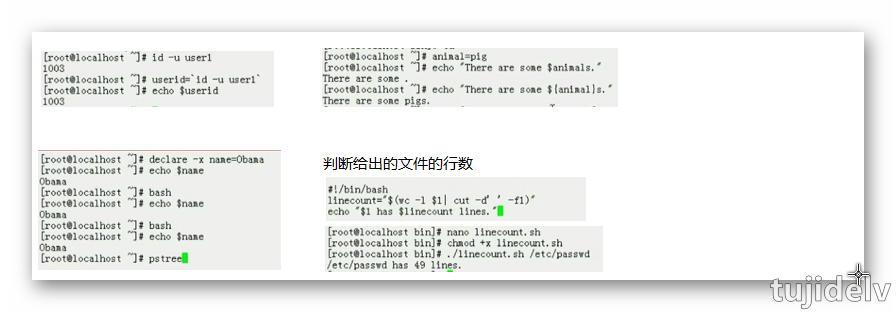
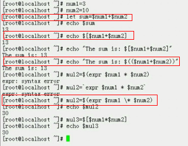
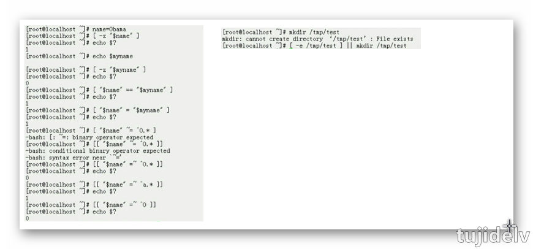
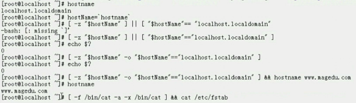

# Linux 札记：Shell 脚本

## 目录

- [简介](#简介)
- [正篇](#正篇)
- [参考链接](#参考链接)
- [结束语](#结束语)

## 简介

shell脚本编程笔记...

## 正篇

### 前言

- `shebang`
    ```
    #!/bin/bash
    #!/usr/bin/python
    #!/usr/bin/perl
    ```
- `运行脚本`
    ```
    1.给予执行权限,通过具体的文件路径指定文件执行	
        eg: ~]# ./first.sh
    2.直接运行解释器,将脚本作为解释器程序的参数运行
    ```
- `bash自定义退出状态码`
    ```
    exit [n]：
    	注：脚本中一旦遇到exit命令,脚本会立即终止;终止退出状态取决于exit命令后面的数字
    注：如果未给脚本指定退出状态码，整个脚本的退出状态码取决于脚本中执行的最后一条命令的状态码
    ```

### 变量

强类型：定义变量时必须指定类型，参与运算必须符合类型要求;调用未声明的变量会产生错误
弱类型：无需指定类型,默认均为字符型,参与运算会自动进行隐式转换;变量无须事先定义可直接调用

---
- `变量类型会决定数据存储格式,存储空间大小,参与运算种类`
    ```
    字符型：
    数值型：整型,浮点型
    ```
- `变量命名法则`
    ```
    1.不能使用程序中的保留字,如if,for等
    2.只能使用数字,字母及下划线,且不能以数字开头
    3.见名知义
    ```
- `只读变量`
    ```
    readonly name
    declare -r name
    ```
- `bash中变量种类`
    ```
    根据变量的生效范围等标准：
    	本地变量：生效范围为当前shell进程,对当前shell之外的其它shell进程,当前shell的子进程均无效	
    		变量赋值：name="value",将赋值符号后面的数据存储于变量名指向的内存空间
    			value：可以使用引用
    				1.可以是直接字串：name="username"	
    				2.变量引用：name="$username"
    				3.命令引用：name=`COMMAND`,name=$(COMMAND),命令执行的返回值	
    		变量引用：${name},$name
    			单引号：强引用，其中的变量引用不会被替换为变量值,而保持原字符串
    			双引号：弱引用，其中的变量引用会被替换为变量值
    		显示已定义的所有变量：
    			set
    		销毁变量：
    			unset name
    	环境变量：生效范围为当前shell进程及其子进程
    		变量声明\赋值：
    			export name=VALUE
    			declare -x name=VALUE
    		变量引用：同本地变量
    		显示所有环境变量：
    			export
    			env
    			printenv
    		销毁变量：同本地变量
    	局部变量：生效范围为当前shell进程中某代码片段(通常指函数)
    	位置变量：用于让脚本在脚本代码中调用通过命令行传递给它的参数
    		$1,$2,...：对应调用第1,第2等参数

    		$0：命令本身

    		$*：传递个脚本的所有参数(当做一个字符串)	
    		$@：传递个脚本的所有参数(多个字符串)
    		$#：传递个脚本的参数的个数
    	特殊变量：$?
    ```
    

### 运算符

- `逻辑运算符`
    ```
    短路与：&&
    短路或：||
    逻辑异或：^
    逻辑非：!
    ```
- `算数运算符`
    ```
    +,-,*,/,%,++,--,
    ----------
    实现算数运算：
    	1.let var=算数表达式
    	2.var=$[算数表达式]
    	3.var=$((算数表达式))	
    	4.var=$(expr arg1 arg2 arg3 ...)
    		乘法符号有些场景中需要转义
		
    	bash中有内建的随机数生成器：$RANDOM
    	    eg: ~]# echo $[$RANDOM%60+1]
    ```
    
- `赋值运算符`
    ```
    增强型赋值：+=,-=,*=,/=,%=,
    	let varOPERvalue
    		eg:let count+=1
    	自增：let var+=1 <==> let var++
    	自减：let var-=1 <==> let var--
    ```

### 条件测试

判断某需求是否满足,需要由测试机制来实现,专用的测试表达式需要由测试命令辅助完成测试过程.

---
- `测试命令`
    ```
    test EXPRESSION
    [ EXPRESSION ]
    [[ EXPRESSION ]]

    注：EXPRESSION前后必须有空白字符,否则语法错误
    ```
- `bash的测试类型`
    ```
    数值测试：
    	-gt：是否大于
    	-ge：是否大于等于
    	-eq：是否等于
    	-ne：是否不等于
    	-lt：是否小于
    	-le：是否小于等于
    字符串测试：
    	==：是否等于
    		也可以用=					
    	>：是否大于
    	<：是否小于
    	!=：是否不等于
    	=~：左侧字符串是否能够被右侧的PATTERN所匹配
    		此表达式一般用于[[  ]]中
    	-z "STRING"：测试字符串是否为空,空则为真,不空则为假
    	-n "STRING"：测试字符串是否为不空,不空则为真,空则为假
	
    	注：用于字符串比较时用到的操作数都应该使用引号
    文件测试：
    	存在性测试：
    		-a FILE
    		-e FILE：文件存在性测试，存在为真，否则为假
    	存在性及类别测试：
    		-b FILE：是否存在且为块设备文件
    		-c FILE：是否存在且为字符设备文件
    		-d FILE：是否存在且为目录文件
    		-f FILE：是否存在且为普通文件
    		-h/L FILE：是否存在且为符号链接文件
    		-p FILE：是否存在且为命名管道文件
    		-S FILE：是否存在且为套接字文件
    	文件权限测试：
    		-r FILE：是否存在且可读
    		-w FILE：是否存在且可写
    		-x FILE：是否存在且可执行
    	文件特殊权限测试：
    		-g FILE：是否存在且拥有sgid权限
    		-u FILE：是否存在且拥有suid权限
    		-k FILE：是否存在且拥有sticky权限
    	文件大小测试：
    		-s FILE：是否存在且非空
    	文件是否打开测试：
    		-t fd：fd表示文件描述符是否已经打开且与某终端相关	

    		-N FILE：文件自上一次被读取之后是否被修改过
    		-O FILE：当前有效用户是否为文件属主
    		-G FILE：当前有效用户是否为文件属组
    	双目测试：
    		FILE1 -ef FILE2：FILE1与FILE2是否指向同一个设备上的相同inode
    		FILE1 -nt FILE2：FILE1是否新于FILE2
    		    常用于备份中
    		FILE1 -ot FILE2：FILE1是否旧于FILE2
    		    常用于备份中
    ```
    
- `组合测试条件`
    ```
    逻辑运算：
    	第一种方式：
    		COMMAND1 && COMMAND2
    		COMMAND1 || COMMAND2
    		! COMMAND
    	第二种方式：必须使用测试命令进行
    		EXPRESSION1 -a EXPRESSION2
    		EXPRESSION1 -o EXPRESSION2
    		! EXPRESSION
    ```
    
    
### 流程控制语句

- `顺序执行`
- `选择执行`
    ```
    if 判断条件
    then 
        条件为真的分支代码
    fi
    ---------------------
    if 判断条件; then
        条件为真的分支代码
    else
        条件为假的分支代码
    fi
    ```
- `循环执行`

### 练习

- 写一个脚本,实现如下功能:如果user1用户存在,就显示其存在,否则添加之;显示添加的用户的id号等信息
    ```
    #!/bin/bash
    id user1 &> /dev/null && echo "user1 exists." || useradd user1
    id user1
    ```
- 写一个脚本,完成如下功能:如果root用户登录了当前系统,就显示root用户在线,否则说明其未登录
    ```
    #!/bin/bash
    w | grep '^root\>' &> /dev/null && echo "root logged." || echo "root not logged."
    ```
- 写一个脚本,计算/etc/passwd文件中的第10个用户和第20个用户的ID之和
    ```
    #!/bin/bash
    userid1=$(head -n 10 /etc/passwd | tail -n 1 | cut -d: -f3)
    userid2=$(head -n 20 /etc/passwd | tail -n 1 | cut -d: -f3)
    useridsum=$[$userid1+$userid2]
    echo "uid sum: $useridsum"
    ```
- 写一个脚本,传递两个文件路径作为参数给脚本,计算这两个文件中所有空白行之和
    ```
    #!/bin/bash
    spaceline1=$(grep '^[[:space:]]*$' $1 | wc -l)
    spaceline2=$(grep '^[[:space:]]*$' $2 | wc -l)
    echo "The sum of space line: $[$spaceline1+$spaceline2]"
    ```
- 写一个脚本,统计/etc,/var,/usr目录中共有多少个一级子目录和文件
    ```
    #!/bin/bash
    sumEtc=$(ls -l /etc | grep '^[dbclsp]' | wc -l)
    sumVar=$(ls -l /var | grep '^[dbclsp]' | wc -l)
    sumUsr=$(ls -l /usr | grep '^[dbclsp]' | wc -l)
    echo "The total count of files: $[${sumEtc}+${sumVar}+${sumUsr}] lines."
    ```
- 写一个脚本,接受一个文件路径作为参数,如果参数个数小于1,则提示用户"至少应该给一个参数",并立即退出;如果参数个数不小于1,则显示第一个参数所指向的文件中的空白行数
    ```
    #!/bin/bash
    [ "$#" -lt 1 ] && echo "The must one arg." && exit 20
    [ -e "$1" ] || { echo "No such file or directory" && exit 30;}
    echo "The blankspace is $(grep '^[[:space:]]*$' $1 | wc -l) lines."
    ```
---
- 写一个脚本
    ```bash
    #!/bin/bash
    #
    
    if [ $# -lt 1 ]; then
            echo "At least one argument."
            exit 1
    fi
    
    if id $1 &> /dev/null; then
            echo "$1 exists."
            exit 0
    else
            useradd $1
            [ $? -eq 0 ] && echo "$1" | passwd --stdin $1 &> /dev/null && exit 0 || exit 2
    fi
    ```

## 参考链接

## 结束语

- 未完待续...