# SSR 搭建：基础

## 目录

- [简介](#简介)
- [SSR 的历史](#SSR的历史)
- [SSR 的相关实现原理](#SSR的相关实现原理)
- [VPS 的科普](#VPS的科普)
- [VPS 的购买及使用](#VPS的购买及使用)
- [参考链接](#参考链接)
- [结束语](#结束语)

## 简介

- 在科学上网之前先大概了解一下番茄的相关知识。
- 维基百科：
    >Shadowsocks可以指：一种基于Socks5代理方式的加密传输协议，也可以指实现这个协议的各种开发包。目前包使用Python、C、C++、C#、Go语言等编程语言开发，大部分主要实现（iOS平台的除外）采用Apache许可证、GPL、MIT许可证等多种自由软件许可协议开放源代码。Shadowsocks分为服务器端和客户端，在使用之前，需要先将服务器端部署到服务器上面，然后通过客户端连接并创建本地代理。

    >在中国大陆，本工具也被广泛用于突破防火长城（GFW），以浏览被封锁、遮蔽或干扰的内容。
    
## SSR的历史

1. 2012 年 4 月 20 日，[clowwindy](https://twitter.com/clowwindy) 因为兴趣而制作了 `Shadowsocks` 项目，并于 Github 上开源 SS。
2. 2015 年 8 月 22 日，`Shadowsocks` 原作者 `Clowwindy` 被“相关部门”约谈喝茶，被迫宣布停止维护此计划（项目）并删除 Github 的源码及相关文档。
    - 应网友要求，另一个开发者把 v2.5.8 的一些严重 BUG 修复了更新为 v3.0，然后宣布不再管了。
    - 8月25日，另一个用于突破网络审查的 [GoAgent](https://zh.wikipedia.org/wiki/GoAgent) 项目也被作者自行删除。
3. 尽管如此，Git 仓库的日志显示该项目被移除以前就有大量的复刻副本，所以事实上并未停止维护，而是转由其他贡献者们持续维护中。
    - 因此，后续版本多种多样，而 SSR 只是较为普遍的一种。SS 以及后续的 SSR 均统一采用纸飞机的图样。
4. 其中由 `@breakwa11`([破娃酱](https://twitter.com/breakwa11)) 发起的 `ShadowsocksR` 项目就是 SS 的一个后续版本分支。
    - 在 SS 的基础上增加了一些数据混淆方式，称修复了部分安全问题并可以提高 QoS 优先级。后来贡献者 Librehat 也为 SS 补上了一些此类特性，甚至增加了类似 Tor 的可插拔传输层功能。
5. SSR 开始时曾有过违反 GPL、发放二进制时不发放源码的争议，不过后来 SSR 项目由 `breakwa11`转为了与 SS 相同的 GPL、Apache 许可证、MIT 许可证等多重自由软件许可协议。
6. 2017 年 7 月 19 日，SSR 作者 `breakwa11`在 Telegram 频道 `ShadowsocksR news` 里转发了深圳市启用 SS 协议检测并被大量用户转发，引发恐慌。
7. 2017 年 7 月 24 日，`breakwa11` 发布了闭源的 SS 被动检测程序，引发争议。
8. 2017 年 7 月 27 日，`breakwa11` 删除 GitHub 上的所有代码、解散相关交流群组，停止 SSR 项目。
    - `breakwa11` 遭到自称 "ESU.TV" 的不明身份人士人身攻击，对方宣称如果不停止开发并阻止用户讨论此事件将发布更多包含个人隐私的资料。
    - 随后 `breakwa11` 表示遭到对方人肉搜索并公开个人资料的是无关人士，为了防止对方继续伤害无关人士，才停止该项目。
9. 但项目已被多人 fork。并有人在其基础上继续发布新的版本，例如 [SSRR](https://github.com/shadowsocksrr/shadowsocksr-csharp)。

## SSR的相关实现原理

### 大概原理

- 天朝局域网通过 [GFW](https://zh.wikipedia.org/wiki/%E9%98%B2%E7%81%AB%E9%95%BF%E5%9F%8E) 隔离了我们与外界的交流，当然，这个隔离并非完全隔离，而是选择性的，天朝不希望你上的网站就直接阻断。
- 每一个网络请求都是有数据特征的，不同的协议具备不同的特征，比如 HTTP/HTTPS 这类请求，会很明确地告诉 GFW 它们要请求哪个域名；再比如 TCP 请求，它只会告诉 GFW 它们要请求哪个 IP。
- `GFW` 封锁包含多种方式，最容易操作也是最基础的方式便是域名黑白名单，在黑名单内的域名不让通过，IP 黑白名单也是这个道理。
- 如果你有一台国外服务器不在 `GFW` 的黑名单内，天朝局域网的机器就可以跟这一台机器通讯。
- 那么一个番茄的方案就出来了：境内设备与境外机器通讯，境内想看什么网页，就告诉境外的机器，让境外机器代理抓取，然后送回来，我们要做的就是保证境内设备与境外设备通讯时不被 GFW 怀疑和窃听。

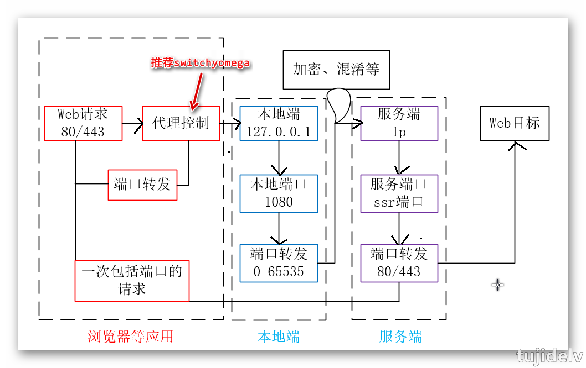

### 必备简易命令，查错方法

1. 以下命令用于查找本地 1080 端口所有 TCP 通信，可以看到相关端口转发与应用程序 PID 号
    ```
    netstat -aon|findstr "1080"
    ```
2. 利用 PID 号，可以定位到相关应用程序，可以在任务管理器中查找
3. 下面通过 PID 号查找相关 TCP 信息
    ```
    netstat -aon|findstr "16656"
    netstat -aon|findstr "25556"
    ```

### 时下流行的几款番茄软件端口介绍

- 使用软件过程中，我们所关心的就是本地端的配置，服务端要不是自己搭建，要么别人已经建好。
- 本地端最重要的就是协议，地址，端口。除去网页代理器等，不需要软件直接 FQ 的，地址往往是 127.0.0.1，代理协议目前常用的就是 HTTP/HTTPs 以及 Socks5，本地端口介绍如下
   ```
   SS,SSR：1080
   GAE 类(例如 XX-NET)：8087
   神风：8887
   2 系列灯：8787
   3、4系列灯：灯设置页面查看
   Tor：9050 是 TorBrowser的，9150 是外部浏览器调用的端口
   ```
- 任何软件，如果你不知道端口，都可以通过 PID 号定位到本地端口，供 `switchyomega` 调用！

## VPS的科普

### VPS 的作用

- 维基百科：
    >虚拟专用服务器（英语：Virtual private server，缩写为 VPS），是将一台服务器分割成多个虚拟专享服务器的服务。实现VPS的技术分为容器技术和虚拟机技术 。
    在容器或虚拟机中，每个VPS都可分配独立公网IP地址、独立操作系统、实现不同VPS间磁盘空间、内存、CPU资源、进程和系统配置的隔离，为用户和应用程序模拟出“独占”使用计算资源的体验。
    VPS可以像独立服务器一样，重装操作系统，安装程序，单独重启服务器。
    VPS为用户提供了管理配置的自由，可用于企业虚拟化，也可以用于IDC资源租用。IDC资源租用，由VPS提供商提供。
    不同VPS提供商所使用的硬件VPS软件的差异，及销售策略的不同，VPS的使用体验也有较大差异。尤其是VPS提供商超卖，导致实体服务器超负荷时，VPS性能将受到极大影响。
    相对来说，容器技术比虚拟机技术硬件使用效率更高，更易于超卖，所以一般来说容器VPS的价格都高于虚拟机VPS的价格。这些VPS主机以最大化的效率共享硬件、软件许可证以及管理资源。
    每个VPS主机都可分配独立公网IP地址、独立操作系统、独立超大空间、独立内存、独立CPU资源、独立执行程序和独立系统配置等。
    VPS主机用户可在服务器上自行安装程序，单独重启主机。
- 简单的说，VPS 相当于一台微型电脑。 购买之后，相当于你在远程（国内，海外，甚至远在美国）可以使用一台电脑作为服务器。
- 而通过这台服务器，你可以做很多很多事情。SSR 只是【搭梯子】的一种方式；而【搭梯子】也只是 VPS 的用途之一。
    ```
    1.搭建一个Seafile服务器，你将拥有一个属于自己的Dropbox（多平台同步、版本管理……）+ 在线协作平台，（在线编辑、评论、Wiki、消息……） 也就是搭建同步网盘。
    2.贡献出VPS的计算资源帮助世界抗击儿童癌症、搜寻外星文明（SETI）、寻找梅森素数（GIMPS）等等，或许还能赢取十万美元。
    3.可以搭建一个邮局。
    4.可以挂上国外的挂机软件赚钱。
    5.可以用来建网站。VPS是用来存放数据的，简单的说，网站是由“域名+主机”组成。买了VPS，可以存放数据，如果注册了域名，这个网站就可以访问了。
    6.搭建私服。
    7.存放电影资源，想看电影的时候打开即可。VPS都有硬盘资源的，购买的时候会有明确的标示。
    8.免流。所谓【免流】，就是“流量免费”。我们用手机上网的时候，服务商（比如移动）会收取流量费，但有些场景不会收取，比如访问移动10086的网页，这个和给10086发短信免费是一样的，有可能不收取，但不一定。这时候，通过VPS，通过酸酸乳特有的【混淆插件】，将自己访问的数据，伪装成访问服务商的网站，那么服务商会认为你只是访问服务商，而不收取流量费。说白了，就是上网不要钱。 然而，这是不妥的行为，不赞成这样的操作。
    9.搭建私人聊天室。搭建在线聊天室，实现多人聊天等等。 
    总之，VPS可以做的事情很多。而酸酸乳，只是其中一种应用方式。
    ```
    
### VPS 的架构

- 现在的 VPS 多数的架构是 openVZ 和 KVM；当然，还有不分 xen 的，但逐渐减少慢慢消失。
    - 同等情况下，同等价格之下最好选择是KVM。因为KVM 架构可以更方便的使用加速服务和减少超售(带水分)现象。
- 识别 KVM 和 openVZ
    ```
    除了服务商标注的KVM或openVZ之外，亦可通过登陆主机执行命令识别
    ----------------------------------
    1.执行：ls /proc/
        通过系统上的相关目录或文件判断,一般Xen的VPS，/proc目录下面会有xen的目录，openvz的会有vz目录。
    2.执行：free -m 
        看内存，openvz的没有swap，当然也有xen的没有swap，但是xen的是的，openvz不行。
    3.执行：uname -a
        有些xen的VPS里面会显示有xen。
    4.执行：ifconfig
        查看网卡，openvz的一般都是venet0，xen的一般都是eth。
    ```
    
### VPS 的线路选择

- 使用 ping 命令查看延迟时间
    ```
    例如ping hnd-jp-ping.vultr.com
    这是vultr日本数据节点的测试结果，稳定100ms；这是大致的结果，其可靠性并不强。
    ```
- 多地 ping
    ```
    所谓多地ping，也就是位于各地范围之内，对该主机进行ping，这样获得更为普遍的数值。
    注：如果多地ping都超时，无疑，IP就GG了。全国都连不上了，还不GG？ 近些日子，jp的服务器就有不少挂掉的，连接全部超时，墙高了。
    参考网址：http://ping.chinaz.com
    ```
- 文件下载测试
    ```
    我们也可通过下载文件来测试连接速度。各种VPS评测网站非常多，而VPS的主机节点，都会公开展示，很容易就可以找到。
    ```
- 路由追踪
    ```
    路由追踪是一款实用工具，可以通过地图的形式，展现数据到VPS之间传输的节点。 
    地址：http://www.webkaka.com/Tracert.aspx（在线路由追踪）、http://www.ipip.net/download.html#ip_trace（本地追踪软件）、https://www.ipip.net/traceroute.php
    同等情况下，直达定然优于绕道。 节点越多越麻烦，节点越少，当然也就越有利。
    ```
    ```
    此外还有专门的路由测试软件，请前往下载Best trace软件，下载完成后安装。
        https://www.ipip.net/product/client.html
    然后打开软件，点击右侧的路由跟踪按钮，打开路由跟踪界面，输入vps的ip，点击开始，就可以得到vps与你本地的路线走向图了。
    ```
    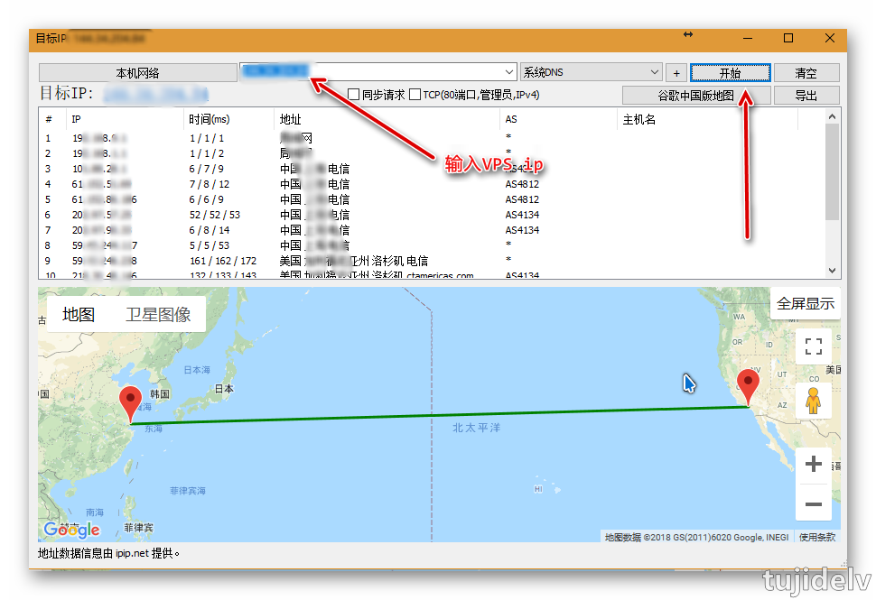
    
### 地域总结

```
中国大陆首选的境外VPS，速度上，
    1.港澳台是首选（毕竟最近）但是，港澳台的VPS比较贵！香港的VPS很多带宽非常小，1M带宽... ping数值100以内。 
    2.日本、新加坡是主流。ping数值100-150以内。但是近期，日本、新加坡VPS封锁特别严重。
    3.中规中矩的还有美国的服务器。ping数值在150--200之间。有直达的中美海底光缆，速度上稍弱于日本（距离上就看得出来），但还算可以，尤其是CN2等专线的建设。
    4.不考虑非洲或者其他地区，再看一下欧洲VPS。
```
```
事实上，如果是简单的搭个梯子，即便ping的数值是300ms，实际上看Youtube视频，其连接速度也可以达到6K附近。如果是200ms，10k以上是毫无问题的。 
因此，购买VPS之后搭建SSR的话，YouTube视频的1080p高清，根本不是问题。除非你的主机响应远远超过350ms服务器远在地球之外了。
除了以上由本地或多地ping主机之外，也可以进行【回测】：也就是购买了主机之后，从主机端ping回到我们的本地。 通常我们搭个梯子啥的，更重要的是回程，所以这更具有参考性。
```

## VPS的购买及使用

### BandwagonHost VPS

1. 选择对应且需要的VPS方案
    - [官网](https://bwh8.net/)
    - [搬瓦工VPS中文网](http://banwagong.cn/)
    - 即便我们购买低配置方案之后，以后也可以升级到其他方案的。
2. 核对方案配置以及选择时间期限和机房
    - 核对我们选择方案的价格，没有问题后点击CHECKOUT结账。
    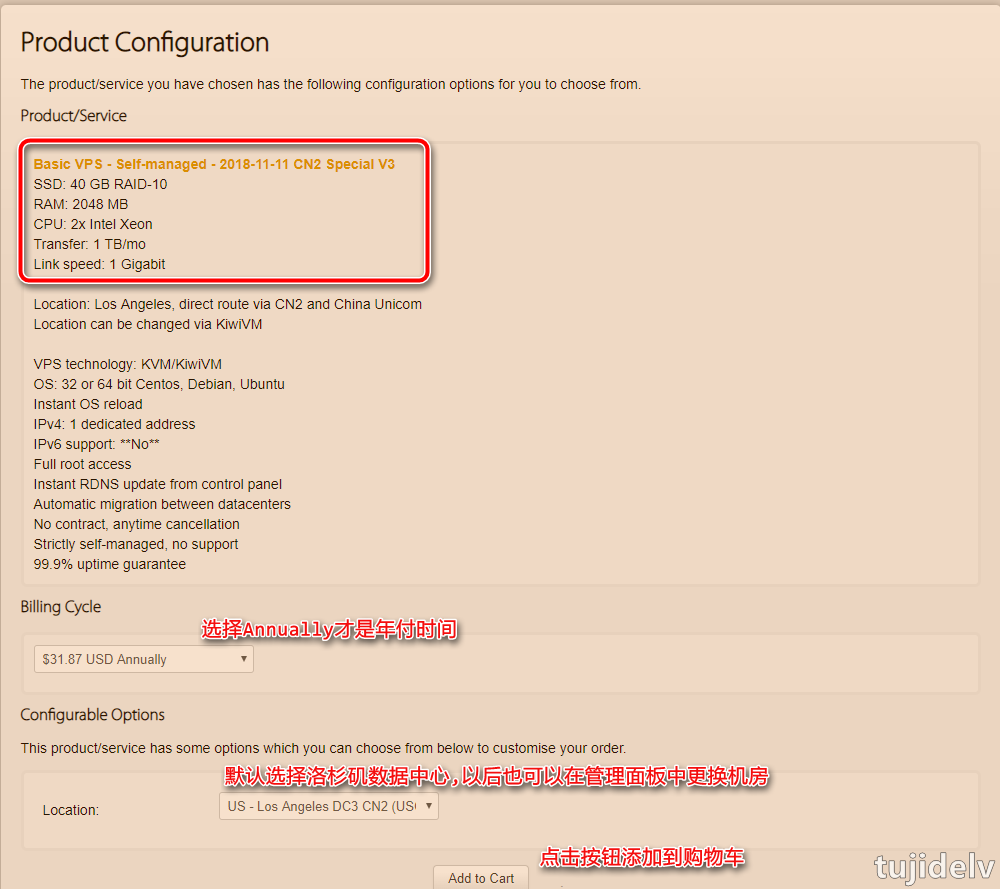
    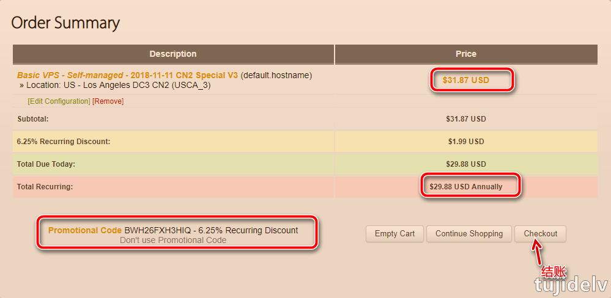
3. 登录或者新注册搬瓦工账户
    - 如果我们有过账户，可以直接点击"Click here to login"登录以及付款就可以，如果还没有账户则需要注册账户。
    - 个人信息不要真实的，但也不能太离谱和乱写字符出来，好歹也要稍微用点拼音。
    - 我们不能用代理IP登录注册账户，国家需要真实，不要乱选择。
    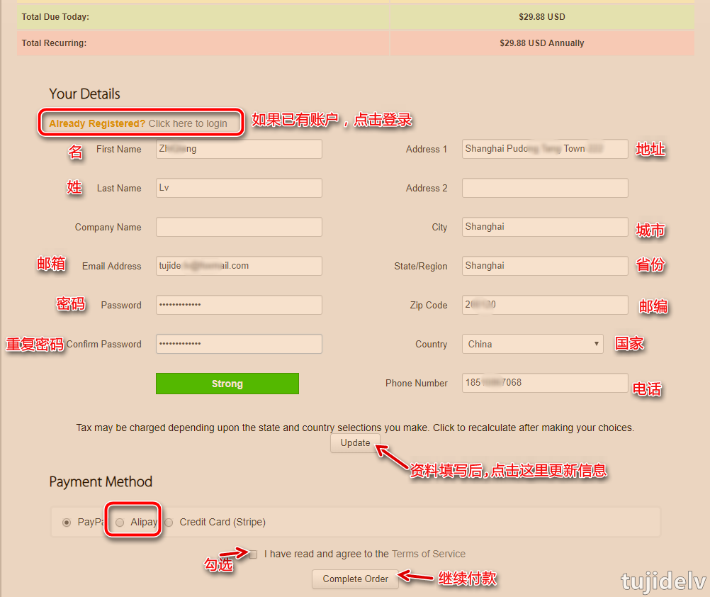
4. 付款成功以及使用
    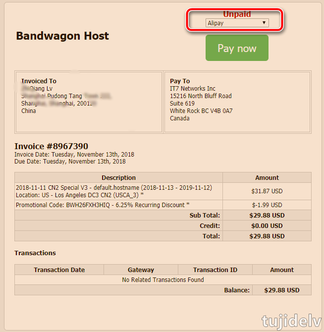
    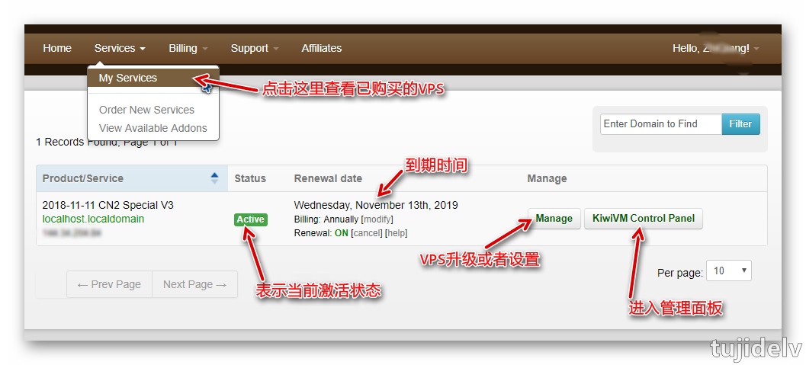
    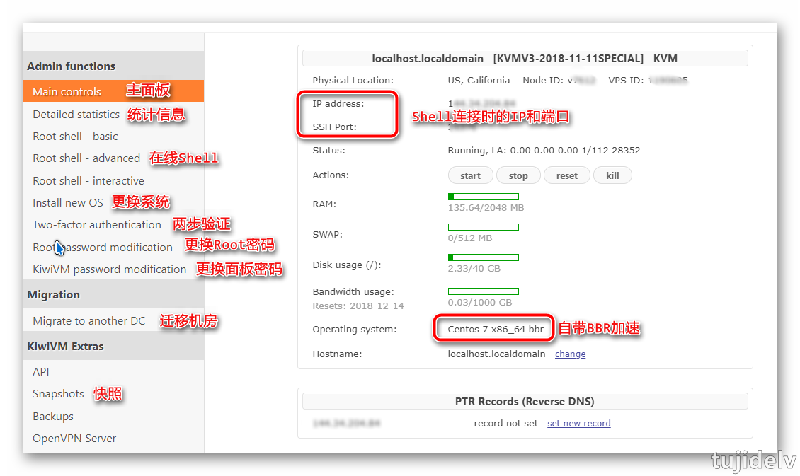
5. 申请退款政策和方法
    - 申请退款需要账户注册 30 天之内，不是 VPS 主机 30 天内，如果我们是老账户是不支持退款的。
    - 申请地址：<https://bwh8.net/refund.php>
    
### 检查搬瓦工 IP/端口是否被封

- 方法1
    1. 打开端口扫描工具 <http://tool.chinaz.com/port/>
    2. 输入 VPS 的 IP 和 SSH 端口号并点击 `开始扫描` 进行扫描
        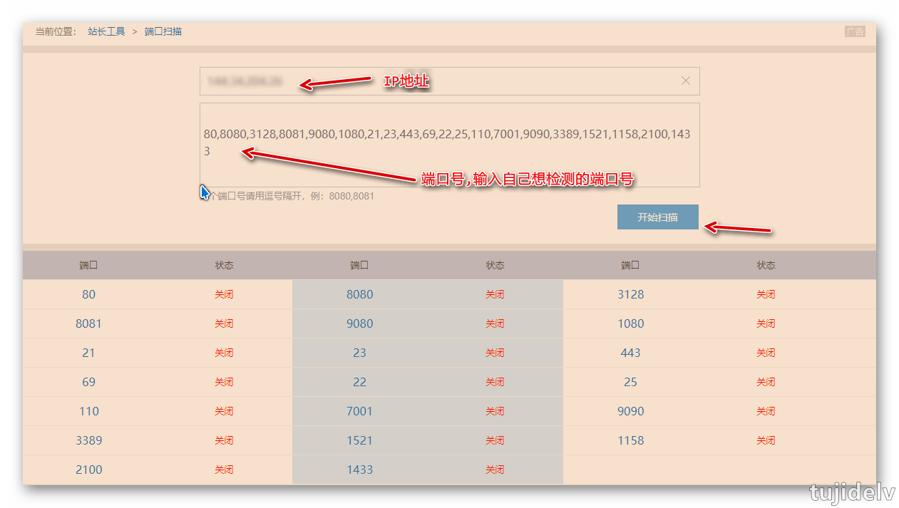
    3. 一般来说，如果被封了，会显示端口是关闭状态。如果没被封，那么这里显示的都是打开状态，恭喜，你的 IP 一切正常。
    4. 然后找一个国外的提供类似测试的网站例如 <https://www.yougetsignal.com/tools/open-ports/>
    5. 输入 VPS 的 IP 和 SSH 端口号并点击 `Check` 进行检查
        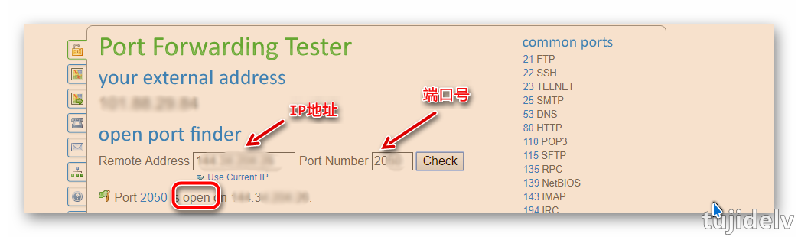
    6. 如果此时显示端口是 `open` 的，那么你的 IP 地址就是被封了。如果这时候也显示 `closed`，那么你可能还有救，尝试一下重启或者重装 VPS 吧。
- 方法2
    1. 首先登陆我们被封了 IP 的 VPS 的 KiwiVM 面板
    2. 登陆之后，打开 <https://kiwivm.64clouds.com/main-exec.php?mode=blacklistcheck>
    3. 打开之后，点击 `Test Main IP` 进行测试，会检查你的 IP 地址是否已经被封
        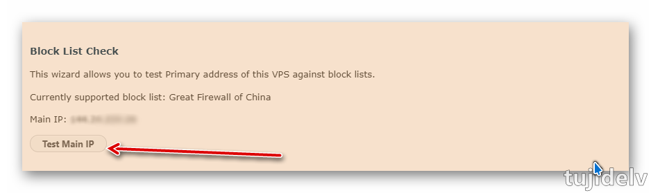
    4. 如果没有被封，会显示 `IP NOT BLOCKED`，如果被封了，会红色加粗显示`IP BLOCKED`。这时候我们只需点击下面的 `Replace Main IP`，进行更换 IP 的操作。
        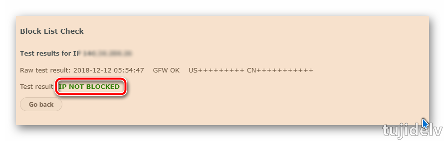

### 搬瓦工 IP/端口被封的原因及解决办法

大部分原因都是因为我们用户在使用过程中不应该有的项目和用途导致的。再次提醒，我们使用任何 VPS、服务器都要正规使用。

- 方法1：购买新服务器
    - 我们在选择搬瓦工 VPS 主机的时候，如果自己知道可能导致 IP 被封，建议还是选择月付。
- 方法2：购买新的 IP
    - 可以重新购买一个新的 IP 地址替换已有老服务器中的自带 IP 地址(包括被封的 IP 地址)，目前是 `8.7$` 一个 IP 地址。
    - 购买新 IP 地址：<https://bwh8.net/ipchange.php>
- 方法3：免费更换 IP
    - 可以参考 `检查搬瓦工 IP/端口是否被封` 方法 2，现在是每 10 周免费更换一次。
    - 如果符合要求(例如被封了)的就可以更换，不符合要求(例如正常的 IP)的会告知是什么问题。如果没有到时间更换，也会提示出来。


## 参考链接

## 结束语

- 未完待续...