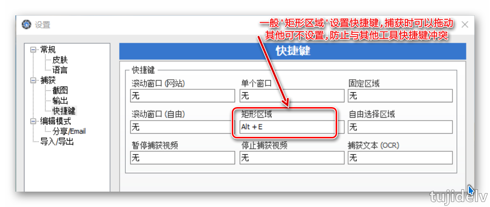
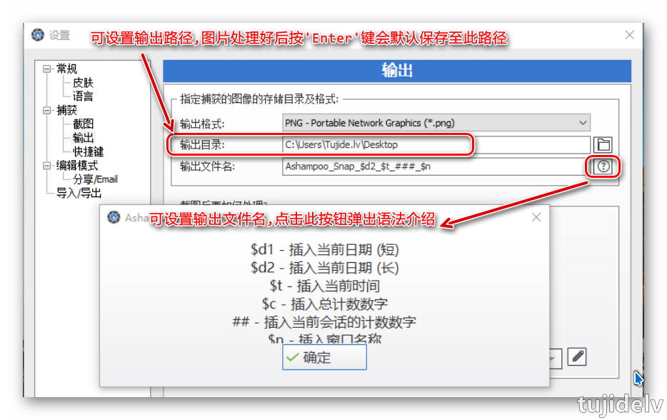
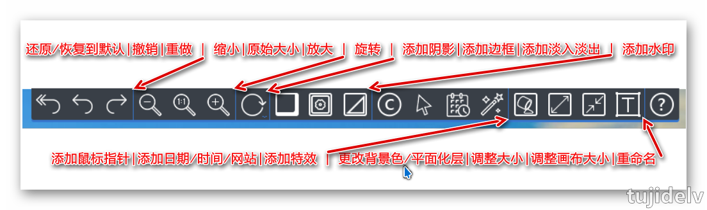
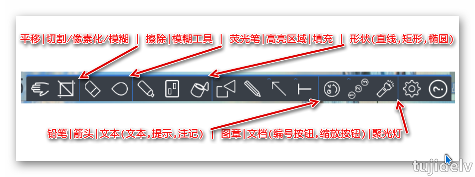
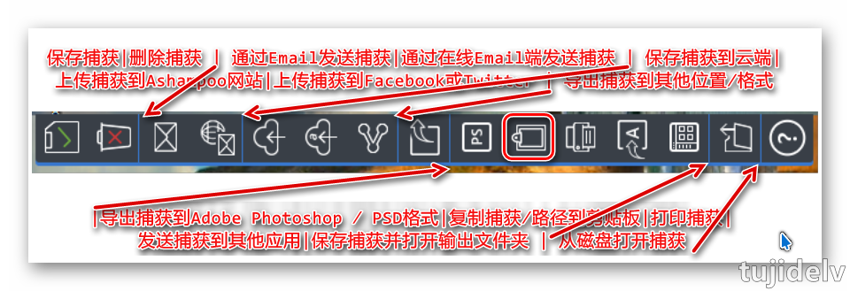

# 阿香婆屏幕截图工具 Ashampoo Snap

## 目录

- [简介](#简介)
- [使用方法](#使用方法)
- [参考链接](#参考链接)
- [结束语](#结束语)

## 简介

- 说明
    - Ashampoo Snap 是德国 Ashampoo 软件公司的专业截图工具，只要屏幕上见到的使用它都能为您抓取并保存为高质量图片或视频。功能齐全，操作简单，界面优秀！。
- 下载
    - Windows 版：[网盘下载](https://pan.baidu.com/s/1G3bkWzUFXa7-RHnWhTo6cA) `提取码hm2g`
- 安装
    - 默认安装即可，最好改下安装路径。
- 主要特性
    - 灵活精确的截图
        >像素级精度的截图。无论是整个屏幕，单个网页或是一个区域 - Snap 都能截取出来生成图片或视频。还有定时器，自动滚动以及智能文本识别，为您提供无限可能。只需点击一下或是按下快捷键，Snap 10 就会立即开始进行截图工作！ 
    - 一图胜千言
        >使用 Snap 10 您可以与他人更快捷的分享信息。添加箭头、图形，自动标号，还有许多其它选项，让您的图片表意更加清晰。免去大段大段枯燥的描述，节省时间和精力！有图有真相 - 快捷、轻松，直击要害。
    - 创建自己的实时视频 
        >实时编辑视频，添加文本、画上图像、语音叙述。现在可以直接进行后期处理了！在视频中可以可视化显示鼠标点击和键盘按下动作 - 这是制作教学视频的利器。如果需要保护知识产权，别忘了试试新的视频水印功能。
    - 匹配任意数量显示器
        >同时使用个多显示器时，您可能会面临一大堆的屏幕分辨率和 DPI 设置问题。Snap 可以自动适应您的显示设置，完美兼容任何显示模式！
    - 完美获取网站内容
        >Snap 10 不仅能截取网站图像，还能在图片上或是元数据中附加上源页面的信息。Snap 让一切都井井有条。如果您需要分享图片，Snap 可以自动添加图片链接。如果您希望捕获整个网站，或是光文本，甚至一次捕获是多个窗口。Ashampoo Snap 10 都能搞定！
    - 视频编辑，制作最完美的影片
        >即使是已经很漂亮的视频也有不少调整空间：裁剪掉无用的场景，删除广告，或是分割视频成一个个片段。有了 Ashampoo Snap 10，您无再需要安装其它软件。设计精巧的编辑器帮您提取出视频中的重点和亮点部分。还可以附加其它视频，导出珍贵场景保存为 GIF 动画！
    - 安全的发送或上传到云端
        >想要随时随地查看您的图片？Ashampoo Snap 10 可以做到：用邮件发送图片，保存到 Ashampoo 网络空间，或是上传到各个云服务（(DropBox、Microsoft OneDrive、Google Drive）。如有必要，可以在邮寄或上传前进行优化，缩小大小。
        
## 使用方法

- 准备工作
    - 控制此程序  
          
    - 常用设置
          
          
 - 主界面
    - 顶部
          
    - 左部
          
    - 右部
          
## 参考链接

## 结束语

- 未完待续...