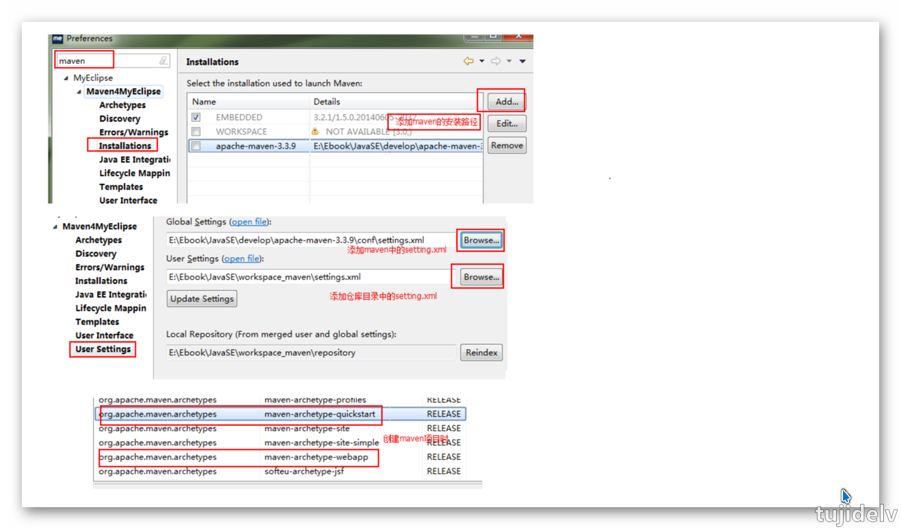

# Eclipse 札记

## 目录

- [简介](#简介)
- [Git 的使用](#Git的使用)
- [参考链接](#参考链接)
- [结束语](#结束语)

## 简介

- 记录 Eclipse 的 常用操作

## Git的使用
- 新建工程初始化为本地库(以 Maven 工程为例)
    ```
    1. Maven工程右键->'Java Tools'->'Generate Deployment Descriptor Stub',来生成web.xml文件
    2. Maven工程右键->'Team'->'Share Project...',选择Git,勾选'Use or create repository in...',选中目标Project后点击'Create Repository'
    3. 在'Preferences'->'Team'->'Git'->'Configuration'中,'Repository Settings'选项卡能够检测到当前工作空间中的git项目
        当前项目本地库配置也可在此配置,例如签名等等
    4. 在'Preferences'->'Team'->'Git'->'Label Decorations'中,能看到各个Git图标的介绍
    ```
- 忽略 Eclipse 特定文件
    ```
    1. .classpath文件,.project文件,.settings目录下所有文件都是Eclipse为了管理我们创建的工程而维护的文件，和开发的代码没有直接关系。最好不要在Git中进行追踪，也就是把它们忽略
        因为同一个团队中很难保证大家使用相同的IDE工具，而IDE工具不同时，相关工程特定文件就有可能不同。如果这些文件加入版本控制，那么开发时很可能需要为了这些文件解决冲突。
    2. 去GitHub官网(https://github.com/github/gitignore)下载样例文件,并在本地编辑该配置文件，文件名任意
        末尾添加.classpath,.project,.settings,target等文件和目录
    3. 在~/.gitconfig文件中引入上述文件 ,注意这里路径中一定要使用“/”，不能使用“\”
        [core]
            excludesfile=C:/Users/Lenovo/Java.gitignore
    4. 在'Preferences'->'Team'->'Git'->'Configuration'中,'User Settings'选项卡中能看到
    ```
- 提交到本地库
    ```
    1. Maven工程右键->'Team'->'Add to index',项目文件都被加入暂存区追踪,也可以通过Ctrl+#打开'Git Stating'窗口来操作指定文件加入暂存区追踪
        已经被追踪过的文件,再次修改,不会进入'Unstaged Changes'中,会进入'Staged Changes'
    2. Maven工程右键->'Team'->'Commit...',快捷键Ctrl+#(Ctrl+Shift+3),填写相关信息,提交到本地库
    ```
- 推送到远程库(以 GitHub 为例)
    ```
    1. Maven工程右键->'Team'->'Remote'-'Push...'>,填写相关信息提交
        填写URI(远程库地址),用户名,密码后next
        点击'Add All Branches Spec'来检测所有分支,next	
        填写相关日志信息,finish
    2. 弹出'Push Results...'窗口代表推送成功
    ```
- 从远程库克隆到本地(以 Oxygen 版本为例)
    ```
    1. 右键'Import...',选择'Git'->'Projects from Git',next后选择'Clone URI'
        填写URI(远程库地址),用户名,密码后,next选择分支
        指定工程的保存位置(Kepler等低版本Eclipse不能保存到当前Eclipse工作空间,需保存到工作空间以外的目录中)
        指定工程导入方式，这里只能用：Import as general project,目录下会多出.project文件
    2. 转换工程类型为Maven
        工程右键'Configure'->'Convert to Maven Project',目录下会多出.classpath文件和.settings目录
    ```
- 解决冲突
    ```
    1. 提交各自的修改至本地库后,然后试着推送到远程库,可能会出现冲突	
        Maven工程右键->'Team'->'Push Branch master'
    2. 当弹出窗口提示冲突时,可执行拉取操作,解决冲突后Ctrl+#提交到本地库,最后推送到远程库
        Maven工程右键->'Team'->'Pull'
        冲突文件右键->'Team'->'Merge Tool'
    ```
- GitFlow 分支实战(以 hot_fix 为例)
    ```
    1. 创建分支		
        工程右键'Team'->'Switch To'->'New Branch...',输入分支名hot_fix,依次提交到本地库和远程库(Push Branch hot_fix)
    2. 切换分支审查代码
        Maven工程右键->'Team'->'Pull'
        工程右键'Team'->'Switch To'->'Other...',选择'Remote Tracking'->'origin/hot_fix'
    3. 检出远程新分支
        选择'Check out as New Local Branch',检出为本地的一个新的分支
    4. 切换回master
        工程右键'Team'->'Switch To'->'master
    5. 合并分支
        工程右键'Team'->'Merge...',选择'Local'->'hot_fix',合并成功后把master推送到远程库
	```
	
## Maven的使用

 
    
## 参考链接

## 结束语

- 未完待续...
