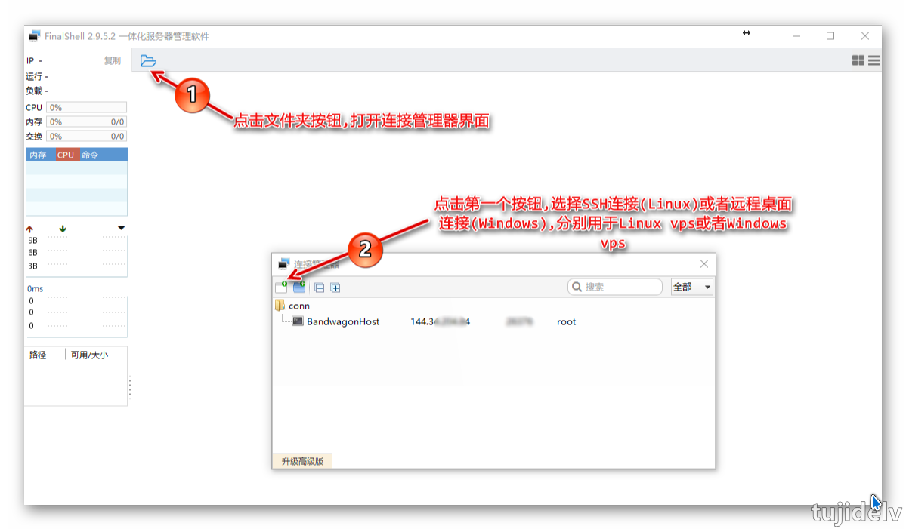
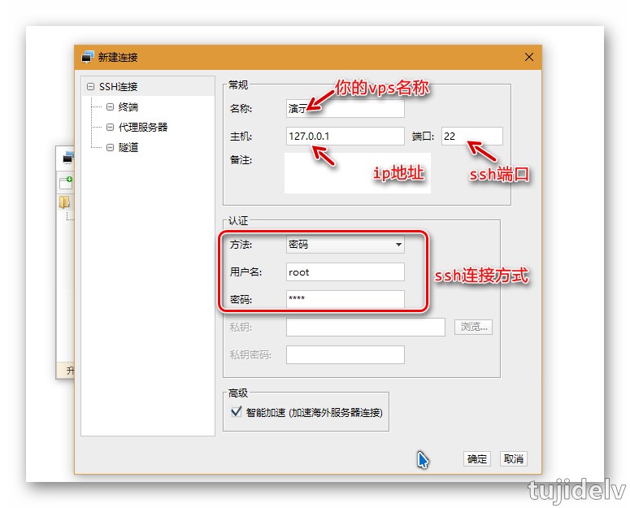
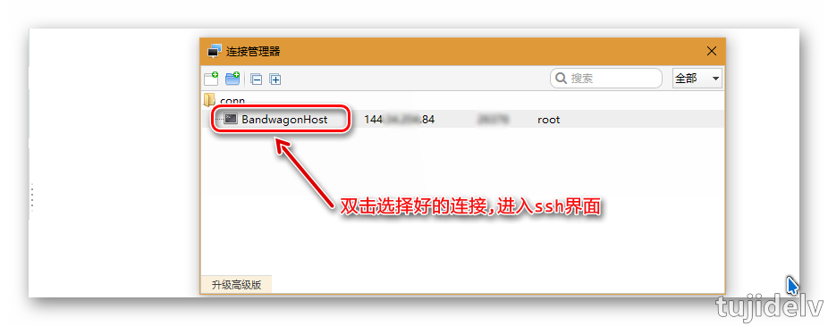
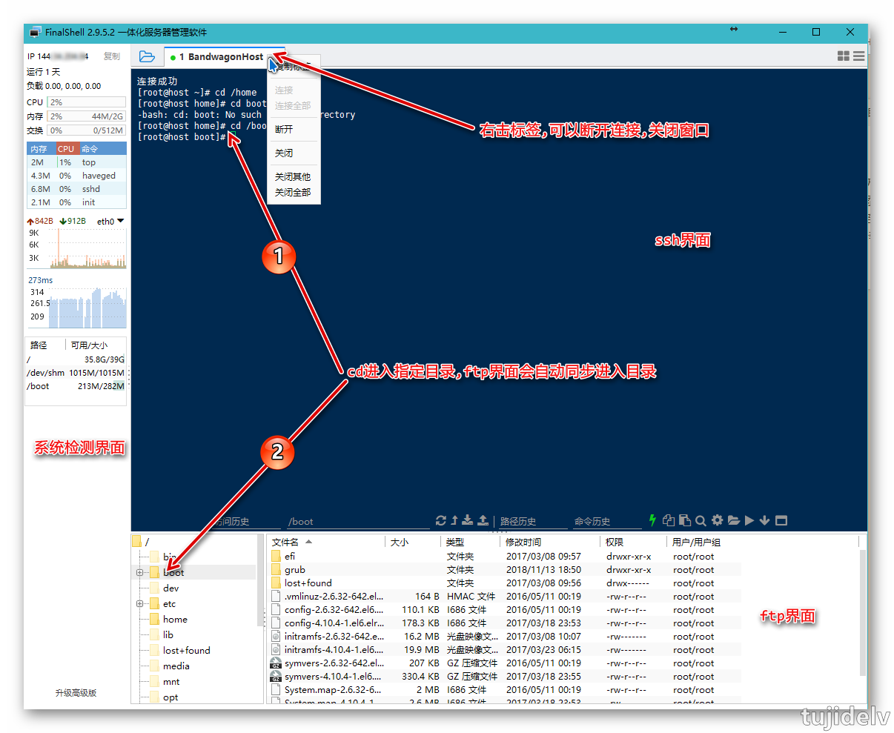

# 超强SSH客户端 FinalShell

## 目录

- [简介](#简介)
- [使用方法](#使用方法)
- [参考链接](#参考链接)
- [结束语](#结束语)

## 简介

- 说明
    - FinalShell 是一款集成 ssh 连接、ftp 管理、系统监控的软件，甚至提供了免费海外服务器远程桌面加速、ssh 加速、双边 tcp 加速、内网穿透等功能。
- 下载
    - Windows 版：[网盘下载](https://pan.baidu.com/s/1eZ3lsrCDZcd02nnJ4F2PBA) `提取码w17p`
    - Mac 版,Linux 版：[FinalShell Mac OS版,Linux版安装及教程](http://www.hostbuf.com/t/1059.html)
- 安装
    - 默认安装即可，最好改下安装路径。
    - 中途会安装 winpcap(windows packet capture)，是 windows 平台下一个免费、公共的网络访问系统。 
- 主要特性
    >1.多平台支持 Windows,Mac OS X,Linux.  
    2.多标签,批量服务器管理.  
    3.支持登录 Ssh 和 Windows 远程桌面.  
    4.漂亮的平滑字体显示,内置 100 多个配色方案.  
    5.终端,sftp 同屏显示,同步切换目录.  
    6.命令自动提示,智能匹配,输入更快捷,方便.  
    7.sftp 支持,通过各种优化技术,加载更快,切换,打开目录无需等待.  
    8.服务器网络,性能实时监控,无需安装服务器插件.  
    9.内置海外服务器加速,加速远程桌面和 ssh 连接,操作流畅无卡顿.  
    10.双边加速功能,大幅度提高访问服务器速度.  
    11.内存,Cpu 性能监控,Ping 延迟丢包,Trace 路由监控.  
    12.实时硬盘监控.  
    13.进程管理器.  
    14.快捷命令面板,可同时显示数十个命令.  
    15.内置文本编辑器,支持语法高亮,代码折叠,搜索,替换.  
    16.ssh 和远程桌面均支持代理服务器.  
    17.打包传输,自动压缩解压.  
    18.免费内网穿透,无需设置路由器,无需公网 ip.  
    19.支持 rz,sz(zmodem).
    
## 使用方法

- ssh 添加

- vps 连接

## 参考链接

## 结束语

- 未完待续...