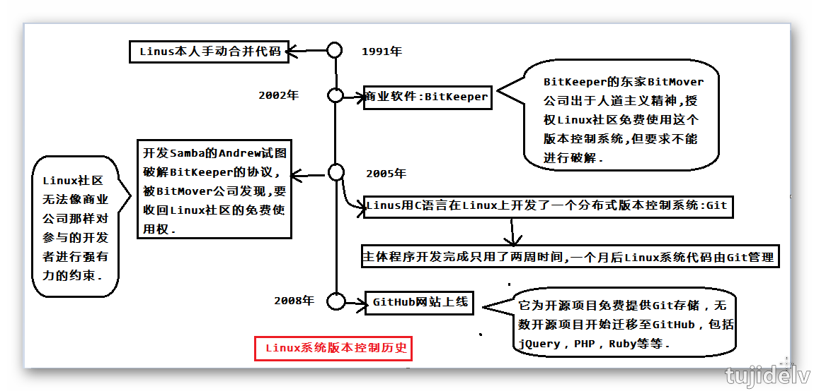
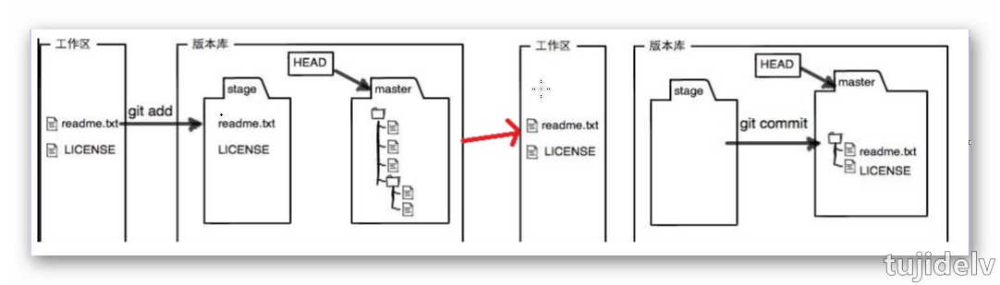
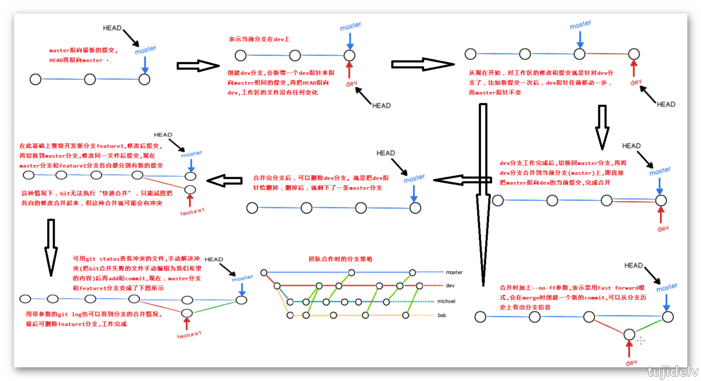

# Git 札记：基础

## 目录

- [简介](#简介)
- [发展历史](#发展历史)
- [准备工作](#准备工作)
- [add/commit 内部原理](#内部原理)
- [本地库常用操作](#本地库常用操作)
- [分支管理](#分支管理)
- [标签管理](#标签管理)
- [自定义 Git](#自定义Git)
- [参考链接](#参考链接)
- [结束语](#结束语)

## 简介

- ### 版本控制系统
    - 集中式
        - 免费：CVS(由于自身设计的问题，会造成提交文件不完整，版本库莫名其妙损坏的情况),SVN(修正了CVS的一些稳定性问题)
        - 收费：ClearCase(以前是 Rational 公司的，被 IBM 收购了,特点是安装比 Windows 还大，运行比蜗牛还慢，能用 ClearCase 的一般是世界 500 强，他们有个共同的特点是财大气粗，或者人傻钱多)
    - 分布式
        - 免费：Git(目前世界上最先进、最流行的分布式版本控制系统)
        - 收费：BitKeeper(属于 BitMover 公司,2002 年授权 Linux 社区免费使用,2005 年终止,促使 Git 诞生)
- ### 优势
    - 无需联网,大部分操作在本地完成
    - 安全性高,通过哈希算法来保证数据的完整性
    - 强大的分支管理,分支操作非常快捷流畅
    - 与 Linux 命令全面兼容

## 发展历史
    


## 准备工作

- 安装过程中选择'User Git from Git Bash only',完全不修改 PATH 环境变量,仅在 Git Bash 中使用 Git
    ```shell
    $ git --version      //查看git是否安装成功及版本号
    ```
- 设置签名：区分不同开发人员的身份
    ```shell
    $ git config --global user.name "tujidelv"      //为该机器上所有的git仓库指定用户名
    $ git config --global user.email "tujide.lv@foxmail.com"      //为该机器上所有的git仓库指定email地址
    ```
 - 适当地显示不同的颜色
    ```shell
    $ git config --global color.ui true
    ```

## 内部原理


- ### git add
    - 保存二进制对象：$ git hash-object -w test.txt  
        - 把 test.txt 的当前内容压缩成二进制文件存入 Git。压缩后的二进制文件称为一个 Git 对象，保存在 .git/objects 目录,同时会计算当前内容的 SHA1 哈希值（长度 40 的字符串）作为该对象的文件名
        - .git/objects 下面的一个个子目录名是该哈希值的前 2 个字符，该子目录下面有一个文件，文件名是哈希值的后 38 个字符
        - 用 cat 命令查看该文件都是一些二进制字符(包括元数据),可用如下命令查看文件原始的文本内容:$ git cat-file -p e69de29bb2d1d6434b8b29ae775ad8c2e48c5391
    - 更新暂存区：$ git update-index --add --cacheinfo 100644 \ 3b18e512dba79e4c8300dd08aeb37f8e728b8dad test.txt
        - 用于在暂存区记录一个发生变动的文件
        - 向暂存区(stage)写入文件名 test.txt、二进制对象名（哈希值）和文件权限(100 代表 regular file[普通文件],644 代表 rw-r--r--)
        
    Tips：**Git提供了git add命令简化上面2步操作。**
- ### git commit
    - 保存当前目录结构：$ it write-tree
        - 将当前的目录结构生成一个 Git 对象,目录结构也是作为二进制对象保存的，也保存在 .git/objects 目录里面，对象名就是哈希值
    - 将目录树对象写入版本历史：$ echo "first commit" | git commit-tree c3b8bb102afeca86037d5b5dd89ceeb0090eae9d
        - 提交的时候需要有提交说明，echo "first commit"就是给出提交说明。然后，git commit-tree 命令将元数据和目录树，一起生成一个Git对象
        - 用 $ git cat-file -p 命令能看到本次快照对应的目录树对象（tree），作者和提交人信息，以及提交说明
        - 用如下命令也可以用来查看某个快照信息:$ git log --stat c9053865e9dff393fd2f7a92a18f9bd7f2caa7fa
        
    Tips：**Git提供了git commit命令简化上面2步操作。**
        
## 本地库常用操作
- 常用命令
    ```
    - git help <命令>
    - git init      //初始化版本库(把当前目录变成git可以管理的仓库[会在当前目录创建一个.git子目录，用来保存版本信息])
    - git add <FILE...|DIR...>      //告诉git把文件添加到仓库的暂存区，可反复多次使用，并且每次可添加多个文件
        - 实际上就是把要提交的所有修改添加到暂存区（stage）
        - git add --all/-A/.      //对当前项目所有变动的文件，执行保存二进制对象和更新暂存区操作
    - git commit -m "wrote a readme file"      //告诉git把文件提交到仓库的分支（-m 后面输入的是本次提交的说明），一次可提交多个文件
        - 实际上就是一次性把暂存区的所有修改提交到分支（master）
    - git status      //查看工作区/暂存区的状态
    - git diff [FILE]      //如果git status提示有文件被修改，可以用此命令查看指定文件修改了哪些内容，显示的格式是Unix通用的diff格式
        - 比较的是版本库（暂存区和分支中的任意一个）与工作区同名文件相比是否相同，而git diff --cached比较的是暂存区有无内容
        - git diff HEAD [FILE]      //将工作区中的文件和本地库历史记录比较 
    - git checkout -- <FILE>...      //撤销此文件在工作区的修改(包括删除)，回到最近一次commit或add时的状态
        - git checkout -- .      //撤销工作区所有的修改
        - git checkout -- *.java      //撤销工作区所有java文件的修改
    - git reset HEAD <FILE>...      //撤销此文件在暂存区的修改，回退到工作区
        - git reset HEAD *      //撤销暂存区所有的修改
    - git rm FILE      //当想从版本库中删除文件时，可先在工作区删除，然后调用此命令，再commit
    - git log      //显示从最近到最远的提交日志。其中commit(快照) id是用SHA1算出的16进制数字
        - 后面加上--pretty=oneline可以精简信息
        - 后面加上--graph可以看到分支合并情况
        - 后面加上--abbrev-commit可以精简快照id
    - git reflog      //查看命令历史，当找不到新版本的id时可以用此来确定要回到未来的哪个版本
        - HEAD@{移动到当前版本需要多少步}
    - git reset --hard HEAD~      //版本回退,HEAD代表当前版本，~代表回退到上个版本，如回到上100个版本可以用HEAD~100来表示 
        - git reset --hard 43ade3f      //当想回到之前的新版本时(也能后退)，可以找到它的commit id输入前几位即可(基于局部索引值操作,推荐)
        - --hard      //会让当前工作区和暂存区的修改也撤销
        - --soft      //不会让当前工作区和暂存区的修改也撤销,上次的提交由本地仓库回到暂存区
        - --mix      //不会让当前工作区的修改撤销,会让暂存区的修改撤销,上次的提交由本地仓库回到暂存区
    - git stash      //隐藏工作现场
        - 当手头工作没有完成时(工作区/暂存区有变动时),先把工作现场git stash隐藏一下,这样git status查看工作区是干净的,然后去修复bug,修复后,再git stash pop,回到份工作现场
        - git stash list      //查看隐藏的工作现场									
        - git stash pop      //恢复隐藏的工作现场,同时删除stash内容	
    ```
    
## 分支管理


- 分支的好处
    - 同时并行推进多个功能开发，提高开发效率
    - 各个分支在开发过程中，如果某一个分支开发失败，不会对其他分支有任何影响,失败的分支删除重新开始即可
- 分支操作
	- 查看所有分支：$ git branch [-v]
	    - 当前分支前面会标一个*号
	- 创建+切换分支：$ git checkout -b <name> [branch-name,可写可不写,依情况而定]
		- 创建分支：$ git branch <name>
		- 切换分支：$ git checkout <name>
		- 在本地创建和远程分支(必须已存在)对应的分支,名称最好一致：$ git checkout -b <branch-name> <origin/branch-name>
	- 合并指定分支到当前分支：git merge [-m "..."] <name>
		- Fast-forward，代表此次合并是"快进模式"，即把当前分支(master)指向指定分支(dev)的当前提交，所以合并速度非常快,这种模式下，删除分支后，会丢失掉分支信息
		- 后面加上--no-ff 参数，表示禁用"Fast-forward"，用普通模式合并，会创建一个新的 commit,合并后的历史能看到分支信息,能看出来曾经做过合并,而 fast forward 合并就看不出来曾经做过合并
	- 删除分支：$ git branch -d <name>
		- $ git branch -D <name>   强行删除一个没有被合并过的分支(分支中只有空文件时可用普通方式-d删除分支)
- 解决冲突
	- 当 Git 无法自动合并分支时，须手动编辑文件解决冲突，然后再添加到暂存区再提交，合并完成
    ```
    CONFLICT (content): Merge conflict in readme.txt
    Automatic merge failed; fix conflicts and then commit the result.
    ```
- 分支管理策略
	- 首先，master 主分支应该非常稳定，仅用来发布新版本，平时不能在上面干活；
	- 每个人干活都在 dev 分支上，dev 分支是不稳定的，例如 1.0 版本发布时，再把 dev 分支合并到 master 上，在 master 主分支发布 1.0 版本；
	- 每个人都有自己的分支，时不时的往 dev 分支上合并就行。
	- **本地新建的分支如果不推送到远程,对其他人就是不可见的。**	
- Rebase
	- $ git rebase 操作可以把本地未 push 的分叉提交历史整理成直线
	- Rebase 的目的是使得我们在查看历史提交的变化时更容易，因为分叉的提交需要三方对比。

## 标签管理

- Git 标签虽然是版本库的快照,但其实是指向某个 commit 的死指针(与分支类似,但分支可以移动,标签不能移动),所以，创建和删除标签都是瞬间完成的。
- 创建标签
    ```
    $ git tag <tagname>      //新建一个标签,默认是打在当前分支下的最新commit上的
        - $ git tag <tagname> [commitid]      //打在某次指定(commit id)提交上
        - $ git tag -a <tagname> -m "" [commitid]      //创建带有说明的标签,-a指定标签名,-m指定说明信息
            - $ git tag -a v0.1 -m "version 0.1 released" 3628164
        - $ git tag -s <tagname> -m "" [commitid]      //创建PGP签名的标签,不可伪造,-s用私钥签名一个标签
            - 必须先安装gpg（GnuPG），如果没有找到gpg，或者没有gpg密钥对，就会报错;如果报错，请参考GnuPG帮助文档配置Key
    ```
- 操作标签
    ```
    $ git tag      //查看所有标签,按字母排序列出,而不是按时间顺序
    $ git show <tagname>      //查看指定标签信息
    $ git tag -d <tagname>      //删除一个本地标签
    $ git push origin <tagname>      //推送一个本地标签到远程
    $ git push origin --tags      //推送全部未推送过的本地标签到远程
    $ git push origin :refs/tags/<tagname>      //删除一个远程标签,需先删除对应的本地标签
    ```

## 自定义Git

### 忽略特殊文件

- 有些时候，你必须把某些文件放到 Git 工作目录中，但又不能提交它们，比如保存了数据库密码的配置文件等等，每次 git status 都会显示 Untracked files ...，
有强迫症的童鞋心里肯定不爽,可以在 Git 工作区的根目录下创建一个特殊的 .gitignore 文件，然后把要忽略的文件名填进去，Git 就会自动忽略这些文件。
- 不需要从头写 .gitignore 文件，GitHub已经为我们准备了各种配置文件，只需要组合一下就可以使用了(该文件要提交到版本库才能生效)。
所有配置文件可以直接在线浏览：<https://github.com/github/gitignore>
- 原则
    - 忽略操作系统自动生成的文件，比如缩略图等；
    - 忽略编译生成的中间文件、可执行文件等，也就是如果一个文件是通过另一个文件自动生成的，那自动生成的文件就没必要放进版本库，比如Java编译产生的.class文件；
    - 忽略你自己的带有敏感信息的配置文件，比如存放口令的配置文件。
- 有些时候添加一个文件到 Git，但发现添加不了，原因是这个文件被 .gitignore 忽略了,有如下2种处理方法
    ```
    $ git add -f FILE      //用-f强制添加到Git
    $ git check-ignore -v FILE      //检查.gitignore文件的哪个配置影响了该文件,好修改规则
    ```
- Windows 下创建 .gitignore 文件的常用方法
    - 方法一（最直接）：在资源管理创建文件时，文件命名“.gitignore.”，注意结尾有个 . 号，回车确认时系统会自动存成 .gitignore。
    - 方法二：打开文本编辑器，保存时文件名输入“.gitignore”，保存类型选“所有文件”。
    - 方法三：进入 cmd 命令行，执行 echo > .gitignore 输入空内容并创建文件，或执行 rename somefile .gitignore、copy somefile .gitignore 从已有文件复制、重命名。
    
### 配置别名
    
- 通过命令配置
    - 加上--global 是针对当前用户起作用的，如果不加，那只针对当前的仓库起作用
    ```								
    $ git config --global alias.st status				 					
    $ git config --global alias.co checkout									
    $ git config --global alias.ci commit									
    $ git config --global alias.br branch									
    $ git config --global alias.unstage 'reset HEAD'									
    $ git config --global alias.last 'log -1'      //显示最近一次的提交									
    $ git config --global alias.lg "log --color --graph --pretty=format:'%Cred%h%Creset -%C(yellow)%d%Creset %s %Cgreen(%cr) %C(bold blue)<%an>%Creset' --abbrev-commit"	
    ```
- 通过文件配置
    - 每个仓库的 Git 配置文件都放在 .git/config 文件中,而当前用户的 Git 配置文件放在用户主目录下的一个隐藏文件 .gitconfig 中,别名就在[alias]后面，要删除别名，直接把对应的行删掉即可
    ```
    [alias]
    	co = checkout
    	ci = commit
    	br = branch
    	st = status
    	unstage = reset HEAD
    	last = log -1
    	lg = log --color --graph --pretty=format:'%Cred%h%Creset -%C(yellow)%d%Creset %s %Cgreen(%cr) %C(bold blue)<%an>%Creset' --abbrev-commit
    [user]
    	name = tujidelv
    	email = tujide.lv@foxmail.com
    ```
- windows 版 git bash 设置其他命令别名
    - **Git 安装目录,修改 etc/profile.d/aliases.sh 文件。**
    
## 参考链接

- [Git 官方文档](https://git-scm.com/book/zh/v2)
- [Git教程 - 廖雪峰的官方网站](https://www.liaoxuefeng.com/wiki/0013739516305929606dd18361248578c67b8067c8c017b000)

## 结束语

- 未完待续...