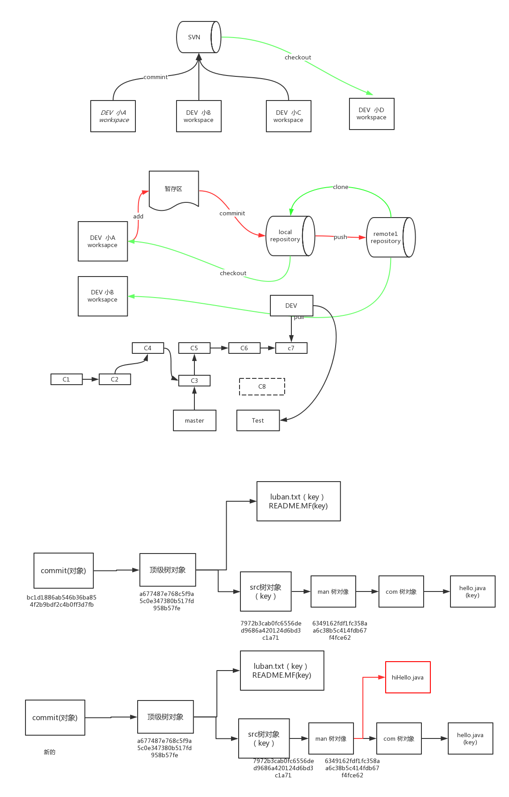
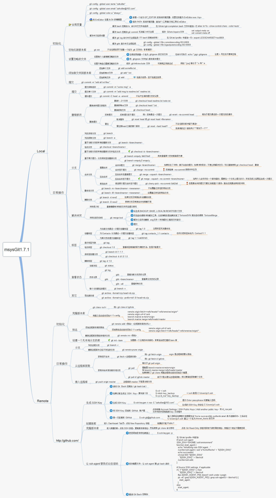

# Git 札记：基础

## 目录

- [简介](#简介)
- [发展历史](#发展历史)
- [准备工作](#准备工作)
- [add/commit 内部原理](#内部原理)
- [本地库常用操作](#本地库常用操作)
- [分支管理](#分支管理)
- [标签管理](#标签管理)
- [自定义 Git](#自定义Git)
- [参考链接](#参考链接)
- [结束语](#结束语)

## 简介

- ### 版本控制系统
    - 集中式
        - 免费：CVS(由于自身设计的问题，会造成提交文件不完整，版本库莫名其妙损坏的情况),SVN(修正了CVS的一些稳定性问题)
        - 收费：ClearCase(以前是 Rational 公司的，被 IBM 收购了,特点是安装比 Windows 还大，运行比蜗牛还慢，能用 ClearCase 的一般是世界 500 强，他们有个共同的特点是财大气粗，或者人傻钱多)
    - 分布式
        - 免费：Git(目前世界上最先进、最流行的分布式版本控制系统)
        - 收费：BitKeeper(属于 BitMover 公司,2002 年授权 Linux 社区免费使用,2005 年终止,促使 Git 诞生)
- ### 优势
    - 无需联网,大部分操作在本地完成
    - 安全性高,通过哈希算法来保证数据的完整性
    - 强大的分支管理,分支操作非常快捷流畅
    - 与 Linux 命令全面兼容

## 发展历史
    


## 准备工作

- 安装过程中选择`User Git from Git Bash only`,表示完全不修改PATH环境变量,仅在Git Bash中使用Git
    ```shell
    $ git --version      //查看git是否安装成功及版本号
    ```
- 设置签名用来区分不同开发人员的身份
    ```shell
    $ git config --global user.name "tujidelv"      //为该机器上所有的git仓库指定用户名
    $ git config --global user.email "tujide.lv@foxmail.com"      //为该机器上所有的git仓库指定email地址
    ```
- 适当地显示不同的颜色
    ```shell
    $ git config --global color.ui true
    ```

## 内部原理


- ### 概述
    - Git存储对象(hashmap)
        ```
        Git是一个内容寻址文件系统，其核心部分是一个简单的键值对数据库（key-value data store），你可以向数据库中插入任意内容，它会返回一个用于取回该值的hash键。
      
        # git键值库中插入数据
        # 写入版本1
        $ echo 'version1' > README.MF; git hash-object -w README.MF;
        # 写入版本2
        $ echo 'version2' > README.MF; git hash-object -w README.MF;
        # 写入版本3
        $ echo 'version3' > README.MF; git hash-object -w README.MF;
        79362d07cf264f8078b489a47132afbc73f87b9a
      
        # 查找所有的git对像
        $ find .git/objects/ -type f
        
        # 基于键获取指定内容(git基于该功能把每个文件的版本中内容都保存在数据库中，当要进行版本回滚的时候就通过其中一个键将其取回并替换)
        $ git cat-file -p 79362d07cf264f8078b489a47132afbc73f87b9a
      
        # 回滚指定版本
        $ git cat-file -p c11e96db44f7f3bc4c608aa7d7cd9ba4ab25066e > README.MF
      
        所以我们平常用的git add其实就是把修改之后的内容插入到键值库中。当我们执行git add README.MF就包括了执行git hash-object -w README.MF把文件写到数据库中。
        我们解决了存储的问题，但其只能存储内容并没有存储文件名，如果要进行回滚,怎么知道哪个内容对应哪个文件呢？接下要讲的就是树对象，它解决了文件名存储的问题。
        ```
    - Git树对象
        ```
        树对象解决了文件名的问题，它的目的将多个文件名组织在一起，其内包含多个文件名称与其对应的Key和其它树对象的引用，可以理解成操作系统当中的文件夹，一个文件夹包含多个文件和多个其它文件夹。
        每一个分支当中都关联了一个树对象，他存储了当前分支下所有的文件名及对应的 key。
      
        #查看分支树对象或者其他树对象
        $ git cat-file -p <master^{tree} | tree_id> 
        $ git cat-file -p a1183ea74b0cd7b5cec6b9bf8b758e03f8c5ba94
        100644 blob 46ad03092238f6c2ee203ef8bb14dc88faa5203b    .gitignore
        100644 blob 6a96454c48ac077474c118f5ed26c02c0f05e762    README.md
        100644 blob d8033580327bba5b2480e16fbbb1dc5fea61e2b4    TOC.md
        100644 blob e1ec5e0c6b69f3371d730926d6d4d2b52faf44f5    _config.yml
        100644 blob 36eaa9c9d2243211556e6e517e5545bbdb62677d    hd.sh
        100644 blob 6a8ed3965ab82e1b73bb7dcc94c575bc85f4317e    hs.sh
        100644 blob 911639e0e486bc709ac7813e2a52082ad9e115e9    package-lock.json
        100644 blob d457fbae7bcb0ef328e13b7fc12a9aeba55597ea    package.json
        040000 tree a99672782f26a13f14589febab3fe407e64170ae    scaffolds
        040000 tree 2ff7dd52dc20edb978226c298967bf33800d26d3    source
        ```
    - Git提交对象
        ```
        一次提交即为当前版本的一个快照，该快照就是通过提交对象保存，其存储的内容为：一个顶级树对象、上一次提交的对象啥希、提交者用户名及邮箱、提交时间戳、提交评论。
        
        $ git cat-file -p a33ef4e
        tree a1183ea74b0cd7b5cec6b9bf8b758e03f8c5ba94
        parent 96bcdd27b47641809d42b2417985a44aa8d25960
        author lvzhiqiang <zhiqiang.lv@riskraider.com> 1579428368 +0800
        committer lvzhiqiang <zhiqiang.lv@riskraider.com> 1579428368 +0800
        pushcode
        
        通过上面的知识，我们可以推测出从修改一个文件到提交的过程总共生成了三个对象：
        一个内容对象 ==> 存储了文件内容
        一个树对象 ==> 存储了文件名及内容对象的key
        一个提交对象 ==> 存储了树对象的key及提交评论。 
        ```
    - Git引用
        ```
        当我们执行git branch {branchName}时创建了一个分支，其本质就是在git基于指定提交创建了一个引用文件，保存在.git\refs\heads\下。
        
        # 演示分支的创建
        $ git branch dev 
        $ cat.git\refs\heads\dev
      
        git总共有三种类型的引用：分支引用、远程分支引用、标签引用
        ```

- ### git add
    - 保存二进制对象：`$ git hash-object -w test.txt`  
        ```
        - 把test.txt的当前内容压缩成二进制文件存入Git，压缩后的二进制文件称为一个Git对象，保存在.git/objects目录,同时会计算当前内容的SHA1哈希值（长度40的字符串）作为该对象的文件名。
        - .git/objects下面的一个个子目录名是该哈希值的前2个字符，该子目录下面有一个文件，文件名是哈希值的后38个字符。
        - 用cat命令查看该文件都是一些二进制字符(包括元数据),可用如下命令查看文件原始的文本内容:$ git cat-file -p e69de29bb2d1d6434b8b29ae775ad8c2e48c5391
        ```
    - 更新暂存区：`$ git update-index --add --cacheinfo 100644 3b18e512dba79e4c8300dd08aeb37f8e728b8dad test.txt`
        ```
        - 用于在暂存区记录一个发生变动的文件
        - 向暂存区(stage)写入文件名test.txt、二进制对象名（哈希值）和文件权限(100代表regular file[普通文件],644代表rw-r--r--)
        ```
        
    Tips：**Git提供了git add命令简化上面2步操作。**
- ### git commit
    - 保存当前目录结构：`$ git write-tree`
        ```
        - 将当前的目录结构生成一个Git对象,目录结构也是作为二进制对象保存的，也保存在.git/objects目录里面，对象名就是哈希值
        ```
    - 将目录树对象写入版本历史：`$ echo "first commit" | git commit-tree c3b8bb102afeca86037d5b5dd89ceeb0090eae9d`
        ```
        - 提交的时候需要有提交说明，echo "first commit"就是给出提交说明。然后git commit-tree命令将元数据和目录树，一起生成一个Git对象
        - 用git cat-file -p命令能看到本次快照对应的目录树对象（tree），作者和提交人信息，以及提交说明
        - 用如下命令也可以用来查看某个快照信息:$ git log --stat c9053865e9dff393fd2f7a92a18f9bd7f2caa7fa
        ```
    - 更新HEAD的值向我们的commit对象：`$ git update-ref refs/heads/master 4ad659c50196f780b19b1ab6c338205815a4d74a`
        ```
        如果当前不在master分支而在其他分支上，则需要指定为其他分支
        ```
    
    Tips：**Git提供了git commit命令简化上面3步操作。**
        
## 本地库常用操作
- 常用命令
    ```
    - git help <命令>
    - git init [目录]     //初始化版本库(把当前目录变成git可以管理的仓库[会在当前目录创建一个.git子目录，用来保存版本信息])
    - git add <FILE...|DIR...>      //告诉git把文件添加到仓库的暂存区，可反复多次使用，并且每次可添加多个文件
        - 实际上就是把要提交的所有修改添加到暂存区（stage）
        - git add --all/-A/.      //对当前项目所有变动的文件，执行保存二进制对象和更新暂存区操作
    - git commit [文件] -m "wrote a readme file"      //告诉git把文件提交到仓库的分支（-m后面是本次提交的说明），一次可提交多个文件
        - 实际上就是一次性把暂存区的所有修改提交到分支（master）
    - git status      //查看工作区/暂存区的状态
        - git status -s    //返回一个简单版的 git status。我设置这个命令为默认 git status 来减少噪音。
    - git diff [FILE]      //如果git status提示有文件被修改，可以用此命令查看指定文件修改了哪些内容，显示的格式是Unix通用的diff格式
        - 比较的是版本库（暂存区和分支中的任意一个）与工作区同名文件相比是否相同，而git diff --cached比较的是暂存区有无内容
        - git diff HEAD [FILE]      //将工作区中的文件和本地库历史记录比较
    - git log [branch-name]     //显示从最近到最远的提交日志。其中commit(快照) id是用SHA1算出的16进制数字
        - 后面加上--pretty=oneline可以精简信息
        - 后面加上--graph可以看到分支合并情况
        - 后面加上--abbrev-commit可以精简快照id
        - 后面加上dev..master可以查看master分支还有多少修改没有同步到dev分支
    - git show [branch-name]    //显示最近一次提交的内容详细改变
    - git reflog      //查看命令历史，当找不到新版本的id时可以用此来确定要回到未来的哪个版本
        - HEAD@{移动到当前版本需要多少步}
    ```
- 其他命令
    ``` 
    - git checkout -- <FILE>...      //撤销此文件在工作区的修改(包括删除)，回到最近一次commit或add时的状态
        - git checkout -- .      //撤销工作区所有的修改
        - git checkout -- *.java      //撤销工作区所有java文件的修改
    - git reset HEAD <FILE>...      //撤销此文件在暂存区的修改，回退到工作区
        - git reset HEAD *      //撤销暂存区所有的修改
    - git rm FILE      //当想从版本库中删除文件时，可先在工作区删除，然后调用此命令，再commit
        - git rm –cached FILE    //只删除远程文件，但是不影响本地文件。这对删除已经推送过的忽略文件记录而且不影响本地文件是非常的方便的。
    - git reset --hard HEAD~      //版本回退,HEAD代表当前版本，~代表回退到上个版本，如回到上100个版本可以用HEAD~100来表示 
        - git reset --hard 43ade3f      //当想回到之前的新版本时(也能后退)，可以找到它的commit id输入前几位即可(基于局部索引值操作,推荐)
        - --hard      //会让当前工作区和暂存区的修改也撤销
        - --soft      //不会让当前工作区和暂存区的修改也撤销,上次的提交由本地仓库回到暂存区
        - --mix      //不会让当前工作区的修改撤销,会让暂存区的修改撤销,上次的提交由本地仓库回到暂存区
    - git stash      //隐藏工作现场
        - 当手头工作没有完成时(工作区/暂存区有变动时),先把工作现场git stash隐藏一下,这样git status查看工作区是干净的,然后去修复bug,修复后,再git stash pop,回到份工作现场
        - git stash list      //查看隐藏的工作现场
        - git stash pop      //恢复隐藏的工作现场,同时删除stash内容
    - git shortlog -sn    //显示提交记录的参与者列表。和GitHub的参与者列表相同。
    ```
    
## 分支管理


- ### 分支的好处
    - 同时并行推进多个功能开发，提高开发效率
    - 各个分支在开发过程中，如果某一个分支开发失败，不会对其他分支有任何影响,删除失败的分支重新开始即可
- ### 分支操作
	- 查看所有分支：`$ git branch [-v]`
	    >当前分支前面会标一个*号
查看所有分支(包括远程分支)：$ git branch -avv
	- 创建+切换分支：`$ git checkout -b name [branch-name]`
		>基于提交/指定分支(默认当前分支)创建新分支：$ git branch new-branch-name [branch-name | commit id] 
基于远程分支(必须已存在)创建与之对应的新分支：$ git branch new-branch-name <origin/branch-name>
切换分支：$ git checkout branch-name
	- 合并指定分支到当前分支：`$ git merge [-m "..."] <name>`
        >Fast-forward，代表此次合并是"快进模式"，即把当前分支(master)指向指定分支(dev)的当前提交，所以合并速度非常快,这种模式下，删除分支后，会丢失掉分支信息
后面加上--no-ff 参数，表示禁用"Fast-forward"，用普通模式合并，会创建一个新的 commit,合并后的历史能看到分支信息,能看出来曾经做过合并,而 fast forward 合并就看不出来曾经做过合并
	- 删除分支：`$ git branch -d <name>`
		>$ git branch -D <name>   强行删除一个没有被合并过的分支(分支中只有空文件时可用普通方式-d删除分支)
- ### 解决冲突
	- 当 Git 无法自动合并分支时，须手动编辑文件解决冲突，然后再添加到暂存区再提交，合并完成
    ```
    CONFLICT (content): Merge conflict in readme.txt
    Automatic merge failed; fix conflicts and then commit the result.
    ```
- ### 分支管理策略
	- 首先，master 主分支应该非常稳定，仅用来发布新版本，平时不能在上面干活；
	- 每个人干活都在 dev 分支上，dev 分支是不稳定的，例如 1.0 版本发布时，再把 dev 分支合并到 master 上，在 master 主分支发布 1.0 版本；
	- 每个人都有自己的分支，时不时的往 dev 分支上合并就行。
	- **本地新建的分支如果不推送到远程,对其他人就是不可见的。**	
- Rebase
	- $ git rebase 操作可以把本地未 push 的分叉提交历史整理成直线
	- Rebase 的目的是使得我们在查看历史提交的变化时更容易，因为分叉的提交需要三方对比。

## 标签管理

- Git 标签虽然是版本库的快照,但其实是指向某个 commit 的死指针(与分支类似,但分支可以移动,标签不能移动),所以，创建和删除标签都是瞬间完成的。
- 创建标签
    ```
    $ git tag <tagname> [branch-name]      //新建一个标签,默认是打在当前分支下的最新commit上的
        - $ git tag <tagname> [commitid]      //打在某次指定(commit id)提交上
        - $ git tag -a <tagname> -m "" [commitid]      //创建带有说明的标签,-a指定标签名,-m指定说明信息
            - $ git tag -a v0.1 -m "version 0.1 released" 3628164
        - $ git tag -s <tagname> -m "" [commitid]      //创建PGP签名的标签,不可伪造,-s用私钥签名一个标签
            - 必须先安装gpg（GnuPG），如果没有找到gpg，或者没有gpg密钥对，就会报错;如果报错，请参考GnuPG帮助文档配置Key
    ```
- 操作标签
    ```
    $ git tag      //查看所有标签,按字母排序列出,而不是按时间顺序
    $ git show <tagname>      //查看指定标签信息
    $ git tag -d <tagname>      //删除一个本地标签
    $ git push origin <tagname>      //推送一个本地标签到远程
    $ git push origin --tags      //推送全部未推送过的本地标签到远程
    $ git push origin :refs/tags/<tagname>      //删除一个远程标签,需先删除对应的本地标签
    ```

## 自定义Git

### 忽略特殊文件

- 有些时候，你必须把某些文件放到 Git 工作目录中，但又不能提交它们，比如保存了数据库密码的配置文件等等，每次 git status 都会显示 Untracked files ...，
有强迫症的童鞋心里肯定不爽,可以在 Git 工作区的根目录下创建一个特殊的 .gitignore 文件，然后把要忽略的文件名填进去，Git 就会自动忽略这些文件。
- 不需要从头写 .gitignore 文件，GitHub已经为我们准备了各种配置文件，只需要组合一下就可以使用了(该文件要提交到版本库才能生效)。
所有配置文件可以直接在线浏览：<https://github.com/github/gitignore>
- 原则
    - 忽略操作系统自动生成的文件，比如缩略图等；
    - 忽略编译生成的中间文件、可执行文件等，也就是如果一个文件是通过另一个文件自动生成的，那自动生成的文件就没必要放进版本库，比如Java编译产生的.class文件；
    - 忽略你自己的带有敏感信息的配置文件，比如存放口令的配置文件。
- 有些时候添加一个文件到 Git，但发现添加不了，原因是这个文件被 .gitignore 忽略了,有如下2种处理方法
    ```
    $ git add -f FILE      //用-f强制添加到Git
    $ git check-ignore -v FILE      //检查.gitignore文件的哪个配置影响了该文件,好修改规则
    ```
- Windows 下创建 .gitignore 文件的常用方法
    - 方法一（最直接）：在资源管理创建文件时，文件命名“.gitignore.”，注意结尾有个 . 号，回车确认时系统会自动存成 .gitignore。
    - 方法二：打开文本编辑器，保存时文件名输入“.gitignore”，保存类型选“所有文件”。
    - 方法三：进入 cmd 命令行，执行 echo > .gitignore 输入空内容并创建文件，或执行 rename somefile .gitignore、copy somefile .gitignore 从已有文件复制、重命名。
    
### 配置别名
    
- 通过命令配置
    - 加上--global 是针对当前用户起作用的，如果不加，那只针对当前的仓库起作用
    ```								
    $ git config --global alias.st status				 					
    $ git config --global alias.co checkout									
    $ git config --global alias.ci commit									
    $ git config --global alias.br branch									
    $ git config --global alias.unstage 'reset HEAD'									
    $ git config --global alias.last 'log -1'      //显示最近一次的提交									
    $ git config --global alias.lg "log --color --graph --pretty=format:'%Cred%h%Creset -%C(yellow)%d%Creset %s %Cgreen(%cr) %C(bold blue)<%an>%Creset' --abbrev-commit"	
    ```
- 通过文件配置
    - 每个仓库的 Git 配置文件都放在 .git/config 文件中,而当前用户的 Git 配置文件放在用户主目录下的一个隐藏文件 .gitconfig 中,别名就在[alias]后面，要删除别名，直接把对应的行删掉即可
    ```
    [alias]
    	co = checkout
    	ci = commit
    	br = branch
    	st = status
    	unstage = reset HEAD
    	last = log -1
    	lg = log --color --graph --pretty=format:'%Cred%h%Creset -%C(yellow)%d%Creset %s %Cgreen(%cr) %C(bold blue)<%an>%Creset' --abbrev-commit
    [user]
    	name = tujidelv
    	email = tujide.lv@foxmail.com
    ```
- windows 版 git bash 设置其他命令别名
    - **Git 安装目录,修改 etc/profile.d/aliases.sh 文件。**
    
## 参考链接

- [Git 官方文档](https://git-scm.com/book/zh/v2)
- [Git教程 - 廖雪峰的官方网站](https://www.liaoxuefeng.com/wiki/0013739516305929606dd18361248578c67b8067c8c017b000)

## 结束语

- 未完待续...
- update by 20200120

