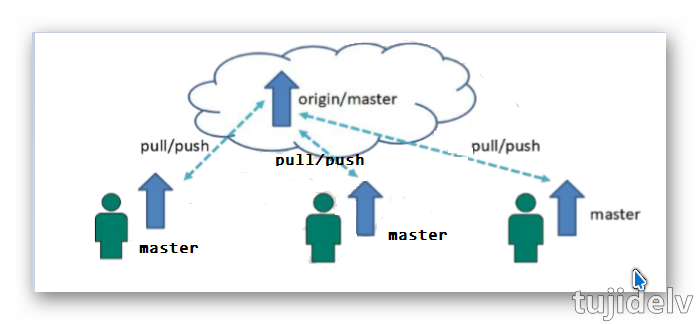
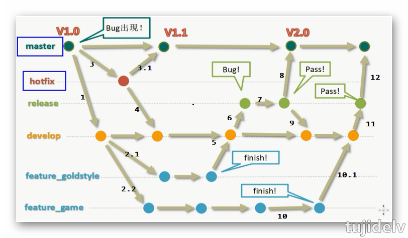

# Git 札记：工作流

## 目录

- [简介](#简介)
- [分类](#分类)
- [参考链接](#参考链接)
- [结束语](#结束语)

## 简介

- Git 工作流：分支管理策略
    - 集中式工作流
    - GitFlow 工作流
    - Github flow 工作流
    - AoneFlow 工作流
    
## 分类

### 集中式工作流

- 简介
    - 像 SVN 一样，集中式工作流以中央仓库作为项目所有修改的单点实体，所有修改都提交到 Master 这个分支上。
- 评价
    - 这种方式与 SVN 的主要区别就是开发人员有本地库，Git 很多特性并没有用到。

### GitFlow 工作流

- 简介
    - GitFlow 工作流通过为功能开发、发布准备和维护设立了独立的分支，让发布迭代过程更流畅，严格的分支模型也为大型项目提供了一些非常必要的结构。
- 评价			
    - GitFlow 的优点是清晰可控，缺点是相对复杂，需要同时维护两个长期分支，大多数工具都将 master 当作默认分支，可是开发是在 develop 分支进行的，这导致经常要切换分支，非常烦人，
    更大问题在于，这个模式是基于"版本发布"的，目标是一段时间以后产出一个新版本，但是，很多网站项目是"持续发布"，代码一有变动，就部署一次，这时，master 分支和 develop 分支的差别不大，没必要维护两个长期分支。	
- 分支种类
    - 长期分支(核心分支)
        - **主干分支 master**
	        - 主要负责管理正在运行的生产环境代码，永远保持与正在运行的生产环境完全一致，这条分支不能进行代码修改，只能用来合并其他分支。
		- **开发分支 develop**
			- 主要负责管理正在开发过程中的代码，一般情况下应该是最新的代码，这条分支也不能进行代码修改，只能用来合并其他辅助分支。
	- 临时分支(辅助分支)
		- **补丁分支(bug 修理)hotfix**
			- 主要负责管理生产环境下出现的紧急修复的代码，基于 master 分支上创建，修复测试无误后合并到 Master 和 Develop 分支。视情况可以删除该分支。
		- **预发分支(准生产)release**
			- 较大的版本上线前，会从 Develop 分支中分出准生产分支，进行最后阶段的集成测试，测试确定新功能没有问题,合并回 Master 和 Develop 分支，生产环境运行一段阶段较稳定后可以视情况删除。
		- **功能分支 feature**
			- 为了不影响较短周期的开发工作，一般把中长期开发模块，会从 Develop 分支中独立出来，开发完成后合并到 Develop 分支，视情况可以删除该分支。

### Github flow 工作流

- 简介
    - 是 GitFlow 的简化版，它只有一个长期分支，就是 master，因此用起来非常简单,专门配合"持续发布"，它是 Github.com 使用的工作流程。
- 评价
	- Github flow 的最大优点就是简单，对于"持续发布"的产品，可以说是最合适的流程，但对于一些要指定时间才能发布的项目来说,容易导致最后线上版本落后于 master 分支,需要另外新建一个 production 分支跟踪线上版本。
- 流程	
	1. 根据需求，从 master 拉出新分支，不区分功能分支或补丁分支。
	2. 新分支开发完成后，或者需要讨论的时候，就向 master 发起一个pull request（简称 PR）。
	3. Pull Request 既是一个通知，让别人注意到你的请求，又是一种对话机制，大家一起评审和讨论你的代码，对话过程中，你还可以不断提交代码。
	4. 你的Pull Request 被接受，合并进 master，重新部署后，原来你拉出来的那个分支就被删除。（先部署再合并也可）

### AoneFlow 工作流

- 待更新...
    
## 参考链接

- [Git 官方文档](https://git-scm.com/book/zh/v2)

## 结束语

- 未完待续...