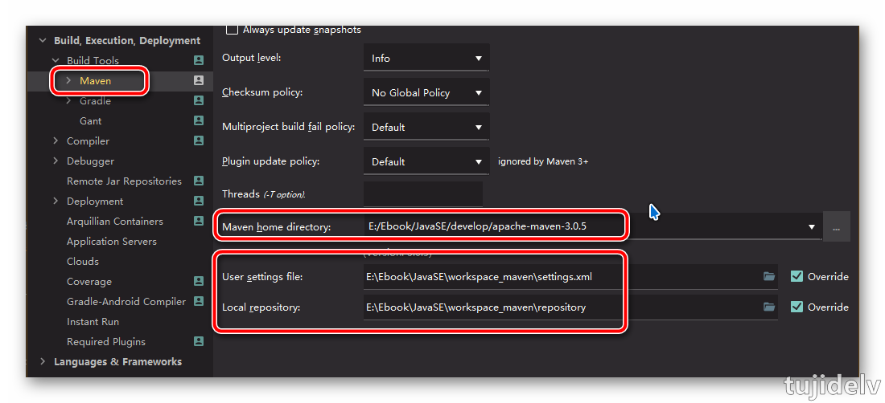
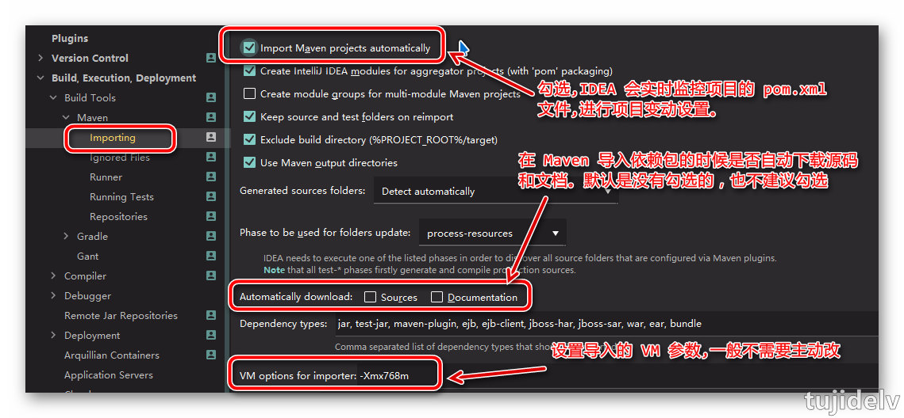
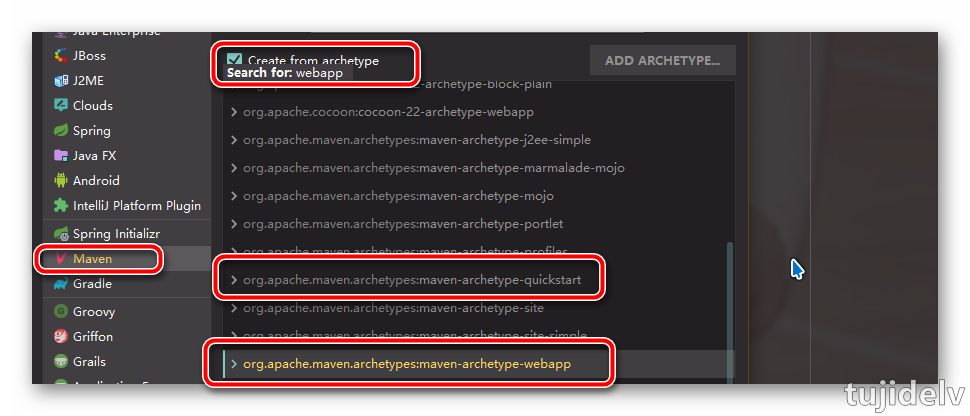
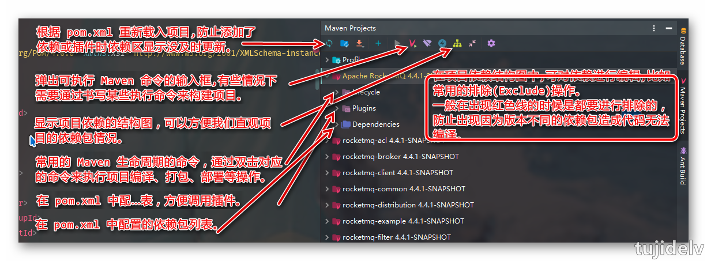

# IDEA 札记：进阶

## 目录

- [简介](#简介)
- [快捷键设置介绍](#快捷键设置介绍)
- [高效率编码功能介绍](#高效率编码功能介绍)
- [插件推荐、开发介绍](#插件推荐、开发介绍)
- [参考链接](#参考链接)
- [结束语](#结束语)

## 简介

- 对IDEA进一步的了解及使用

## 快捷键设置介绍

- 设置为 Eclipse 的快捷键
    ```
    1.Keymap下拉框选中"Eclipse"并应用
    2.如需在此快捷键模板上修改,则点击旁边齿轮->Duplicate来拷贝一份模板,并输入自己的命名
    ```
- 筛选并修改快捷键
    ```
    1.在搜索框输入快捷键描述内容							
    2.点击搜索框旁边图标并按下需要修改的快捷键							
    -------------------------
    Add Keyboard Shortcut：用来添加新的纯键盘快捷键组合
    Add Mouse Shortcut：用来添加新的键盘+鼠标快捷键组合，比如设置Ctrl+左键单击这类快捷组合。其中在弹出的添加面板中Click Pad是用来监听当前鼠标是左键单击还是右键单击
    Add Abbreviation：根据IDEA的版本文档解释，添加简称主要是为了方便Search Everywhere中使用我设置的简称搜索
    Remove：移出当前操作命令(一个操作命令同时支持多个快捷键组合)已设置的快捷键组合，由于IDEA默认就占用了很多快捷键组合，所以如果你要修改某个快捷键，建议还是删除掉旧的
    ```
- 导入已有的快捷键模板
    ```
    File–>import setttings–>选中本地的快捷键jar文件–>一路确认–>重启。
    IDEA默认快捷键的配置文件所在地：${IDEA_home}\lib\resources.jar\keymaps\*
    ```
- 常用快捷键(Eclipse 版)

### ***Ctrl***

|快捷键|介绍|
|:---------|:---------|
|<kbd>Ctrl</kbd> + <kbd>F</kdb>|在当前文件进行文本替换 `（必备）` |
|<kbd>Ctrl</kbd> + <kbd>Z/Y</kdb>|撤销/反撤销 `（必备）` |
|<kbd>Ctrl</kbd> + <kbd>X/C/V/A/S</kdb>|剪切/复制/粘贴/全选/保存 `（必备）` |
|<kbd>Ctrl</kbd> + <kbd>D</kdb>|删除光标所在行或选中行 `（必备）` |
|<kbd>Ctrl</kbd> + <kbd>/</kdb>|单行注释 `（必备）` |
|<kbd>Ctrl</kbd> + <kbd>O</kdb>|查看当前类的结构 `（必备）` |
|<kbd>Ctrl</kbd> + <kbd>H/R</kdb>|查找/替换(全局) `（必备）` |
|<kbd>Ctrl</kbd> + <kbd>E</kdb>|显示最近打开的文件记录列表 `（必备）` |
|<kbd>Ctrl</kbd> + <kbd>W</kdb>|关闭当前打开的代码栏 `（必备）` |
|<kbd>Ctrl</kbd> + <kbd>L</kdb>|在当前文件跳转到指定行处 `（必备）` |
|<kbd>Ctrl</kbd> + <kbd>Up/Down</kdb>|等效于鼠标滚轮向前/后效果 `（必备）` |
|<kbd>Ctrl</kbd> + <kbd>Left/Right</kdb>|光标跳转到当前单词/中文名的左/右侧开头位置 `（必备）` |
|<kbd>Ctrl</kbd> + <kbd>T</kdb>|在某个调用的方法名上使用会跳到具体的实现处，可以跳过接口 `（必备）` |
|<kbd>Ctrl</kbd> + <kbd>F12</kdb>|调转到所选中的词的下一个引用位置|
|<kbd>Ctrl</kbd> + <kbd>F1</kdb>|在光标所在的错误代码处显示错误信息|
|<kbd>Ctrl</kbd> + <kbd>J</kdb>|插入自定义动态代码模板|
|<kbd>Ctrl</kbd> + <kbd>U</kdb>|前往当前光标所在的方法的父类的方法/接口定义|

### ***Alt***

|快捷键|介绍|
|:---------|:---------|
|<kbd>Alt</kbd> + <kbd>Insert</kdb>|新建文件 `（必备）` |
|<kbd>Alt</kbd> + <kbd>Enter</kdb>|万能解错/生成返回值变量 `（必备）` |
|<kbd>Alt</kbd> + <kbd>/</kdb>|提示补全 `（必备）` |
|<kbd>Alt</kbd> + <kbd>Up/Down</kdb>|向上/下移动行/方法 `（必备）` |
|<kbd>Alt</kbd> + <kbd>Left/Right</kdb>|退回/前进到上一个/下一个操作的页面 `（必备）` |
|<kbd>Alt</kbd> + <kbd>R/D</kdb>|在执行/调试 `（必备）` |
|<kbd>Alt</kbd> + <kbd>1,2,...,9</kdb>|显示对应数值的他选项卡,其中1是Project用得最多 `（必备）` |
|<kbd>Alt</kbd> + <kbd>F12</kdb>|在项目下打开命令行 `（必备）` |
|<kbd>Alt</kbd> + <kbd>F1</kdb>|显示当前文件选择目标弹出层,弹出层中有很多目标可以进行选择 `（必备）` |
|<kbd>Alt</kbd> + <kbd>`</kdb>|显示版本控制常用操作菜单弹出层 `（必备）` |

### ***Shift***

|快捷键|介绍|
|:---------|:---------|
|<kbd>Shift</kbd> + <kbd>Enter</kdb>|向下开始新的一行 `（必备）` |
|<kbd>Shift</kbd> + <kbd>Tab</kdb>|取消缩进 `（必备）` |
|<kbd>Shift</kbd> + <kbd>F11</kdb>|弹出书签显示层 `（必备）` |

### ***Ctrl + Alt***

|快捷键|介绍|
|:---------|:---------|
|<kbd>Ctrl</kbd> + <kbd>Alt</kbd> + <kbd>S</kbd>|打开idea系统设置 `（必备）` |
|<kbd>Ctrl</kbd> + <kbd>Alt</kbd> + <kbd>Down</kbd>|向下复制一行 `（必备）` |
|<kbd>Ctrl</kbd> + <kbd>Alt</kbd> + <kbd>F</kbd>|添加到收藏 `（必备）` |
|<kbd>Ctrl</kbd> + <kbd>Alt</kbd> + <kbd>Left/Right</kbd>|切换当前已打开的窗口中的子视图,如debug窗口中有output,debugger等子视图|
|<kbd>Ctrl</kbd> + <kbd>Alt</kbd> + <kbd>H</kbd>|查看方法的多层重写结构|
|<kbd>Ctrl</kbd> + <kbd>Alt</kbd> + <kbd>/</kbd>|方法参数提示显示|

### ***Ctrl + Shift***

|快捷键|介绍|
|:---------|:---------|
|<kbd>Ctrl</kbd> + <kbd>Shift</kbd> + <kbd>/</kbd>|多行注释 `（必备）` |
|<kbd>Ctrl</kbd> + <kbd>Shift</kbd> + <kbd>Enter</kbd>|向上开始新的一行 `（必备）` |
|<kbd>Ctrl</kbd> + <kbd>Shift</kbd> + <kbd>F</kbd>|格式化代码 `（必备）` |
|<kbd>Ctrl</kbd> + <kbd>Shift</kbd> + <kbd>O</kbd>|优化导入的类 `（必备）` |
|<kbd>Ctrl</kbd> + <kbd>Shift</kbd> + <kbd>Y</kbd>|大写转小写/小写转大写 `（必备）` |
|<kbd>Ctrl</kbd> + <kbd>Shift</kbd> + <kbd>T</kbd>|根据输入的类名查找类文件 `（必备）` |
|<kbd>Ctrl</kbd> + <kbd>Shift</kbd> + <kbd>R</kbd>|根据输入的文件名打开文件/目录,打开目录需在末尾多加一个正斜杠 `（必备）` |
|<kbd>Ctrl</kbd> + <kbd>Shift</kbd> + <kbd>Up/Down</kbd>|当前光标跳转到当前文件的前/后一个方法名位置 `（必备）` |
|<kbd>Ctrl</kbd> + <kbd>Shift</kbd> + <kbd>F12</kbd>|编辑器最大化 `（必备）` |
|<kbd>Ctrl</kbd> + <kbd>Shift</kbd> + <kbd>H</kbd>|查找方法在哪里被调用 `（必备）` |
|<kbd>Ctrl</kbd> + <kbd>Shift</kbd> + <kbd>V</kbd>|选择要粘贴的内容|
|<kbd>Ctrl</kbd> + <kbd>Shift</kbd> + <kbd>Q</kbd>|快速搜索类中的错误|
|<kbd>Ctrl</kbd> + <kbd>Shift</kbd> + <kbd>W</kbd>|关闭打开的所有代码栏|
|<kbd>Ctrl</kbd> + <kbd>Shift</kbd> + <kbd>U</kbd>|查看类的继承结构图|
|<kbd>Ctrl</kbd> + <kbd>Shift</kbd> + <kbd>X</kbd>|打开代码所在硬盘文件夹|
|<kbd>Ctrl</kbd> + <kbd>Shift</kbd> + <kbd>C</kbd>|复制当前文件磁盘路径到剪切板|

### ***Alt + Shift***

|快捷键|介绍|
|:---------|:---------|
|<kbd>Alt</kbd> + <kbd>Shift</kbd> + <kbd>S</kbd>|生成构造器/get/set/toString `（必备）` |
|<kbd>Alt</kbd> + <kbd>Shift</kbd> + <kbd>Z</kbd>|生成 try-catch 等 `（必备）` |
|<kbd>Alt</kbd> + <kbd>Shift</kbd> + <kbd>C/X</kbd>|收起/打开所有的方法 `（必备）` |
|<kbd>Alt</kbd> + <kbd>Shift</kbd> + <kbd>R</kbd>|重构(修改变量名与方法名) `（必备）` |
|<kbd>Alt</kbd> + <kbd>Shift</kbd> + <kbd>M</kbd>|抽取方法|
|<kbd>Alt</kbd> + <kbd>Shift</kbd> + <kbd>F</kbd>|局部变量抽取为成员变量|
|<kbd>Alt</kbd> + <kbd>Shift</kbd> + <kbd>N</kbd>|选择/添加 task|

### ***Ctrl + Shift + Alt***

|快捷键|介绍|
|:---------|:---------|
|<kbd>Ctrl</kbd> + <kbd>Shift</kbd> + <kbd>Alt</kbd> + <kbd>S</kbd>|打开当前项目设置 `（必备）` |
|<kbd>Ctrl</kbd> + <kbd>Shift</kbd> + <kbd>Alt</kbd> + <kbd>V</kbd>|无格式黏贴|
        
### ***其他***

|快捷键|介绍|
|:---------|:---------|
|<kbd>Dobule Shift</kbd>|查找文件 `（必备）` |
|<kbd>Esc</kbd>|从工具窗口进入代码文件窗口 `（必备）` |
|<kbd>Tab</kbd>|缩进 `（必备）` |
|<kbd>F3</kbd>|进入光标所在的方法/变量的接口或是定义处,等效于ctrl+左键单击 `（必备）` |
|<kbd>F11</kbd>|添加书签 `（必备）` |
|<kbd>F2</kbd>|光标所在的变量/类名/方法名等上面显示文档内容|
|<kbd>F4</kbd>|查看继承关系|

## 高效率编码功能介绍

### `Maven 配置`

- Maven 常用设置(`同时在Other Settings中进行默认设置`)
    
    
- Maven 骨架创建 JavaWeb 项目(`创建普通maven项目时不用选择quickstart,默认就行`)
    
- Maven 组件界面介绍
    
    
    

### `版本控制`

- IDEA 对版本控制的支持是以插件化的方式实现的，旗舰版默认支持目前主流的版本控制软件：CVS、SVN、Git、Mercurial、Perforce、TFS。
又因为目前太多人使用 Github 进行协同或是项目版本管理，同时自带了 Github 插件，方便 Checkout 和管理你的 Github 项目，
    ```
    Background：后台进程处理			
    Confirmation：弹窗提示,是否提交,merge			
    Issue Navigation：问题导航			
    GitHub：github配置			
    CVS：cvs配置			
    Subversion：svn配置			
    TFS：工作流引擎管理
    ```
- 常用设置
    ```
    1. 设置子目录有文件被修改了，则该文件的所有上层目录都显示版本控制被修改的颜色
        Version Control,勾选'Show directories with changed descendants',默认是不勾选的
    2. 设置新建或者删除文件时Git做默认如何处理
        Version Control->Confirmation,修改'When files are created'和'When files are deleted'
    3. 设置忽略文件
        Version Control->Ignored Files,添加不想加入到版本控制的文件和目录.对于已经加入到版本控制的文件使用此功能，则表示该文件或目录无法再使用版本控制相关的操作，比如提交、更新等
    4. 关联本地git.exe
        Version Control->Git,在Path to Git executable中选择
    5. 关联GitHub账户
        Version Control->GitHub,选择"+"号关联
    6. 支持从当前登陆的GitHub账号上直接Clone项目到本地
        VCS->Checkout from Version Control->Git
        File->New->Project from Version Control->Git
    7. 支持将本地项目分享到你的GitHub账号上
        VCS->Import into Version Control->Share Project On GitHub
        此时会在GitHub上创建一个新的仓库，而非更新已经存在的仓库,默认采用https方式传输
    8. Commit Changes弹窗介绍
        Before Commit：
            Reformat code：格式化代码，如果是Web开发建议不要勾选，因为格式化JSP类文件，格式化效果不好。如果都是Java类则可以安心格式化
            Rearrange code：重新编排代码，IDEA支持各种复杂的编排设置选项
            Optimize imports：优化导入包，会自动去掉没有使用的包。这个建议都勾选，因其只对Java类有作用，所以不用担心有副作用
            Perform code analysis：进行代码分析，这个建议不用在提交的时候处理，而是在开发完之后，要专门养成对代码进行分析的习惯。IDEA 集成了代码分析功能
            Check TODO：检查代码中的TODO。记录待办事项
            Cleanup：清除下版本控制系统，去掉一些版本控制系统的错误信息，建议勾选（主要针对 SVN，Git 不适用）
        标识着不同颜色的文件：
            红色：未被版本控制的文件，即未添加到版本控制的文件，例如我们添加到ignore中的文件
            绿色：新加入版本的文件，即我们新创建的文件，还未提交到远程仓库
            蓝色：修改过的文件，即远程仓库中已有该文件，我们这次对它进行了修改，但是还未提交
    9. 点击界面右下角位置可以切换分支和创建分支，以及合并、删除分支等操作
    ```

### `Debug 技巧`

- Debug 设置				
    ```
    Settings->Build,Execution,Deployment->Debugger,Transport选中Shared memory
    表示设置Debug连接方式，默认是Socket。Shared memory是Windows特有的一个属性，一般在Windows系统下建议使用此设置，相对于Socket会快
    ```
- Debug 常用快捷键
    ```
    Step Over(F6)：进入下一步，如果当前行断点是一个方法，则不进入当前方法体内
    Step Into(F5)：进入下一步，如果当前行断点是一个方法，则进入当前方法体内(自定义方法)
    Force Step Into(Alt+Shift+F7)：进入下一步，如果当前行断点是一个方法，则进入当前方法体内(所有方法,包括JDK库)
    Step Out(F7)：跳出
    Drop Frame：该按钮可以用来退回到当前停住的断点的上一层方法上，可以让过掉的断点重新来过
    Evaluate Expression(Ctrl+U)：选中对象，弹出可输入计算表达式调试框，查看该输入内容的调试结果
    Resume Program(F8)：恢复程序运行，但如果该断点下面代码还有断点则停在下一个断点上
    Stop：停止
    View Breakpoints：查看所有断点
    Mute Breakpoints：点中，使得所有的断点失效
    Restore Layout：窗口还原
    ```
- Debug 其他用法
    ```
    条件断点：调试的时候，在循环里增加条件判断，可以极大的提高效率，心情也能愉悦
    在断点处右击调出条件断点。可以在满足某个条件下，实施断点。
        ```

### `实时代码模板`

- 功能介绍
    - 它的原理就是配置一些常用代码字母缩写，在输入简写时可以出现你预定义的固定模式的代码，使得开发效率大大提高，同时也可以增加个性化。最简单的例子就是在 Java 中输入 sout 会出现 System.out.println()。
    - 官方介绍 Live Templates：<https://www.jetbrains.com/help/idea/using-live-templates.html>
- 已有的常用模板
    - 所处位置： Settings->Editor->General->Postfix Completion | Editor->Live Templates
        - 二者的区别：Live Templates 可以自定义，而 Postfix Completion 不可以。同时，有些操作二者都提供了模板，Postfix Templates较Live Templates 能快 0.01 秒
    - 举例
        ```
        psvm : 可生成main方法
        sout : 快捷输出System.out.println()
            soutp => System.out.println("方法形参名 = " + 形参名); 
            soutm => System.out.println("当前类名.当前方法");
            soutv => System.out.println("变量名 = " + 变量); 
            "abc".sout => System.out.println("abc");
        fori : 可生成普通for循环
            iter => 可生成增强for循环
            itar => 可生成普通for循环并赋值
        list.for : 可生成list集合的增强for循环
            list.fori => 可生成list集合的普通for循环
            list.forr => 可生成list集合的普通for循环(倒序)
        ifn：可生成if(xxx = null)
            inn => 可生成if(xxx != null)
            xxx.nn或xxx.null  (Postfix Completion)
        prsf：可生成private static final
            psf => 可生成public static final
            psfi => 可生成public static final int
            psfs => 可生成public static final String
        ```			
- 修改现有模板
    - 如果对于现有的模板，感觉不习惯、不适应的，可以修改。
    - 举例
        ```
        修改Abbreviation：
            Settings->Editor->Live Templates,定位到other->psvm,将Abbreviation值改为main
        修改Template text：
            Settings->Editor->Live Templates,定位到plain->psfi,将Template text值改为public static final int $VAR1$ = $VAR2$;$END$	
        ```		
- 自定义模板
    - IDEA 提供了很多现成的 Templates,但你也可以根据自己的需要创建新的 Template。
    ```
    1. 定义一个模板组	
        Settings->Editor->Live Templates,点击"+"号,选择Template Group...,
    2. 选中自定义的模板组，点击"+"来定义模板	
        Settings->Editor->Live Templates,点击"+"号,选择Live Template,	
    3. 填写模板的内容
        Abbreviation：模板的缩略名
        Description：模板的描述
        Template text：模板的代码片段
        应用范围：比如点击Define,选择java
        Edit variables：	https://www.jetbrains.com/help/idea/template-variables.html
    ```

### `数据库管理工具`

- IDEA 的 Database 最大特性就是对于 JavaWeb 项目来讲,对常用的 ORM 框架有很好的支持,比如配置好了 Database 之后，IDEA 会自动识别 domain 对象与数据表的关系，也可以通过 Database 的数据表直接生成 domain 对象等等。
- 关联方式
    ```
    Database->"+"->Data Source->MySQL,填写相关信息
    ```
- 常用操作
    ```
    3：同步当前数据库连接。这个是最重要的操作，有一些情况下，当我们配置好连接之后，没有显示数据表，那就是需要点击该按钮进行同步。还有一种情况就是我们在IDEA之外用其他工具操作数据库，比如新建表。而此时IDEA的 Database如果没有同步到新表，也是需要点击此按钮进行同步的
    4：配置当前连接，跟我们首次设置连接的界面是一样的
    5：断开当前的连接
    6：显示相应数据库对象的数据
    7：编辑修改当前数据库对象
    ```

## 插件推荐、开发介绍

- 插件设置
    - IDEA 对插件进行了很好的分类：启用的插件是被勾选的，如果要禁用一个插件，去掉勾选即可
    	```
    	All plugins：显示所有插件
        Enabled：显示当前所有已经启用的插件
        Disabled：显示当前所有已经禁用的插件
        Bundled：显示所有IDEA自带的插件
        Custom：显示所有我们自行安装的插件，如果你自己装了很多次插件的话，这个选项会用得比较多
    	```
    - Install JetBrains plugin...：弹出IDEA公司自行开发的插件仓库列表，供下载安装	
    - Browse repositories...：弹出插件仓库中所有插件列表供下载安装
    - Install plugin from disk...：浏览本地的插件文件进行安装，而不是从服务器上下载并安装
    
    Tips：在国内的网络下，很经常出现显示不了插件列表，或是显示了插件列表，无法下载完成安装。这时候请自行开 VPN，一般都可以得到解决
- 插件推荐
    - 官方插件库：<https://plugins.jetbrains.com>
    - 在用插件
        ```
        Material Theme UI
        Power Mode II：activate-power-mode
        Background Image Plus
        Nyan Progress Bar
        Gitee
        NodeJS
        Lombok
        Alibaba Java Coding Guidelines：阿里巴巴出的代码规范检查插件
        JRebel for IntelliJ：热部署
        ```
    - 备用插件
        ```
        Translation：翻译插件
        Maven Helper：Maven辅助插件
        MybatisX：mybatis框架辅助（免费）
        Lombok Plugin：Lombok 功能辅助插件
        Git Flow Integration：Git Flow的图形界面操作
        .ignore：各类版本控制忽略文件生成工具
        GenerateAllSetter：new POJO类的快速生成set方法
        GsonFormat：把JSON字符串直接实例化成类
        Rainbow Brackets：对各个对称括号进行着色，方便查看
        String Manipulation：驼峰式命名和下划线命名交替变化
        --------------------------
        IDE Features Trainer：IDEA官方出的学习辅助插件
        Key promoter：快捷键提示
        Grep Console：自定义设置控制台输出
        CheckStyle-IDEA：代码规范检查
        FindBugs-IDEA：潜在Bug检查
        MetricsReloaded：代码复杂度检查
        Statistic：代码统计
        CodeGlance：在编辑代码最右侧，显示一块代码小地图
        Markdown Navigator：书写Markdown文章
        Eclipse Code Formatter：使用 Eclipse 的代码格式化风格，在一个团队中如果公司有规定格式化风格，这个可以使用
        Jindent-Source Code Formatter：自定义类、方法、doc、变量注释模板
        Properties to YAML Converter：把Properties的配置格式改为YAML格式
        mongo4idea：mongo客户端
        iedis：redis客户端
        VisualVM Launcher：项目启动的时候也启动VisualVM
        ```
- Java 热部署插件 JRebel 安装及使用
- 插件开发

## 参考链接

- <https://github.com/judasn/IntelliJ-IDEA-Tutorial>

## 结束语

- 未完待续...
