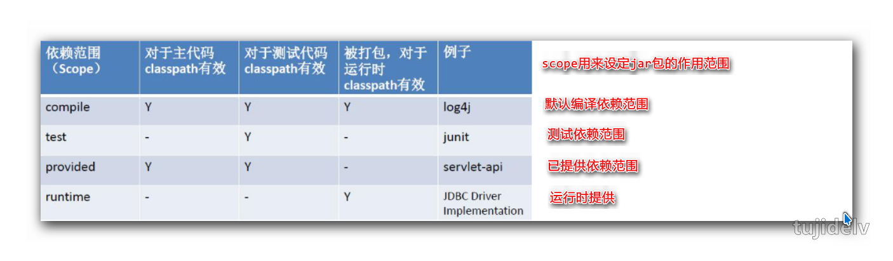
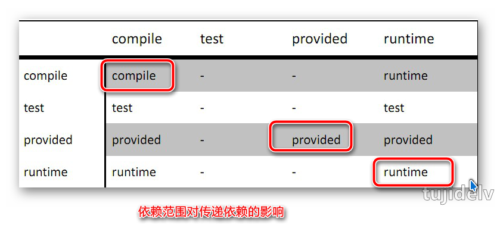
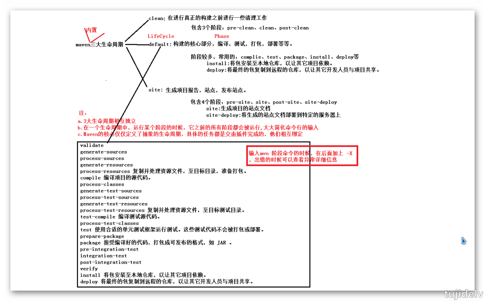

# Maven 札记：基础

## 目录

- [简介](#简介)
- [正篇](#正篇)
- [参考链接](#参考链接)
- [结束语](#结束语)

## 简介

### `maven是什么`

```
Maven是Apache提供的一款跨平台的项目管理工具。主要服务于基于Java平台的项目构建，依赖管理和项目信息管理。
    开发团队基本不用花多少时间就能自动完成工程的基础构建配置,因为maven使用了一个标准的目录结构和一个默认的构建生命周期。
    采用了“约定大于配置”的设计理念，减少了配置和规范了工程结构。
------------------
什么是理想的项目构建？
    高度自动化，跨平台，可重用的组件，标准化的
什么是依赖？为什么要进行依赖管理？
    自动下载，统一依赖管理
有哪些项目信息？
    项目名称描述等，开发人员信息，开发者信息等
```

### `为什么要用maven`

```
IDE：
    1. 手工操作较多，编译、测试、部署等工作都是独立的，很难一步完成
    2. 每个人的IDE配置都不同，很容易出现本地代码换个地方编译就出错
Ant：
    1. 没有一个约定的目录结构
    2. 必须明确让ant做什么，什么时候做，然后编译，打包
    3. 没有生命周期，必须定义目标及其实现的任务序列
    4. 没有集成依赖管理
Maven：
    1. 拥有约定的目录结构，知道你的代码在哪里，放到哪里去
    2. 拥有一个生命周期，例如执行 mvn install 就可以自动执行编译，测试，打包等构建过程
    3. 只需要定义一个pom.xml,然后把源码放到默认的目录，Maven帮你处理其他事情
    4. 拥有依赖管理，仓库管理
```

## 正篇

### `安装与配置`

1. 确认当前系统正确的配置了JDK 环境变量
    ```
    # java -version
    java version "1.8.0_91"
    Java(TM) SE Runtime Environment (build 1.8.0_91-b15)
    Java HotSpot(TM) 64-Bit Server VM (build 25.91-b15, mixed mode)
    ```
2. 将Maven程序的压缩包解压到一个非中文无空格目录
    ```
    下载地址：
        http://maven.apache.org/download.cgi
    安装目录介绍：
        bin：含有mvn运行的脚本
        boot：含有plexus-classworlds类加载器框架
        conf：含有settings.xml配置文件
        lib：含有Maven运行时所需要的java类库
        LICENSE.txt, NOTICE.txt, README.txt针对Maven版本，第三方软件等简要介绍
    ```
3. 配置MAVEN_HOME或M2_HOME环境变量并添加到PATH中
    ```
    MAVEN_HOME=E:\Ebook\JavaSE\develop\apache-maven-3.0.5
    PATH=%MAVEN_HOME%\bin
    ```
4. 验证是否成功
    ```
    C:\Users\Tujide.lv>mvn -v
    Apache Maven 3.0.5 (r01de14724cdef164cd33c7c8c2fe155faf9602da; 2013-02-19 21:51:28+0800)
    Maven home: E:\Ebook\JavaSE\develop\apache-maven-3.0.5\bin\..
    Java version: 1.8.0_91, vendor: Oracle Corporation
    Java home: E:\Ebook\JavaSE\develop\Java\jdk1.8.0_91\jre
    Default locale: zh_CN, platform encoding: GBK
    OS name: "windows 10", version: "10.0", arch: "amd64", family: "dos"
    ```
5. 修改本地仓库的默认位置
    ```
    1. 修改E:\Ebook\JavaSE\develop\apache-maven-3.0.5\conf\settings.xml文件
        <localRepository>E:\Ebook\JavaSE\workspace_maven\repository</localRepository>
    2. 复制此文件到E:\Ebook\JavaSE\workspace_maven中
        用户级别的仓库在全局配置中一旦设置，全局配置将不再生效，转用用户所设置的仓库，否则使用默认路径仓库
    ```

### `项目结构`

```
src
    main
        java —— 存放项目的.java文件
        resources —— 存放项目资源文件，如spring, hibernate配置文件
        webapp —— web工程有
    test
        java —— 存放所有测试.java文件。类名必须以Test开头以及方法名以test开头。如果采用junit此约定失效而执行junit方法。
        resources —— 存放测试资源文件
target —— 运行会自动创建,项目输出位置
pom.xml —— maven项目核心配置文件
```

### `核心概念`

- 坐标
    ```
    Maven坐标主要组成
        groupId：组织名称,定义当前Maven项目隶属项目
        artifactId：项目名称,定义实际项目中的一个模块
        version： 当前项目版本号,定义当前项目的当前版本
        packaging：定义该项目的打包方式,jar或war,可省略。另外，值为pom时，表示这是一个父工程
    Maven为什么使用坐标？
        Maven世界拥有大量构建，我们需要找一个用来唯一标识一个构建的统一规范
        拥有了统一规范，就可以把查找工作交给机器
    ```
- 依赖管理
     
     
    ```
    传递性依赖：
        例如B中使用A,C中使用B,则称B是C的直接依赖,A是C的间接依赖
    可选依赖：
        <optional>true/false</optional> 设置自己的依赖是否向下传递
    排除依赖：
        <exclusions><exclusion> 设置当前依赖中是否使用间接依赖
    --------------
    依赖冲突：
        如果直接与间接依赖中包含有同一个坐标不同版本的资源依赖，以直接依赖的版本为准（就近原则）
        如果直接依赖中包含有同一个坐标不同版本的资源依赖，以配置顺序下方的版本为准（就近原则）
    ```
- 生命周期
    ```
    Maven生命周期就是为了对所有的构建过程进行抽象和统一
    包括清理，编译，测试，报告，打包，安装，部署等几乎所有构建步骤
        清理(mvn clean)：表示在编译代码前将之前生成的内容删除
        编译(mvn compile)：将源代码编译为字节码
        测试(mvn test)：运行单元测试用例程序
        报告：测试程序的结果
        打包(mvn package)：将 java 项目打成 jar 包；将 Web 项目打成 war 包
        安装(mvn install)：将 jar 或 war 生成到 Maven 本地仓库中 
        部署(mvn deploy)：将 jar 或 war 从Maven 本地仓库复制到远程仓库中,以让其他开发人员与项目共享
    ```
     
- 插件和目标
    ```
    Maven的核心程序并不包含具体功能，仅定义了抽象的生命周期来负责宏观调度。具体功能由插件来完成。
        Maven核心程序会到本地仓库中查找插件。如果本地仓库中没有就会从远程中央仓库下载。此时如果不能上网则无法执行Maven的具体功能。
        为了解决这个问题，我们可以将Maven的本地仓库指向一个在联网情况下下载好的目录。 
    每个插件都能实现多个功能，每个功能就是一个插件目标
    Maven的生命周期与插件目标相互绑定，以完成某个具体的构建任务
        例如compile就是插件maven-compiler-plugin的一个插件目标
    ```
    ```xml
    <build>
    	<plugins>
    		<plugin><!--将源码打包的功能-->
                <groupId>org.apache.maven.plugins</groupId>
    			<artifactId>maven-source-plugin</artifactId>
          		<version>2.2.1</version>
          		<executions><!--设置插件的的执行位置 -->
                    <execution><!--具体的的执行位置 -->
    					<goals>
    						<goal>jar-no-fork</goal>
                        </goals>
                        <phase>verify</phase>
    				</execution>
                 </executions>
      		</plugin>
    	</plugins>
    </build>
    ```
- 继承
    ```
    何为继承？
        继承为了消除重复，把很多相同的配置提取出来
        例如：grouptId，version等
    父工程设置为被继承
        <packaging>pom</packaging>
    子工程继承父工程
        子工程中可以省略父工程中定义的坐标(artifactId除外)中的所有设定
        
        <parent>
            <groupId>…</groupId>
            <artifactId>… </artifactId>
            <version>… </version>
            <relativePath>../父工程项目名</relativePath>    ----如果网络仓库上有父工程,这行可不写上
        </parent>
    ```
    ```
    父工程统一管理子工程依赖版本
        <dependencyManagement>	
            <dependencies>
                //添加公共依赖包
            </dependencies>
        </dependencyManagement>
        子工程仅仅添加依赖包，无需添加版本，版本由父工程继承而来
        为了进一步便于管理，将所有的版本管理设置在一起，设置为系统属性值
        <properties>
            <junit.version>4.9</junit.version>
            ……
        </properties>
        引用使用${junit.version}格式进行，只能在依赖范围设置
    父工程统一管理子工程依赖关系
        如果所有子工程都需要依赖某些包，父工程可以通过设置依赖，将依赖关系传递到子工程中
        <dependencies>
            //添加公共依赖包
        </dependencies>
    ```
- 聚合
    ```
    何为聚合？
        如果我们想一次对多个项目模块进行快速构建，那我们就需要对多个项目模块进行聚合
        <modules>
            <module>../子项目名称1</module>
            <module>../子项目名称2</module>
             <module>../子项目名称3</module>
        </modules>
    ```
- 仓库管理
    ```
    何为Maven仓库？
        用来统一存储所有Maven共享构建的位置
    Maven仓库布局
        根据Maven坐标定义每个构建在仓库中唯一存储路径
        大致为：groupId/artifactId/version/artifactId-version.packaging
    仓库的分类
        本地仓库
            每个用户只有一个本地仓库,默认在~/.m2/repository/
        远程仓库
            中央仓库：Maven默认的远程仓库，不包含版权资源
                http://repo1.maven.org/maven2
                http://repo2.maven.org/maven2
            私服：是一种特殊的远程仓库，它是架设在局域网内的仓库
                例如nexus
    ```

### `Maven私服`

- nexus私服搭建
    ```
    1.下载nexus.war包，然后拷贝到tomcat下的webapps目录中
    2.启动tomcat,并访问http://localhost:8080/nexus/
    3.点击右上角“log in”	，输入username：admin 和Password：admin123登录
    4.点击Views/Repositories 中的Repositories
        Nexus内置仓库说明：
            （1）Central：该仓库代理Maven中央仓库，其策略为Release，因此只会下载和缓存中央仓库中的发布版本构件。
            （2）Releases：这是一种策略为Release的宿主类型仓库，用来部署组织内部的发布版本构件。
            （3）Snapshots：这是一个策略为Snapshot的宿主类型仓库，用来部署组织内部的快照版本构件。
            （4）3rd party：这是一个策略为Release的宿主类型仓库，用来部署无法从公共仓库获得的第三方发布版本构件。例如oracel的驱动jar。
            （5）Public Repositories：该仓库组将上述所有策略为Release的仓库聚合并通过一致的地址提供服务。
    5.创建宿主仓库和代理仓库
        Hosted：宿主仓库，通常我们会部署自己的构件到这一类型的仓库。 
            包括3rd party仓库，Releases仓库，Snapshots仓库
        Proxy：代理仓库，它们被用来代理远程的公共仓库，如maven中央仓库。 
        Group：仓库组，用来合并多个hosted/proxy仓库，通常我们配置maven依赖仓库组。
    6.创建仓库组
        点击Public Repositories仓库，在Configurations栏中选取需要合并的仓库,点击箭头加到左边保存即可
    7.下载中央仓库Index索引并进行构建搜索（GAV搜索）
        可自动下载,也可手动添加索引
        拷贝indexer.zip/central-ctx目录下的的所有文件覆盖到~/sonatype-work/nexus/indexer/central-ctx下
    ```
- nexus私服相关配置
    1. 配置所有构建均从私服下载(即本地仓库与nexus进行关联)，setting.xml(2个都要改)中配置如下
        ```
        方法1：
            <mirrors><!--私服策略-->
                <mirror>
                    <id>alimaven</id>
                    <name>aliyun maven</name>
                    <mirrorOf>central</mirrorOf><!--此处配置所有的构建均从私有仓库中下载 *代表所有，也可以写central -->
                    <url>https://maven.aliyun.com/repository/public</url>
                </mirror>
                <mirror>
                    <id>repo2</id>
                    <name>repo2 maven</name>
                    <mirrorOf>central</mirrorOf>
                    <url>http://repo2.maven.org/maven2</url>
                </mirror>
            </mirrors>
        方法2：
            <profiles>
                <profile>
                    <id>nexus</id>
                    <!—所有请求均通过镜像 -->
                    <repositories>
                        <repository>
                            <id>central</id>
                            <url>>https://maven.aliyun.com/repository/public</url>
                            <releases><enabled>true</enabled></releases>
                            <snapshots><enabled>true</enabled></snapshots>
                        </repository>
                    </repositories>
                    <pluginRepositories>
                        <pluginRepository>
                            <id>central</id>
                            <url>>https://maven.aliyun.com/repository/public</url>
                            <releases><enabled>true</enabled></releases>
                            <snapshots><enabled>true</enabled></snapshots>
                        </pluginRepository>
                    </pluginRepositories>
                </profile>
            </profiles>
            <activeProfiles><!--配置激活,指定profile才生效起作用-->
                <activeProfile>nexus</activeProfile>
            </activeProfiles>
        ```
    2. (如项目不上传到私服可省略)部署构建到Nexus，包含Release和Snapshot， 一般在父工程中的根目录pom.xml中配置
        ```
        <distributionManagement> 
        	<repository> 
        	    <id>releases</id> 
        	    <name>Internal Releases</name> 
        	    <url>http://localhost:8000/nexus/content/repositories/releases/</url> 
        	</repository> 
        	<snapshotRepository> 
        	    <id>snapshots</id> 
        	    <name>Internal Snapshots</name> 
        	    <url>http://localhost:8000/nexus/content/repositories/snapshots/</url> 
            </snapshotRepository> 
        </distributionManagement>
        ```
    3. (如不进行步骤2可省略)Nexus的访问权限控制，在setting.xml(2个都要改)中配置如下
        ```
        <servers>
         	<server>
         		<id>releases</id>
                <username>admin</username>
                <password>admin123</password>
            </server>
            <server>
                <id>snapshots</id>
                <username>admin</username>
                <password>admin123</password>
            </server>
        </servers>
        ```

## 参考链接

## 结束语

- 未完待续...