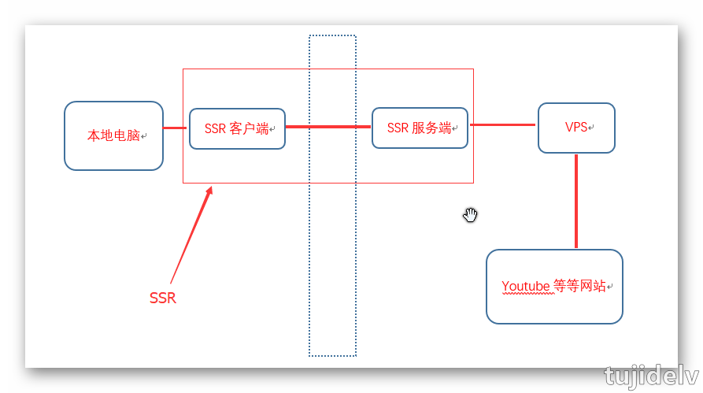
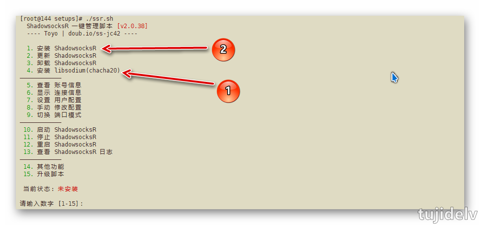
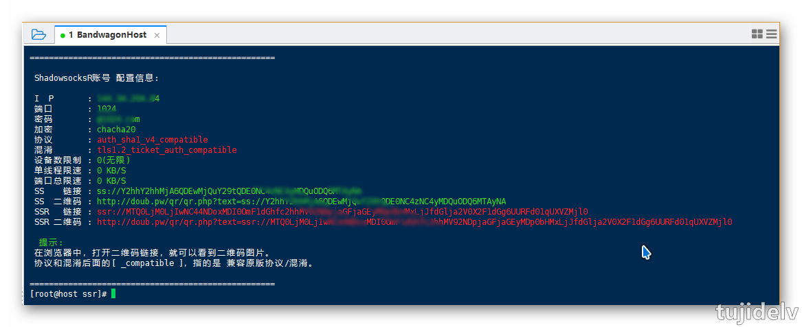
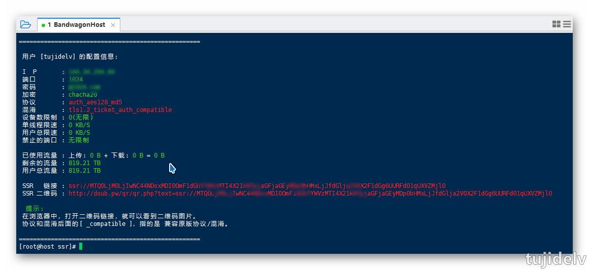
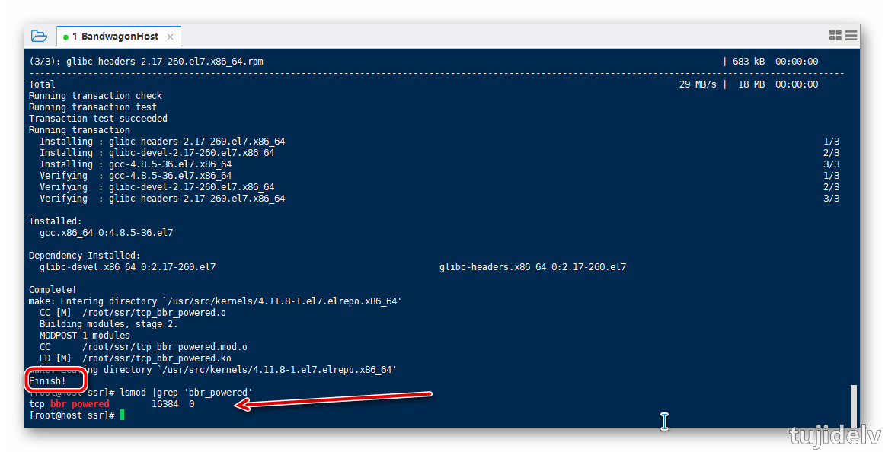
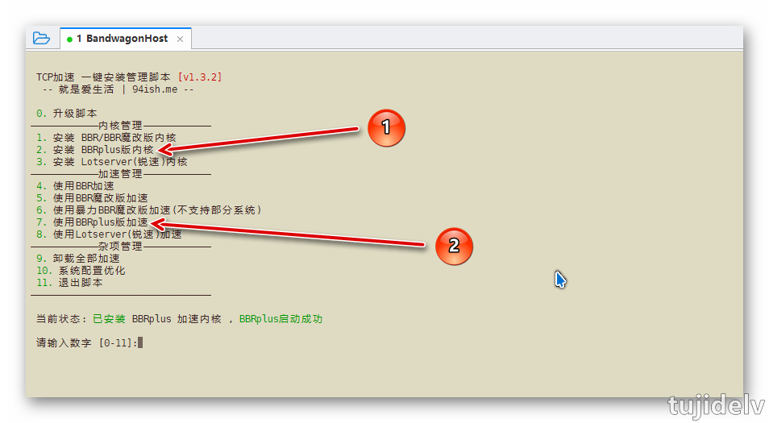

# SSR科学上网：进阶

## 目录

- [简介](#简介)
- [SSR 的部署及使用](#SSR的部署及使用)
- [SSR 进阶使用](#SSR的进阶使用)
- [参考链接](#参考链接)
- [结束语](#结束语)

## 简介

- 在了解了番茄的相关知识后正式搭建科学上网环境。

## 部署

整套SSR 分为 SSR 服务端（部署在 VPS，也就是海外主机），SSR 客户端（部署在本机或者本地路由器或本地手机上）。


### `服务端1`

1. 下载并执行ssr脚本
    - 支持限制用户速度、`限制端口设备数`、`切换管理单/多端口`、显示当前连接 IP 等
    ```bash
    [root@host ssr]# wget -N --no-check-certificate https://raw.githubusercontent.com/tujidelv/doubi/master/ssr.sh && chmod +x ssr.sh && bash ssr.sh 
    ```
    - 支持限制用户速度、`限制用户设备数`、`限制用户总流量`、`定时流量清零`、显示当前连接 IP 等
    ```
    [root@host ssr]# wget -N --no-check-certificate https://raw.githubusercontent.com/tujidelv/doubi/master/ssrmu.sh && chmod +x ssrmu.sh && bash ssrmu.sh
    ```
    


2. 选择 `4` ，安装 libsodium(chacha20)，如果选择 `chacha20` 加密方式需要用到
    ```bash
    请输入数字 [1-15]：4
    [信息] libsodium 未安装，开始安装...
    [信息] 开始获取 libsodium 最新版本...
    [信息] libsodium 最新版本为 1.0.16 !
    ```
3. 继续执行 `./ssr.sh`，选择 `1` ，安装 SSR
4. 设置端口 & 密码 & 协议，速度方面 `chacha20 > RC4-MD5 > AES`，但 `chacha20` 对 VPS 内存要求比较高，至少 1G
    ```bash
    [信息] 开始设置 ShadowsocksR账号配置...
    请输入要设置的ShadowsocksR账号 端口
    (默认: 2333):1024
    
    ——————————————————————————————
            端口 : 1024
    ——————————————————————————————
    
    请输入要设置的ShadowsocksR账号 密码
    (默认: doub.io):@1024.com
    
    ——————————————————————————————
            密码 : @1024.com
    ——————————————————————————————
    
    请选择要设置的ShadowsocksR账号 加密方式
            
      1. none
     [注意] 如果使用 auth_chain_a 协议，请加密方式选择 none，混淆随意(建议 plain)
     
      2. rc4
      3. rc4-md5
      4. rc4-md5-6
     
      5. aes-128-ctr
      6. aes-192-ctr
      7. aes-256-ctr
     
      8. aes-128-cfb
      9. aes-192-cfb
     10. aes-256-cfb
     
     11. aes-128-cfb8
     12. aes-192-cfb8
     13. aes-256-cfb8
     
     14. salsa20
     15. chacha20
     16. chacha20-ietf
     [注意] salsa20/chacha20-*系列加密方式，需要额外安装依赖 libsodium ，否则会无法启动ShadowsocksR !
    
    (默认: 5. aes-128-ctr):15
    
    ——————————————————————————————
            加密 : chacha20
    ——————————————————————————————
    ```
5. 选择协议插件，默认是 `auth_sha1_v4或者origin`，推荐`auth_sha1_v4和auth_aes128_md5和auth_aes128_sha1`
    ```bash
    请选择要设置的ShadowsocksR账号 协议插件
            
     1. origin                           原版协议，为了兼容
     2. auth_sha1_v4                     较高安全性，有宽松的时间校对要求，混淆强度大
     3. auth_aes128_md5                  最高安全性，有宽松的时间校对要求，计算量相对高一些，混淆强度较大
     4. auth_aes128_sha1                 最高安全性，有宽松的时间校对要求，计算量相对高一些，混淆强度较大
     5. auth_chain_a
     6. auth_chain_b
     [注意] 如果使用 auth_chain_a 协议，请加密方式选择 none，混淆随意(建议 plain)
    
    (默认: 2. auth_sha1_v4):
    
    ——————————————————————————————
            协议 : auth_sha1_v4
    ——————————————————————————————
    ```
6. 选择混淆插件，默认是 `plain`，支持SS客户端，推荐 `plain,http_simple,http_post,tls1.2_ticket_auth`
    ```bash
    是否设置 协议插件兼容原版(_compatible)？[Y/n]y
    
    请选择要设置的ShadowsocksR账号 混淆插件
            
     1. plain
     2. http_simple
     3. http_post
     4. random_head
     5. tls1.2_ticket_auth
     [注意] 如果使用 ShadowsocksR 加速游戏，请选择 混淆兼容原版或 plain 混淆，然后客户端选择 plain，否则会增加延迟 !
     另外, 如果你选择了 tls1.2_ticket_auth，那么客户端可以选择 tls1.2_ticket_fastauth，这样即能伪装又不会增加延迟 !
     如果你是在日本、美国等热门地区搭建，那么选择 plain 混淆可能被墙几率更低 !
     [注意]不要奇怪为什么推荐plain，因为混淆不总是有效果，要看各地区的策略的，有时候不混淆让其看起来像随机数据更好。
    
    (默认: 1. plain):5
    
    ——————————————————————————————
            混淆 : tls1.2_ticket_auth
    ——————————————————————————————
    ```
7. 接下来默认回车即可
    ```bash
    是否设置 混淆插件兼容原版(_compatible)？[Y/n]y
    
    请输入要设置的ShadowsocksR账号 欲限制的设备数 ( auth_* 系列协议 不兼容原版才有效 )
    [注意] 设备数限制：每个端口同一时间能链接的客户端数量(多端口模式，每个端口都是独立计算)，建议最少 2个。
    (默认: 无限):
    
    请输入要设置的每个端口 单线程 限速上限(单位：KB/S)
    [注意] 单线程限速：每个端口 单线程的限速上限，多线程即无效。
    (默认: 无限):
    
    请输入要设置的每个端口 总速度 限速上限(单位：KB/S)
    [注意] 端口总限速：每个端口 总速度 限速上限，单个端口整体限速。
    (默认: 无限):
    
    [信息] 开始安装/配置 ShadowsocksR依赖...
    ```
8. 最后会输出账号信息，从上往下依次为 SSR 帐号的IP、端口、密码、加密方式、协议插件和混淆插件等。
    
    

### `服务端2`

1. 脚本说明
    ```
    本脚本适用环境：
        系统支持：CentOS，Debian，Ubuntu
        内存要求：≥128M
        作者：秋水逸冰
    关于本脚本：
        一键安装 ShadowsocksR 服务端
        请下载与之配套的客户端程序来连接
    配置说明：
        服务器端口：自己设定（如不设定，默认为 8989）
        密码：自己设定（如不设定，默认为 teddysun.com）
        加密方式：自己设定（如不设定，默认为 aes-256-cfb）
        协议（Protocol）：自己设定（如不设定，默认为 origin）
        混淆（obfs）：自己设定（如不设定，默认为 plain）
    配置方法：
        使用root用户登录，执行以下命令：
    ```
2. 下载并执行脚本
    ```
    [root@host ssr]# wget --no-check-certificate https://raw.githubusercontent.com/teddysun/shadowsocks_install/master/shadowsocksR.sh
    [root@host ssr]# chmod +x shadowsocksR.sh
    [root@host ssr]# ./shadowsocksR.sh 2>&1 | tee shadowsocksR.log
    ```
3. 安装完成
    ```
    Congratulations, ShadowsocksR server install completed!
    Your Server IP        :your_server_ip
    Your Server Port      :your_server_port
    Your Password         :your_password
    Your Protocol         :your_protocol
    Your obfs             :your_obfs
    Your Encryption Method:your_encryption_method
    Welcome to visit:https://shadowsocks.be/9.html
    Enjoy it!
    ```
4. 常用命令
    ```
    卸载：./shadowsocksR.sh uninstall
    启动：/etc/init.d/shadowsocks start
    停止：/etc/init.d/shadowsocks stop
    重启：/etc/init.d/shadowsocks restart
    状态：/etc/init.d/shadowsocks status
    配置文件路径：/etc/shadowsocks.json
    日志文件路径：/var/log/shadowsocks.log
    代码安装目录：/usr/local/shadowsocks
    ```
5. 多用户配置示例
    ```
    {
    "server":"0.0.0.0",
    "server_ipv6": "[::]",
    "local_address":"127.0.0.1",
    "local_port":1080,
    "port_password":{
        "8989":"password1",
        "8990":"password2"，
        "8991":"password3"
    },
    "timeout":300,
    "method":"aes-256-cfb",
    "protocol": "origin",
    "protocol_param": "",
    "obfs": "plain",
    "obfs_param": "",
    "redirect": "",
    "dns_ipv6": false,
    "fast_open": false,
    "workers": 1
    }
    ```

### `客户端`

- 下载
    ```
    Windows：https://github.com/shadowsocksr-backup/shadowsocksr-csharp/releases
    Android：https://github.com/shadowsocksr-backup/shadowsocksr-android/releases
    Linux：https://github.com/the0demiurge/CharlesScripts/blob/master/charles/bin/ssr（命令行界面， Mac 也能用，使用方法见注释）
    macOS：https://github.com/shadowsocksr-backup/ShadowsocksX-NG/releases（Mac 也能用 Linux 版的）
    iOS：https://github.com/Alvin9999/new-pac/wiki/%E8%8B%B9%E6%9E%9C%E6%89%8B%E6%9C%BA%E7%BF%BB%E5%A2%99%E8%BD%AF%E4%BB%B6
    -------------------------------------
    pac文件地址：https://pan.lanzou.com/i09dv1e
    -------------------------------------
    .NET Framework 4.7：http://download.microsoft.com/download/D/D/3/DD35CC25-6E9C-484B-A746-C5BE0C923290/NDP47-KB3186497-x86-x64-AllOS-ENU.exe?desc=dotnet47
    .NET Framework 4.6.2：https://download.microsoft.com/download/D/5/C/D5C98AB0-35CC-45D9-9BA5-B18256BA2AE6/NDP462-KB3151802-Web.exe?desc=dotnet462
    .NET Framework 4.5.2：http://download.microsoft.com/download/E/2/1/E21644B5-2DF2-47C2-91BD-63C560427900/NDP452-KB2901907-x86-x64-AllOS-ENU.exe?desc=dotnet452
    .NET Framework 2.0+3.5SP1：http://download.microsoft.com/download/2/0/E/20E90413-712F-438C-988E-FDAA79A8AC3D/dotnetfx35.exe?source=getdotnet&desc=dotnet35
    ```
- 安装
    ```
    将压缩包解压，文件内含7个文件。下载pac.txt文件，放入文件夹内。
    -------------------------------------
    文件夹内有两个.exe文件，两个版本的功能是完全一样的，不同之处是根据你系统安装的 .NET Framework 支持库版本，这个支持库有v2.0/3.5/4.0/4.5等版本，且每个版本都是独立的。
    这里的 .NET Framework v2.0就是对应的 DotNet2.0 Shadowsocks客户端，v4.0则是对应 DotNet4.0的。
    Shadowsocks是C#语言写的，所以需要安装这个微软的支持库，Shadowsocks原版是更新到2.5.2后就取消支持v2.0了，但是ShadowsocksR依然支持。
    这支持库是一般来说XP是都没有安装的，Win7则是系统自带v2.0，win8以后是自带v4.0。
    所以自己看着支持库的安装情况选择版本就行了，功能无差别。
    -------------------------------------
    PAC中文名叫做代理自动配置，PAC其实就是 HTTP/SOCKS等代理服务器 + 网址规则，只有在你浏览器访问网址规则中包含的网站时才会走PAC文件中包含指定的HTTP/SOCKS代理服务器。
    因为Shadowsocks作者喝茶后，原本维护更新的PAC（GFWlist）文件也被删除，不过由ShadowsocksR作者接手维护了，由网友不断的提交新的被墙的网址和IP。
    目前分为域名白名单、黑名单、黑白名单，同时也有IP的名单。由于SSR也停更删除了项目，目前该文件也已经无法更新了。右键pac-更新会提示failed。
    -------------------------------------
    ShadowsocksR目前分两种规则方式，那就是系统代理模式（直接连接[不经过代理直接访问]、PAC[匹配pac.txt内的域名后执行]、全局[不管啥域名全都走代理]） 和 代理规则，这两种判断方式是相互配合使用的。
    先用系统代理模式来判断是否让数据进入SSR客户端，再用代理规则来判断进入SSR客户端的数据是直连还是走代理。
    -------------------------------------
    当你访问XXX网站，然后是全局或者满足PAC条件（不满足条件就直接直连访问了，也不会有接下来的代理规则判断了），从而访问XXX网站的请求数据流量进入了客户端，然后客户端会根据XXX网站的IP来判断，如下：
        绕过局域网：当IP属于局域网内的，那么SSR客户端就会让流量直连，反之则会让流量走代理（发送到SSR服务端）。
        绕过局域网和大陆：当IP属于大陆内或局域网的，那么SSR客户端就会让流量直连，反之则会让流量走代理（发送到SSR服务端）。
        绕过局域网和非大陆：当IP属于大陆外(非大陆IP都算大陆外)或局域网的，那么SSR客户端就会让流量直连，反之则会让流量走代理（发送到SSR服务端）。
        全局：无论什么情况都直接走代理。
    举例说明：
        当你选择系统代理模式-pac模式后，假如你访问www.google.com ，浏览器在PAC文件中匹配这个域名，并发现这个域名按PAC规则应走代理，所以浏览器就会发送访问网页数据到PAC中的代理服务器，
    于是SSR客户端就收到了访问谷歌的数据，而这时候就该用代理规则判断了。
        代理规则为：绕过局域网，则判断www.google.com域名的IP是否是局域网IP，然而不是局域网IP，于是走代理。
        代理规则为：绕过局域网和大陆，则判断www.google.com域名的IP是否是局域网IP或大陆IP，然而不是局域网IP或大陆IP，于是走代理。
        代理规则为：绕过局域网和非大陆，则判断www.google.com 名的IP是否是局域网IP或非大陆IP，然而是非大陆IP，于是不走代理，直连。
        代理规则为：全局，不判断www.google.com域名的IP，直接走代理。
    -------------------------------------
    ```
- 使用
    ```
    常用连接的方式有以下几种：
        二维码扫描：可以扫描屏幕上的SSR配置信息二维码并导入服务器配置中。二维码通常由你的SSR供应商提供。
        剪贴板批量导入ssr://链接：如果你的SSR供应商有提供批量SSR服务器配置链接，你就可以复制之后通过这里导入。
        手动输入：单击图标出来服务器配置界面，输入IP、端口、密码、加密、协议、混淆，这些资料都由供应商提供。
        订阅服务器：可订阅服务器，自动从服务器更新SSR，这是最方便的，但是也是最难找的。
    添加完成后，右键—服务器选择相应的服务器，选择好代理模式、代理规则即可上网。
    状态显示：
        普通情况下，图标颜色为 深蓝色。
        当你选择 系统代理模式 — PAC模式 的时候，图标颜色为 浅绿色。
        当你选择 系统代理模式 — 全局模式 的时候，图标颜色为 浅蓝色(浅青色)。
        当你启动 服务器负载均衡 功能的时候，图标颜色从 深蓝色 变为 粉红色。
        当你启动 服务器负载均衡 功能并选择 系统代理模式 — PAC模式 的时候，图标颜色为 浅橙色。
        当你启动 服务器负载均衡 功能并选择 系统代理模式 — 全局模式 的时候，图标颜色为 白色。
    ```
- 常见问题及技巧
    ```
    1.连上了代理但是无法上谷歌、推特等
        按下键盘组合键“Win + R”调出运行窗口,输入“cmd”（不带引号）然后回车，这时会打开“命令提示符”,输入ipconfig /flushdns然后回车
    2.正确添加了配置，但无法正常使用代理上网
        a.你可能根本就连不上你的ss代理服务器。可以ping服务器地址,如ping不通说明你目前的网络情况根本无法连接代理。
        b.你的SSR配置可能不正确。如果你是手动填写的配置而不是通过SSR提供商的一键配置来添加，那可能会出现这种情况，请检查一下你的配置是否正确。
        c.SSR的系统代理模式和代理规则是否正确。通常来讲推荐萌新的设置是，系统代理模式选择“全局模式”，代理规则选择“绕过局域网和大陆”。
    3.更改图标
        把一个名为icon.png的PNG图片放到ShadowsocksR客户端文件夹内（和ShadowsocksR-dotnetX.0.exe 放在一起），然后重新启动ShadowsocksR客户端。OK
    ```
- 常用免费 SSR 帐号分享
    ```
    https://doub.bid/sszhfx/ 逗比根据地 免费SS
    https://free-ss.site/ 免费帐号 免费SS
    https://ssr.plus/ 免费帐号 需回复后才能看，无需注册
    http://www.hishadowsocks.com/ 4小时换1次
    https://ssray.club/
    ```

## 进阶

### 魔改BBR加速SSR

- 注意点
    1. kvm优化的话，只能bbr、魔改bbr、锐速三选一，速度从高到低大概是 `魔改BBR > 锐速 > BBR`。
    2. 重装系统那里，后缀带`bbr`的表示重装后自带bbr并且默认开启了，但是没有经过魔改的bbr速度远不及锐速。
    3. 同时bbr只支持4.9以上4.13以下的内核，锐速不支持4.9以上的内核，所以不能共存。但他们都可以和kcptun共存。
    3. 锐速技术成熟，已经停止更新；而BBR是2016年才出现的新技术，未来的发展性很强。所以从短期看，锐速或者BBR视情况都可以，从长期来说，BBR终究是主流。 
- 重装系统
    - 在main-controls那里stop机器，然后install new os，安装CentOS7_86x64。复制密码准备登录主机。密码和端口也会发到你的邮箱。
- 安装最合适的内核
    - 可以使用 `uanme -a` 查看内核信息，BBR算法的部署，需要注意内核版本，如果过低会造成崩溃。
    - 安装新内核后，输入Y，系统会自动断开shell，重启一次，重新登录后将启用新的内核。
    ```bash
    wget --no-check-certificate -O C71.sh https://raw.githubusercontent.com/tujidelv/CBBR/master/C71.sh && chmod +x C71.sh && bash C71.sh
    ```
- 使用脚本编译开启魔改的 bbr
    ```bash
    wget --no-check-certificate -O C72.sh https://raw.githubusercontent.com/tujidelv/CBBR/master/C72.sh && chmod +x C72.sh && bash C72.sh
    ```
- 结束后，显示 Finish 表示正常，或者执行 `lsmod |grep 'bbr_powered'` 结果不为空，则加载模块成功。
    
    
### BBRplus加速SSR

- 下载加速脚本,支持`CentOS 6+、Debian 8+、Ubuntu 14+`
    ```
    wget -N --no-check-certificate "https://raw.githubusercontent.com/chiakge/Linux-NetSpeed/master/tcp.sh" && chmod +x tcp.sh && ./tcp.sh
    ```
- 打开脚本,根据自己需求安装对应的内核和加速
    

## 参考链接

- [BBR+BBR魔改+Lotsever(锐速)一键脚本 for Centos/Debian/Ubuntu](https://www.moerats.com/archives/387)
- [安装libsodium库解决libsodium not found问题](https://www.debugnode.com/ubuntul_ibsodium)
- [ShadowsocksR(SSR)一键安装脚本 By 秋水逸冰](http://www.wangchao.info/1549.html)

## 结束语

- 未完待续...