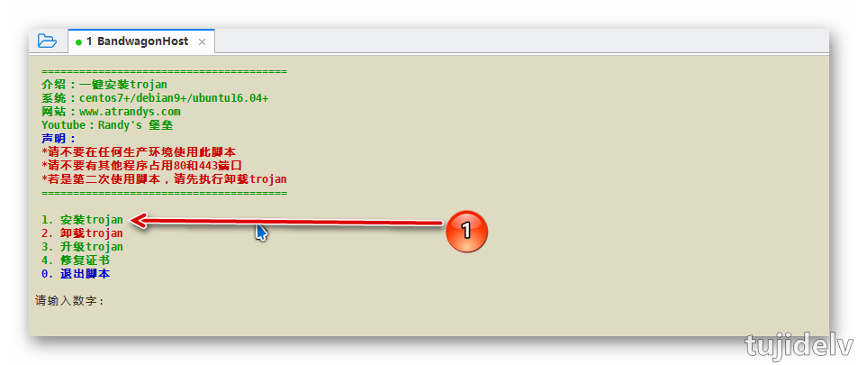
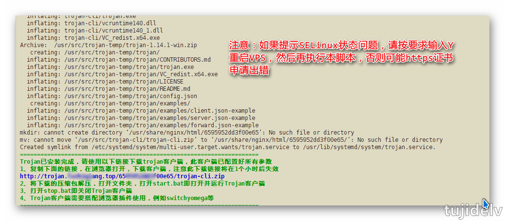
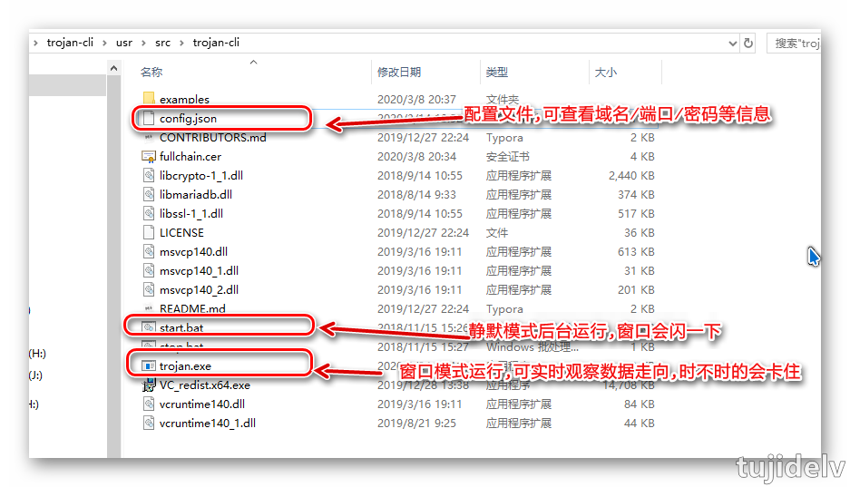
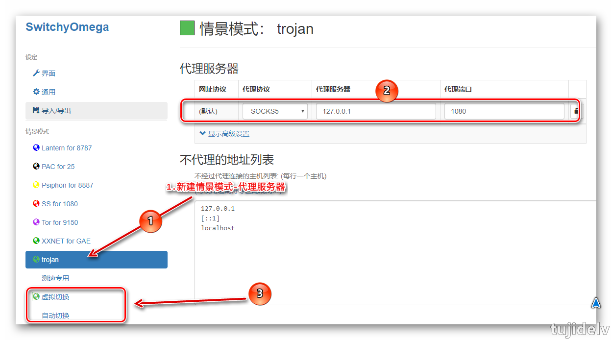
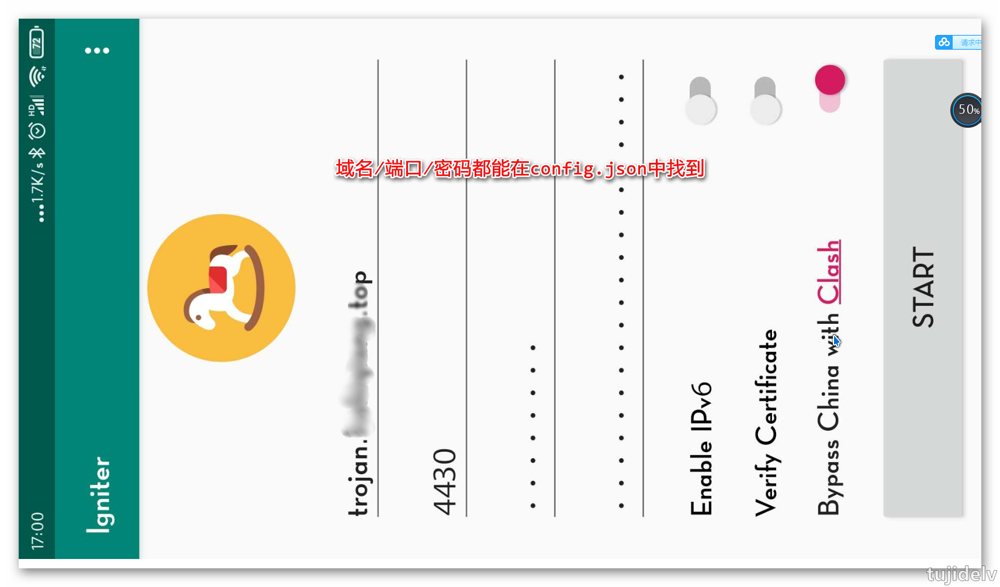

# Trojan科学上网：基础

## 目录

- [简介](#简介)
- [部署](#部署)
- [常见问题总结](#常见问题总结)
- [参考链接](#参考链接)
- [结束语](#结束语)

## 简介

- 介绍
    ```
    Trojan模仿了互联网上最常见的Https协议,以诱骗GFW封锁认为它就是Https,从而不被识别.
    Trojan处理来自外界的Https请求,如果是合法的,那么为该请求提供服务,否则将该流量转交给Web服务器Nginx,由Nginx为其提供服务.
    基于这个工作过程可以知道,Trojan的一切表现与Nginx一致,不会引入额外特征,从页达到无法识别的效果.
    ```
- Trojan与V2ray ws协议的区别
    ```
    V2ray是Nginx侦听443,数据->Nginx->V2ray;Trojan是自己侦听443,都是伪装成网站.
    ```
- 系统要求及脚本介绍
    ```
    1、系统支持centos7+/debian9+/ubuntu16+
    2、域名需要解析到VPS并生效。
    3、脚本自动续签https证书
    4、自动配置伪装网站，位于/usr/share/nginx/html/目录下，可在脚本中自行替换其中内容
    5、请不要在任何生产环境使用一键脚本，此条适用于本站所有脚本，专门用来科学上网的VPS可以随意使用。
    6、trojan不能用CDN，不要开启CDN
    7、如果你在用谷歌云、阿里云等产品的时候，需要在控制台开放80、443端口。
    9、可参考ssr文章安装相关的BBR加速
    ```

## 部署

### `服务端`

1. 下载并执行脚本
    ```
     [root@host ssr]# wget --no-check-certificate https://raw.githubusercontent.com/atrandys/trojan/master/trojan_mult.sh
     [root@host ssr]# chmod +x trojan_mult.sh
     [root@host ssr]# ./trojan_mult.sh 2>&1 | tee trojan_mult.log
    ```


2. 选择安装trojan，然后输入解析到VPS的域名并回车（不要带http://），开始安装，然后等待安装完成即可。


---
对于有安装宝塔面板的前提下,一般会事先安装好Nginx,而且已搭建Https的网站,如何已Trojan共存
```
方法一：让自己所有搭建的网站取消SSL证书,这样Nginx就能只启动80端口,而不会与Trojan的443端口冲突.只是不能用Https方式访问自己搭建的网站了.
方法二：可更改Trojan运行在非443端口上,修改相关配置文件(服务端和客户端)即可;然后通过Nginx反向代理Trojan域名到该非443端口上.
```

### `客户端`

- **Windows系统**
    ```
    服务端安装完成后，会展示一条下载地址，复制地址，并下载下来运行即可。
    如果你真的忘记下载了，那么进入/usr/share/nginx/html/目录下，找到一个乱码文件夹，进入会看到客户端文件，使用sftp下载下来即可。
    解压缩下载的trojan-cli.zip的压缩包，进入文件夹并开启Trojan服务，Trojan会监听本地1080端口。
    ```

    ```
    1.如果软件支持配置socks5,直接指向127.0.0.1:1080即可.如Firefox,IDM等.
    2.如果软件不支持配置socks5,可选择v2rayN/sstap/sockscap64/supercap等软件曲线实现代理.
    3.浏览器插件:谷歌浏览器--SwitchyOmega
    ```
    
---
►V2rayN客户端：<https://github.com/2dust/v2rayN/releases>
►SocksCap64：<https://www.sockscap64.com/sockscap-64-free-download-zh-hans>
►SSTap：<https://www.sockscap64.com/changelog-of-sstap>
►SwitchyOmega情景模式：[网盘下载](https://pan.baidu.com/s/1nN60uMMsit4XNYS90eASaw) `提取码8cp7`
►SwitchyOmega规则GFWList：<https://github.com/gfwlist/gfwlist>

---

- **Mac系统**
    ```
    1.如果软件支持配置socks5,直接指向127.0.0.1:1080即可.如Firefox,IDM等.
    2.如果软件不支持配置socks5,可选择v2rayU/mellow等软件曲线实现代理.
    3.浏览器插件:谷歌浏览器--SwitchyOmega
    ```
---
►Trojan Mac客户端：<https://github.com/trojan-gfw/trojan/releases>
►V2rayU客户端：<https://github.com/yanue/V2rayU/releases>

---
- **Android系统**

---
►Android客户端（选择app-release.apk）：<https://github.com/trojan-gfw/igniter/releases>
►Trojan项目地址：<https://github.com/trojan-gfw/trojan>

---

- **IOS系统**

需下载Shadowrocket软件

## 常见问题总结

1. Trojan客户端打开无法运行，提示缺少找不到vcruntime140.dll或找不到msvcp140.dll。
    ```
    原因缺少运行库，下载链接中的两个软件，一个是32位一个是64位，请全部安装即可：
    https://www.microsoft.com/en-us/download/details.aspx?id=48145
    ```
2. 如果遇到vcruntime140_1的错误，下载下面的文件放到C:\windows\system32目录下即可
    ```
    下载140_1.dll：https://github.com/atrandys/trojan/raw/master/vcruntime140_1.dll
    ```
3. trojan服务端怎么修改密码
    ```
    trojan服务端配置文件路径如下，如需修改内容，修改以下文件即可。
    /usr/src/trojan/server.conf
    修改完成后，重启trojan服务端即可，同时客户端的密码也要同步修改哦。
    systemctl restart trojan
    ```
4. chrome插件switchyomega无法安装
    ```
    参考这篇文章，离线安装chrome插件方法：https://www.atrandys.com/2019/2149.html
    ```
5. 关于申请证书没有成果的处理
    ```
    可能的原因1：
        一些原因导致使用nginx申请证书时出错，要么防火墙端口没开放，要么nginx未正常。建议用最纯净的系统安装。
    可能的原因2:
        出现这个问题最可能的原因之一是你的同一个域名多次申请证书，导致let’s encrypt官方的限制，同一域名每周最多5次申请。
    ```

## 参考链接

<https://www.youtube.com/watch?v=eiI2e4gnO4w&t=610s>
<https://www.youtube.com/watch?v=0_b34pfmhzA>

## 结束语

- 未完待续...