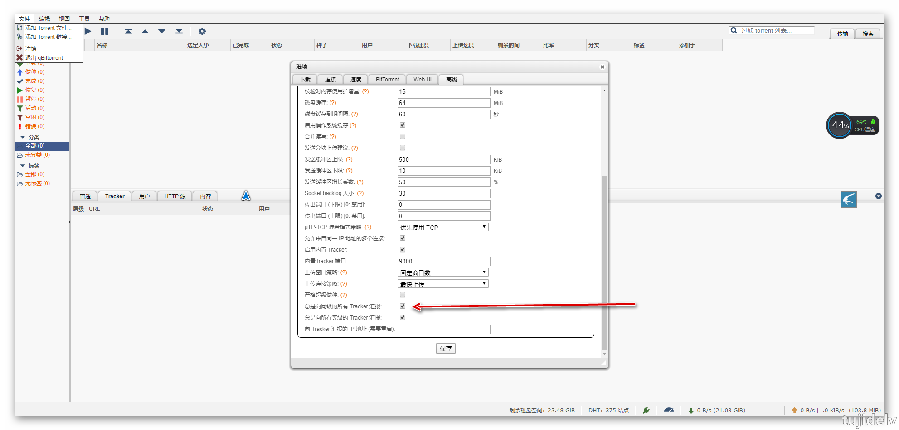
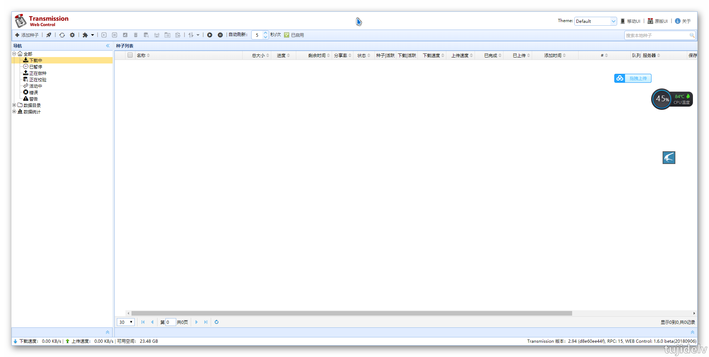
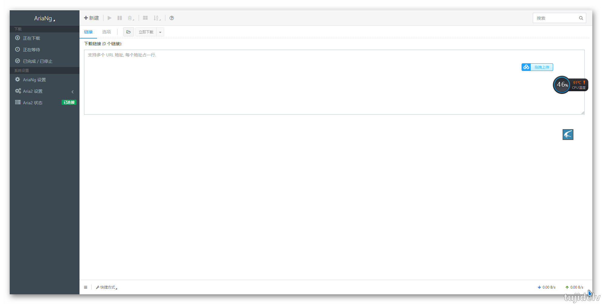
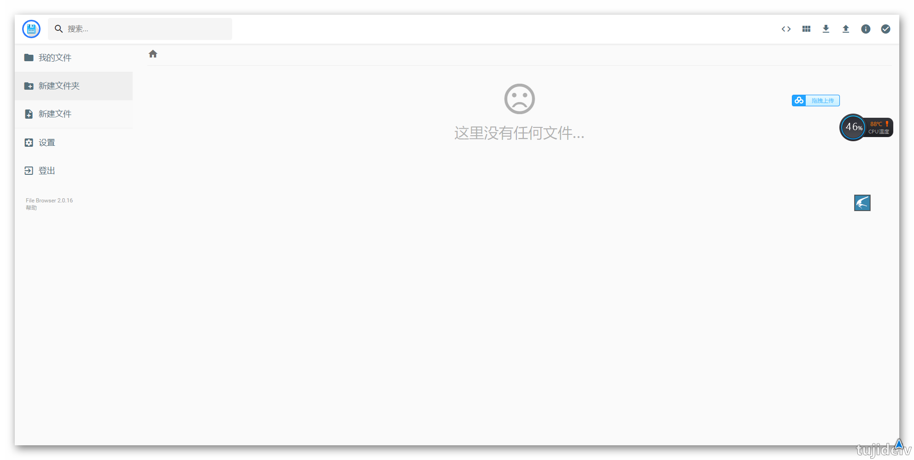
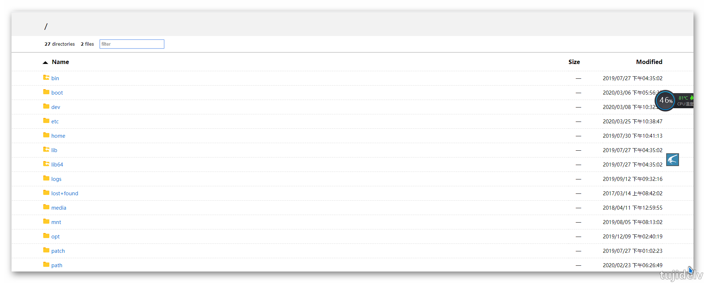
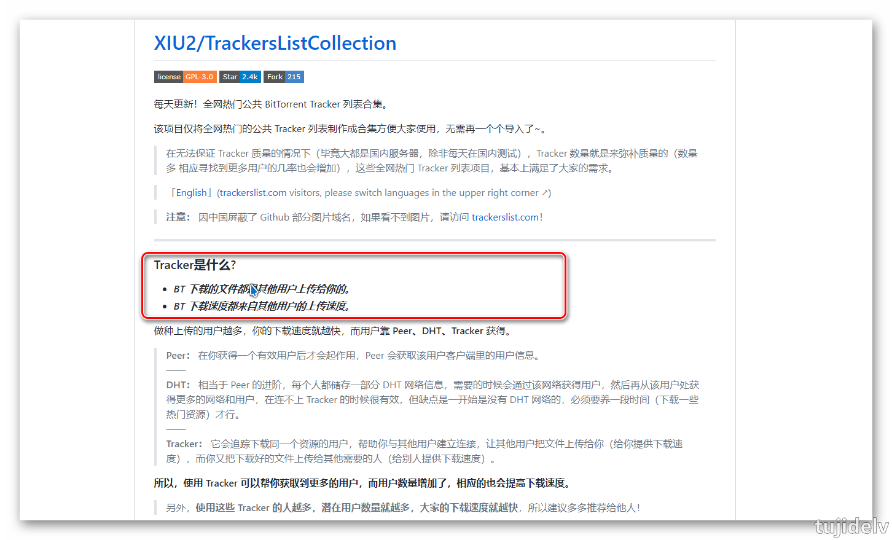

# VPS离线下载BT利器

## 目录

- [简介](#简介)
- [部署](部署)
- [取回本地](取回本地)
- [常用tracker](常用tracker)
- [参考链接](#参考链接)
- [结束语](#结束语)

## 简介

VPS的用途很多，本次介绍几种常用的服务器下载BT的利器，体验千兆网络的魅力。

## 部署

- qBittorrent功能非常强大,支持添加tracker,DHT等,但是占用系统资源(内存)比较大，如果服务器还要做一些其它的工作，用这个可能就不太合适了。
- Transmission占用系统资源少，对硬件的配置要求非常的低，甚至在路由器上面都可以运行，对于需要长期挂着是一个很好的选择。

### `qBittorrent`

1. docker安装
    ```
    docker pull linuxserver/qbittorrent
    ```
2. 完成后输入
    ```
    docker create \
      --name=qbittorrent \
      -e PUID=1000 \
      -e PGID=1000 \
      -e TZ=Aisa/Shanghai \
      -e UMASK_SET=022 \
      -e WEBUI_PORT=8080 \
      -p 8999:8999 \
      -p 8999:8999/udp \
      -p 8080:8080 \
      -v /path/to/appdata/config:/config \
      -v /path/to/downloads:/downloads \
      --restart unless-stopped \
      linuxserver/qbittorrent
    ```
3. 创建好后启动
    ```
    docker start qbittorrent
    ```
4. 进入主界面
    ```
    1.输入IP:端口号即可进入qbittorrent 的管理界面
    2.默认账号密码admin/admin
    3.进入"Option->Web UI->Language",将语言设置成中文
    4.进入"Option->高级",勾选"总是向同级的所有Tracker汇报",适合下载一些冷门的资源
    5.进入"Option->BitTorrent",可在做种限制中勾选"当分享率达到",来设置上传大小,例如设置2代表当上传2倍大小时就停止上传给其他用户
    6.进入"Option->BitTorrent",勾选"自动添加以下tracker到新的torrent",来提高下载速度
    ```


### `Transmission`

1. docker安装
    ```
    docker run -d \
    --restart=always \
    --name transmission \
    -v /path3/to/torrents:/to_download \
    -v /path3/to/download:/output \
    -p 9091:9091 \
    -p 51413:51413 \
    -e USERNAME=admin \
    -e PASSWORD=admin \
    jaymoulin/transmission
    ```
2. 进入主界面
    ```
    1.输入IP:9091即可进入transmission 的管理界面
    2.默认账号密码是空,按回车就可以进入
    ```


### `Aria2`

1. docker安装
    ```
    # 最快速启动
    docker run -d --name aria2-ui -v /path2/down:/data -p 80:80 wahyd4/aria2-ui
    ```
    ```
    # 加密下载界面
    docker run -d --name ariang \
      -p 80:80 \
      -e PUID=1000 \
      -e PGID=1000 \
      -e ENABLE_AUTH=true \
      -e RPC_SECRET=Hello \
      -e ARIA2_SSL=false \
      -e ARIA2_USER=user \
      -e ARIA2_PWD=pwd \
      -v /home/down:/data \
      wahyd4/aria2-ui
    ```
2. 进入主界面
    ```
    Aria2: http://ip:port/ui/
    FileManger: http://ip:port
    FileManger可作为网盘来使用,说caddy的功能差不多
    ```
3. 补充
    - 根据个人的需求来选择，如果觉得不需要加密Aria2的管理界面的，其实用第一种方式就行了。非常简单，一行命令即可。
    - 同时也可以结合TransdroneAPP来使用，使用它来管理多个下载工具也是比较方便的。[网盘下载](https://pan.baidu.com/s/19Nj1htcK49zyexF9qP7Stw) `提取码v7aa`



## 取回本地

- 下载好的文件存在服务器里，想把它取回到电脑或者手机，有以下几种方法。 
- 第三种适合于临时下载的，前两种适合长时间的。如果机器本身有装docker，那我建议使用第二种。当然第一种也有好处，就是可以绑定指定的域名。
- 各取所需吧，适合自己的需求的才是最好的。

### `安装caddy`

1. 安装
    ```
    wget -N --no-check-certificate https://raw.githubusercontent.com/ToyoDAdoubi/doubi/master/caddy_install.sh && chmod +x caddy_install.sh && bash caddy_install.sh
    ```
2. 写入配置
    ```
    echo ":2015 {  
     root /path/to/downloads
     timeouts none  
     gzip  
     browse  
    }" > /usr/local/caddy/Caddyfile
    ```
3. 启动caddy
    ```
    /etc/init.d/caddy start
    ```
4. 浏览器访问
    ```
    1.如不能访问,记得开放相关端口
    2.完成后就可以在浏览器里，输入IP地址:端口号来访问下载好的文件了。如果是MP4文件的话，还可以支持在线播放。
    3.默认密码是admin/adminadmin
    ```


### `h5ai`

> 这是一个 PHP 程序，原本它是要求机器本身有 PHP 才能用的，不过现在使用 docker 来安装的话，也可以非常迅速就安装好。

```
docker run -d -p 8055:80 -v /home/tr/download:/h5ai --name h5ai ilemonrain/h5ai:full -d
```
装好后在浏览器输入 ip:8085 就可以看到里面的内容

### `python web`

这个是最简单的，基本所有的服务器都可以，而且不用额外安装其它的程序。只需要在 ssh 时进入到指定的文件夹，然后输入这条命令即可。

```
python -m SimpleHTTPServer
```
会默认采用8000端口,此时输入 **IP:8000** 或者 **域名:8000** ，即可访问当前目录下的文件，如果有 index.html 则会默认加载。

然后想要停止时，按`CTRL + C` 取消。
不过这种方法有挺多缺点的，比如不支持断点续传，开启时需一直保持 ssh 连接着，显示的文件信息简陋等。

## 常用tracker

<https://github.com/ngosang/trackerslist>
<https://trackerslist.com/all.txt>


## 参考链接

<https://powersee.github.io>
<https://github.com/c0re100/qBittorrent-Enhanced-Edition>
<https://github.com/ronggang/transmission-web-control>
<https://github.com/wahyd4/aria2-ariang-docker>

## 结束语

- 未完待续...