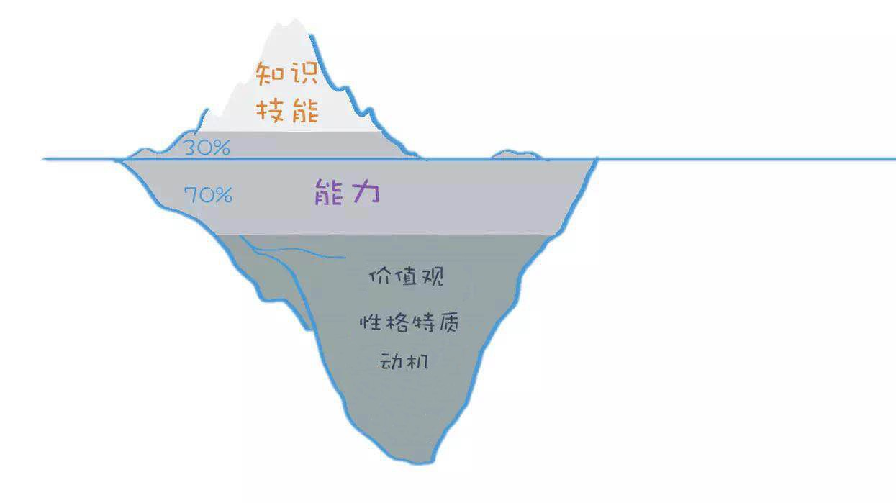
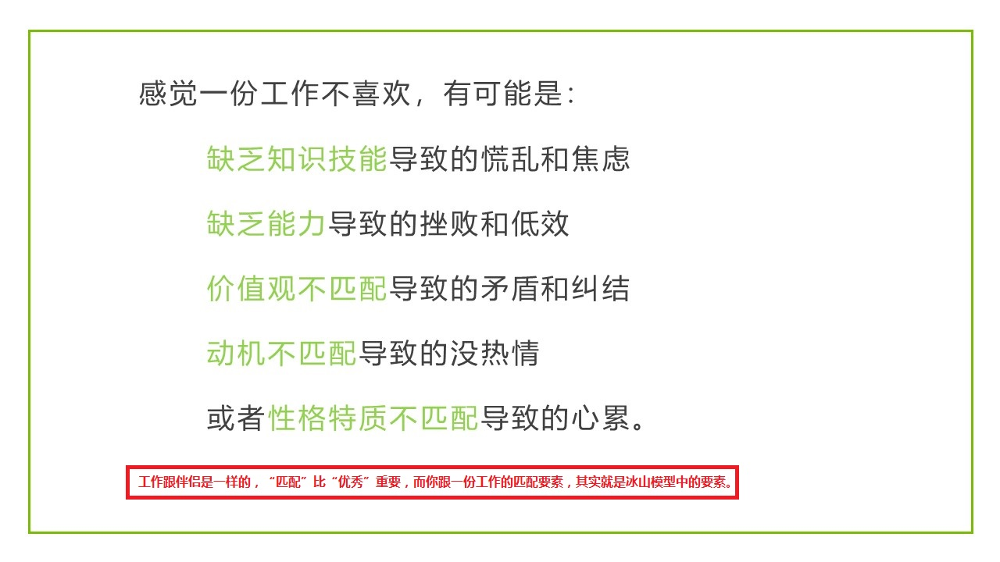
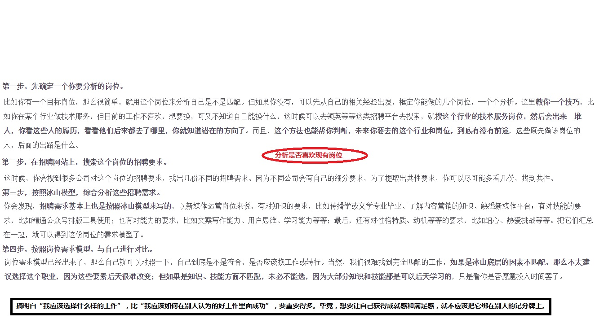

# 个人发展战略：基础

## 目录

- [简介](#简介)
- [正篇](#正篇)
- [参考链接](#参考链接)
- [结束语](#结束语)

## 简介

> 一、诊断现状  
   1）一个模型，帮你找到真正热爱的工作：分析个人和工作匹配的要素有哪些，知道自己为什么会不喜欢一份工作，以及怎么找到跟自己匹配的工作。  
   2）四大要素，决定了你的市场价值：分析应该把时间花在什么要素上面，才能有市场价值的提升，并不是所有努力都有效      
> 二、发现潜能  
   3）四类迹象，发现你的隐藏能力：找到自己的天赋，也就是隐藏的能力，才能事半功倍  
> 三、学习提升  
   4）三种方法，将知识内化成能力：知识是死的，能力才能盘活它  
   5）三大系统，让学习不靠意志力：靠意志力学习是不可能的，需要依靠三大系统  
> 四、规划未来  
   6）三个建议，让你不做“定制化人才：如何找到不变的因素，应对未来的加速变化，避免成为企业定制化人才
   
普及一些基本的职业发展和提升方法，不再让一些毫无专业基础的成功学老师误导我们，每个人都应该有自己的发展策略，当好自己的CEO。

## 正篇

### **一个模型，帮你找到真正热爱的工作**

掌握冰山模型的用法，能够用它来分析自己跟工作的匹配度，从而做出正确的职业选择，并能精准找到自己喜欢并有成就感的工作。

查理芒格在《穷查理宝典》里面提到，掌握一定数量的思维模型，能解决这世上90%的问题。

冰山模型是美国著名心理学家麦克利兰提出来的，它全面地描述了一个人的个体素质要素，也就是说，`你跟一个岗位是不是匹配、匹配程度如何、市场薪资值多少，都是这个模型可以解释的，几乎所有大公司都会用它来进行人才招聘和培养。`



- `第一部分，知识和技能`
    ```
    冰山模型从上到下有很多要素，最上面的要素是知识和技能。
    
    知识，就是我们在学习和实践中获得的认知和经验，比如财务知识、人力资源知识等等，包括我们现在学习的冰山模型，也属于知识。
    这跟你大学所学的专业、常看的书、从事的工作、甚至业余爱好都有关系。
    
    技能是指你所具备的某项专门技术，比如骑自行车、编程、使用Excel等等。
    
    一个人的知识和技能是可以后天习得的，也是非常显性，容易看出来的。所以，我们称为冰山上的部分。
    
    知识技能跟工作之间的关系是什么呢？简单来说，如果你的工作中有很多陌生的内容，觉得每天都信息量很大、来不及接收，感到慌乱
    和焦虑，很可能就是你的知识技能跟岗位不匹配。但这不是什么大问题，因为知识和技能比较容易补齐，上上课、看看书、跟资深同事
    学，一段时间之后就能提升。
    ```
- `第二部分，能力`
    ```
    冰山模型中间的要素是能力，或叫通用能力，比如学习和思考能力、人际交往能力等。相对知识和技能来说，能力高低不是一眼就能看
    出来的。比如，一个人的创新能力到底如何，很难用一个证书、几道题目来考察，而需要看他在处理很多问题时候的行为。
    
    能力跟知识技能最大的区别在于：知识和技能属于特定领域，而能力则更多是通用领域的。比如，知识会分财务、人力资源、金融等等，
    但是“创新”这样的能力，是适用于任何领域的，一旦掌握，是能够迁移的。
    
    那么，如果能力不匹配，在工作中会如何呢？工作效率、沟通效率较低，面对复杂的问题无从下手，缺乏成就感，力不从心。能力的培养
    周期相对长一些，一般要几个月时间，我们后面几节会讲方法。
    ```
- `第三部分，价值观、性格、动机`
    ```
    冰山模型最底下包括价值观、性格特质、动机。这些要素在成年之后很难被改变，它们会受基因、家庭教育、童年经历等等的影响。简单
    介绍一下各个要素：
    
    价值观是你判断事物的标准，比如说，当你在择业的时候，自由和稳定产生了冲突，你选择哪个、放弃哪个；在事业和家庭产生冲突的时
    候，你怎么处理，等等。如果你在工作中经常陷入矛盾和纠结，对所做的事情很难发自内心地认同，很可能就是价值观上不匹配，比如你
    做自媒体，公司为了赚钱让你写一些低俗内容，但你觉得那对用户没有价值。
    
    性格特质则是个人的行为偏好，比如，你是偏内向还是外向，更关注宏观还是细节，等等。如果你在工作中发现，自己好像工作量没有很
    大，但却觉得心累，很有可能是性格不匹配 。比如，你是内向性格的人，是从独处中获得能量，但你做了一份每天都要不断跟陌生人沟通的工作。 
    
    至于动机，其实动机的分类方法有很多，最常见的是麦克利兰的理论，分为成就动机、权力动机和亲和动机。成就动机的人，喜欢挑战；权
    力动机的人，希望影响他人；而亲和动机的人，希望维持更好的团队关系。如果你感觉自己没有动力，做事提不起劲儿来，那很可能就是现
    在的工作跟你的动机不匹配，比如你明明是成就感动机，喜欢一定挑战，但你的工作却高度重复。
    ```



### **四大要素，决定了你的市场价值**

### **四类迹象，发现你的隐藏能力**

### **三种方法，将知识内化成能力**

### **三大系统，让学习不靠意志力**

### **三个建议，让你不做“定制化人才”**

## 参考链接

## 结束语

- 未完待续...